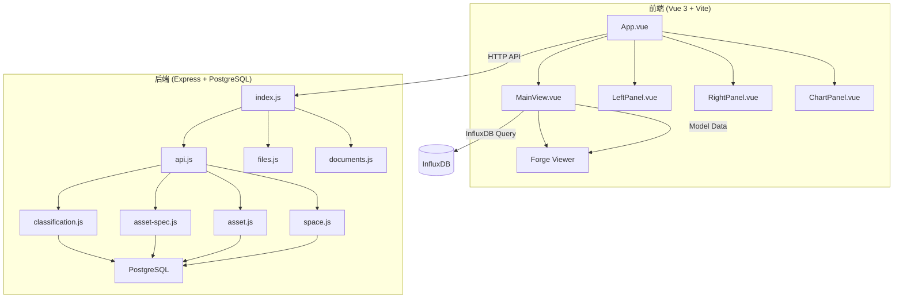
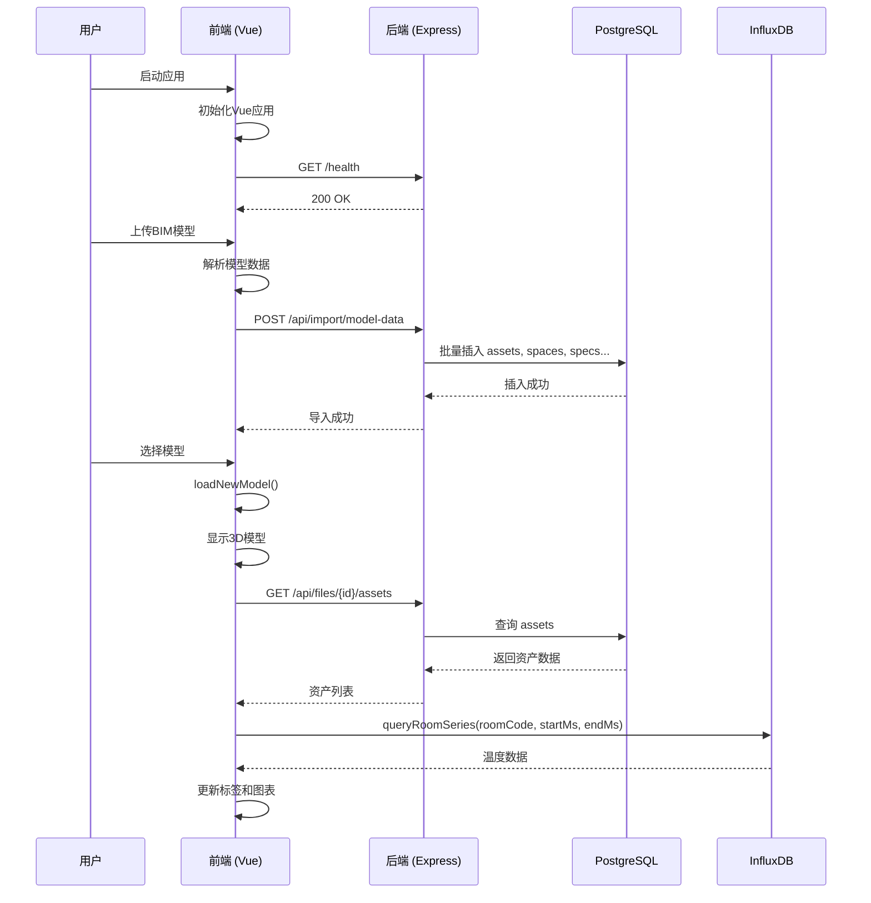
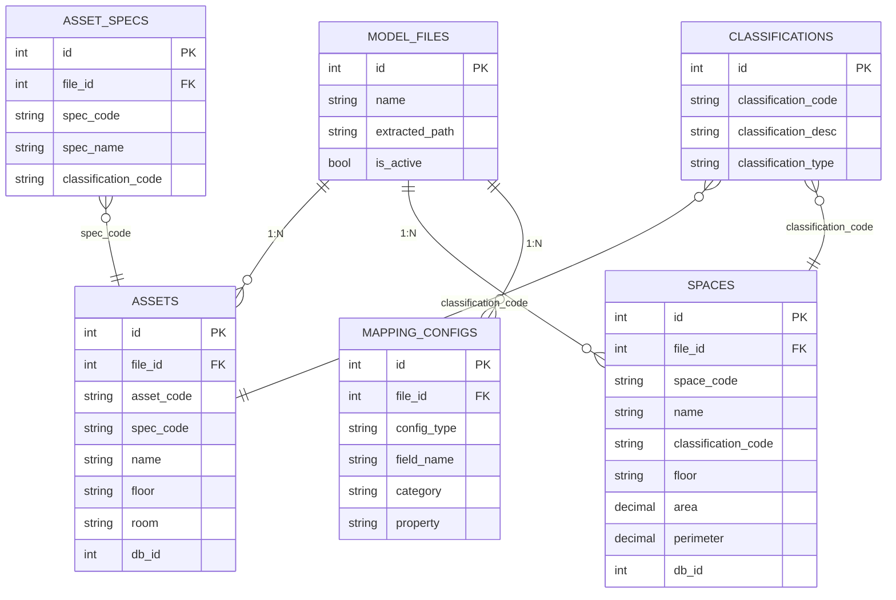

# 系统概述

<cite>
**本文档引用文件**  
- [main.js](file://src/main.js)
- [App.vue](file://src/App.vue)
- [MainView.vue](file://src/components/MainView.vue)
- [index.js](file://server/index.js)
- [api.js](file://server/routes/api.js)
- [mapping-config.js](file://server/models/mapping-config.js)
- [postgres.js](file://src/services/postgres.js)
- [influx.ts](file://src/services/influx.ts)
- [schema.sql](file://server/db/schema.sql)
- [vite.config.js](file://vite.config.js)
</cite>

## 目录
1. [项目简介](#项目简介)
2. [技术架构](#技术架构)
3. [核心功能模块](#核心功能模块)
4. [系统工作流](#系统工作流)
5. [数据模型与集成](#数据模型与集成)
6. [前后端交互机制](#前后端交互机制)
7. [应用场景与优势](#应用场景与优势)

## 项目简介

tandem-demo项目是一个集成了建筑信息模型（BIM）与物联网（IoT）数据的可视化展示平台。该项目旨在通过融合3D/2D建筑模型与实时传感器数据，为建筑运维、设施管理和空间规划提供直观的数据支持。系统允许用户上传BIM模型，配置资产与空间的属性映射，并将来自InfluxDB的时序数据（如温度）与模型中的房间进行关联，最终在3D视图中以动态标签和热力图的形式进行可视化展示。

系统支持多模型管理，用户可以在不同建筑模型之间切换，并查看与之关联的文档、资产列表和空间信息。通过“数据导出”功能，用户可以将模型中的资产和空间数据，结合自定义的字段映射配置，导出为结构化的数据报告。

**Section sources**
- [App.vue](file://src/App.vue#L1-L800)
- [MainView.vue](file://src/components/MainView.vue#L1-L800)

## 技术架构

tandem-demo项目采用前后端分离的架构设计，前端使用Vue 3 + Vite构建现代化的单页应用（SPA），后端使用Express + PostgreSQL提供RESTful API服务。这种架构模式实现了关注点分离，便于团队协作开发和独立部署。

前端通过Vite构建工具实现快速的开发服务器启动和热模块替换（HMR），提升了开发效率。Vite配置文件（vite.config.js）中设置了代理规则，将`/api`前缀的请求转发到运行在3001端口的后端服务，解决了开发环境下的跨域问题。

后端服务基于Express框架，提供了用于管理分类编码、资产规格、资产、空间等数据的API接口。所有数据持久化在PostgreSQL数据库中，其表结构在`server/db/schema.sql`文件中定义，包括`classifications`、`asset_specs`、`assets`、`spaces`等核心表。后端还通过`/api/import/model-data`接口接收从前端解析的模型数据，并将其批量导入数据库。

**Diagram sources**

**Section sources**
- [main.js](file://src/main.js#L1-L7)
- [index.js](file://server/index.js#L1-L92)
- [vite.config.js](file://vite.config.js#L1-L21)

## 核心功能模块

系统的核心功能模块包括3D/2D模型可视化、文档管理、时序数据集成和空间-资产映射配置。

**3D/2D模型可视化**：系统使用Autodesk Forge Viewer在`MainView.vue`组件中加载和渲染3D模型。用户可以对模型进行旋转、缩放和平移操作。模型中的房间和资产构件可以通过点击进行选择，其属性信息会显示在右侧面板中。系统还支持2D平面图的显示。

**文档管理**：用户可以上传与建筑模型相关的文档（如PDF、图片等），这些文档被存储在`public/docs`目录下，并通过后端的`/api/documents`接口进行管理。用户可以在文件面板中浏览和预览这些文档。

**时序数据集成**：系统集成了InfluxDB作为时序数据库，用于存储和查询来自IoT传感器的数据（如房间温度）。前端通过`influx.ts`服务向InfluxDB发送Flux查询，获取指定时间范围内的平均温度或单个房间的温度历史数据，并在时间轴和图表中进行展示。

**空间-资产映射配置**：这是系统的关键功能之一。由于BIM模型中的属性字段名称可能不统一，系统提供了“字段映射配置”功能。用户可以在`MappingConfigPanel.vue`中，将系统预设的字段（如`assetCode`、`name`）映射到模型中的实际属性名（如`MC编码`、`名称`）。这个映射关系被保存在PostgreSQL的`mapping_configs`表中，确保了数据提取的灵活性和准确性。

**Section sources**
- [App.vue](file://src/App.vue#L1-L800)
- [MainView.vue](file://src/components/MainView.vue#L1-L800)
- [MappingConfigPanel.vue](file://src/components/MappingConfigPanel.vue#L1-L502)
- [influx.ts](file://src/services/influx.ts#L1-L136)

## 系统工作流

用户的典型工作流如下：首先，用户启动前端应用（`npm run dev`）和后端服务（`npm start`）。前端应用通过`main.js`初始化Vue应用，并加载`App.vue`作为根组件。

当用户上传一个BIM模型文件后，系统会解析该模型，提取出其中的资产和空间构件。这些数据通过`postgres.js`服务发送到后端的`/api/import/model-data`接口。后端服务将这些数据与分类编码、资产规格等信息一起，批量插入到PostgreSQL数据库的相应表中。

随后，用户可以在前端界面中选择该模型进行查看。`App.vue`会加载`MainView.vue`，并调用`loadNewModel`方法加载对应的3D模型。同时，`onViewerReady`回调会触发，从数据库加载该模型关联的资产和空间数据。

用户可以在“连接”视图中，通过点击房间来查看其实时温度。`MainView.vue`会根据当前时间轴的位置，从InfluxDB查询对应的温度数据，并更新房间标签上的数值。用户还可以开启热力图，根据温度数据动态改变房间构件的颜色。

**Diagram sources**

**Section sources**
- [main.js](file://src/main.js#L1-L7)
- [App.vue](file://src/App.vue#L1-L800)
- [MainView.vue](file://src/components/MainView.vue#L1-L800)
- [postgres.js](file://src/services/postgres.js#L1-L245)

## 数据模型与集成

系统的数据模型围绕BIM中的核心实体构建。PostgreSQL数据库中的`assets`表存储了资产构件的信息，如`asset_code`（MC编码）、`spec_code`（规格编码）和`db_id`（在Viewer中的唯一标识）。`spaces`表存储了空间（房间）的信息，如`space_code`（编号）、`area`（面积）和`floor`（楼层）。

`mapping_configs`表是实现灵活数据集成的关键。它存储了文件级别的字段映射配置，将系统内部的字段名（`field_name`）映射到模型中的实际属性名（`property`），并关联到一个分类（`category`）。例如，系统中的`assetCode`字段可以被映射到模型中的`MC编码`属性。

时序数据存储在InfluxDB中，测量值（measurement）为`room_temp`，包含`code`（房间编码）和`value`（温度值）两个字段。前端通过Flux查询语言，按时间范围和房间编码聚合数据，实现了高效的数据检索。

**Diagram sources**

**Section sources**
- [schema.sql](file://server/db/schema.sql#L1-L160)
- [mapping-config.js](file://server/models/mapping-config.js#L1-L115)

## 前后端交互机制

前后端通过RESTful API进行交互。前端使用`fetch` API或封装好的服务（如`postgres.js`）向后端发起HTTP请求。后端的`api.js`文件定义了所有API路由，如`GET /api/assets`用于获取所有资产，`POST /api/assets/batch`用于批量导入资产。

环境变量的管理通过`.env`文件实现。前端使用`import.meta.env.VITE_API_URL`来获取后端API的地址，后端使用`dotenv`包加载数据库连接信息。这种机制使得应用可以在不同环境（开发、生产）中灵活配置。

数据的双向绑定通过Vue 3的响应式系统实现。例如，`App.vue`中的`assetList`和`roomList`是响应式引用（`ref`），当从后端获取数据并更新这些引用时，所有使用它们的组件（如`LeftPanel`、`MainView`）会自动重新渲染。

**Section sources**
- [api.js](file://server/routes/api.js#L1-L517)
- [postgres.js](file://src/services/postgres.js#L1-L245)
- [index.js](file://server/index.js#L1-L92)

## 应用场景与优势

tandem-demo项目适用于智能建筑、设施管理和数字孪生等场景。其主要优势在于：

1.  **数据融合**：无缝集成静态的BIM模型数据与动态的IoT传感器数据，提供全面的建筑信息视图。
2.  **灵活性高**：通过字段映射配置，系统可以适应不同来源、不同命名规范的BIM模型，无需修改代码即可接入新项目。
3.  **用户体验好**：直观的3D可视化界面和交互式时间轴，使用户能够轻松地探索和理解复杂的数据。
4.  **技术栈现代**：采用Vue 3、Vite、Express等现代技术栈，保证了系统的性能和可维护性。

对于初学者，该系统提供了一个清晰的BIM+IoT应用范例；对于高级开发者，其模块化的设计和清晰的API接口便于进行二次开发和功能扩展。