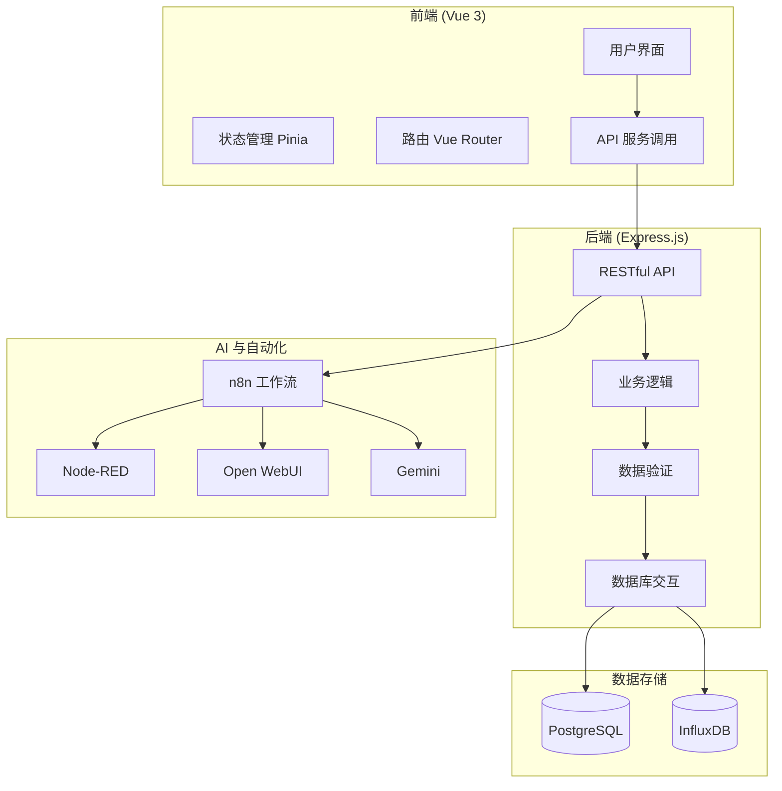
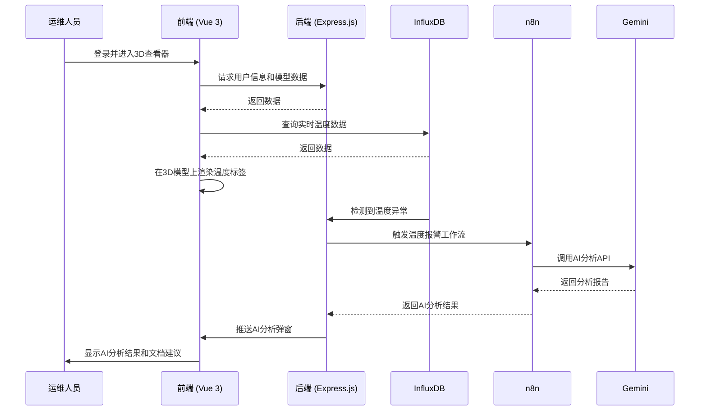

# 系统概述

<cite>
**本文档引用文件**  
- [README.md](file://README.md)
- [package.json](file://package.json)
- [docker-compose.yml](file://docker-compose.yml)
- [server/package.json](file://server/package.json)
- [src/main.js](file://src/main.js)
- [server/index.js](file://server/index.js)
- [server/config/index.js](file://server/config/index.js)
- [server/models/user.js](file://server/models/user.js)
- [server/routes/v1/assets.js](file://server/routes/v1/assets.js)
- [server/routes/v1/spaces.js](file://server/routes/v1/spaces.js)
- [server/services/gemini-service.js](file://server/services/gemini-service.js)
- [src/router/index.js](file://src/router/index.js)
- [src/stores/auth.ts](file://src/stores/auth.ts)
- [src/views/HomeView.vue](file://src/views/HomeView.vue)
- [src/components/MainView.vue](file://src/components/MainView.vue)
- [src/components/viewer/AIAnalysisModal.vue](file://src/components/viewer/AIAnalysisModal.vue)
- [src/services/api/assets.ts](file://src/services/api/assets.ts)
</cite>

## 目录
1. [项目愿景与核心价值主张](#项目愿景与核心价值主张)
2. [系统架构](#系统架构)
3. [核心功能模块](#核心功能模块)
4. [用户角色与工作流](#用户角色与工作流)
5. [外部集成点](#外部集成点)
6. [典型应用场景](#典型应用场景)

## 项目愿景与核心价值主张

TwinSight数字孪生平台旨在构建一个集成化的设施管理中枢，通过融合3D可视化、资产管控、文档智能分析与时序数据监控四大核心能力，实现物理空间与数字世界的无缝连接。其核心价值主张在于打破传统设施管理中信息孤岛的壁垒，为设施管理者提供一个统一、直观、智能的操作界面。

平台致力于将复杂的建筑设施数据转化为可操作的洞察，通过AI驱动的智能分析，将被动响应式维护转变为主动预测性维护。这不仅显著提升了运维效率，降低了运营成本，更通过数据驱动的决策支持，为设施的全生命周期管理提供了坚实基础。

**Section sources**
- [README.md](file://README.md)
- [src/views/HomeView.vue](file://src/views/HomeView.vue)

## 系统架构

TwinSight平台采用现代化的前后端分离架构，并通过Docker容器化实现便捷部署与环境一致性。

**前端**基于Vue 3框架构建，利用Vite作为构建工具，确保了开发效率与生产环境的高性能。前端应用通过Pinia进行状态管理，Vue Router处理路由导航，Element Plus提供UI组件库，实现了响应式、现代化的用户界面。

**后端**采用Node.js运行时环境，基于Express.js框架构建RESTful API服务。后端负责处理所有业务逻辑、数据验证和与数据库的交互，为前端提供稳定可靠的数据接口。

整个系统通过**Docker容器化**进行部署，`docker-compose.yml`文件定义了所有服务的依赖关系和网络配置，确保了开发、测试和生产环境的高度一致性。

**Diagram sources**
- [package.json](file://package.json)
- [server/package.json](file://server/package.json)
- [docker-compose.yml](file://docker-compose.yml)
- [src/main.js](file://src/main.js)
- [server/index.js](file://server/index.js)

## 核心功能模块

TwinSight平台的核心功能围绕四大支柱展开：

1.  **3D可视化**: 平台集成了Autodesk Forge Viewer，支持RVT、IFC等BIM模型的在线浏览。用户可以在3D模型中直观地查看建筑结构、设备位置和空间布局，实现物理空间的数字映射。

2.  **资产管控**: 提供对设施内所有资产（如设备、家具）的全生命周期管理。通过`/api/v1/assets`等API，支持资产的增删改查、批量导入、与BIM模型中的构件（dbId）关联，并支持按MC编码、分类、位置等维度进行管理。

3.  **文档智能分析**: 平台能够关联PDF、图片等文档，并利用AI技术进行智能分析。当系统检测到异常（如温度超标）时，可自动触发AI工作流，分析相关文档，为运维人员提供处置建议和知识支持。

4.  **时序数据监控**: 集成InfluxDB时序数据库，用于存储和查询来自IoT传感器的实时与历史数据（如温度、湿度）。前端通过时间轴控件，支持对历史数据进行回溯分析，并能基于阈值触发预警。

**Section sources**
- [src/views/HomeView.vue](file://src/views/HomeView.vue)
- [server/routes/v1/assets.js](file://server/routes/v1/assets.js)
- [server/routes/v1/spaces.js](file://server/routes/v1/spaces.js)
- [src/components/MainView.vue](file://src/components/MainView.vue)

## 用户角色与工作流

平台主要服务于两类用户角色：

**管理员**:
- **工作流**: 负责系统的初始化配置，包括创建用户账户、分配角色权限、配置InfluxDB数据源、管理文档库等。他们通过后台管理界面，确保平台的基础数据和配置正确无误。

**运维人员**:
- **工作流**: 日常使用平台进行设施监控。他们登录后进入3D查看器，通过开启“温度标签”或“热力图”功能，实时监控各空间的环境数据。当系统弹出AI分析弹窗时，他们可以查看AI生成的故障原因、处置方案和相关文档链接，快速做出响应。

**Diagram sources**
- [src/stores/auth.ts](file://src/stores/auth.ts)
- [src/components/MainView.vue](file://src/components/MainView.vue)
- [server/services/gemini-service.js](file://server/services/gemini-service.js)

## 外部集成点

TwinSight平台通过开放的API和微服务架构，与多个外部系统深度集成，构建了一个强大的自动化与AI生态。

- **n8n**: 作为核心的自动化引擎，负责编排复杂的业务流程。例如，当InfluxDB检测到温度异常时，n8n工作流会被触发，调用Gemini进行AI分析，并将结果推送给前端。
- **Node-RED**: 用于IoT数据的采集、处理和协议转换。它作为连接物理世界传感器与InfluxDB数据库的桥梁。
- **Open WebUI**: 提供了一个本地化的AI聊天界面，集成了Gemini模型，支持RAG（检索增强生成）功能，允许用户直接与平台知识库进行对话。
- **Gemini**: 作为AI服务的核心，提供强大的语言理解和生成能力，用于分析报警、生成报告、回答用户问题。

这些集成点通过Docker网络相互通信，确保了数据流的高效与安全。

**Section sources**
- [docker-compose.yml](file://docker-compose.yml)
- [server/config/index.js](file://server/config/index.js)
- [server/services/gemini-service.js](file://server/services/gemini-service.js)

## 典型应用场景

1.  **智能预警与故障诊断**: 当机房温度超过28°C时，系统自动触发AI分析工作流。Gemini模型结合设备手册、维护记录等文档，分析可能的故障原因（如冷却系统故障），并生成包含处置步骤和预防建议的报告，推送给运维人员。
2.  **资产全生命周期管理**: 新设备到货后，管理员将其信息录入系统，并与BIM模型中的对应构件关联。后续的维护记录、巡检报告、相关图纸均可在资产详情页中一站式查看。
3.  **历史数据回溯分析**: 运维人员发现某区域近期能耗异常，可通过时间轴控件回溯过去30天的能耗数据，结合天气、人员活动等数据，分析能耗升高的根本原因。

**Section sources**
- [src/components/viewer/AIAnalysisModal.vue](file://src/components/viewer/AIAnalysisModal.vue)
- [src/components/MainView.vue](file://src/components/MainView.vue)
- [server/services/gemini-service.js](file://server/services/gemini-service.js)