# 反向代理与SSL配置

<cite>
**本文引用的文件**
- [docker/nginx.conf](file://docker/nginx.conf)
- [docker/docker-compose.prod.yml](file://docker/docker-compose.prod.yml)
- [CLOUD_DEPLOYMENT_GUIDE.md](file://CLOUD_DEPLOYMENT_GUIDE.md)
- [docker/entrypoint.sh](file://docker/entrypoint.sh)
- [server/config/openwebui-config.js](file://server/config/openwebui-config.js)
</cite>

## 目录
1. [简介](#简介)
2. [项目结构](#项目结构)
3. [核心组件](#核心组件)
4. [架构总览](#架构总览)
5. [详细组件分析](#详细组件分析)
6. [依赖关系分析](#依赖关系分析)
7. [性能考虑](#性能考虑)
8. [故障排查指南](#故障排查指南)
9. [结论](#结论)
10. [附录](#附录)

## 简介
本指南围绕生产环境的 Nginx 反向代理与 SSL 安全配置展开，结合 docker/nginx.conf 文件，系统讲解以下内容：
- HTTP 到 HTTPS 的重定向机制与 Let's Encrypt 验证路径
- SSL 证书配置（fullchain.pem 与 privkey.pem）及安全套件与会话参数
- 安全头设置（X-Frame-Options、X-Content-Type-Options、X-XSS-Protection）
- 各 location 块的路由规则：前端静态文件、API 接口、n8n 工作流、Open WebUI、Node-RED 等
- 与 Docker Compose 的集成方式与端口映射
- WebSocket 与 SSE 长连接的超时配置优化建议

## 项目结构
本项目采用 Docker Compose 将 Nginx 作为统一入口，反向代理多个后端服务：
- Nginx：监听 80/443，负责 SSL 终止、重定向、上游代理与安全头
- API：后端服务，提供 REST API 与健康检查
- n8n：工作流自动化平台
- Open WebUI：AI 对话界面
- Node-RED：IoT 数据流处理
- Grafana：监控仪表盘
- InfluxDB：时序数据库（默认仅内部访问）

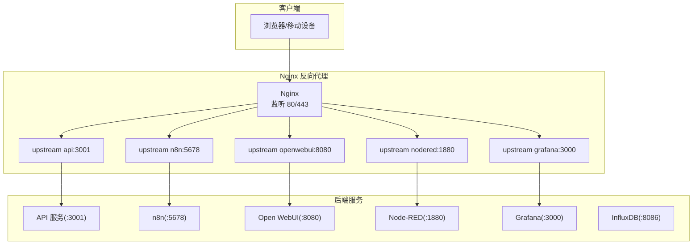

**图示来源**
- [docker/docker-compose.prod.yml](file://docker/docker-compose.prod.yml#L63-L80)
- [docker/nginx.conf](file://docker/nginx.conf#L46-L74)

**章节来源**
- [docker/docker-compose.prod.yml](file://docker/docker-compose.prod.yml#L63-L80)
- [docker/nginx.conf](file://docker/nginx.conf#L46-L74)

## 核心组件
- Nginx 主配置与上游服务定义
- HTTP 服务器（80 端口）：重定向与 ACME 挑战路径
- HTTPS 服务器（443 端口）：SSL 证书、安全套件、安全头、location 路由
- Docker Compose：挂载 nginx.conf 与 ssl 目录，暴露 80/443 端口

**章节来源**
- [docker/nginx.conf](file://docker/nginx.conf#L13-L24)
- [docker/nginx.conf](file://docker/nginx.conf#L76-L91)
- [docker/nginx.conf](file://docker/nginx.conf#L95-L114)
- [docker/docker-compose.prod.yml](file://docker/docker-compose.prod.yml#L63-L80)

## 架构总览
Nginx 作为统一入口，负责：
- HTTP 到 HTTPS 的 301 重定向
- Let's Encrypt 证书验证路径透传
- SSL 终止与安全套件配置
- 前端静态资源与 API 的反向代理
- 各子系统的路径级路由与长连接支持

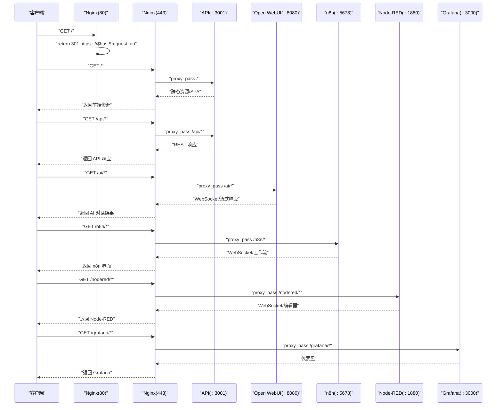

**图示来源**
- [docker/nginx.conf](file://docker/nginx.conf#L76-L91)
- [docker/nginx.conf](file://docker/nginx.conf#L115-L221)
- [docker/docker-compose.prod.yml](file://docker/docker-compose.prod.yml#L250-L262)

## 详细组件分析

### HTTP 到 HTTPS 重定向与 ACME 验证
- 80 端口 server：
  - 透传 /.well-known/acme-challenge/ 路径，用于 Let's Encrypt 证书签发与续期验证
  - 其他请求统一返回 301 重定向至 HTTPS
- 443 端口 server：
  - 加载 SSL 证书与私钥（fullchain.pem 与 privkey.pem）
  - 配置 TLS 版本与加密套件，启用会话缓存与超时

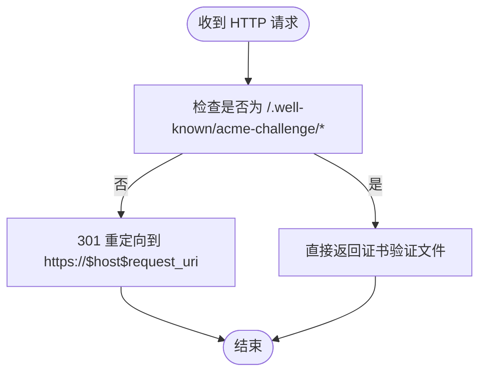

**图示来源**
- [docker/nginx.conf](file://docker/nginx.conf#L76-L91)

**章节来源**
- [docker/nginx.conf](file://docker/nginx.conf#L76-L91)

### SSL 证书与安全套件
- 证书位置：/etc/nginx/ssl/fullchain.pem 与 /etc/nginx/ssl/privkey.pem
- TLS 版本：TLSv1.2/TLSv1.3
- 加密套件：优先服务端密码套件，限定 AES-GCM
- 会话缓存：共享缓存，会话超时 1 天

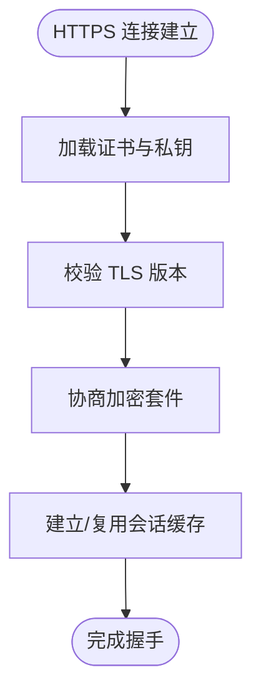

**图示来源**
- [docker/nginx.conf](file://docker/nginx.conf#L95-L114)

**章节来源**
- [docker/nginx.conf](file://docker/nginx.conf#L95-L114)

### 安全头设置
- X-Frame-Options：SAMEORIGIN
- X-Content-Type-Options：nosniff
- X-XSS-Protection：1; mode=block
- 以上均在 HTTPS server 中通过 add_header 设置

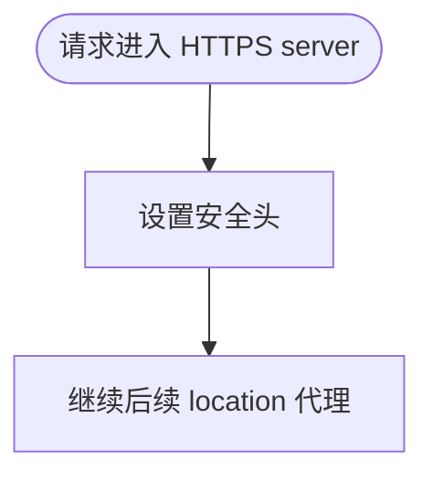

**图示来源**
- [docker/nginx.conf](file://docker/nginx.conf#L110-L114)

**章节来源**
- [docker/nginx.conf](file://docker/nginx.conf#L110-L114)

### 前端静态文件与 API 路由
- 根路径 /：代理到上游 api，用于提供前端 SPA 静态资源与单页路由
- /api/*：代理到 api 的 /api/*，支持长连接（SSE/WebSocket），设置超时
- /docs/*：代理到 api 的 /docs/*，用于文档静态资源

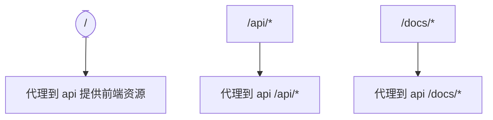

**图示来源**
- [docker/nginx.conf](file://docker/nginx.conf#L115-L152)

**章节来源**
- [docker/nginx.conf](file://docker/nginx.conf#L115-L152)

### n8n 工作流与 Webhook
- /n8n/*：代理到 n8n，默认开启升级头以支持 WebSocket
- /webhook/*：代理到 n8n 的 webhook，便于外部系统回调接入

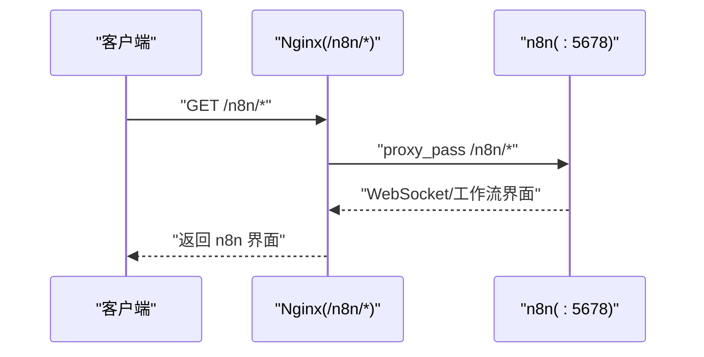

**图示来源**
- [docker/nginx.conf](file://docker/nginx.conf#L153-L178)

**章节来源**
- [docker/nginx.conf](file://docker/nginx.conf#L153-L178)

### Open WebUI（AI 对话）
- /ai/*：代理到 openwebui
- 为支持流式响应（如 SSE/流式 WebSocket），关闭缓冲并设置较短读取超时

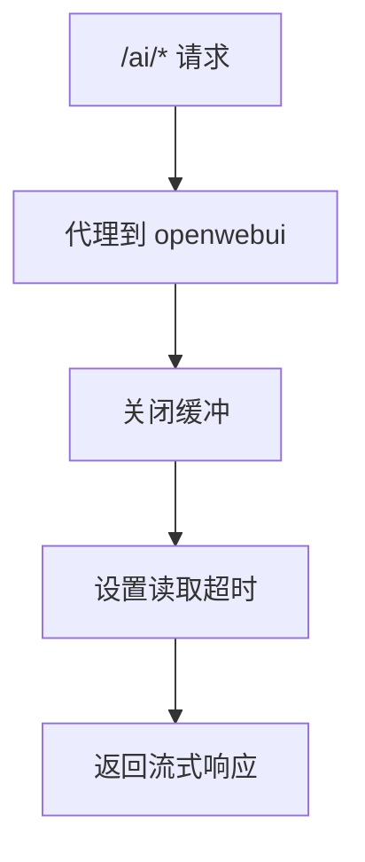

**图示来源**
- [docker/nginx.conf](file://docker/nginx.conf#L179-L195)

**章节来源**
- [docker/nginx.conf](file://docker/nginx.conf#L179-L195)

### Node-RED（IoT 数据流）
- /nodered/*：代理到 nodered，开启升级头以支持 WebSocket
- 适合实时数据流与节点编辑器交互

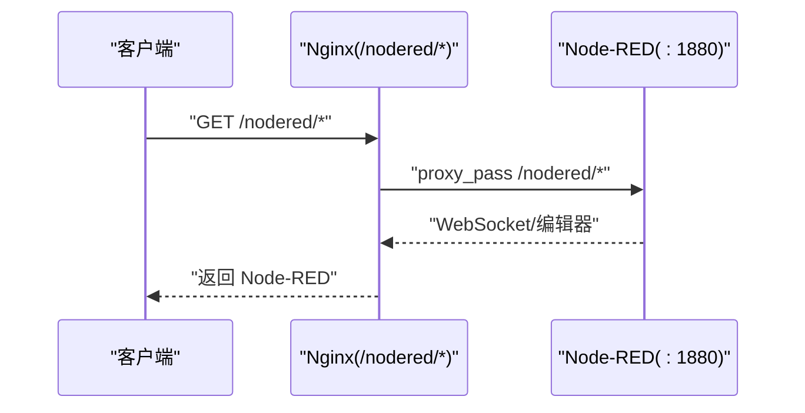

**图示来源**
- [docker/nginx.conf](file://docker/nginx.conf#L196-L210)

**章节来源**
- [docker/nginx.conf](file://docker/nginx.conf#L196-L210)

### Grafana（监控仪表盘）
- /grafana/*：代理到 grafana，支持子路径部署
- 通过上游 grafana:3000 提供仪表盘服务

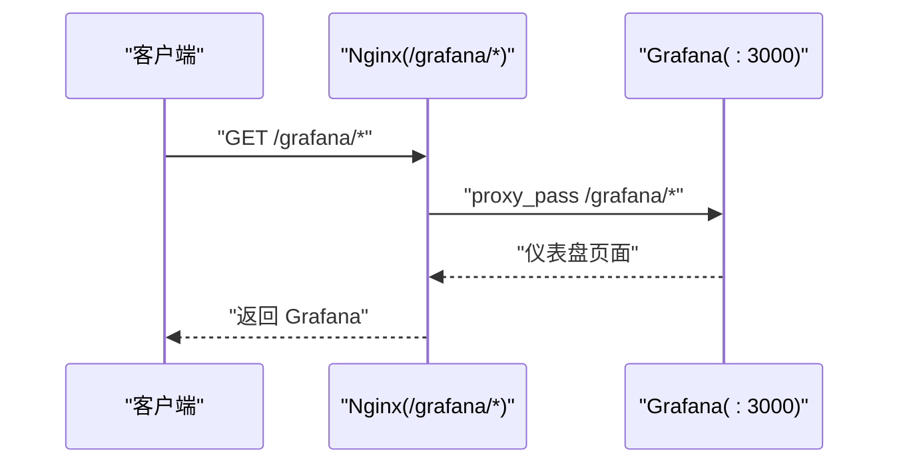

**图示来源**
- [docker/nginx.conf](file://docker/nginx.conf#L211-L221)
- [docker/docker-compose.prod.yml](file://docker/docker-compose.prod.yml#L196-L213)

**章节来源**
- [docker/nginx.conf](file://docker/nginx.conf#L211-L221)
- [docker/docker-compose.prod.yml](file://docker/docker-compose.prod.yml#L196-L213)

### InfluxDB（可选）
- 默认不暴露端口，如需开放 API，可取消注释相应 location 块
- 通过上游 influxdb:8086 提供时序数据访问

**章节来源**
- [docker/nginx.conf](file://docker/nginx.conf#L222-L231)
- [docker/docker-compose.prod.yml](file://docker/docker-compose.prod.yml#L82-L101)

### 健康检查端点
- /health：代理到 api 的 /api/health，便于外部探针检查

**章节来源**
- [docker/nginx.conf](file://docker/nginx.conf#L232-L238)

## 依赖关系分析
- Nginx 依赖上游服务名称与端口（通过 upstream 定义）
- Docker Compose 将 nginx.conf 与 ssl 目录挂载到 Nginx 容器
- API 服务依赖数据库与 InfluxDB，并通过环境变量配置外部服务地址（如 Open WebUI、n8n）

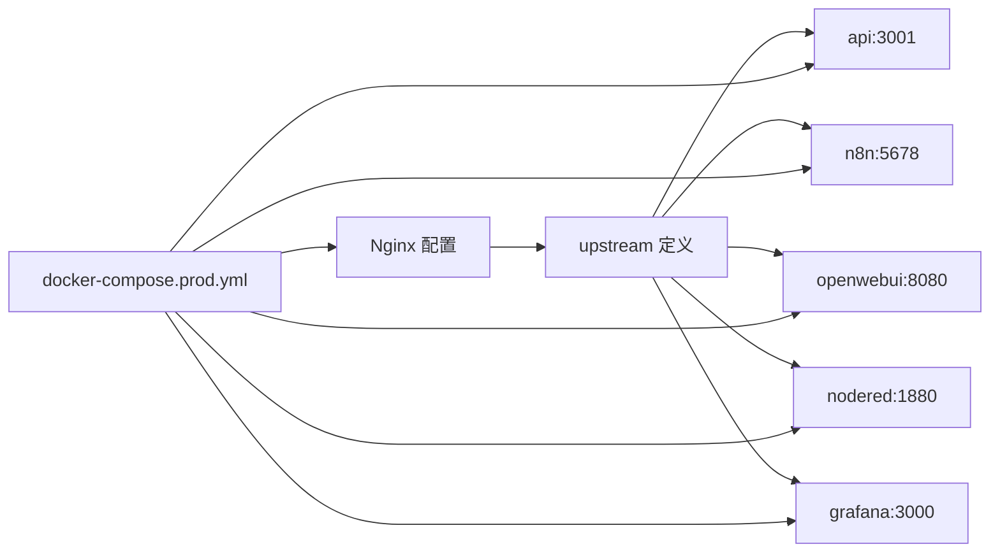

**图示来源**
- [docker/nginx.conf](file://docker/nginx.conf#L46-L74)
- [docker/docker-compose.prod.yml](file://docker/docker-compose.prod.yml#L63-L80)

**章节来源**
- [docker/nginx.conf](file://docker/nginx.conf#L46-L74)
- [docker/docker-compose.prod.yml](file://docker/docker-compose.prod.yml#L63-L80)

## 性能考虑
- keepalive 连接池：上游服务均配置 keepalive，减少连接建立开销
- gzip 压缩：对常见文本/JSON 类型启用压缩，降低带宽
- 上传大小限制：client_max_body_size 限制为 500M，满足大文件上传需求
- 会话缓存与超时：SSL 会话缓存与超时提升 TLS 握手效率
- WebSocket/SSE 超时：针对长连接设置较长读写超时，避免中间设备断开导致连接中断

**章节来源**
- [docker/nginx.conf](file://docker/nginx.conf#L26-L43)
- [docker/nginx.conf](file://docker/nginx.conf#L103-L114)
- [docker/nginx.conf](file://docker/nginx.conf#L131-L144)
- [docker/nginx.conf](file://docker/nginx.conf#L153-L170)
- [docker/nginx.conf](file://docker/nginx.conf#L179-L195)

## 故障排查指南
- 证书加载失败
  - 确认 fullchain.pem 与 privkey.pem 是否正确挂载到 /etc/nginx/ssl/
  - 检查 Docker Compose 中卷挂载路径与权限
- Let's Encrypt 验证失败
  - 确认 /.well-known/acme-challenge/ 路径被透传且可访问
  - 使用 certbot standalone 模式进行验证
- WebSocket/SSE 断连
  - 检查 proxy_read_timeout 与 proxy_send_timeout 是否足够
  - 确认代理头 Upgrade/Connection 已正确传递
- 健康检查异常
  - 确认 /health 代理到 api 的 /api/health
  - 检查 API 服务健康检查配置与网络连通性

**章节来源**
- [docker/docker-compose.prod.yml](file://docker/docker-compose.prod.yml#L63-L80)
- [docker/nginx.conf](file://docker/nginx.conf#L76-L91)
- [docker/nginx.conf](file://docker/nginx.conf#L131-L144)
- [docker/nginx.conf](file://docker/nginx.conf#L153-L170)
- [docker/nginx.conf](file://docker/nginx.conf#L179-L195)
- [docker/nginx.conf](file://docker/nginx.conf#L232-L238)

## 结论
本配置通过单一 Nginx 入口实现多服务统一代理与 SSL 终止，结合安全头与严格的加密套件，确保生产环境的安全性与稳定性。针对长连接场景（WebSocket/SSE）提供了合理的超时配置，配合 Docker Compose 的卷挂载与端口映射，可快速完成部署与运维。

## 附录

### Let's Encrypt 证书申请与自动续期
- 本地申请与复制证书到 docker/ssl 目录
- 证书文件命名与路径需与 Nginx 配置一致
- 自动续期可使用 certbot 的 cron 或 systemd timer 定时任务

**章节来源**
- [CLOUD_DEPLOYMENT_GUIDE.md](file://CLOUD_DEPLOYMENT_GUIDE.md#L415-L428)

### Docker Compose 集成要点
- Nginx 挂载 nginx.conf 与 ssl 目录
- 暴露 80/443 端口
- 上游服务通过服务名与端口访问

**章节来源**
- [docker/docker-compose.prod.yml](file://docker/docker-compose.prod.yml#L63-L80)

### Open WebUI 配置参考
- 后端服务通过环境变量 OPENWEBUI_URL 指向 Nginx 下的 /ai/ 路径
- 端点与 RAG 配置在 openwebui-config.js 中定义

**章节来源**
- [server/config/openwebui-config.js](file://server/config/openwebui-config.js#L1-L56)