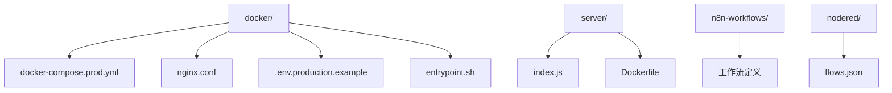
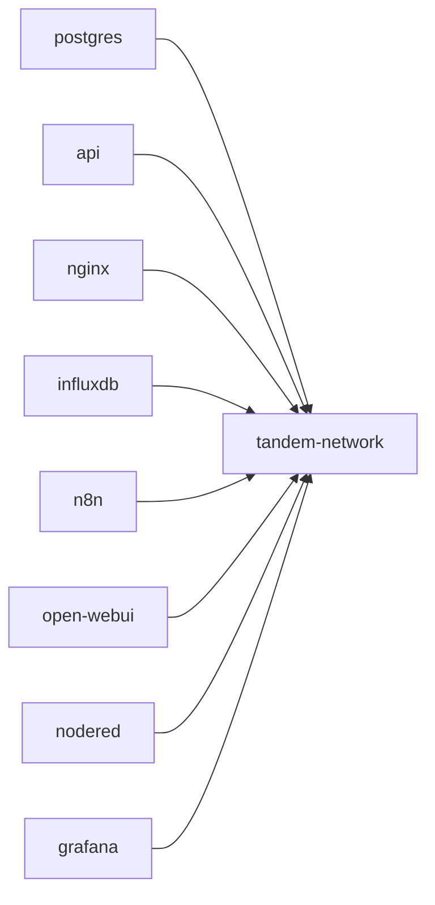
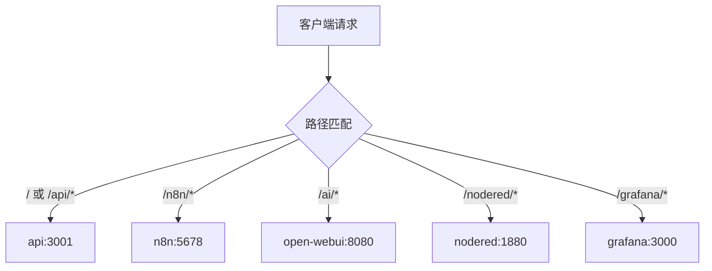
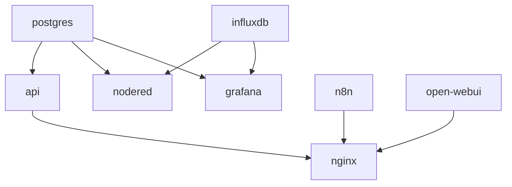

# 容器服务编排

<cite>
**本文档引用文件**  
- [docker-compose.prod.yml](file://docker/docker-compose.prod.yml)
- [nginx.conf](file://docker/nginx.conf)
- [.env.production.example](file://docker/.env.production.example)
- [Dockerfile](file://Dockerfile)
- [entrypoint.sh](file://docker/entrypoint.sh)
- [index.js](file://server/index.js)
</cite>

## 目录
1. [项目结构](#项目结构)  
2. [核心服务配置详解](#核心服务配置详解)  
3. [自定义网络与服务通信](#自定义网络与服务通信)  
4. [Nginx反向代理配置解析](#nginx反向代理配置解析)  
5. [环境变量与安全配置](#环境变量与安全配置)  
6. [常用Docker Compose命令](#常用docker-compose命令)  
7. [服务依赖与健康检查](#服务依赖与健康检查)  
8. [卷映射与数据持久化](#卷映射与数据持久化)

## 项目结构

本项目采用模块化结构，主要服务通过 `docker-compose.prod.yml` 进行编排，核心配置文件位于 `docker/` 目录下。前端与后端代码分别位于 `src/` 和 `server/` 目录，AI与IoT服务配置独立管理。



**图示来源**  
- [docker-compose.prod.yml](file://docker/docker-compose.prod.yml#L1-L262)
- [nginx.conf](file://docker/nginx.conf#L1-L240)

## 核心服务配置详解

### PostgreSQL数据库服务

`postgres` 服务使用 `pgvector/pgvector:pg16` 镜像，支持向量存储功能。通过环境变量注入数据库凭证，并使用命名卷 `postgres_data` 持久化数据。

**关键配置项**：
- **镜像**：`pgvector/pgvector:pg16`
- **环境变量**：`POSTGRES_USER`, `POSTGRES_PASSWORD`, `POSTGRES_DB`
- **卷映射**：`postgres_data:/var/lib/postgresql/data`
- **健康检查**：使用 `pg_isready` 命令验证数据库就绪状态

**服务来源**  
- [docker-compose.prod.yml](file://docker/docker-compose.prod.yml#L9-L27)

### 后端API服务

`api` 服务基于项目根目录的 `Dockerfile` 构建，监听3001端口。通过环境变量连接PostgreSQL和InfluxDB，并依赖数据库健康状态启动。

**关键配置项**：
- **构建上下文**：`context: ..`, `dockerfile: Dockerfile`
- **环境变量**：`DB_HOST`, `INFLUX_URL`, `OPENWEBUI_URL`, `N8N_WEBHOOK_URL`
- **健康检查**：通过 `wget` 访问 `/api/health` 端点

**服务来源**  
- [docker-compose.prod.yml](file://docker/docker-compose.prod.yml#L28-L62)
- [Dockerfile](file://Dockerfile#L1-L75)

### InfluxDB时序数据库

`influxdb` 服务使用 `influxdb:2.7-alpine` 镜像，配置初始化参数并持久化数据与配置。

**关键配置项**：
- **镜像**：`influxdb:2.7-alpine`
- **环境变量**：`DOCKER_INFLUXDB_INIT_*` 系列变量用于初始化
- **卷映射**：`influxdb_data` 和 `influxdb_config`
- **网络**：仅内部访问，不暴露端口

**服务来源**  
- [docker-compose.prod.yml](file://docker/docker-compose.prod.yml#L83-L101)

### n8n工作流自动化

`n8n` 服务提供可视化工作流引擎，支持Gemini API集成。

**关键配置项**：
- **镜像**：`n8nio/n8n:latest`
- **环境变量**：`GEMINI_API_KEY`, `N8N_BASIC_AUTH_*`, `N8N_PATH`
- **卷映射**：`n8n_data:/home/node/.n8n`
- **健康检查**：检查5678端口可达性

**服务来源**  
- [docker-compose.prod.yml](file://docker/docker-compose.prod.yml#L106-L145)

### Open WebUI AI对话界面

`open-webui` 服务提供AI聊天界面，集成Gemini模型。

**关键配置项**：
- **镜像**：`ghcr.io/open-webui/open-webui:main`
- **环境变量**：`OPENAI_API_KEYS`（使用Gemini密钥）
- **卷映射**：`open_webui_data:/app/backend/data`

**服务来源**  
- [docker-compose.prod.yml](file://docker/docker-compose.prod.yml#L146-L171)

### Node-RED与Grafana

`nodered` 和 `grafana` 服务分别提供IoT数据流处理和可视化功能。

**关键配置项**：
- **Node-RED**：依赖 `influxdb` 和 `postgres`，健康检查端口1880
- **Grafana**：管理员凭据通过环境变量设置，依赖数据库服务

**服务来源**  
- [docker-compose.prod.yml](file://docker/docker-compose.prod.yml#L174-L213)

## 自定义网络与服务通信

### tandem-network自定义桥接网络

`docker-compose.prod.yml` 定义了名为 `tandem-network` 的自定义桥接网络，所有服务均连接至此网络，实现容器间通信。



**网络优势**：
- 服务间通过容器名称直接通信（如 `api` 服务通过 `postgres` 访问数据库）
- 内部流量隔离，提升安全性
- 支持服务发现与负载均衡

**图示来源**  
- [docker-compose.prod.yml](file://docker/docker-compose.prod.yml#L228-L231)

## Nginx反向代理配置解析

### 上游服务定义

Nginx通过 `upstream` 指令定义后端服务地址，实现负载均衡与连接复用。

```nginx
upstream api {
    server api:3001;
    keepalive 32;
}
upstream n8n {
    server n8n:5678;
    keepalive 16;
}
# 其他服务类似...
```

### 路由规则详解

Nginx根据请求路径将流量路由到对应后端服务：



**关键路由配置**：
- **根路径**：代理到 `api` 服务，支持前端静态文件
- **/api/**：重写路径并代理，支持WebSocket
- **/n8n/**：支持WebSocket，用于实时工作流
- **/ai/**：关闭缓冲，支持AI流式响应

**配置来源**  
- [nginx.conf](file://docker/nginx.conf#L46-L238)

## 环境变量与安全配置

### 生产环境变量

`.env.production.example` 文件定义了所有必需的环境变量，包括：

- **数据库**：`DB_PASSWORD`（必填）
- **AI服务**：`GEMINI_API_KEY`（必填）
- **n8n**：`N8N_AUTH_PASSWORD`（必填）
- **Grafana**：`GRAFANA_PASSWORD`

**安全实践**：
- 敏感变量使用 `:?` 语法强制检查
- SSL证书通过 `./ssl/` 目录挂载
- 基本身份验证保护n8n和Grafana

**配置来源**  
- [.env.production.example](file://docker/.env.production.example#L1-L104)

## 常用Docker Compose命令

### 服务管理命令

```bash
# 启动生产环境服务
docker-compose -f docker-compose.prod.yml up -d

# 查看日志
docker-compose -f docker-compose.prod.yml logs -f

# 停止服务
docker-compose -f docker-compose.prod.yml down

# 重建并启动
docker-compose -f docker-compose.prod.yml up -d --build
```

### 环境准备

```bash
# 复制环境配置模板
cp docker/.env.production.example docker/.env

# 编辑 .env 文件填写实际值
vim docker/.env
```

**命令来源**  
- [docker-compose.prod.yml](file://docker/docker-compose.prod.yml#L234-L248)

## 服务依赖与健康检查

### 依赖关系图



### 健康检查策略

各服务配置了不同的健康检查机制：

- **postgres**：`pg_isready` 命令检查
- **api**：HTTP请求 `/api/health`
- **n8n**：检查5678端口
- **nodered**：检查1880端口

**依赖配置来源**  
- [docker-compose.prod.yml](file://docker/docker-compose.prod.yml#L52-L55)
- [docker-compose.prod.yml](file://docker/docker-compose.prod.yml#L74-L78)

## 卷映射与数据持久化

### 卷定义

`docker-compose.prod.yml` 定义了多个命名卷用于数据持久化：

```yaml
volumes:
  postgres_data:
  influxdb_data:
  influxdb_config:
  n8n_data:
  open_webui_data:
  nodered_data:
  grafana_data:
```

### 用途说明

- **postgres_data**：存储PostgreSQL数据库文件
- **influxdb_data**：存储时序数据
- **influxdb_config**：存储InfluxDB配置
- **n8n_data**：保存工作流定义与设置
- **open_webui_data**：存储AI对话历史与知识库
- **nodered_data**：保存Node-RED流程
- **grafana_data**：存储仪表盘与用户数据

**卷配置来源**  
- [docker-compose.prod.yml](file://docker/docker-compose.prod.yml#L216-L224)