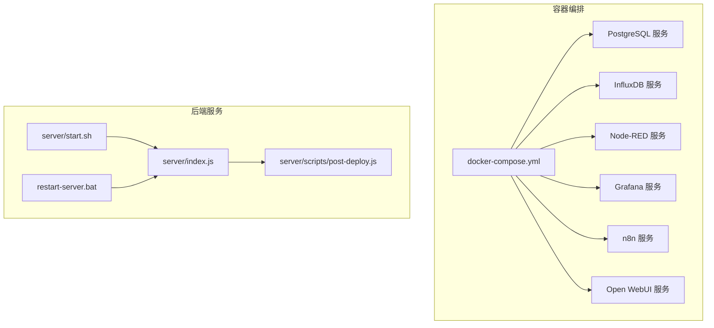
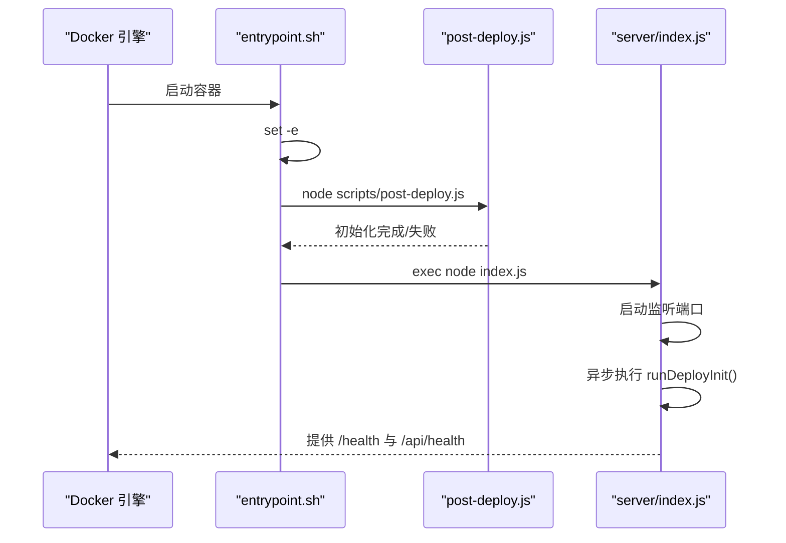
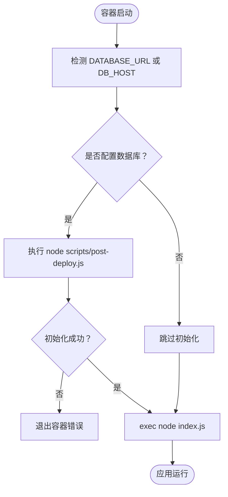
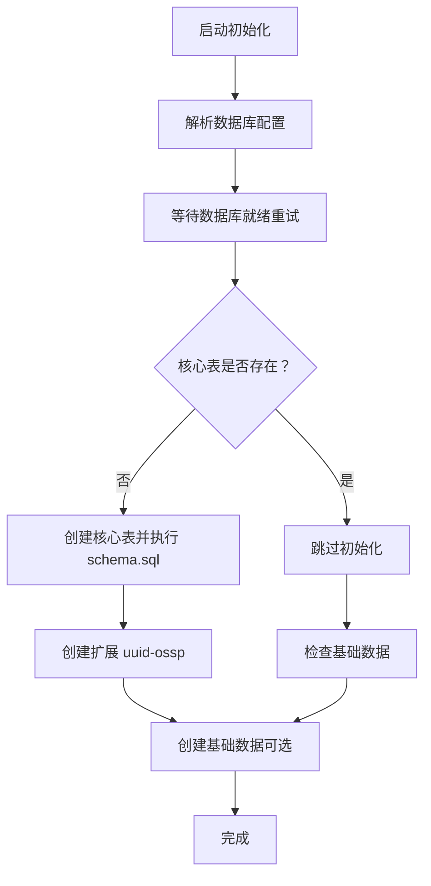
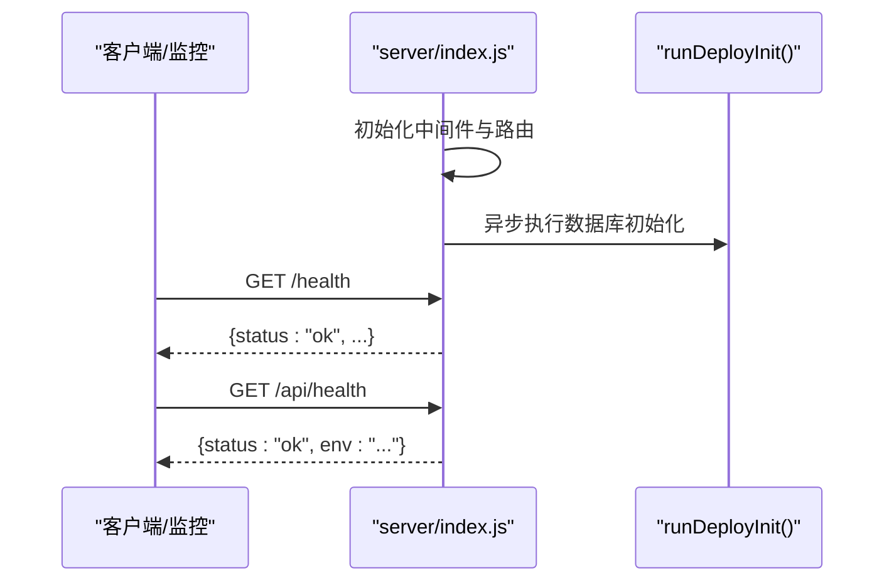
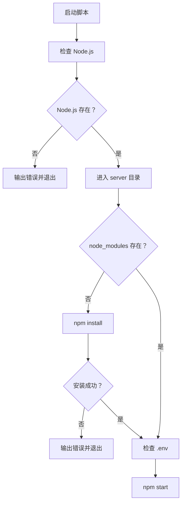
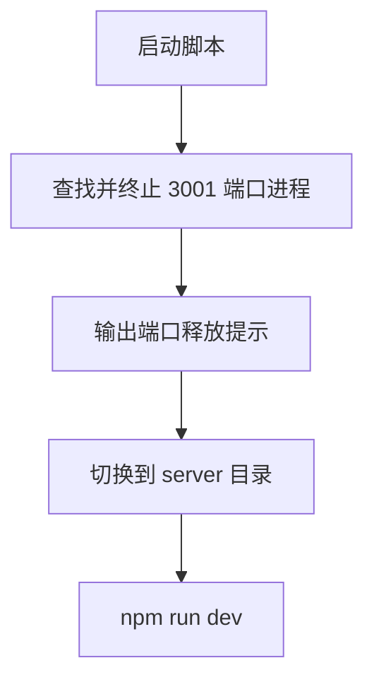
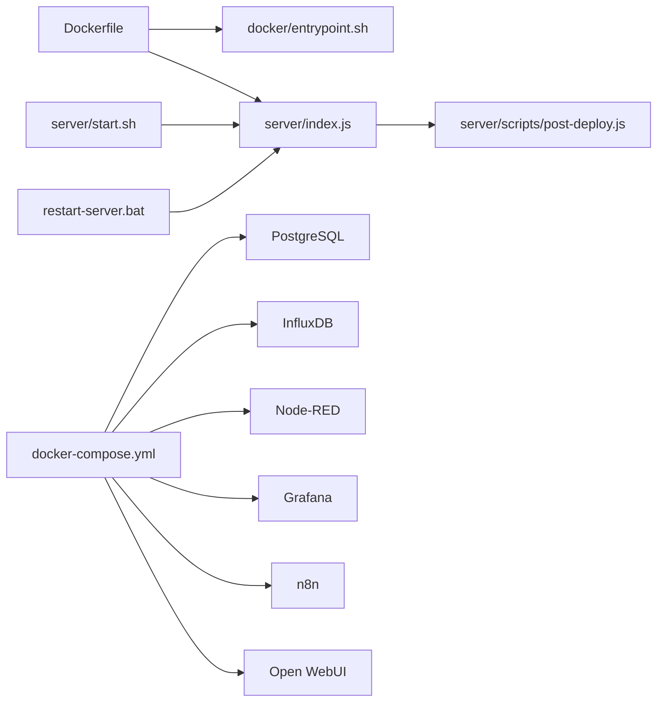

# 容器生命周期管理

<cite>
**本文引用的文件**
- [docker/entrypoint.sh](file://docker/entrypoint.sh)
- [Dockerfile](file://Dockerfile)
- [docker-compose.yml](file://docker-compose.yml)
- [server/index.js](file://server/index.js)
- [server/scripts/post-deploy.js](file://server/scripts/post-deploy.js)
- [server/scripts/check-backend-connection.js](file://server/scripts/check-backend-connection.js)
- [server/start.sh](file://server/start.sh)
- [restart-server.bat](file://restart-server.bat)
- [server/package.json](file://server/package.json)
</cite>

## 目录
1. [简介](#简介)
2. [项目结构](#项目结构)
3. [核心组件](#核心组件)
4. [架构总览](#架构总览)
5. [详细组件分析](#详细组件分析)
6. [依赖关系分析](#依赖关系分析)
7. [性能考量](#性能考量)
8. [故障排查指南](#故障排查指南)
9. [结论](#结论)
10. [附录](#附录)

## 简介
本文件制定容器生命周期管理规范，聚焦以下目标：
- 解析容器启动入口脚本 docker/entrypoint.sh 的核心流程：如何通过 set -e 在错误时终止容器；如何检测数据库连接并执行 scripts/post-deploy.js 进行数据库初始化或迁移；最终如何通过 exec node index.js 启动主应用进程。
- 对比 Linux 环境下的 server/start.sh 与 Windows 环境下的 restart-server.bat：前者如何检查 Node.js 环境、自动安装依赖（npm install）并启动服务（npm start），后者如何实现服务的重启操作。
- 提供容器健康检查、故障排查和日志分析的实用方法。

## 项目结构
本项目采用多服务编排，包含 PostgreSQL、InfluxDB、Node-RED、Grafana、n8n、Open WebUI 等服务，并通过 docker-compose.yml 统一管理。后端服务位于 server/ 目录，容器镜像由 Dockerfile 构建，入口脚本位于 docker/entrypoint.sh。

图表来源
- [docker-compose.yml](file://docker-compose.yml#L1-L220)
- [server/index.js](file://server/index.js#L1-L199)
- [server/scripts/post-deploy.js](file://server/scripts/post-deploy.js#L1-L182)
- [server/start.sh](file://server/start.sh#L1-L54)
- [restart-server.bat](file://restart-server.bat#L1-L13)

章节来源
- [docker-compose.yml](file://docker-compose.yml#L1-L220)

## 核心组件
- 容器入口脚本：负责在容器启动阶段等待数据库就绪、执行数据库初始化/迁移、最后启动主应用进程。
- 后端主程序：提供健康检查端点、静态文件服务、API 路由与后台任务。
- 初始化脚本：在容器启动时检测数据库连接、创建缺失的表结构、生成基础数据。
- 开发启动脚本：在 Linux 环境下检查 Node.js、安装依赖并启动服务。
- Windows 重启脚本：在 Windows 环境下停止占用端口的进程并重新启动开发服务。

章节来源
- [docker/entrypoint.sh](file://docker/entrypoint.sh#L1-L36)
- [server/index.js](file://server/index.js#L1-L199)
- [server/scripts/post-deploy.js](file://server/scripts/post-deploy.js#L1-L182)
- [server/start.sh](file://server/start.sh#L1-L54)
- [restart-server.bat](file://restart-server.bat#L1-L13)

## 架构总览
容器启动生命周期如下：
1. Dockerfile 指定生产镜像的 CMD 为 node index.js。
2. 容器启动时，ENTRYPOINT 执行 docker/entrypoint.sh。
3. entrypoint.sh 通过 set -e 保证错误即退出；当检测到数据库相关环境变量时，执行 node scripts/post-deploy.js 完成数据库初始化/迁移。
4. 初始化完成后，使用 exec node index.js 启动主应用进程，使 PID 1 不变，便于容器管理。
5. server/index.js 启动后，异步执行 runDeployInit() 完成幂等初始化，同时提供 /health 与 /api/health 健康检查端点。

图表来源
- [Dockerfile](file://Dockerfile#L67-L74)
- [docker/entrypoint.sh](file://docker/entrypoint.sh#L9-L36)
- [server/scripts/post-deploy.js](file://server/scripts/post-deploy.js#L146-L182)
- [server/index.js](file://server/index.js#L121-L136)

## 详细组件分析

### 容器入口脚本：docker/entrypoint.sh
- 关键特性
  - set -e：任何命令失败立即退出，避免后续步骤继续执行造成不可控状态。
  - 条件初始化：仅当存在 DATABASE_URL 或 DB_HOST 环境变量时，才执行数据库初始化。
  - 数据库初始化：调用 node scripts/post-deploy.js 完成数据库连接检测、表结构创建与基础数据生成。
  - 启动主进程：使用 exec node index.js 将 PID 1 交给 Node.js，确保信号传递与容器生命周期一致。

图表来源
- [docker/entrypoint.sh](file://docker/entrypoint.sh#L9-L36)
- [server/scripts/post-deploy.js](file://server/scripts/post-deploy.js#L146-L182)

章节来源
- [docker/entrypoint.sh](file://docker/entrypoint.sh#L9-L36)

### 数据库初始化脚本：server/scripts/post-deploy.js
- 功能概述
  - 数据库连接配置：优先使用 DATABASE_URL（云服务注入），否则使用 DB_HOST/DB_PORT/DB_NAME/DB_USER/DB_PASSWORD。
  - 等待数据库就绪：循环重试连接，超时则报错。
  - 幂等初始化：检测核心表是否存在，不存在则创建并执行 schema.sql；确保 uuid-ossp 扩展可用；必要时创建基础数据。
  - 错误处理：捕获异常并退出进程，保证容器启动失败时及时暴露问题。

图表来源
- [server/scripts/post-deploy.js](file://server/scripts/post-deploy.js#L19-L182)

章节来源
- [server/scripts/post-deploy.js](file://server/scripts/post-deploy.js#L19-L182)

### 主应用进程：server/index.js
- 健康检查端点
  - /health：轻量级健康检查，返回状态与时间戳。
  - /api/health：包含环境变量信息，便于云平台监控。
- 启动流程
  - 加载环境变量、配置 CORS、静态文件服务、路由注册。
  - 异步执行 runDeployInit()，不阻塞主服务启动。
  - 启动文档同步后台服务（周期性任务）。

图表来源
- [server/index.js](file://server/index.js#L121-L136)
- [server/index.js](file://server/index.js#L171-L196)

章节来源
- [server/index.js](file://server/index.js#L121-L136)
- [server/index.js](file://server/index.js#L171-L196)

### Linux 开发启动脚本：server/start.sh
- 功能要点
  - 检查 Node.js 是否安装并打印版本。
  - 自动安装依赖（npm install），若失败则退出。
  - 检查 .env 文件是否存在并给出提示。
  - 启动服务（npm start）。

图表来源
- [server/start.sh](file://server/start.sh#L1-L54)

章节来源
- [server/start.sh](file://server/start.sh#L1-L54)

### Windows 重启脚本：restart-server.bat
- 功能要点
  - 查找并终止占用 3001 端口的进程。
  - 输出端口释放提示。
  - 切换到 server 目录并启动开发模式（npm run dev）。

图表来源
- [restart-server.bat](file://restart-server.bat#L1-L13)

章节来源
- [restart-server.bat](file://restart-server.bat#L1-L13)

### 数据库连接检查脚本：server/scripts/check-backend-connection.js
- 功能要点
  - 从 server/.env 加载数据库配置。
  - 使用 pg 连接池测试连接与查询。
  - 执行插入测试并在事务中回滚，验证写入能力。
  - 输出详细日志与错误信息，便于诊断。

章节来源
- [server/scripts/check-backend-connection.js](file://server/scripts/check-backend-connection.js#L1-L90)

## 依赖关系分析
- 容器镜像与入口
  - Dockerfile 使用 node:20-alpine，复制后端代码与入口脚本，设置 NODE_ENV=production，CMD 为 node index.js。
  - entrypoint.sh 通过 exec 启动主进程，确保 PID 1 保持不变。
- 后端依赖
  - server/package.json 定义了 start、dev、db:* 等脚本，主程序入口为 index.js。
- 编排与网络
  - docker-compose.yml 定义了 PostgreSQL、InfluxDB、Node-RED、Grafana、n8n、Open WebUI 等服务及其依赖关系与网络。

图表来源
- [Dockerfile](file://Dockerfile#L35-L74)
- [docker/entrypoint.sh](file://docker/entrypoint.sh#L33-L36)
- [server/index.js](file://server/index.js#L1-L199)
- [server/scripts/post-deploy.js](file://server/scripts/post-deploy.js#L146-L182)
- [server/start.sh](file://server/start.sh#L1-L54)
- [restart-server.bat](file://restart-server.bat#L1-L13)
- [docker-compose.yml](file://docker-compose.yml#L1-L220)

章节来源
- [Dockerfile](file://Dockerfile#L35-L74)
- [docker-compose.yml](file://docker-compose.yml#L1-L220)
- [server/package.json](file://server/package.json#L1-L30)

## 性能考量
- 容器启动阶段的数据库初始化应尽量幂等且快速，避免长时间阻塞容器启动。
- 生产镜像使用多阶段构建，减少镜像体积，提升拉取与启动速度。
- 健康检查端点应保持低开销，避免对业务造成额外压力。
- 日志输出建议在生产环境适度降噪，避免过多 I/O 影响性能。

## 故障排查指南
- 容器启动失败
  - 检查 entrypoint.sh 是否因 set -e 在初始化阶段报错退出。
  - 使用 docker-compose logs -f 查看容器日志，定位初始化失败原因。
- 数据库连接问题
  - 使用 server/scripts/check-backend-connection.js 手动验证连接与写入能力。
  - 确认 DATABASE_URL 或 DB_* 环境变量配置正确。
- 健康检查
  - 访问 /health 与 /api/health，确认返回状态为 ok。
  - 若云平台集成，关注 /api/health 返回的环境信息。
- 开发环境重启
  - Windows：使用 restart-server.bat 停止占用端口的进程并重新启动开发服务。
  - Linux：使用 server/start.sh 自动安装依赖并启动服务。

章节来源
- [docker/entrypoint.sh](file://docker/entrypoint.sh#L9-L36)
- [server/scripts/check-backend-connection.js](file://server/scripts/check-backend-connection.js#L1-L90)
- [server/index.js](file://server/index.js#L121-L136)
- [restart-server.bat](file://restart-server.bat#L1-L13)
- [server/start.sh](file://server/start.sh#L1-L54)

## 结论
本规范明确了容器生命周期的关键节点：入口脚本通过 set -e 保障失败即停，条件执行数据库初始化，最终以 exec 方式启动主应用进程。开发与运维脚本分别覆盖 Linux 与 Windows 场景，配合健康检查与日志分析，形成完整的可观测与可维护体系。建议在生产环境中持续完善健康检查与日志策略，确保系统稳定运行。

## 附录
- 健康检查端点
  - GET /health：返回 { status: "ok", timestamp: "..." }
  - GET /api/health：返回 { status: "ok", timestamp: "...", env: "..." }
- 初始化脚本行为
  - 幂等执行，支持重复运行；在缺少核心表时创建并执行 schema.sql；确保 uuid-ossp 扩展存在；可选创建基础数据。
- 开发启动与重启
  - Linux：server/start.sh 自动安装依赖并启动服务。
  - Windows：restart-server.bat 停止占用端口进程并启动开发服务。