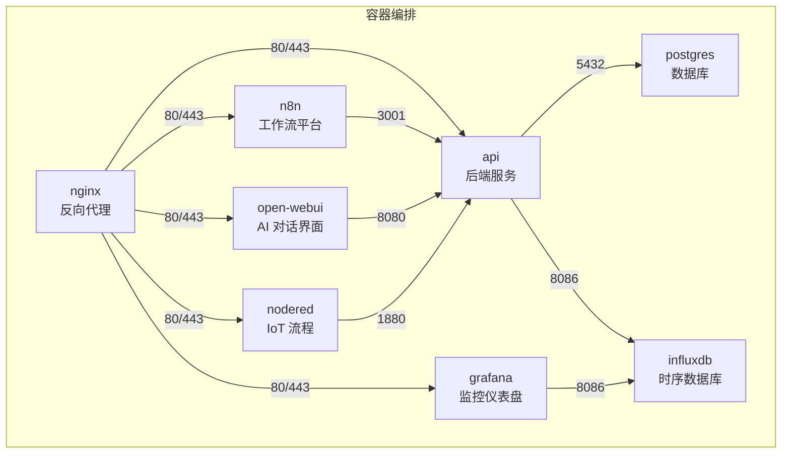
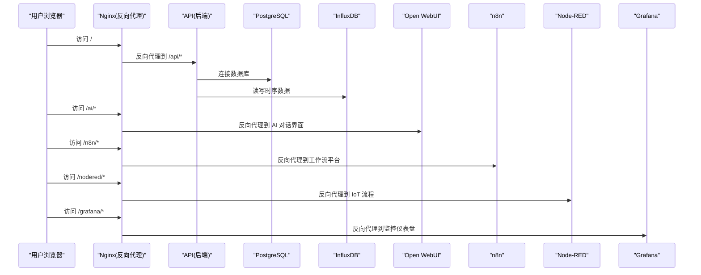
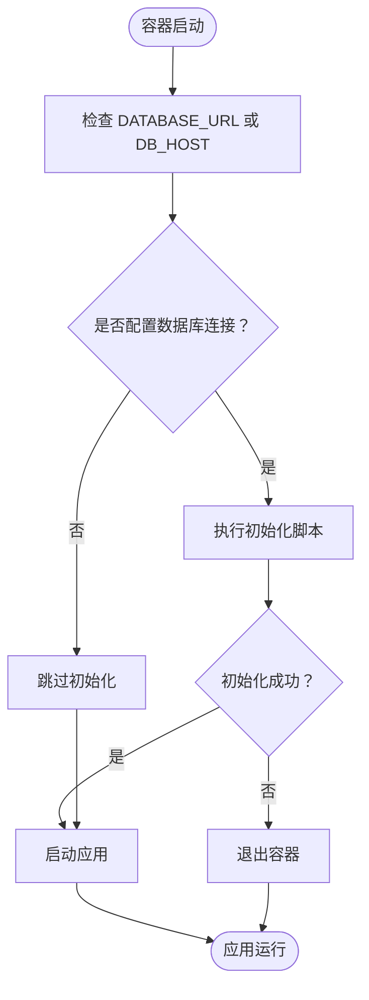
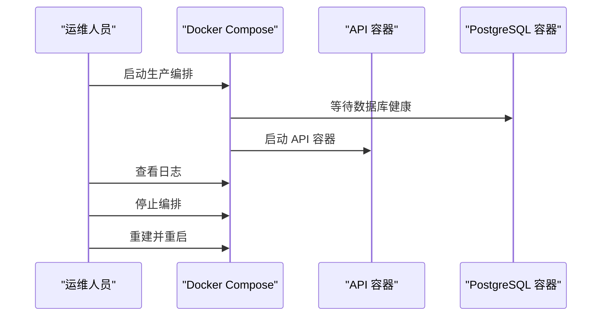
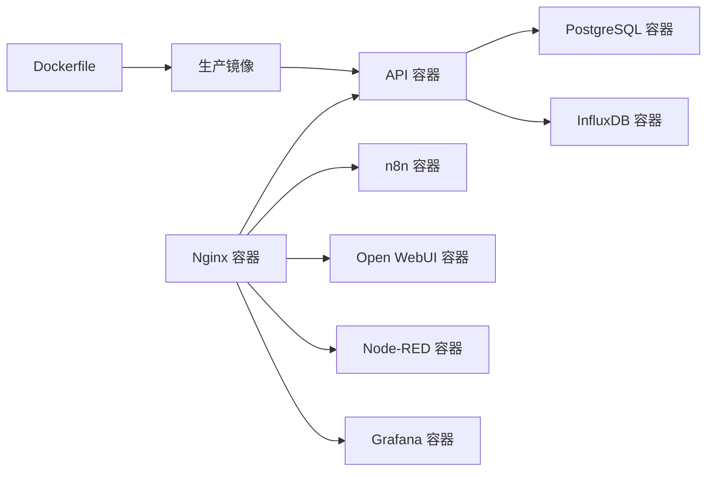

# 容器管理

<cite>
**本文引用的文件**
- [Dockerfile](file://Dockerfile)
- [docker-compose.prod.yml](file://docker/docker-compose.prod.yml)
- [entrypoint.sh](file://docker/entrypoint.sh)
- [post-deploy.js](file://server/scripts/post-deploy.js)
- [database.js](file://server/config/database.js)
- [nginx.conf](file://docker/nginx.conf)
- [restart-server.bat](file://restart-server.bat)
- [docker-compose.yml](file://docker-compose.yml)
- [.env.production](file://.env.production)
- [docker/.env](file://docker/.env)
- [server/package.json](file://server/package.json)
- [server/start.bat](file://server/start.bat)
</cite>

## 目录
1. [简介](#简介)
2. [项目结构](#项目结构)
3. [核心组件](#核心组件)
4. [架构总览](#架构总览)
5. [详细组件分析](#详细组件分析)
6. [依赖关系分析](#依赖关系分析)
7. [性能考虑](#性能考虑)
8. [故障排查指南](#故障排查指南)
9. [结论](#结论)
10. [附录](#附录)

## 简介
本手册面向容器化部署与运维人员，围绕以下目标展开：
- 解析 Dockerfile 的多阶段构建策略与优化技巧
- 深入解读 docker-compose.prod.yml 的服务编排、依赖关系、网络与卷配置
- 分析 docker/entrypoint.sh 的启动流程：数据库连接等待、初始化脚本执行与应用启动
- 提供容器生命周期管理命令，覆盖 Linux 与 Windows（restart-server.bat）平台差异
- 结合 Nginx 反向代理配置，说明统一入口与端口映射策略

## 项目结构
本仓库采用“根镜像 + 多服务编排”的容器化方案：
- 根镜像：基于多阶段构建的单体应用镜像，同时包含前端构建产物与后端服务
- 编排：生产环境使用 docker-compose.prod.yml，定义数据库、API、Nginx、AI 与 IoT 等服务
- 启动脚本：entrypoint.sh 在容器启动时负责数据库初始化与应用启动
- 反向代理：Nginx 将不同子路径路由到对应服务，统一对外暴露端口

图表来源
- [docker-compose.prod.yml](file://docker/docker-compose.prod.yml#L1-L262)
- [nginx.conf](file://docker/nginx.conf#L1-L240)

章节来源
- [docker-compose.prod.yml](file://docker/docker-compose.prod.yml#L1-L262)
- [Dockerfile](file://Dockerfile#L1-L75)

## 核心组件
- 多阶段构建镜像：前端构建阶段、后端构建阶段、生产镜像阶段，减少最终镜像体积并提升安全性
- 生产编排：定义数据库、API、Nginx、AI 与 IoT 服务，统一网络与卷，声明健康检查与依赖条件
- 启动脚本：在容器启动时等待数据库就绪、执行初始化脚本、再启动应用
- 反向代理：集中处理 HTTPS、静态资源、子路径路由与长连接升级

章节来源
- [Dockerfile](file://Dockerfile#L1-L75)
- [docker-compose.prod.yml](file://docker/docker-compose.prod.yml#L1-L262)
- [entrypoint.sh](file://docker/entrypoint.sh#L1-L36)
- [nginx.conf](file://docker/nginx.conf#L1-L240)

## 架构总览
下图展示生产环境的服务交互与数据流向，突出 Nginx 作为统一入口，以及各服务间的依赖关系。

图表来源
- [docker-compose.prod.yml](file://docker/docker-compose.prod.yml#L1-L262)
- [nginx.conf](file://docker/nginx.conf#L1-L240)

## 详细组件分析

### Dockerfile 多阶段构建策略与优化
- 阶段划分
  - 前端构建阶段：使用 Node Alpine 基础镜像，复制前端依赖与源码，通过构建参数注入 API 与 Influx 配置，执行构建生成 dist
  - 后端构建阶段：仅安装生产依赖，避免开发依赖进入最终镜像
  - 生产镜像阶段：安装必要工具（如 wget），复制后端依赖、后端代码、前端构建产物与启动脚本，创建持久化目录，设置环境变量，使用 CMD 启动应用
- 关键优化点
  - 分离前端与后端构建，减少镜像层与体积
  - 使用只读挂载与最小化工具集，降低攻击面
  - 通过构建参数传递前端配置，便于 CI/CD 注入
  - 生产镜像中预创建上传目录，避免运行时权限问题
- 与编排的关系
  - 生产编排通过 docker-compose 指定 Dockerfile 路径，确保镜像构建上下文正确
  - 编排中对 API 服务声明健康检查，结合镜像内的健康检查策略协同

章节来源
- [Dockerfile](file://Dockerfile#L1-L75)
- [docker-compose.prod.yml](file://docker/docker-compose.prod.yml#L28-L62)

### docker-compose.prod.yml 服务编排逻辑
- 服务定义
  - 数据库：PostgreSQL（带 PGVector 扩展），持久化数据卷，健康检查
  - API：基于根 Dockerfile 构建，声明数据库与 Influx 环境变量，依赖数据库健康状态，声明健康检查
  - Nginx：反向代理，映射 80/443，挂载配置与 SSL 证书，依赖 API、Open WebUI、n8n
  - InfluxDB：时序数据库，初始化参数，持久化数据与配置卷
  - n8n：工作流平台，启用 Basic Auth，挂载数据卷，声明 API 与 Open WebUI 地址
  - Open WebUI：AI 对话界面，挂载数据卷，配置 Gemini API
  - Node-RED：IoT 流程，挂载数据卷，依赖 InfluxDB 与 PostgreSQL
  - Grafana：监控仪表盘，挂载数据卷，依赖 InfluxDB 与 PostgreSQL
- 依赖关系
  - API 依赖数据库健康
  - Nginx 依赖 API、Open WebUI、n8n
  - Node-RED、Grafana 依赖 InfluxDB 与 PostgreSQL
- 网络与卷
  - 统一桥接网络，服务间通过服务名通信
  - 使用命名卷持久化数据库与应用数据
- 健康检查
  - 各服务均配置健康检查，便于编排器进行状态判断与自动恢复

章节来源
- [docker-compose.prod.yml](file://docker/docker-compose.prod.yml#L1-L262)

### docker/entrypoint.sh 启动脚本工作流程
- 功能概述
  - 等待数据库就绪（当配置了 DATABASE_URL 或 DB_HOST）
  - 执行数据库初始化脚本（post-deploy.js）
  - 启动 Node.js 应用
- 初始化脚本职责
  - 优先使用 DATABASE_URL（云服务注入），否则使用独立配置
  - 生产环境或云服务通常启用 SSL
  - 等待数据库可用，幂等创建表结构与扩展，必要时创建基础数据
- 启动顺序
  - 若未配置数据库连接，则跳过初始化
  - 初始化成功后启动应用

图表来源
- [entrypoint.sh](file://docker/entrypoint.sh#L1-L36)
- [post-deploy.js](file://server/scripts/post-deploy.js#L1-L182)

章节来源
- [entrypoint.sh](file://docker/entrypoint.sh#L1-L36)
- [post-deploy.js](file://server/scripts/post-deploy.js#L1-L182)

### Nginx 反向代理配置
- 统一入口
  - 80 端口重定向到 443，443 端口终止 SSL 并转发到上游服务
- 上游服务
  - api、n8n、open-webui、nodered、grafana、influxdb
- 路由规则
  - /api/ → 后端 API
  - /docs/ → 文档静态资源
  - /n8n/ → n8n 工作流
  - /ai/ → Open WebUI
  - /nodered/ → Node-RED
  - /grafana/ → Grafana
- 长连接与缓冲
  - 支持 WebSocket/SSE，设置超时与缓冲策略
- 健康检查
  - /health 路由代理到 API 健康端点

章节来源
- [nginx.conf](file://docker/nginx.conf#L1-L240)

### 容器生命周期管理命令
- Linux 平台
  - 启动：使用 docker-compose 指定生产编排文件，后台启动
  - 查看日志：实时跟踪容器日志
  - 停止：关闭并移除容器、网络与卷
  - 更新：重建镜像并重新拉起服务
- Windows 平台
  - 一键重启本地开发服务器：通过批处理脚本结束占用 3001 端口的进程，再启动后端开发服务
  - 注意：该脚本仅适用于本地开发场景，不参与生产编排

图表来源
- [docker-compose.prod.yml](file://docker/docker-compose.prod.yml#L28-L62)

章节来源
- [docker-compose.prod.yml](file://docker/docker-compose.prod.yml#L233-L262)
- [restart-server.bat](file://restart-server.bat#L1-L13)

## 依赖关系分析
- 镜像与编排
  - 生产编排通过 build 字段指定 Dockerfile，确保镜像构建上下文正确
  - API 服务依赖数据库健康，编排器会等待数据库健康后再启动 API
- 启动脚本与数据库
  - entrypoint.sh 依赖 post-deploy.js 完成数据库初始化
  - database.js 提供连接池封装，供应用使用
- 反向代理与服务
  - Nginx 依赖多个上游服务，编排中通过 depends_on 保证启动顺序
  - 端口映射集中在 Nginx，简化外部访问

图表来源
- [Dockerfile](file://Dockerfile#L1-L75)
- [docker-compose.prod.yml](file://docker/docker-compose.prod.yml#L1-L262)
- [nginx.conf](file://docker/nginx.conf#L1-L240)

章节来源
- [Dockerfile](file://Dockerfile#L1-L75)
- [docker-compose.prod.yml](file://docker/docker-compose.prod.yml#L1-L262)
- [database.js](file://server/config/database.js#L1-L74)

## 性能考虑
- 镜像体积与启动速度
  - 多阶段构建减少最终镜像体积，缩短拉取与启动时间
  - 生产镜像仅包含运行所需文件，避免开发依赖
- 连接池与数据库
  - database.js 使用连接池，合理设置最大连接数与超时，避免阻塞
- 反向代理
  - 启用 keepalive 与 gzip，提升静态资源与长连接性能
  - 为 WebSocket/SSE 设置合适的超时与缓冲策略

章节来源
- [Dockerfile](file://Dockerfile#L1-L75)
- [database.js](file://server/config/database.js#L1-L74)
- [nginx.conf](file://docker/nginx.conf#L1-L240)

## 故障排查指南
- 数据库连接失败
  - 检查 DATABASE_URL 或 DB_* 环境变量是否正确
  - 确认数据库容器健康状态与网络连通性
  - 查看 post-deploy.js 的等待逻辑与错误日志
- 初始化脚本异常
  - entrypoint.sh 在初始化失败时会退出容器，查看初始化日志定位问题
  - 确认 schema 文件存在且可被初始化脚本读取
- API 健康检查失败
  - 编排中为 API 配置了健康检查，检查 Nginx 路由与上游服务状态
- Nginx 路由问题
  - 检查 nginx.conf 中的上游服务与路径映射
  - 确认 SSL 证书路径与权限
- Windows 本地开发
  - 使用 restart-server.bat 结束占用 3001 端口的进程，再启动后端开发服务
  - 确保本地环境变量与端口映射正确

章节来源
- [entrypoint.sh](file://docker/entrypoint.sh#L1-L36)
- [post-deploy.js](file://server/scripts/post-deploy.js#L1-L182)
- [docker-compose.prod.yml](file://docker/docker-compose.prod.yml#L28-L62)
- [nginx.conf](file://docker/nginx.conf#L1-L240)
- [restart-server.bat](file://restart-server.bat#L1-L13)

## 结论
本容器化方案通过多阶段构建、统一编排与反向代理，实现了前后端一体化部署与高效运维。entrypoint.sh 与 post-deploy.js 的配合确保了数据库初始化的幂等性与可靠性；docker-compose.prod.yml 明确了服务依赖、网络与卷配置，并通过健康检查提升了系统的可观测性与自愈能力。结合 Nginx 的统一入口与端口映射，可满足生产环境的安全、稳定与高性能需求。

## 附录
- 环境变量参考
  - 生产环境前端配置：VITE_API_URL（用于同源请求）
  - Nginx 环境变量：用于 n8n、邮件、短信与企业微信等配置
- 本地开发脚本
  - Windows：restart-server.bat 一键重启本地开发服务
  - Linux：使用 docker-compose 指定开发编排文件启动

章节来源
- [.env.production](file://.env.production#L1-L4)
- [docker/.env](file://docker/.env#L1-L48)
- [restart-server.bat](file://restart-server.bat#L1-L13)
- [docker-compose.yml](file://docker-compose.yml#L1-L220)
- [server/package.json](file://server/package.json#L1-L30)
- [server/start.bat](file://server/start.bat#L1-L55)