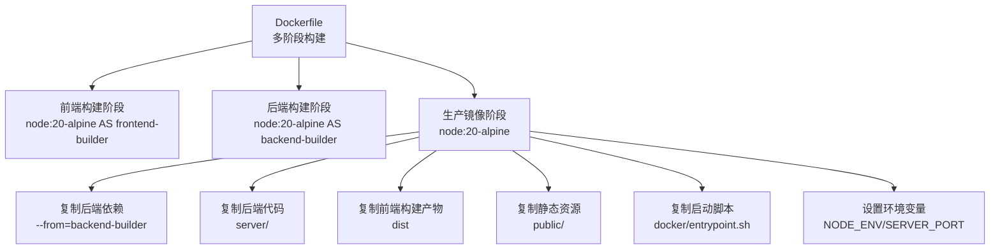
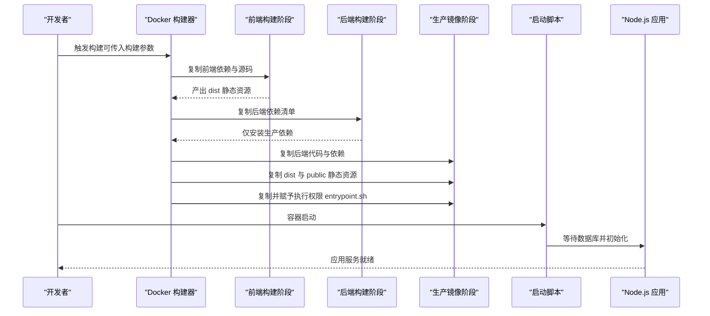
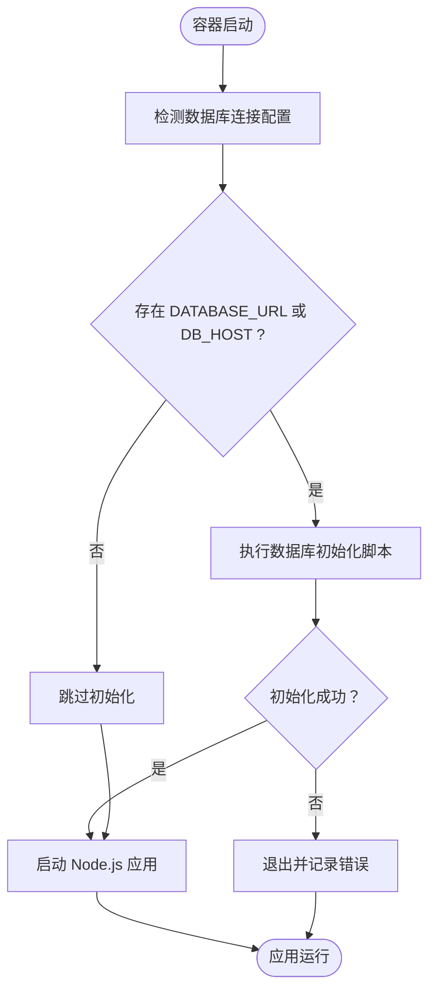
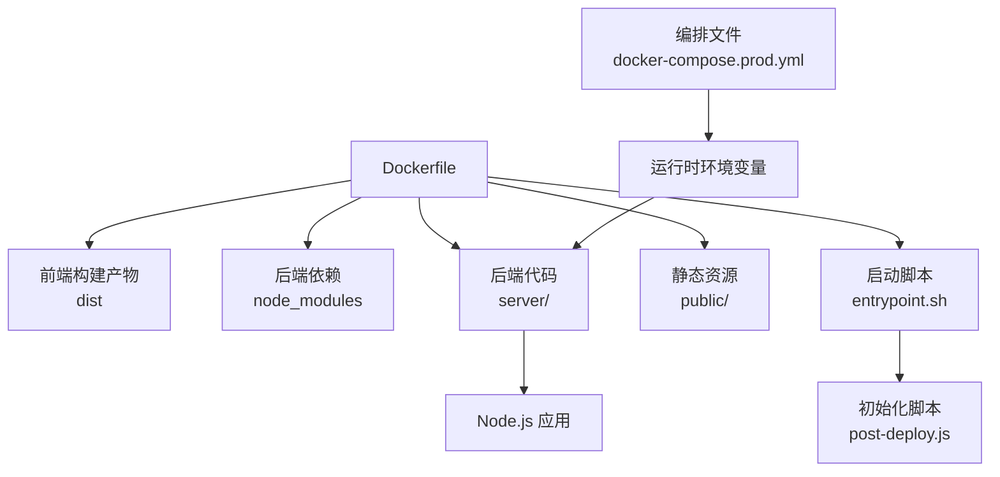

# 容器镜像构建

<cite>
**本文引用的文件**
- [Dockerfile](file://Dockerfile)
- [docker-compose.prod.yml](file://docker/docker-compose.prod.yml)
- [entrypoint.sh](file://docker/entrypoint.sh)
- [.env.production](file://.env.production)
- [vite.config.js](file://vite.config.js)
- [server/package.json](file://server/package.json)
- [package.json](file://package.json)
- [post-deploy.js](file://server/scripts/post-deploy.js)
- [docker-compose.yml](file://docker-compose.yml)
</cite>

## 目录
1. [简介](#简介)
2. [项目结构](#项目结构)
3. [核心组件](#核心组件)
4. [架构总览](#架构总览)
5. [详细组件分析](#详细组件分析)
6. [依赖关系分析](#依赖关系分析)
7. [性能考量](#性能考量)
8. [故障排查指南](#故障排查指南)
9. [结论](#结论)
10. [附录](#附录)

## 简介
本指南围绕仓库中的多阶段 Docker 构建进行深入解析，重点覆盖：
- 前端构建阶段（node:20-alpine AS frontend-builder）如何通过构建命令生成静态资源；
- 后端依赖安装阶段（backend-builder）如何仅安装生产依赖以减小镜像体积；
- 最终生产镜像如何整合前后端产物、复制启动脚本并设置正确的文件权限；
- 构建参数（如 VITE_API_URL、VITE_INFLUX_URL 等）的传递方式与作用；
- 提供构建命令示例，并解释每层的构建逻辑与优化技巧，包括 Alpine 镜像选择、依赖缓存、多阶段复制等最佳实践。

## 项目结构
与容器镜像构建直接相关的关键文件与位置如下：
- Dockerfile：定义多阶段构建流程与产物整合；
- docker/entrypoint.sh：容器启动入口脚本，负责等待数据库、执行初始化并启动应用；
- docker/docker-compose.prod.yml：生产环境编排，包含 API 服务、数据库、反向代理等；
- .env.production：生产环境前端构建参数示例；
- vite.config.js：开发时代理配置，有助于理解构建参数在开发与生产中的差异；
- server/package.json：后端依赖清单，用于生产依赖安装；
- package.json：前端依赖与脚本；
- server/scripts/post-deploy.js：数据库初始化与幂等检查脚本；
- docker-compose.yml：通用服务编排（含数据库、AI、IoT 等），便于理解整体服务生态。

图表来源
- [Dockerfile](file://Dockerfile#L1-L75)

章节来源
- [Dockerfile](file://Dockerfile#L1-L75)
- [docker-compose.prod.yml](file://docker/docker-compose.prod.yml#L1-L120)

## 核心组件
- 多阶段构建策略
  - 前端构建阶段：基于 node:20-alpine，复制前端依赖与源码，使用构建命令生成静态资源；
  - 后端构建阶段：基于 node:20-alpine，仅安装生产依赖，减少镜像体积；
  - 生产镜像阶段：合并前后端产物，复制启动脚本，设置运行时环境变量。
- 构建参数传递
  - 通过构建参数传入前端构建参数（如 VITE_API_URL、VITE_INFLUX_* 等），在前端构建时生效；
  - 在生产编排中通过环境变量传递后端运行时参数（如数据库、InfluxDB、AI 服务地址等）。
- 启动流程
  - 容器启动时执行启动脚本，等待数据库就绪并执行初始化，随后启动 Node.js 应用。

章节来源
- [Dockerfile](file://Dockerfile#L1-L75)
- [.env.production](file://.env.production#L1-L4)
- [docker-compose.prod.yml](file://docker/docker-compose.prod.yml#L29-L62)
- [entrypoint.sh](file://docker/entrypoint.sh#L1-L36)
- [post-deploy.js](file://server/scripts/post-deploy.js#L1-L182)

## 架构总览
下图展示了从构建到运行的整体流程，以及各阶段之间的依赖关系与产物流向。

图表来源
- [Dockerfile](file://Dockerfile#L1-L75)
- [entrypoint.sh](file://docker/entrypoint.sh#L1-L36)

## 详细组件分析

### 前端构建阶段（node:20-alpine AS frontend-builder）
- 镜像与工作目录
  - 使用 node:20-alpine 作为基础镜像，结合 Alpine 的轻量化特性降低镜像体积；
  - 设置工作目录为 /app。
- 依赖安装与缓存
  - 先复制前端依赖清单，执行依赖安装命令，利用 Docker 缓存机制提升后续构建速度；
  - 复制前端源码与公共资源目录，确保构建时具备完整上下文。
- 构建参数与产物
  - 通过构建参数接收前端构建参数（如 VITE_API_URL、VITE_INFLUX_URL、VITE_INFLUX_ORG、VITE_INFLUX_BUCKET、VITE_INFLUX_TOKEN 等）；
  - 执行构建命令生成静态资源，产物位于 dist 目录，供生产镜像阶段复制使用。

章节来源
- [Dockerfile](file://Dockerfile#L1-L30)
- [.env.production](file://.env.production#L1-L4)
- [vite.config.js](file://vite.config.js#L1-L27)

### 后端构建阶段（node:20-alpine AS backend-builder）
- 依赖安装策略
  - 仅安装生产依赖，避免开发依赖进入最终镜像，显著减小体积；
  - 该阶段的 node_modules 将被复制到生产镜像，供运行时使用。
- 适用场景
  - 适用于后端服务的依赖隔离与最小化，配合多阶段复制实现“干净”运行时镜像。

章节来源
- [Dockerfile](file://Dockerfile#L26-L44)
- [server/package.json](file://server/package.json#L1-L30)

### 生产镜像阶段（node:20-alpine）
- 运行时工具与环境
  - 安装必要的运行时工具（如用于健康检查的下载工具），并设置运行时环境变量（如 NODE_ENV、SERVER_PORT）。
- 产物整合
  - 从后端构建阶段复制 node_modules；
  - 复制后端代码（server/）；
  - 从前端构建阶段复制 dist；
  - 复制 public 目录中的静态资源（如模型文件等）；
  - 复制并赋予执行权限启动脚本（entrypoint.sh）。
- 持久化目录
  - 创建上传与临时目录，便于挂载卷与数据持久化。
- 启动方式
  - 使用 CMD 启动 Node.js 应用，以便云平台（如 Railway）的 startCommand 能正确覆盖。

章节来源
- [Dockerfile](file://Dockerfile#L35-L75)

### 启动脚本与数据库初始化（entrypoint.sh 与 post-deploy.js）
- 启动脚本职责
  - 等待数据库服务就绪（根据数据库连接配置判断是否启用等待）；
  - 执行数据库初始化脚本（幂等执行，支持 DATABASE_URL 或独立配置）；
  - 成功后启动 Node.js 应用。
- 初始化脚本能力
  - 支持 DATABASE_URL 或独立配置（DB_HOST/DB_PORT/DB_NAME/DB_USER/DB_PASSWORD）；
  - 在生产环境或云服务环境下自动启用 SSL；
  - 等待数据库可用后再执行初始化；
  - 幂等地创建核心表与扩展，必要时创建基础数据。

图表来源
- [entrypoint.sh](file://docker/entrypoint.sh#L1-L36)
- [post-deploy.js](file://server/scripts/post-deploy.js#L1-L182)

章节来源
- [entrypoint.sh](file://docker/entrypoint.sh#L1-L36)
- [post-deploy.js](file://server/scripts/post-deploy.js#L1-L182)

### 构建参数与环境变量传递
- 前端构建参数（通过构建参数传入）
  - VITE_API_URL：前端构建时注入 API 服务地址（生产环境可为空字符串以走同源）；
  - VITE_INFLUX_URL、VITE_INFLUX_ORG、VITE_INFLUX_BUCKET、VITE_INFLUX_TOKEN：注入 InfluxDB 访问所需参数；
  - 以上参数在前端构建阶段生效，影响打包后的静态资源对后端服务的访问路径。
- 生产环境运行时参数（通过环境变量传入）
  - 数据库与 InfluxDB 参数：在编排文件中统一注入；
  - AI 服务地址：如 Open WebUI、n8n 等服务地址；
  - 以上参数在运行时由 Node.js 应用读取，决定后端服务行为。

章节来源
- [Dockerfile](file://Dockerfile#L17-L24)
- [.env.production](file://.env.production#L1-L4)
- [docker-compose.prod.yml](file://docker/docker-compose.prod.yml#L36-L52)

## 依赖关系分析
- 组件耦合与协作
  - Dockerfile 的三个阶段之间通过多阶段复制建立清晰的依赖链；
  - 启动脚本与初始化脚本共同保障应用启动前的数据一致性；
  - 编排文件为生产镜像提供运行时所需的环境变量与网络配置。
- 外部依赖与集成点
  - PostgreSQL 与 InfluxDB 作为后端数据存储；
  - 反向代理（Nginx）用于统一对外服务入口；
  - AI 服务（Open WebUI、n8n）通过环境变量与 API 地址集成。

图表来源
- [Dockerfile](file://Dockerfile#L1-L75)
- [entrypoint.sh](file://docker/entrypoint.sh#L1-L36)
- [post-deploy.js](file://server/scripts/post-deploy.js#L1-L182)
- [docker-compose.prod.yml](file://docker/docker-compose.prod.yml#L29-L62)

章节来源
- [Dockerfile](file://Dockerfile#L1-L75)
- [docker-compose.prod.yml](file://docker/docker-compose.prod.yml#L29-L62)

## 性能考量
- 镜像体积优化
  - 使用 node:20-alpine 作为基础镜像，结合仅安装生产依赖的策略，有效降低镜像体积；
  - 多阶段复制仅将必要产物复制到最终镜像，避免携带构建期依赖与中间文件。
- 构建缓存与分层
  - 先复制依赖清单并安装依赖，再复制源码，可充分利用 Docker 层缓存；
  - 前端与后端分别在各自阶段构建，避免不必要的重复安装。
- 运行时稳定性
  - 启动脚本在启动前等待数据库并执行幂等初始化，减少冷启动失败率；
  - 生产镜像设置运行时环境变量与必要的工具，提升可观测性与可维护性。

章节来源
- [Dockerfile](file://Dockerfile#L1-L75)
- [entrypoint.sh](file://docker/entrypoint.sh#L1-L36)
- [post-deploy.js](file://server/scripts/post-deploy.js#L1-L182)

## 故障排查指南
- 前端构建失败
  - 检查构建参数是否正确传入（如 VITE_API_URL、VITE_INFLUX_*）；
  - 确认前端依赖清单与源码已正确复制到构建阶段。
- 后端依赖安装异常
  - 确保仅安装生产依赖的步骤正常执行；
  - 检查后端依赖清单与网络可达性。
- 生产镜像缺少静态资源
  - 确认前端构建产物已复制到 dist；
  - 确认 public 目录中的静态资源已复制到最终镜像。
- 启动脚本无法执行
  - 确认启动脚本已复制并赋予执行权限；
  - 检查运行时环境变量（如数据库连接）是否正确。
- 数据库初始化失败
  - 查看初始化脚本输出，确认数据库连接配置与网络连通性；
  - 在生产环境或云服务环境下，确认 SSL 配置与证书策略。

章节来源
- [Dockerfile](file://Dockerfile#L1-L75)
- [entrypoint.sh](file://docker/entrypoint.sh#L1-L36)
- [post-deploy.js](file://server/scripts/post-deploy.js#L1-L182)

## 结论
本指南系统梳理了仓库的多阶段容器镜像构建流程，明确了前端与后端在不同阶段的职责、构建参数的传递方式与作用、以及生产镜像整合与启动流程。通过仅安装生产依赖、多阶段复制与启动前初始化等策略，实现了体积小、启动快、运行稳的目标。建议在实际部署中结合编排文件提供的环境变量与网络配置，确保前后端服务协同工作。

## 附录

### 构建命令示例
- 使用构建参数传入前端构建参数并构建镜像（示例）
  - docker build --build-arg VITE_API_URL=... --build-arg VITE_INFLUX_URL=... --build-arg VITE_INFLUX_ORG=... --build-arg VITE_INFLUX_BUCKET=... --build-arg VITE_INFLUX_TOKEN=... -t twinsight-app .
- 使用编排文件构建并启动生产环境
  - docker-compose -f docker/docker-compose.prod.yml up -d

章节来源
- [Dockerfile](file://Dockerfile#L17-L24)
- [docker/docker-compose.prod.yml](file://docker/docker-compose.prod.yml#L29-L62)

### 关键配置要点
- 前端构建参数
  - VITE_API_URL：API 服务地址（生产环境可为空字符串走同源）；
  - VITE_INFLUX_*：InfluxDB 访问参数（URL、组织、Bucket、Token）。
- 运行时环境变量（示例）
  - 数据库与 InfluxDB：DB_HOST/DB_PORT/DB_NAME/DB_USER/DB_PASSWORD、INFLUX_URL/INFLUX_ORG/INFLUX_BUCKET/INFLUX_TOKEN；
  - AI 服务：OPENWEBUI_URL、N8N_WEBHOOK_URL；
  - 服务器端口：SERVER_PORT。

章节来源
- [.env.production](file://.env.production#L1-L4)
- [docker-compose.prod.yml](file://docker/docker-compose.prod.yml#L36-L52)
- [vite.config.js](file://vite.config.js#L1-L27)