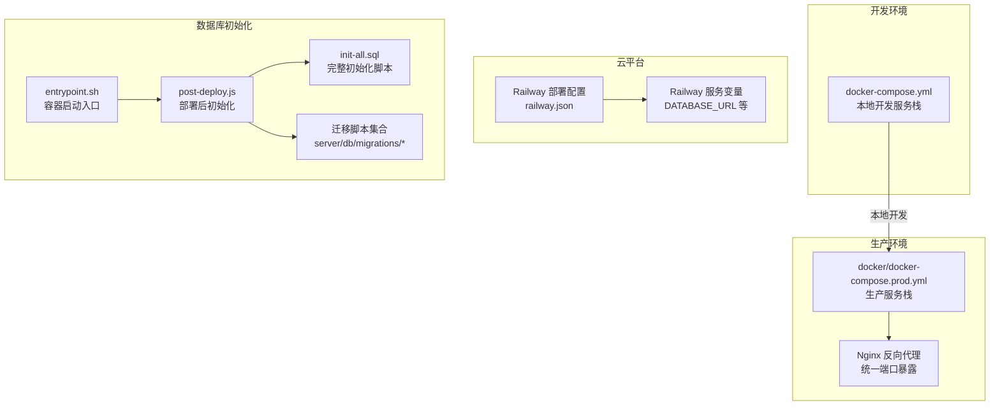
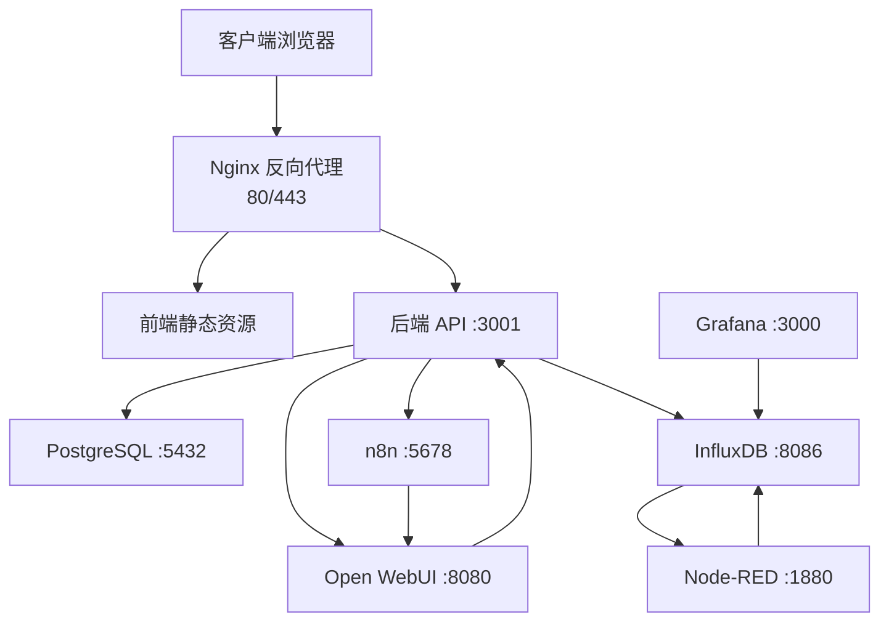
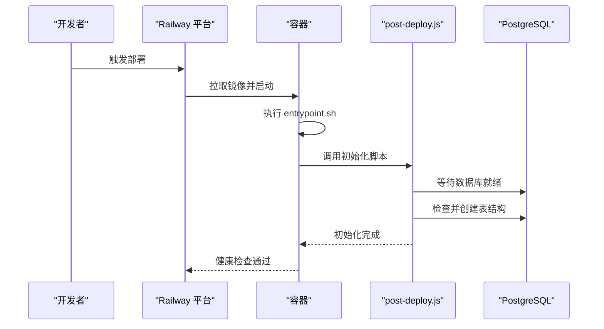
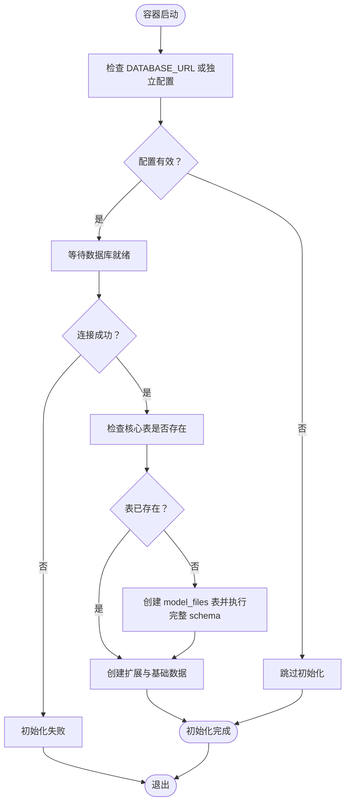
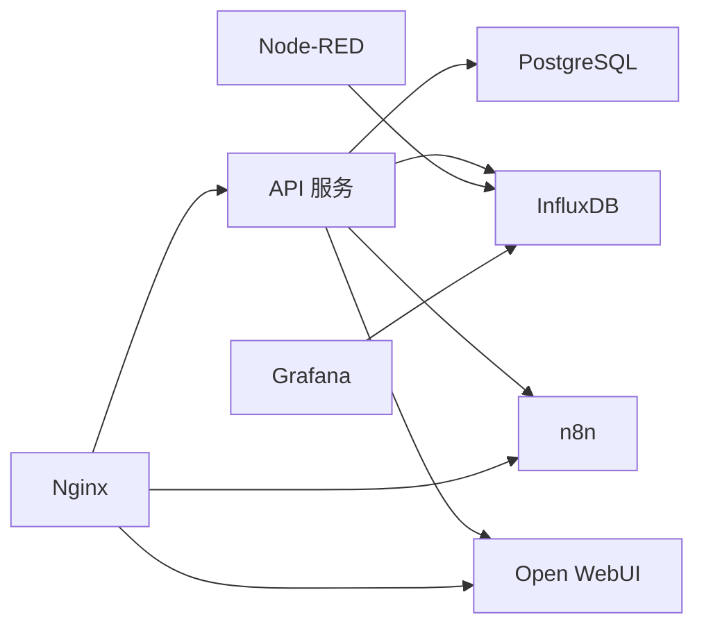

# 部署策略

<cite>
**本文引用的文件**
- [CLOUD_DEPLOYMENT_GUIDE.md](file://CLOUD_DEPLOYMENT_GUIDE.md)
- [docker-compose.yml](file://docker-compose.yml)
- [docker/docker-compose.prod.yml](file://docker/docker-compose.prod.yml)
- [railway.json](file://railway.json)
- [docker/entrypoint.sh](file://docker/entrypoint.sh)
- [server/scripts/post-deploy.js](file://server/scripts/post-deploy.js)
- [server/run-migration.js](file://server/run-migration.js)
- [server/db/migrations/create-auth-tables.sql](file://server/db/migrations/create-auth-tables.sql)
- [server/db/migrations/reset_railway_db.sql](file://server/db/migrations/reset_railway_db.sql)
- [server/db/init-all.sql](file://server/db/init-all.sql)
- [server/package.json](file://server/package.json)
</cite>

## 目录
1. [简介](#简介)
2. [项目结构](#项目结构)
3. [核心组件](#核心组件)
4. [架构总览](#架构总览)
5. [详细组件分析](#详细组件分析)
6. [依赖关系分析](#依赖关系分析)
7. [性能考量](#性能考量)
8. [故障排查指南](#故障排查指南)
9. [结论](#结论)
10. [附录](#附录)

## 简介
本文件面向多环境部署与升级，围绕 Railwary 等云平台的部署流程展开，重点覆盖：
- 环境变量配置、服务链接与持久化存储设置
- 开发环境 docker-compose.yml 与生产环境 docker-compose.prod.yml 的差异
- 蓝绿部署与滚动更新建议及版本回滚流程
- 数据库迁移脚本在部署过程中的执行时机与安全保障

## 项目结构
项目采用多服务组合的容器化架构，包含核心应用（前端静态 + 后端 API）、数据库（PostgreSQL + pgvector）、时序数据库（InfluxDB）、AI 服务（n8n、Open WebUI）、IoT 服务（Node-RED、Grafana）以及反向代理（Nginx）。不同部署场景分别使用不同的编排文件与启动脚本，确保开发与生产的差异化需求得到满足。

**图表来源**
- [docker-compose.yml](file://docker-compose.yml#L1-L220)
- [docker/docker-compose.prod.yml](file://docker/docker-compose.prod.yml#L1-L262)
- [railway.json](file://railway.json#L1-L12)
- [docker/entrypoint.sh](file://docker/entrypoint.sh#L1-L36)
- [server/scripts/post-deploy.js](file://server/scripts/post-deploy.js#L1-L182)
- [server/db/init-all.sql](file://server/db/init-all.sql#L1-L389)

**章节来源**
- [CLOUD_DEPLOYMENT_GUIDE.md](file://CLOUD_DEPLOYMENT_GUIDE.md#L28-L139)
- [docker-compose.yml](file://docker-compose.yml#L1-L220)
- [docker/docker-compose.prod.yml](file://docker/docker-compose.prod.yml#L1-L262)

## 核心组件
- 开发环境编排：docker-compose.yml 提供本地一体化服务栈，便于快速开发与调试。
- 生产环境编排：docker/docker-compose.prod.yml 提供生产级服务栈，并通过 Nginx 统一反向代理与端口暴露。
- 云平台部署：railway.json 定义构建与部署行为；Railway 注入 DATABASE_URL 等环境变量，简化数据库连接。
- 启动与初始化：entrypoint.sh 在容器启动时调用 post-deploy.js，实现数据库健康检查、结构初始化与基础数据创建。
- 数据库迁移：init-all.sql 作为完整初始化脚本；migrations 目录提供增量迁移脚本；run-migration.js 用于特定迁移任务。

**章节来源**
- [docker-compose.yml](file://docker-compose.yml#L1-L220)
- [docker/docker-compose.prod.yml](file://docker/docker-compose.prod.yml#L1-L262)
- [railway.json](file://railway.json#L1-L12)
- [docker/entrypoint.sh](file://docker/entrypoint.sh#L1-L36)
- [server/scripts/post-deploy.js](file://server/scripts/post-deploy.js#L1-L182)
- [server/db/init-all.sql](file://server/db/init-all.sql#L1-L389)
- [server/run-migration.js](file://server/run-migration.js#L1-L39)

## 架构总览
下图展示从客户端到各服务的典型请求路径，以及数据库与 AI/IoT 服务的交互关系。

**图表来源**
- [CLOUD_DEPLOYMENT_GUIDE.md](file://CLOUD_DEPLOYMENT_GUIDE.md#L44-L91)
- [docker/docker-compose.prod.yml](file://docker/docker-compose.prod.yml#L63-L171)

## 详细组件分析

### 开发环境与生产环境编排差异
- 服务范围
  - 开发环境：包含 PostgreSQL、InfluxDB、Node-RED、Grafana、n8n、Open WebUI，端口直接映射，便于本地调试。
  - 生产环境：通过 Nginx 统一反向代理，隐藏内部端口细节，集中暴露 80/443；数据库与 AI/IoT 服务通过网络隔离与健康检查保障稳定性。
- 环境变量
  - 开发环境：使用 .env 示例文件，变量通过 compose 的 environment 字段注入。
  - 生产环境：通过 .env.production.example 与 docker-compose.prod.yml 的环境变量占位符，结合云平台服务变量（如 DATABASE_URL）实现解耦。
- 持久化存储
  - 开发环境：使用命名卷（如 postgres_data、n8n_data 等）保存数据。
  - 生产环境：同样使用命名卷，配合 Nginx SSL 证书挂载，确保数据与证书持久化。
- 健康检查与重启策略
  - 开发环境：部分服务配置了健康检查与重启策略，便于快速发现问题。
  - 生产环境：API、n8n、Open WebUI、Node-RED、Grafana 均配置健康检查，提升可用性。

**章节来源**
- [docker-compose.yml](file://docker-compose.yml#L1-L220)
- [docker/docker-compose.prod.yml](file://docker/docker-compose.prod.yml#L1-L262)

### 云平台部署流程（Railway）
- 构建与启动
  - 使用 Dockerfile 进行多阶段构建；railway.json 指定构建器与部署参数。
  - 容器启动时，entrypoint.sh 调用 post-deploy.js，等待数据库就绪并执行初始化。
- 环境变量配置
  - Railway 注入 DATABASE_URL；同时可配置 SERVER_PORT、Gemini API Key、InfluxDB 连接参数等。
- 健康检查与副本数
  - 配置健康检查路径与超时；可设置副本数与重启策略，提升稳定性。
- 自定义域名
  - 在 Railway 项目设置中添加自定义域名或使用 Railway 提供的子域名。

**图表来源**
- [railway.json](file://railway.json#L1-L12)
- [docker/entrypoint.sh](file://docker/entrypoint.sh#L1-L36)
- [server/scripts/post-deploy.js](file://server/scripts/post-deploy.js#L1-L182)

**章节来源**
- [CLOUD_DEPLOYMENT_GUIDE.md](file://CLOUD_DEPLOYMENT_GUIDE.md#L290-L350)
- [railway.json](file://railway.json#L1-L12)
- [docker/entrypoint.sh](file://docker/entrypoint.sh#L1-L36)
- [server/scripts/post-deploy.js](file://server/scripts/post-deploy.js#L1-L182)

### 数据库初始化与迁移策略
- 初始化脚本
  - post-deploy.js 支持 DATABASE_URL 或独立配置；在生产/云环境下自动启用 SSL；具备幂等性，可重复执行。
  - 初始化流程：等待数据库就绪 → 检查核心表是否存在 → 若不存在则创建 model_files 表并执行完整 schema；随后创建扩展与基础数据。
- 完整初始化脚本
  - init-all.sql 定义了完整的数据库结构（含扩展、函数、索引、外键约束等），适合全新环境或重置后重建。
- 迁移脚本集合
  - migrations 目录包含多个 SQL 迁移文件，覆盖认证表、字段扩展、外键关系等；reset_railway_db.sql 提供“删除所有表并提示后续执行 init-all.sql”的修复路径。
- 特定迁移任务
  - run-migration.js 用于执行特定迁移（例如为 documents 表添加 view_id 列），通过动态导入数据库模块与读取 SQL 文件实现。

**图表来源**
- [server/scripts/post-deploy.js](file://server/scripts/post-deploy.js#L1-L182)
- [server/db/init-all.sql](file://server/db/init-all.sql#L1-L389)

**章节来源**
- [server/scripts/post-deploy.js](file://server/scripts/post-deploy.js#L1-L182)
- [server/db/init-all.sql](file://server/db/init-all.sql#L1-L389)
- [server/db/migrations/create-auth-tables.sql](file://server/db/migrations/create-auth-tables.sql#L1-L78)
- [server/db/migrations/reset_railway_db.sql](file://server/db/migrations/reset_railway_db.sql#L1-L29)
- [server/run-migration.js](file://server/run-migration.js#L1-L39)

### 蓝绿部署与滚动更新建议
- 蓝绿部署
  - 通过两套相同规模的生产环境（蓝/绿）进行切换：部署新版本到备用环境，验证健康检查与功能后，将流量切换至新环境，旧环境在确认稳定后再回收。
  - 适用场景：变更风险较高、需要快速回滚的生产环境。
- 滚动更新
  - 逐步替换实例，保持服务可用性；结合健康检查与副本数，确保每次只替换少量实例。
  - 适用场景：变更风险较低、可接受短暂停机窗口的生产环境。
- 版本回滚流程
  - 记录每次部署的镜像标签与配置快照；
  - 通过平台回滚至上一个稳定版本；
  - 若涉及数据库结构变更，结合 init-all.sql 或迁移脚本进行回退或修复。

[本节为通用实践建议，不直接分析具体文件，故不附加“章节来源”]

### 数据迁移与数据一致性保障
- 本地数据不会自动部署到云端，云端数据库为空，需通过导出/导入或初始化脚本建立结构与数据。
- PostgreSQL 与 InfluxDB 的数据迁移遵循“导出/导入”流程；Railway 提供 CLI 命令辅助导入。
- 初始化脚本具备幂等性，避免重复部署导致的异常；迁移脚本按顺序执行，确保依赖关系正确。

**章节来源**
- [CLOUD_DEPLOYMENT_GUIDE.md](file://CLOUD_DEPLOYMENT_GUIDE.md#L95-L139)

## 依赖关系分析
- 组件耦合
  - API 服务依赖 PostgreSQL 与 InfluxDB；n8n 与 Open WebUI 通过环境变量与 API 交互；Nginx 作为统一入口代理各服务。
- 外部依赖
  - Railway 注入 DATABASE_URL；InfluxDB 通过环境变量配置；AI 服务依赖 Gemini API Key。
- 循环依赖
  - 编排文件中通过 depends_on 与健康检查避免循环依赖；服务间通过网络隔离与反向代理通信。

**图表来源**
- [docker/docker-compose.prod.yml](file://docker/docker-compose.prod.yml#L63-L213)

**章节来源**
- [docker/docker-compose.prod.yml](file://docker/docker-compose.prod.yml#L1-L262)

## 性能考量
- 反向代理与端口暴露：通过 Nginx 统一入口减少外部暴露面，提高安全性与可观测性。
- 健康检查与重启策略：合理设置健康检查间隔与超时，结合重启策略提升可用性。
- 数据库连接：生产/云环境启用 SSL，降低中间人攻击风险；使用连接池与超时控制，避免阻塞。
- AI/IoT 服务：n8n、Open WebUI、Node-RED、Grafana 的资源占用需根据业务量评估，必要时进行水平扩展或独立部署。

[本节提供一般性指导，不直接分析具体文件，故不附加“章节来源”]

## 故障排查指南
- 数据库连接失败
  - 检查 DATABASE_URL 或独立配置项（host、port、user、password、database）是否正确；
  - 确认 SSL 设置（生产/云环境通常需要）；
  - 查看 post-deploy.js 的等待逻辑与错误输出。
- 初始化失败
  - 确认数据库已就绪并通过健康检查；
  - 检查 init-all.sql 是否被正确执行；
  - 若出现表结构冲突，参考 reset_railway_db.sql 的修复思路（先删除再重建）。
- 容器启动异常
  - 查看 entrypoint.sh 的执行日志，确认 post-deploy.js 返回状态；
  - 检查各服务健康检查配置与日志输出。
- 迁移脚本执行问题
  - 使用 run-migration.js 执行特定迁移任务；
  - 确保 SQL 文件路径与权限正确。

**章节来源**
- [server/scripts/post-deploy.js](file://server/scripts/post-deploy.js#L1-L182)
- [server/db/migrations/reset_railway_db.sql](file://server/db/migrations/reset_railway_db.sql#L1-L29)
- [server/run-migration.js](file://server/run-migration.js#L1-L39)
- [docker/entrypoint.sh](file://docker/entrypoint.sh#L1-L36)

## 结论
- 开发与生产环境通过 docker-compose.yml 与 docker/docker-compose.prod.yml 实现差异化配置，前者强调易用性，后者强调稳定性与安全性。
- 云平台部署依托 railway.json 与 Railway 的服务变量注入，结合 post-deploy.js 的初始化能力，实现一键部署与自动数据库初始化。
- 数据库迁移采用幂等初始化与迁移脚本相结合的策略，配合健康检查与回滚流程，保障生产环境的可靠性与可维护性。

[本节为总结性内容，不直接分析具体文件，故不附加“章节来源”]

## 附录
- 环境变量清单（Railway）
  - NODE_ENV、SERVER_PORT、DATABASE_URL、GEMINI_API_KEY、INFLUX_URL、INFLUX_ORG、INFLUX_BUCKET、INFLUX_TOKEN 等。
- 端口与路径映射（生产环境）
  - /api/* → 后端 API (:3001)
  - /n8n/* → n8n (:5678)
  - /ai/* → Open WebUI (:8080)
  - /nodered/* → Node-RED (:1880)
  - /grafana/* → Grafana (:3000)

**章节来源**
- [CLOUD_DEPLOYMENT_GUIDE.md](file://CLOUD_DEPLOYMENT_GUIDE.md#L545-L593)
- [docker/docker-compose.prod.yml](file://docker/docker-compose.prod.yml#L250-L262)