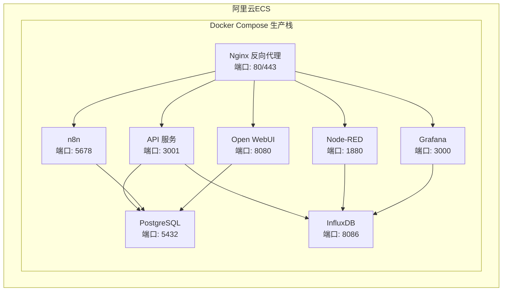
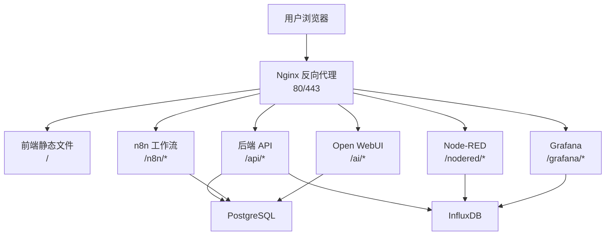
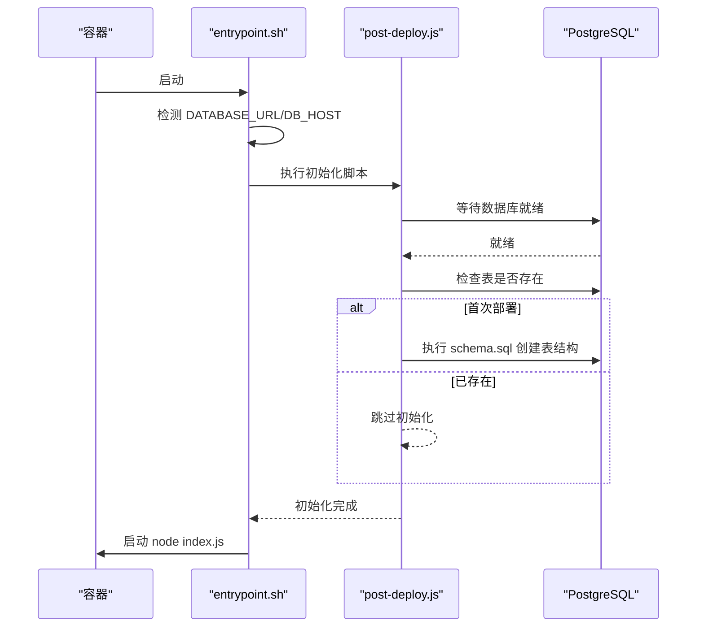
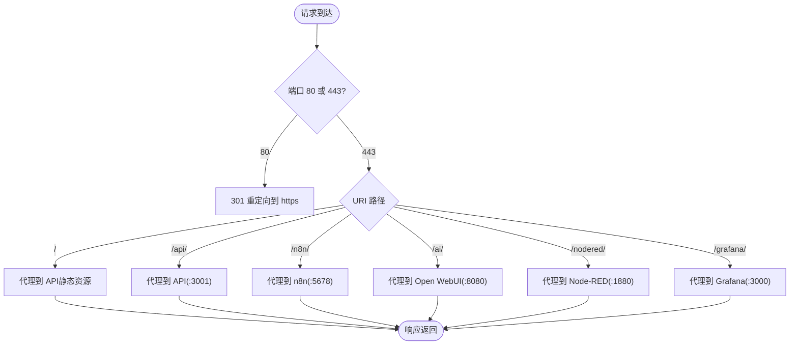
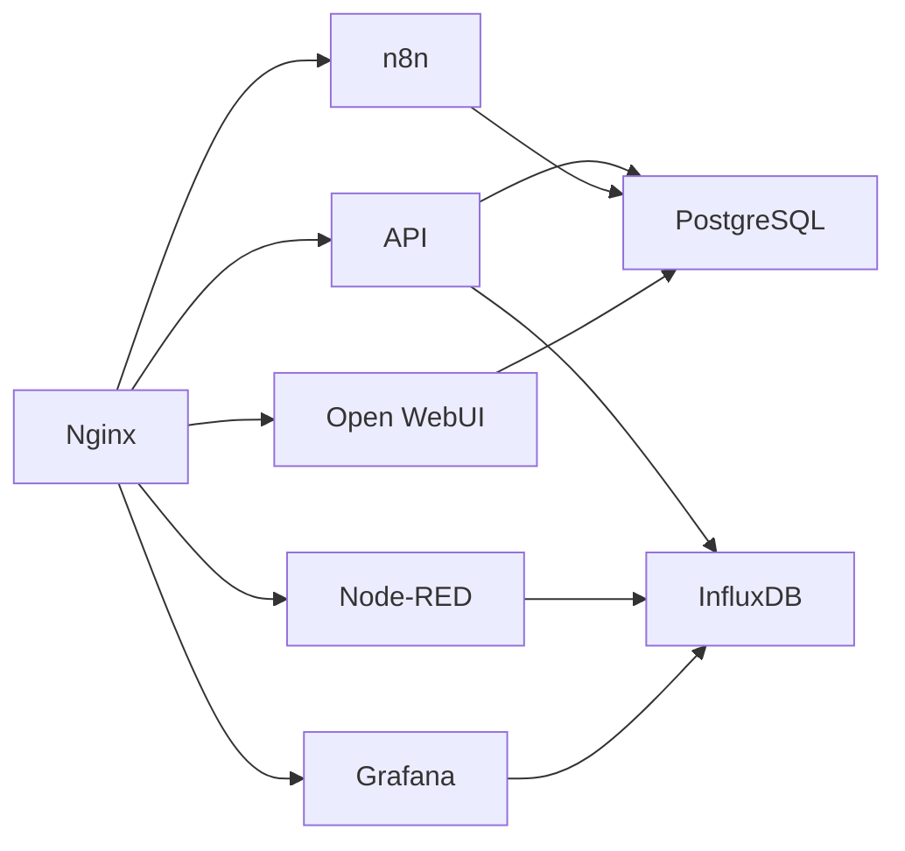

# 阿里云ECS部署指南

<cite>
**本文引用的文件**
- [ALIBABA_ECS_DEPLOYMENT.md](file://ALIBABA_ECS_DEPLOYMENT.md)
- [CLOUD_DEPLOYMENT_GUIDE.md](file://CLOUD_DEPLOYMENT_GUIDE.md)
- [docker-compose.yml](file://docker-compose.yml)
- [docker-compose.prod.yml](file://docker/docker-compose.prod.yml)
- [.env.production.example](file://docker/.env.production.example)
- [nginx.conf](file://docker/nginx.conf)
- [Dockerfile](file://Dockerfile)
- [entrypoint.sh](file://docker/entrypoint.sh)
- [post-deploy.js](file://server/scripts/post-deploy.js)
- [railway.json](file://railway.json)
- [package.json](file://package.json)
- [server/package.json](file://server/package.json)
- [start.sh](file://server/start.sh)
- [start.bat](file://server/start.bat)
</cite>

## 目录
1. [简介](#简介)
2. [项目结构](#项目结构)
3. [核心组件](#核心组件)
4. [架构总览](#架构总览)
5. [详细组件分析](#详细组件分析)
6. [依赖关系分析](#依赖关系分析)
7. [性能与安全考量](#性能与安全考量)
8. [故障排查指南](#故障排查指南)
9. [结论](#结论)
10. [附录](#附录)

## 简介
本指南面向中国大陆地域的阿里云 ECS（Ubuntu 22.04 LTS）部署，聚焦于网络连通、镜像加速与AI服务访问优化，提供从环境初始化、Docker与Docker Compose安装、环境变量配置、AI服务（n8n、Open WebUI）切换国产模型、Nginx反向代理与SSL证书申请到服务启动的完整流程。同时结合项目现有文档，给出与Railway、Vercel等云平台的部署对比与迁移建议。

## 项目结构
- 服务编排与反向代理
  - docker-compose.prod.yml：生产环境完整服务栈（API、PostgreSQL、InfluxDB、n8n、Open WebUI、Node-RED、Grafana）及Nginx反代。
  - nginx.conf：统一反向代理、HTTP→HTTPS重定向、各子路径路由（/、/api、/n8n、/ai、/nodered、/grafana）。
- 构建与启动
  - Dockerfile：多阶段构建（前端+后端），生产镜像设置DATA_PATH目录与CMD启动。
  - entrypoint.sh：容器启动入口，等待数据库就绪并执行数据库初始化脚本，再启动应用。
  - post-deploy.js：数据库初始化脚本，支持DATABASE_URL或独立DB_*变量，幂等执行。
- 环境变量
  - .env.production.example：生产环境变量模板（数据库、InfluxDB、AI服务、Grafana、通知等）。
- 本地开发辅助
  - docker-compose.yml：本地开发完整栈（含本地InfluxDB、Node-RED、Grafana、n8n、Open WebUI）。
  - server/start.sh、server/start.bat：本地开发一键启动脚本。
- 平台集成
  - railway.json：Railway部署配置（Dockerfile构建、启动命令、健康检查等）。

图表来源
- [docker-compose.prod.yml](file://docker/docker-compose.prod.yml#L1-L262)
- [nginx.conf](file://docker/nginx.conf#L1-L240)

章节来源
- [docker-compose.prod.yml](file://docker/docker-compose.prod.yml#L1-L262)
- [nginx.conf](file://docker/nginx.conf#L1-L240)

## 核心组件
- API服务（Node.js + Express）
  - 通过Dockerfile多阶段构建，生产镜像设置NODE_ENV=production、SERVER_PORT=3001。
  - entrypoint.sh在启动前执行post-deploy.js进行数据库初始化。
- 数据库（PostgreSQL + pgvector）
  - docker-compose.prod.yml中定义postgres服务，使用pgvector:pg16镜像；entrypoint.sh等待数据库就绪并执行初始化。
- 时序数据库（InfluxDB 2.x）
  - docker-compose.prod.yml中定义influxdb服务，初始化组织、Bucket与Token。
- AI服务
  - n8n：工作流自动化平台，支持反向代理路径前缀与Webhook。
  - Open WebUI：AI对话界面，默认兼容Gemini OpenAI接口；可在阿里云ECS上切换为国产模型（DeepSeek、通义千问）以降低网络复杂度。
- IoT与可视化
  - Node-RED：IoT数据流处理。
  - Grafana：数据可视化仪表盘。
- 反向代理与SSL
  - Nginx统一暴露80/443，将不同路径转发至对应服务；支持Let’s Encrypt证书申请与自动挂载。

章节来源
- [Dockerfile](file://Dockerfile#L1-L75)
- [entrypoint.sh](file://docker/entrypoint.sh#L1-L36)
- [post-deploy.js](file://server/scripts/post-deploy.js#L1-L182)
- [docker-compose.prod.yml](file://docker/docker-compose.prod.yml#L1-L262)
- [nginx.conf](file://docker/nginx.conf#L1-L240)

## 架构总览
下图展示阿里云ECS上的服务架构与流量走向：Nginx作为统一入口，将前端静态资源、API、n8n、Open WebUI、Node-RED、Grafana分别代理到对应容器；API与数据库、时序数据库建立连接。

图表来源
- [CLOUD_DEPLOYMENT_GUIDE.md](file://CLOUD_DEPLOYMENT_GUIDE.md#L45-L93)
- [nginx.conf](file://docker/nginx.conf#L116-L221)
- [docker-compose.prod.yml](file://docker/docker-compose.prod.yml#L1-L262)

## 详细组件分析

### 组件A：数据库初始化与启动流程
- 流程说明
  - 容器启动时执行entrypoint.sh，若检测到DATABASE_URL或DB_HOST，则运行post-deploy.js。
  - post-deploy.js等待数据库可达（最多重试若干次），若表不存在则执行schema.sql创建结构，并创建必要扩展与基础数据。
  - 初始化完成后启动Node.js应用。

图表来源
- [entrypoint.sh](file://docker/entrypoint.sh#L1-L36)
- [post-deploy.js](file://server/scripts/post-deploy.js#L1-L182)

章节来源
- [entrypoint.sh](file://docker/entrypoint.sh#L1-L36)
- [post-deploy.js](file://server/scripts/post-deploy.js#L1-L182)

### 组件B：Nginx反向代理与路径映射
- 路径映射
  - / → 前端静态文件（由API提供静态资源）
  - /api/* → 后端API（:3001）
  - /n8n/* → n8n（:5678）
  - /ai/* → Open WebUI（:8080）
  - /nodered/* → Node-RED（:1880）
  - /grafana/* → Grafana（:3000）
- SSL与重定向
  - HTTP监听80，重定向至HTTPS；HTTPS监听443，加载fullchain.pem与privkey.pem。
  - 支持WebSocket长连接与SSE场景（如AI流式响应）。

图表来源
- [nginx.conf](file://docker/nginx.conf#L116-L221)

章节来源
- [nginx.conf](file://docker/nginx.conf#L1-L240)

### 组件C：AI服务（n8n与Open WebUI）在中国大陆的网络优化
- 国产模型替代方案（推荐）
  - Open WebUI与n8n均可通过环境变量将OpenAI兼容接口指向DeepSeek或通义千问，避免直连googleapis.com带来的网络问题。
  - 在docker-compose.prod.yml中修改open-webui与n8n的环境变量，即可切换为国产模型。
- Gemini代理方案（如需使用Gemini）
  - 可通过Cloudflare Worker或其他API中转服务，或在n8n与后端API中设置HTTPS_PROXY环境变量。

章节来源
- [ALIBABA_ECS_DEPLOYMENT.md](file://ALIBABA_ECS_DEPLOYMENT.md#L142-L211)
- [docker-compose.prod.yml](file://docker/docker-compose.prod.yml#L106-L171)

### 组件D：Railway与Vercel部署对比（参考）
- Railway
  - 使用railway.json指定Dockerfile构建与启动命令，自动注入DATABASE_URL等变量。
  - 适合快速原型与小团队，支持自动健康检查与重启策略。
- Vercel + Railway
  - 前端部署于Vercel，后端部署于Railway，通过环境变量VITE_API_URL指向后端地址。
- 自托管VPS/Docker Compose
  - 适合需要完全控制的场景，使用docker-compose.prod.yml与Nginx统一暴露。

章节来源
- [CLOUD_DEPLOYMENT_GUIDE.md](file://CLOUD_DEPLOYMENT_GUIDE.md#L291-L443)
- [railway.json](file://railway.json#L1-L12)

## 依赖关系分析
- 组件耦合
  - API服务依赖PostgreSQL与InfluxDB；n8n与Open WebUI依赖API与数据库；Node-RED依赖InfluxDB；Grafana依赖InfluxDB与PostgreSQL。
  - Nginx作为统一入口，依赖所有服务健康状态。
- 外部依赖
  - Docker与Docker Compose（国内镜像源与镜像加速）、Let’s Encrypt证书、阿里云容器镜像加速器。
- 环境变量契约
  - .env.production.example定义了数据库、InfluxDB、AI服务、Grafana等关键变量；Railway等平台会自动注入DATABASE_URL等变量。

图表来源
- [docker-compose.prod.yml](file://docker/docker-compose.prod.yml#L1-L262)
- [nginx.conf](file://docker/nginx.conf#L1-L240)

章节来源
- [docker-compose.prod.yml](file://docker/docker-compose.prod.yml#L1-L262)
- [.env.production.example](file://docker/.env.production.example#L1-L104)

## 性能与安全考量
- 性能
  - Nginx启用gzip压缩、keepalive与HTTP/2；API与AI服务开启WebSocket长连接支持。
  - InfluxDB与Node-RED、Grafana均配置健康检查，保证服务可用性。
- 安全
  - 仅在80/443暴露Nginx；内部服务（如API、数据库、InfluxDB）不直接对外暴露。
  - 通过Nginx终止SSL，证书存放于docker/ssl目录并挂载到Nginx。
  - n8n与Grafana配置Basic Auth与路径前缀，减少直接暴露风险。

章节来源
- [nginx.conf](file://docker/nginx.conf#L1-L240)
- [docker-compose.prod.yml](file://docker/docker-compose.prod.yml#L106-L213)

## 故障排查指南
- 数据库初始化失败
  - 检查DATABASE_URL或DB_*变量是否正确；确认PostgreSQL服务健康；查看post-deploy.js输出的日志。
- API健康检查失败
  - 确认Nginx已正确代理到API；检查API容器健康检查端点；查看API日志。
- AI服务无法访问
  - 若使用Gemini，检查HTTPS_PROXY或API中转配置；若切换为国产模型，确认OPENAI_API_BASE_URLS与API Key已正确设置。
- SSL证书问题
  - 确认certbot已成功申请证书并复制到docker/ssl；检查Nginx证书路径与权限。

章节来源
- [post-deploy.js](file://server/scripts/post-deploy.js#L1-L182)
- [entrypoint.sh](file://docker/entrypoint.sh#L1-L36)
- [nginx.conf](file://docker/nginx.conf#L95-L115)

## 结论
本指南基于项目现有文档，提供了阿里云ECS（Ubuntu 22.04 LTS）的完整部署路径：环境初始化（国内镜像源与Docker安装）、Docker Compose生产栈启动、AI服务网络优化（国产模型优先）、Nginx反向代理与SSL证书配置。同时结合Railway与Vercel的部署方案，便于在不同场景下选择最优路径。建议在生产环境中严格遵循最小暴露原则与安全加固措施，并定期备份数据库与配置。

## 附录

### 部署前准备与安全组
- 服务器选型与地域建议（华东1/华北2）。
- 安全组入方向规则：22（SSH，限特定IP）、80/433（Web），3001/5678/5432等内部服务端口通过Nginx代理访问。

章节来源
- [ALIBABA_ECS_DEPLOYMENT.md](file://ALIBABA_ECS_DEPLOYMENT.md#L15-L24)

### 环境初始化与Docker安装（国内加速）
- 替换apt源、安装Docker与Docker Compose、配置镜像加速（阿里云容器镜像加速器）。

章节来源
- [ALIBABA_ECS_DEPLOYMENT.md](file://ALIBABA_ECS_DEPLOYMENT.md#L28-L90)

### 代码部署与环境变量
- 克隆代码（可使用Gitee镜像或本地上传）。
- 复制并编辑.env.production.example，填写数据库、InfluxDB、AI服务、Grafana等关键变量。

章节来源
- [ALIBABA_ECS_DEPLOYMENT.md](file://ALIBABA_ECS_DEPLOYMENT.md#L92-L141)
- [.env.production.example](file://docker/.env.production.example#L1-L104)

### 启动服务与日志查看
- 使用docker compose -f docker-compose.prod.yml up -d启动；使用logs -f查看实时日志。

章节来源
- [ALIBABA_ECS_DEPLOYMENT.md](file://ALIBABA_ECS_DEPLOYMENT.md#L214-L223)

### Nginx与SSL配置
- 使用docker/nginx.conf作为基础配置；通过Certbot申请免费SSL证书并挂载到Nginx。
- 证书目录与文件名需与nginx.conf一致。

章节来源
- [ALIBABA_ECS_DEPLOYMENT.md](file://ALIBABA_ECS_DEPLOYMENT.md#L224-L251)
- [nginx.conf](file://docker/nginx.conf#L95-L115)

### 本地开发与一键启动脚本
- server/start.sh与server/start.bat提供本地开发一键启动能力，自动安装依赖并启动服务。

章节来源
- [start.sh](file://server/start.sh#L1-L54)
- [start.bat](file://server/start.bat#L1-L55)