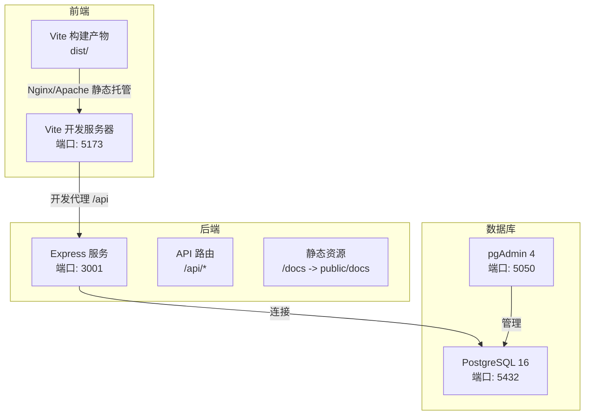
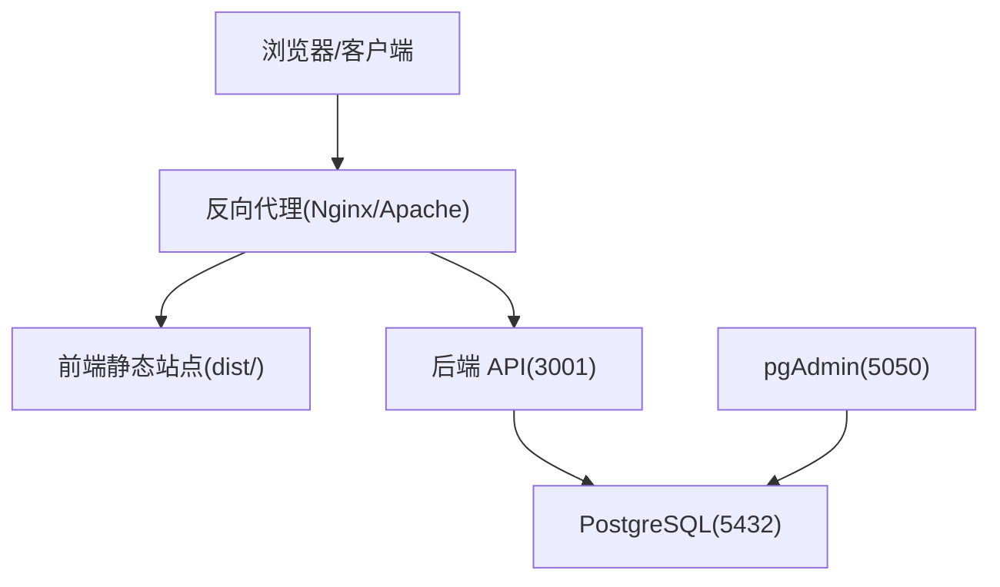
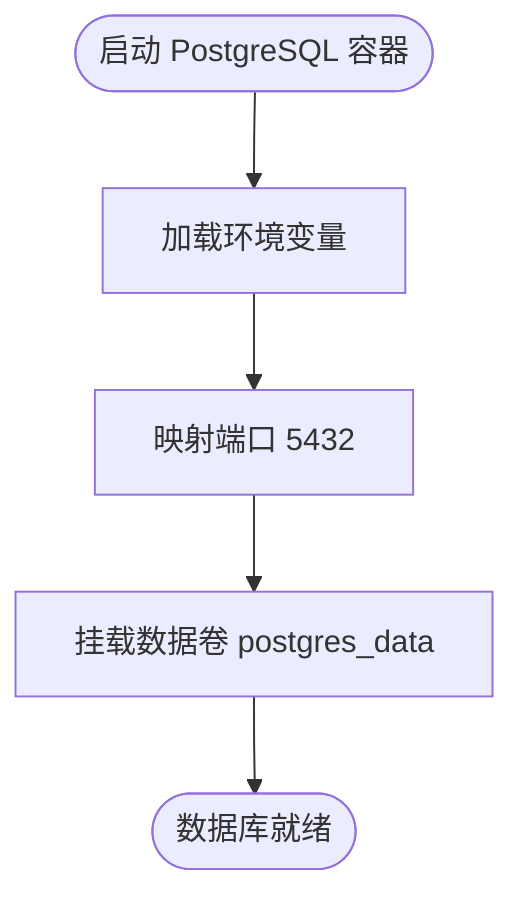
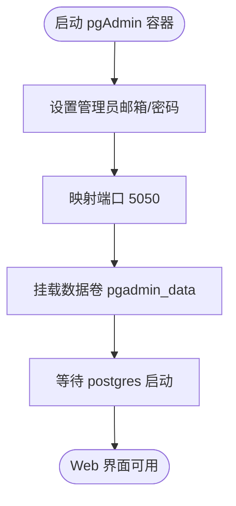
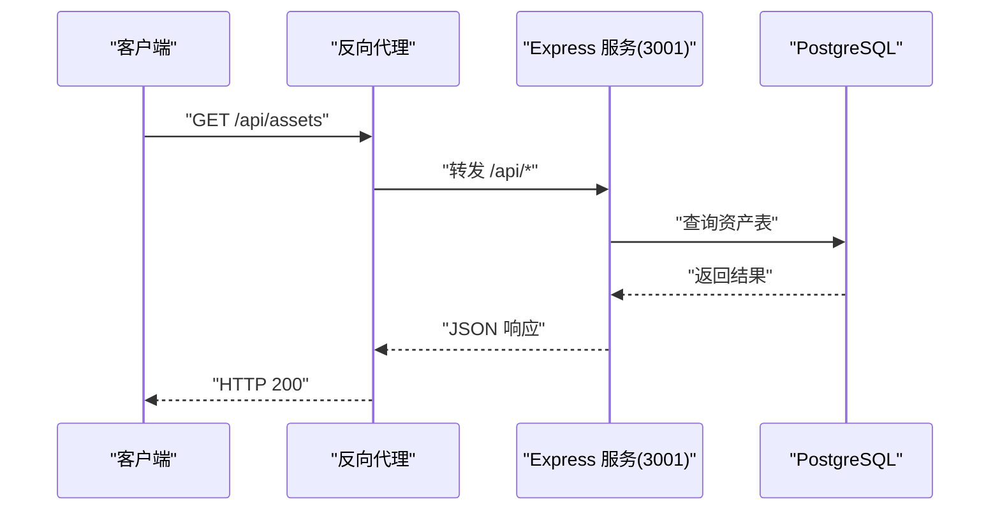
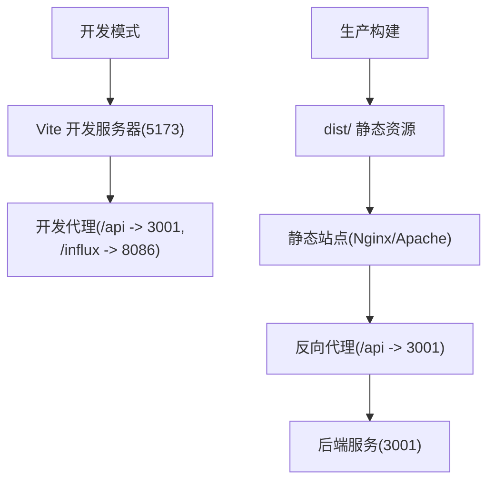
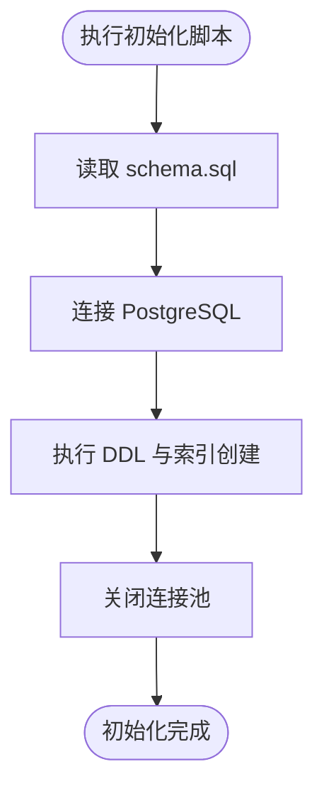
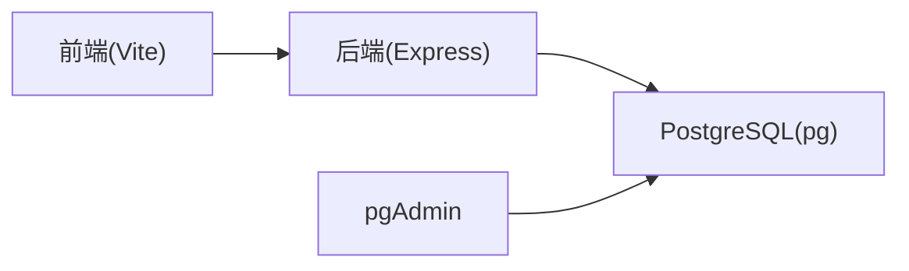
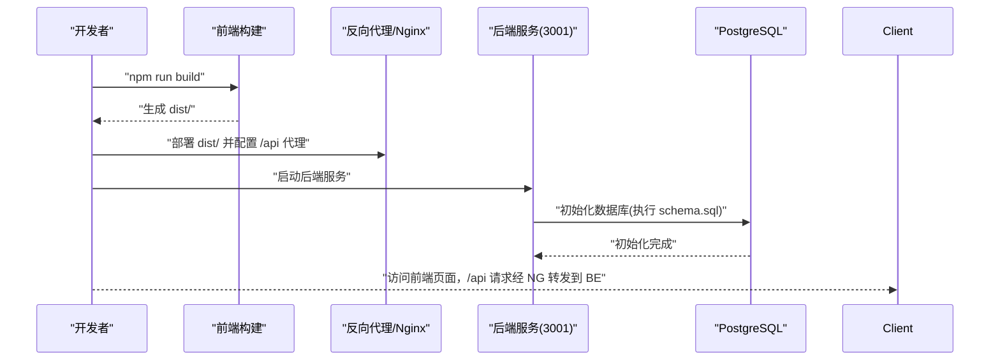

# 部署架构

<cite>
**本文引用的文件**
- [docker-compose.yml](file://docker-compose.yml)
- [package.json](file://package.json)
- [vite.config.js](file://vite.config.js)
- [.env](file://.env)
- [server/package.json](file://server/package.json)
- [server/index.js](file://server/index.js)
- [server/db/index.js](file://server/db/index.js)
- [server/db/schema.sql](file://server/db/schema.sql)
- [server/scripts/init-db.js](file://server/scripts/init-db.js)
- [server/routes/api.js](file://server/routes/api.js)
- [restart-server.bat](file://restart-server.bat)
</cite>

## 目录
1. [简介](#简介)
2. [项目结构](#项目结构)
3. [核心组件](#核心组件)
4. [架构总览](#架构总览)
5. [详细组件分析](#详细组件分析)
6. [依赖关系分析](#依赖关系分析)
7. [性能考虑](#性能考虑)
8. [故障排查指南](#故障排查指南)
9. [结论](#结论)
10. [附录](#附录)

## 简介
本文件面向运维与开发团队，系统性说明本项目的生产环境部署方案。基于 docker-compose.yml 的容器编排，明确 PostgreSQL 数据库与 Node.js 应用服务的部署方式；解释前端构建产物（通过 Vite 构建）与后端服务的集成部署策略；覆盖环境变量管理、端口映射、数据卷持久化等关键配置；并提供从代码构建到服务上线的完整操作流程，确保可重复、可靠的部署与维护。

## 项目结构
项目采用前后端分离架构：
- 前端：基于 Vue 3 与 Vite，提供开发代理与构建能力
- 后端：Node.js + Express + PostgreSQL，提供 RESTful API 与静态资源服务
- 数据库：PostgreSQL 16，使用 pg 客户端与连接池
- 管理工具：pgAdmin 4，便于数据库可视化管理

图表来源
- [docker-compose.yml](file://docker-compose.yml#L1-L51)
- [vite.config.js](file://vite.config.js#L1-L21)
- [server/index.js](file://server/index.js#L1-L92)

章节来源
- [docker-compose.yml](file://docker-compose.yml#L1-L51)
- [package.json](file://package.json#L1-L30)
- [vite.config.js](file://vite.config.js#L1-L21)
- [server/index.js](file://server/index.js#L1-L92)

## 核心组件
- Docker Compose 编排
  - PostgreSQL 服务：镜像、容器名、重启策略、环境变量、端口映射、数据卷
  - pgAdmin 服务：镜像、容器名、重启策略、环境变量、端口映射、数据卷、依赖
- Node.js 后端服务
  - Express 应用：CORS、JSON/URL 编码中间件、静态资源、健康检查、路由注册
  - 数据库连接：pg 连接池，支持主机、端口、用户、密码、数据库名等环境变量
  - 初始化脚本：读取 schema.sql 并执行，创建表结构与索引
- 前端构建与代理
  - Vite 构建：生成 dist/ 静态资源
  - Vite 开发代理：将 /api 代理到后端 3001 端口，/influx 代理到 InfluxDB 8086 端口
  - 环境变量：前端侧 InfluxDB 连接参数

章节来源
- [docker-compose.yml](file://docker-compose.yml#L1-L51)
- [server/index.js](file://server/index.js#L1-L92)
- [server/db/index.js](file://server/db/index.js#L1-L70)
- [server/scripts/init-db.js](file://server/scripts/init-db.js#L1-L40)
- [vite.config.js](file://vite.config.js#L1-L21)
- [.env](file://.env#L1-L6)

## 架构总览
生产部署建议：
- 使用 Nginx/Apache 将前端构建产物 dist/ 作为静态站点对外提供
- 后端服务通过反向代理暴露 API，如 /api 前缀转发至后端 3001 端口
- 数据库与管理工具在内网或受控网络中运行，必要时通过防火墙限制入站访问
- 使用 Docker Compose 在开发/测试环境快速拉起数据库与管理工具；生产环境可按需替换为云数据库或自有数据库集群

图表来源
- [docker-compose.yml](file://docker-compose.yml#L1-L51)
- [server/index.js](file://server/index.js#L1-L92)

## 详细组件分析

### 数据库服务（PostgreSQL）
- 镜像与版本：使用官方 postgres:16-alpine
- 容器名：tandem-postgres
- 重启策略：always
- 环境变量：POSTGRES_USER、POSTGRES_PASSWORD、POSTGRES_DB
- 端口映射：宿主 5432 -> 容器 5432
- 数据卷：postgres_data 持久化 /var/lib/postgresql/data
- 初始化：首次启动会创建数据库与用户，后续可通过初始化脚本创建表结构

图表来源
- [docker-compose.yml](file://docker-compose.yml#L1-L30)

章节来源
- [docker-compose.yml](file://docker-compose.yml#L1-L30)

### 数据库管理工具（pgAdmin）
- 镜像：dpage/pgadmin4:latest
- 容器名：tandem-pgadmin
- 重启策略：always
- 环境变量：PGADMIN_DEFAULT_EMAIL、PGADMIN_DEFAULT_PASSWORD
- 端口映射：宿主 5050 -> 容器 80
- 数据卷：pgadmin_data 持久化 /var/lib/pgadmin
- 依赖：depends_on: postgres
- 连接数据库时 Host 填写容器名 postgres

图表来源
- [docker-compose.yml](file://docker-compose.yml#L16-L30)

章节来源
- [docker-compose.yml](file://docker-compose.yml#L16-L30)

### 后端服务（Node.js + Express）
- 启动方式：server/package.json 中的 scripts.start 或开发模式 scripts.dev
- 端口：默认 3001，可通过环境变量 SERVER_PORT 覆盖
- CORS：允许本地开发源（5173/3000/127.0.0.1:5173）
- 静态资源：/docs -> 项目根目录 public/docs
- 路由：/api、/api/files、/api/documents、/api/views、/api/v1/timeseries
- 健康检查：/health
- 数据库连接：通过 server/db/index.js 使用 pg 连接池，支持 DB_HOST、DB_PORT、DB_NAME、DB_USER、DB_PASSWORD 等环境变量
- 初始化：server/scripts/init-db.js 读取 server/db/schema.sql 并创建表结构与索引

图表来源
- [server/index.js](file://server/index.js#L1-L92)
- [server/db/index.js](file://server/db/index.js#L1-L70)
- [server/routes/api.js](file://server/routes/api.js#L1-L517)

章节来源
- [server/index.js](file://server/index.js#L1-L92)
- [server/db/index.js](file://server/db/index.js#L1-L70)
- [server/scripts/init-db.js](file://server/scripts/init-db.js#L1-L40)
- [server/routes/api.js](file://server/routes/api.js#L1-L517)

### 前端构建与集成
- 构建命令：package.json 中的 build 脚本，生成 dist/ 静态资源
- 开发代理：vite.config.js 将 /api 代理到后端 3001，/influx 代理到 InfluxDB 8086
- 环境变量：.env 中配置前端侧 InfluxDB 连接参数（URL、组织、桶、Token）
- 生产集成：建议将 dist/ 交由 Nginx/Apache 作为静态站点托管；反向代理将 /api 前缀转发至后端 3001 端口

图表来源
- [package.json](file://package.json#L1-L30)
- [vite.config.js](file://vite.config.js#L1-L21)
- [.env](file://.env#L1-L6)

章节来源
- [package.json](file://package.json#L1-L30)
- [vite.config.js](file://vite.config.js#L1-L21)
- [.env](file://.env#L1-L6)

### 数据库初始化与迁移
- 初始化脚本：server/scripts/init-db.js 读取 server/db/schema.sql 并执行，创建表结构与索引
- 连接参数：通过 server/db/index.js 的环境变量（DB_HOST、DB_PORT、DB_NAME、DB_USER、DB_PASSWORD）
- 建议：生产环境可将 schema.sql 与迁移脚本纳入 CI/CD 流水线，在部署前自动执行

图表来源
- [server/scripts/init-db.js](file://server/scripts/init-db.js#L1-L40)
- [server/db/schema.sql](file://server/db/schema.sql#L1-L160)
- [server/db/index.js](file://server/db/index.js#L1-L70)

章节来源
- [server/scripts/init-db.js](file://server/scripts/init-db.js#L1-L40)
- [server/db/schema.sql](file://server/db/schema.sql#L1-L160)
- [server/db/index.js](file://server/db/index.js#L1-L70)

## 依赖关系分析
- 组件耦合
  - 后端服务依赖数据库连接池（pg），通过环境变量配置
  - 前端开发代理依赖后端 3001 端口；生产环境依赖反向代理
  - pgAdmin 依赖 PostgreSQL 容器
- 外部依赖
  - PostgreSQL 官方镜像与 pgAdmin 官方镜像
  - Vite、Vue、Express、pg 等 NPM 包

图表来源
- [server/db/index.js](file://server/db/index.js#L1-L70)
- [docker-compose.yml](file://docker-compose.yml#L1-L51)

章节来源
- [server/db/index.js](file://server/db/index.js#L1-L70)
- [docker-compose.yml](file://docker-compose.yml#L1-L51)

## 性能考虑
- 连接池配置
  - 后端使用 pg 连接池，最大连接数、空闲超时、连接超时等参数可在 server/db/index.js 中调整
- 查询性能
  - schema.sql 中为关键列创建了索引，有助于提升查询效率
- 静态资源
  - 建议在生产环境中启用缓存与压缩，减少带宽占用
- 反向代理
  - 建议在 Nginx/Apache 中开启 gzip、缓存静态资源、限流与健康检查

[本节为通用指导，不直接分析具体文件]

## 故障排查指南
- 后端无法连接数据库
  - 检查 server/db/index.js 的环境变量是否正确（DB_HOST、DB_PORT、DB_NAME、DB_USER、DB_PASSWORD）
  - 确认数据库容器已启动且端口映射正常
- 前端代理无效
  - 确认开发代理配置（vite.config.js）指向正确的后端地址
  - 生产环境确认反向代理已将 /api 前缀转发至后端 3001
- 数据库初始化失败
  - 查看 server/scripts/init-db.js 的输出日志，确认 schema.sql 路径与权限
  - 确认数据库连接字符串与凭据正确
- Windows 端口占用
  - 使用 restart-server.bat 停止占用 3001 端口的进程后重启服务

章节来源
- [server/db/index.js](file://server/db/index.js#L1-L70)
- [vite.config.js](file://vite.config.js#L1-L21)
- [server/scripts/init-db.js](file://server/scripts/init-db.js#L1-L40)
- [restart-server.bat](file://restart-server.bat#L1-L13)

## 结论
本项目的生产部署以 Docker Compose 快速搭建数据库与管理工具，结合 Vite 构建产物与反向代理实现前后端一体化部署。通过环境变量集中管理数据库与 API 密钥，利用数据卷实现持久化，配合连接池与索引优化保障性能。建议在生产环境中进一步完善 CI/CD、监控与备份策略，确保系统的稳定性与可维护性。

[本节为总结，不直接分析具体文件]

## 附录

### 环境变量清单
- 数据库连接（后端）
  - DB_HOST、DB_PORT、DB_NAME、DB_USER、DB_PASSWORD
- 服务器配置（后端）
  - SERVER_PORT
- InfluxDB（前端直连）
  - VITE_INFLUX_URL、VITE_INFLUX_ORG、VITE_INFLUX_BUCKET、VITE_INFLUX_TOKEN
- API 密钥（后端）
  - API_KEY_SECRET

章节来源
- [server/db/index.js](file://server/db/index.js#L1-L70)
- [server/index.js](file://server/index.js#L1-L92)
- [.env](file://.env#L1-L6)

### 端口映射与服务说明
- PostgreSQL
  - 宿主端口：5432 -> 容器端口：5432
- pgAdmin
  - 宿主端口：5050 -> 容器端口：80
- 后端 API
  - 默认端口：3001（可通过 SERVER_PORT 覆盖）

章节来源
- [docker-compose.yml](file://docker-compose.yml#L1-L51)
- [server/index.js](file://server/index.js#L1-L92)

### 数据卷持久化
- PostgreSQL 数据卷：postgres_data
- pgAdmin 数据卷：pgadmin_data

章节来源
- [docker-compose.yml](file://docker-compose.yml#L31-L34)

### 从代码构建到服务上线的完整流程
- 前端
  - 执行构建命令生成 dist/ 静态资源
  - 将 dist/ 部署到 Nginx/Apache，配置反向代理将 /api 前缀转发至后端 3001
- 后端
  - 设置环境变量（数据库与 API 密钥）
  - 启动后端服务（3001 端口）
  - 执行数据库初始化脚本创建表结构
- 数据库与管理工具
  - 使用 Docker Compose 启动 PostgreSQL 与 pgAdmin
  - 在 pgAdmin 中添加服务器并连接数据库

图表来源
- [package.json](file://package.json#L1-L30)
- [server/scripts/init-db.js](file://server/scripts/init-db.js#L1-L40)
- [server/index.js](file://server/index.js#L1-L92)
- [docker-compose.yml](file://docker-compose.yml#L1-L51)