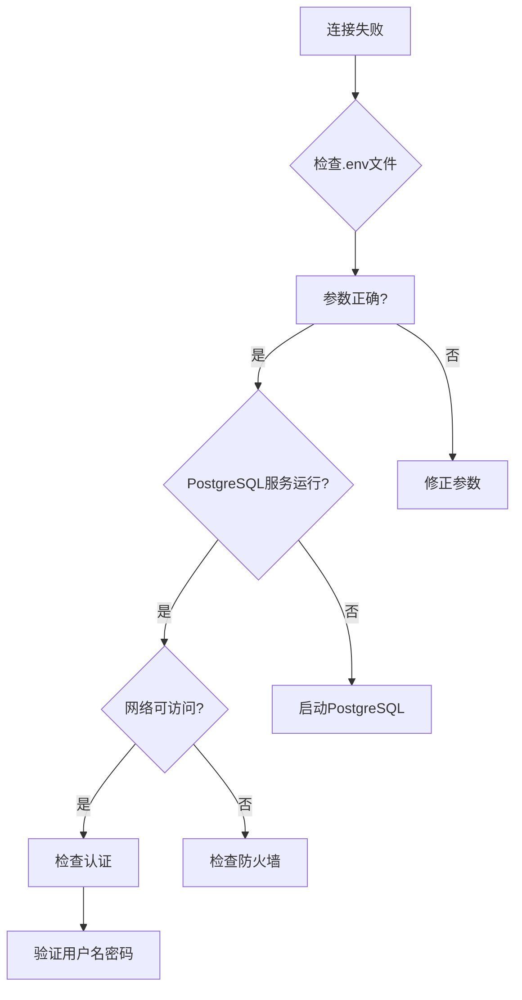

# 配置与定制

<cite>
**本文档中引用的文件**   
- [.env](file://.env)
- [.env.local](file://.env.local)
- [server/.env](file://server/.env)
- [vite.config.js](file://vite.config.js)
- [src/services/influx.ts](file://src/services/influx.ts)
- [src/services/postgres.js](file://src/services/postgres.js)
- [server/db/index.js](file://server/db/index.js)
- [server/index.js](file://server/index.js)
</cite>

## 目录
1. [项目配置概述](#项目配置概述)
2. [.env文件配置详解](#env文件配置详解)
3. 环境变量覆盖机制
4. Vite构建配置
5. 配置最佳实践
6. 常见问题排查
7. 安全建议

## 项目配置概述

本项目采用多层配置体系，通过环境变量文件和构建配置文件实现灵活的系统定制。配置体系主要包括：
- 根目录下的`.env`和`.env.local`文件，用于前端Vite应用的环境配置
- `server/`目录下的`.env`文件，用于后端服务器的环境配置
- `vite.config.js`文件，用于Vite构建工具的开发服务器和代理配置

这种分层配置方式使得前端和后端可以独立配置各自的连接参数，同时通过Vite的代理功能实现开发环境下的无缝集成。

**Section sources**
- [.env](file://.env#L1-L6)
- [server/.env](file://server/.env#L1-L19)
- [vite.config.js](file://vite.config.js#L1-L21)

## .env文件配置详解

### 根目录.env文件

根目录下的`.env`文件主要用于配置前端应用的环境变量，特别是与InfluxDB时序数据库的连接配置：

```env
# InfluxDB 配置 (前端直接查询)
VITE_INFLUX_URL=http://localhost:8086
VITE_INFLUX_ORG=demo
VITE_INFLUX_BUCKET=tandem
VITE_INFLUX_TOKEN=Wutfd7wGE9HowTtyZp6uX2Y7xLucD3iB8AFh0VWeUdlRxllw5Oljah6fO-aXDAc3U-ROIo4rBvVSXSDgXT7-rA==
```

这些环境变量通过Vite的`import.meta.env`在前端代码中使用，主要用于时序数据的查询和写入操作。

**Section sources**
- [.env](file://.env#L1-L6)
- [src/services/influx.ts](file://src/services/influx.ts#L1-L136)

### .env.local文件

`.env.local`文件是本地环境的配置文件，具有最高优先级，用于覆盖其他.env文件中的配置：

```env
VITE_INFLUX_URL=/influx
VITE_INFLUX_TOKEN=db86a771bdf34e26b5dbb75efdf04391
VITE_INFLUX_ORG=demo
VITE_INFLUX_BUCKET=tandem
VITE_INFLUX_BASIC=false
VITE_INFLUX_USER=root
VITE_INFLUX_PASSWORD=rootroot

# PostgreSQL 数据库配置
DB_HOST=localhost
DB_PORT=5432
DB_NAME=tandem
DB_USER=postgres
DB_PASSWORD=password
```

此文件包含了前端和后端共用的数据库连接配置，以及InfluxDB的详细认证信息。

**Section sources**
- [.env.local](file://.env.local#L1-L15)

### server/.env文件

`server/`目录下的`.env`文件专门用于后端服务器的配置：

```env
# PostgreSQL 数据库配置
DB_HOST=localhost
DB_PORT=5432
DB_NAME=tandem
DB_USER=postgres
DB_PASSWORD=password

# 服务器配置
SERVER_PORT=3001

# InfluxDB 配置 (用于时序数据)
INFLUX_URL=http://localhost:8086
INFLUX_ORG=demo
INFLUX_BUCKET=tandem
INFLUX_TOKEN=Wutfd7wGE9HowTtyZp6uX2Y7xLucD3iB8AFh0VWeUdlRxllw5Oljah6fO-aXDAc3U-ROIo4rBvVSXSDgXT7-rA==

# API 密钥配置 (用于生成 Stream URL 的安全 Key)
API_KEY_SECRET=tandem-timeseries-secret-2024
```

这些配置在`server/index.js`和`server/db/index.js`中通过`process.env`访问，用于建立数据库连接和启动服务器。

**Section sources**
- [server/.env](file://server/.env#L1-L19)
- [server/db/index.js](file://server/db/index.js#L1-L70)
- [server/index.js](file://server/index.js#L1-L92)

## 环境变量覆盖机制

本项目采用Vite的环境变量优先级机制，实现灵活的配置覆盖：

1. **默认配置**：`.env`文件提供默认的环境变量值
2. **本地覆盖**：`.env.local`文件可以覆盖`.env`中的配置，且该文件通常被.gitignore忽略，不会提交到版本控制
3. **环境特定配置**：支持`.env.[mode]`和`.env.[mode].local`格式的文件，用于不同环境（如development、production）的特定配置

在代码中，前端通过`import.meta.env.VITE_`前缀访问环境变量，后端通过`process.env`访问。Vite会自动将`VITE_`前缀的变量暴露给前端代码，而其他变量则仅在构建时可用。

```mermaid
flowchart TD
A[默认配置 .env] --> B[本地覆盖 .env.local]
B --> C[环境特定配置 .env.[mode]]
C --> D[最终生效配置]
D --> E[前端: import.meta.env]
D --> F[后端: process.env]
```

**Diagram sources**
- [.env](file://.env#L1-L6)
- [.env.local](file://.env.local#L1-L15)
- [vite.config.js](file://vite.config.js#L1-L21)

**Section sources**
- [.env](file://.env#L1-L6)
- [.env.local](file://.env.local#L1-L15)

## Vite构建配置

`vite.config.js`文件定义了Vite构建工具的核心配置，特别是开发服务器的代理设置：

```javascript
import { defineConfig } from 'vite'
import vue from '@vitejs/plugin-vue'

export default defineConfig({
  plugins: [vue()],
  server: {
    proxy: {
      '/api': {
        target: 'http://localhost:3001',
        changeOrigin: true,
      },
      '/influx': {
        target: 'http://localhost:8086',
        changeOrigin: true,
        rewrite: (path) => path.replace(/^\/influx/, ''),
      },
    },
  },
})
```

### 代理配置说明

1. **API代理**：将`/api`前缀的请求代理到后端服务器`http://localhost:3001`
   - 解决开发环境下的跨域问题
   - 前端代码可以直接使用`/api`路径，无需指定完整URL

2. **InfluxDB代理**：将`/influx`前缀的请求代理到InfluxDB服务`http://localhost:8086`
   - 通过`rewrite`函数移除`/influx`前缀，实现路径转换
   - 增强安全性，避免直接暴露InfluxDB的完整URL

### 开发服务器配置

- **热重载**：Vite提供快速的模块热替换，提升开发效率
- **按需编译**：仅编译请求的模块，启动速度快
- **TypeScript支持**：原生支持TypeScript，无需额外配置

```mermaid
flowchart LR
A[前端应用] --> B[Vite开发服务器]
B --> C[/api → 后端服务]
B --> D[/influx → InfluxDB]
C --> E[后端API http://localhost:3001]
D --> F[InfluxDB http://localhost:8086]
```

**Diagram sources**
- [vite.config.js](file://vite.config.js#L1-L21)
- [src/services/postgres.js](file://src/services/postgres.js#L1-L245)

**Section sources**
- [vite.config.js](file://vite.config.js#L1-L21)

## 配置最佳实践

### 1. 环境变量命名规范

- 前端环境变量必须以`VITE_`为前缀，才能在客户端代码中访问
- 后端环境变量使用大写字母和下划线分隔，如`DB_HOST`、`SERVER_PORT`
- 敏感信息（如密码、令牌）应避免在代码中硬编码

### 2. 配置文件组织

```bash
# 推荐的配置文件结构
.env                # 默认配置，提交到版本控制
.env.local          # 本地覆盖配置，添加到.gitignore
.env.development    # 开发环境特定配置
.env.production     # 生产环境特定配置
```

### 3. 数据库连接配置

PostgreSQL数据库连接配置在前后端都有定义，确保一致性：

```javascript
// server/db/index.js 中的连接池配置
const pool = new Pool({
    host: process.env.DB_HOST || 'localhost',
    port: parseInt(process.env.DB_PORT || '5432'),
    user: process.env.DB_USER || 'postgres',
    password: process.env.DB_PASSWORD || 'password',
    database: process.env.DB_NAME || 'tandem',
    max: 20,
    idleTimeoutMillis: 30000,
    connectionTimeoutMillis: 2000,
});
```

### 4. 服务端口配置

- 前端开发服务器默认使用5173端口（Vite默认）
- 后端API服务器使用`SERVER_PORT`环境变量配置，当前设置为3001
- InfluxDB使用默认的8086端口

### 5. 时序数据库配置

InfluxDB配置在前后端保持一致，确保数据写入和查询的一致性：

```javascript
// src/services/influx.ts 中的配置使用
const url = import.meta.env.VITE_INFLUX_URL || '';
const token = import.meta.env.VITE_INFLUX_TOKEN || '';
const org = import.meta.env.VITE_INFLUX_ORG || '';
const bucket = import.meta.env.VITE_INFLUX_BUCKET || '';
```

**Section sources**
- [server/db/index.js](file://server/db/index.js#L1-L70)
- [src/services/influx.ts](file://src/services/influx.ts#L1-L136)
- [server/.env](file://server/.env#L1-L19)

## 常见问题排查

### 1. 数据库连接失败

**症状**：后端启动时出现"PostgreSQL 连接池错误"或"查询错误"

**排查步骤**：
1. 检查`server/.env`文件中的数据库连接参数
2. 确认PostgreSQL服务是否正在运行
3. 验证数据库用户名和密码是否正确
4. 检查防火墙设置，确保5432端口可访问



**Section sources**
- [server/db/index.js](file://server/db/index.js#L1-L70)
- [server/.env](file://server/.env#L1-L19)

### 2. API请求404错误

**症状**：前端调用API返回404错误

**排查步骤**：
1. 检查Vite代理配置是否正确
2. 确认后端服务器是否已启动
3. 验证API端点路径是否正确
4. 检查跨域设置

```javascript
// server/index.js 中的API路由配置
app.use('/api', apiRoutes);
app.use('/api/files', fileRoutes);
app.use('/api/documents', documentRoutes);
app.use('/api/views', viewsRoutes);
app.use('/api/v1/timeseries', timeseriesRoutes);
```

**Section sources**
- [vite.config.js](file://vite.config.js#L1-L21)
- [server/index.js](file://server/index.js#L1-L92)

### 3. InfluxDB查询失败

**症状**：时序数据无法显示或写入失败

**排查步骤**：
1. 检查`.env.local`中的InfluxDB认证信息
2. 验证InfluxDB服务是否运行
3. 确认组织(org)和存储桶(bucket)名称是否正确
4. 检查令牌(token)是否有足够的权限

```javascript
// src/services/influx.ts 中的配置验证
export const isInfluxConfigured = () => !!(url && org && bucket && (token || (useBasic && basicUser && basicPass)));
```

**Section sources**
- [.env.local](file://.env.local#L1-L15)
- [src/services/influx.ts](file://src/services/influx.ts#L1-L136)

## 安全建议

### 1. 敏感信息保护

- **避免硬编码**：绝不将密码、令牌等敏感信息直接写入代码
- **使用环境变量**：通过环境变量管理敏感配置
- **.gitignore策略**：将`.env.local`添加到`.gitignore`，防止意外提交

```bash
# .gitignore 配置
.env.local
*.key
*.pem
```

### 2. 访问控制

- **最小权限原则**：数据库用户应仅具有必要的权限
- **API密钥管理**：使用`API_KEY_SECRET`等密钥进行接口安全验证
- **令牌有效期**：定期轮换InfluxDB令牌

### 3. 配置验证

在应用启动时验证关键配置：

```javascript
// server/db/index.js 中的连接事件
pool.on('connect', () => {
    console.log('📦 PostgreSQL 连接已建立');
});

pool.on('error', (err) => {
    console.error('❌ PostgreSQL 连接池错误:', err);
});
```

### 4. 生产环境配置

生产环境应使用独立的配置文件：

```env
# .env.production 示例
VITE_INFLUX_URL=https://influx.example.com
VITE_INFLUX_ORG=production
DB_HOST=prod-db.example.com
SERVER_PORT=80
```

**Section sources**
- [.env.local](file://.env.local#L1-L15)
- [server/.env](file://server/.env#L1-L19)