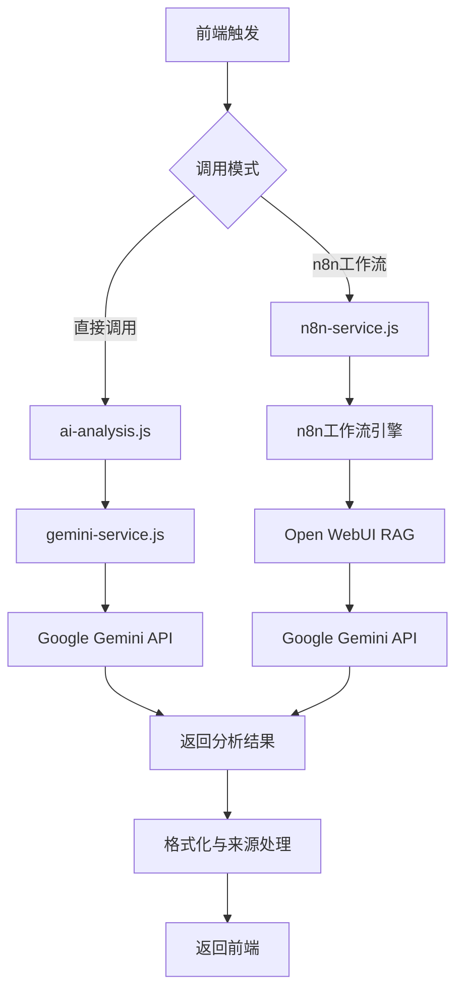
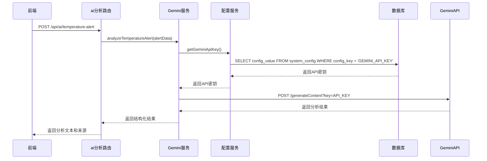
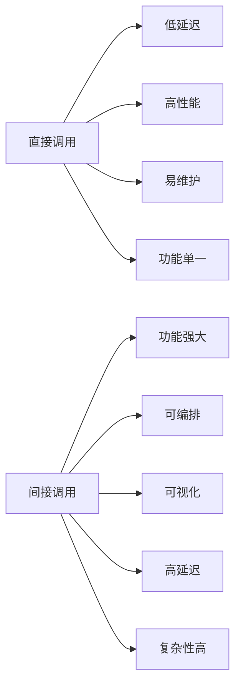

# Gemini AI分析

<cite>
**本文档引用文件**   
- [gemini-service.js](file://server/services/gemini-service.js)
- [config-service.js](file://server/services/config-service.js)
- [ai-analysis.js](file://server/routes/ai-analysis.js)
- [n8n-service.js](file://server/services/n8n-service.js)
- [temperature-alert.json](file://n8n-workflows/temperature-alert.json)
- [temperature-alert-workflow.json](file://n8n-workflows/temperature-alert-workflow.json)
- [ai.js](file://server/routes/v1/ai.js)
- [ai-analysis.ts](file://src/services/ai-analysis.ts)
</cite>

## 目录
1. [引言](#引言)
2. [Gemini AI直接集成架构](#gemini-ai直接集成架构)
3. [Prompt构建与分析要求](#prompt构建与分析要求)
4. [API调用实现细节](#api调用实现细节)
5. [间接调用与直接调用模式对比](#间接调用与直接调用模式对比)
6. [最佳实践建议](#最佳实践建议)
7. [结论](#结论)

## 引言
本项目实现了Gemini AI在建筑运维场景中的深度集成，支持通过直接调用Google Gemini API或间接通过n8n工作流两种模式进行智能分析。系统核心功能包括温度异常报警分析、设备与空间的智能问答等，通过构建专业的Prompt并结合上下文信息，为运维人员提供精准的决策支持。本文档详细记录了`gemini-service.js`中`analyzeTemperatureAlert`函数的实现机制，分析了Prompt的构建逻辑、API调用流程，并对比了两种集成模式的优劣，为后端AI集成提供最佳实践指导。

## Gemini AI直接集成架构

系统采用模块化设计，`gemini-service.js`作为独立的服务模块，负责与Google Gemini API进行直接通信。该服务不依赖n8n等中间件，通过`config-service.js`从数据库安全地获取API密钥，实现了轻量级、高内聚的集成方案。整个调用流程由`ai-analysis.js`路由控制，根据环境变量`USE_N8N_WORKFLOW`动态选择调用模式，确保了系统的灵活性和可配置性。

**Diagram sources**
- [ai-analysis.js](file://server/routes/ai-analysis.js)
- [gemini-service.js](file://server/services/gemini-service.js)
- [n8n-service.js](file://server/services/n8n-service.js)

**Section sources**
- [ai-analysis.js](file://server/routes/ai-analysis.js)
- [gemini-service.js](file://server/services/gemini-service.js)

## Prompt构建与分析要求

`analyzeTemperatureAlert`函数的核心在于构建一个符合建筑运维专家角色的Prompt。该Prompt不仅包含报警的基本信息，还通过结构化指令明确了分析的深度和输出格式。

### 报警信息
Prompt中包含以下关键报警数据：
- **位置**: 房间名称与编码
- **温度数据**: 当前温度与阈值
- **报警类型**: 高温或低温
- **时间戳**: 事件发生时间

### 分析要求
Prompt明确要求AI提供三个维度的专业分析：
1. **原因分析**: 列出3-5个可能导致异常的原因，例如高温时的冷却系统故障、过载运行等。
2. **处置方案**: 分步骤列出具体的处置措施。
3. **预防建议**: 提供长期的预防性措施。

### 格式化输出指令
为确保输出的一致性和可解析性，Prompt强制要求使用特定的Markdown格式：
- 使用`##`作为一级标题
- 原因、处置、预防三个部分必须清晰分隔
- 禁止追问更多信息，直接给出专业建议
- 全程使用中文回答

**Section sources**
- [gemini-service.js](file://server/services/gemini-service.js#L20-L41)

## API调用实现细节

### API密钥获取
`gemini-service.js`通过`config-service.js`的`getGeminiApiKey()`函数从数据库的`system_config`表中获取API密钥。该服务实现了5分钟的内存缓存机制，有效减少了数据库查询频率，提升了性能。

**Diagram sources**
- [gemini-service.js](file://server/services/gemini-service.js)
- [config-service.js](file://server/services/config-service.js)
- [ai-analysis.js](file://server/routes/ai-analysis.js)

### 请求体构建
请求体遵循Gemini API的规范，包含`contents`和`generationConfig`两个主要部分。`contents`中包含用户输入的Prompt，`generationConfig`设置了`temperature: 0.7`以保证一定的创造性，同时限制`maxOutputTokens`为2048，防止响应过长。

### 响应解析
API返回的JSON响应被仔细解析，提取`candidates[0].content.parts[0].text`中的分析文本。该过程包含多层空值检查，确保在API返回异常结构时不会导致服务崩溃。

### 错误处理
函数实现了全面的错误处理机制：
- **密钥未配置**: 检查`GEMINI_API_KEY`是否存在，不存在则返回明确错误。
- **HTTP错误**: 捕获非200响应，记录状态码和错误文本。
- **网络异常**: 使用`try-catch`捕获所有运行时异常，确保服务的健壮性。

**Section sources**
- [gemini-service.js](file://server/services/gemini-service.js#L43-L105)
- [config-service.js](file://server/services/config-service.js#L74-L76)

## 间接调用与直接调用模式对比

系统支持两种AI集成模式，通过环境变量`USE_N8N_WORKFLOW`进行切换。

### 直接调用模式
- **优点**: 调用链路短，延迟低，性能高；代码逻辑集中，易于调试和维护。
- **缺点**: 功能相对单一，难以实现复杂的多步骤工作流。

### 间接调用模式（n8n）
- **优点**: 利用n8n强大的工作流编排能力，可以轻松实现RAG（检索增强生成）、多模型调用、条件分支等复杂逻辑；支持可视化配置和调试。
- **缺点**: 调用链路长，增加了网络延迟和潜在的故障点；需要维护n8n服务的可用性。

**Diagram sources**
- [ai-analysis.js](file://server/routes/ai-analysis.js#L17-L31)
- [temperature-alert.json](file://n8n-workflows/temperature-alert.json)
- [temperature-alert-workflow.json](file://n8n-workflows/temperature-alert-workflow.json)

**Section sources**
- [ai-analysis.js](file://server/routes/ai-analysis.js)
- [n8n-service.js](file://server/services/n8n-service.js)

## 最佳实践建议

1. **安全性**: API密钥等敏感信息绝不硬编码，必须通过配置服务从安全的存储（如数据库）中获取，并实现缓存以优化性能。
2. **错误处理**: 所有外部API调用都必须包裹在`try-catch`中，并提供清晰的错误日志和用户友好的错误信息。
3. **Prompt工程**: 构建Prompt时，应明确角色、任务、输出格式和约束条件，以获得更稳定、更高质量的AI输出。
4. **模式选择**: 对于简单的、确定性的分析任务，推荐使用直接调用模式以保证性能；对于复杂的、需要结合多种数据源的分析任务，推荐使用n8n工作流模式以获得更大的灵活性。
5. **监控与日志**: 关键调用点应添加详细的日志记录（如`console.log`），便于问题排查和性能分析。

**Section sources**
- [gemini-service.js](file://server/services/gemini-service.js)
- [config-service.js](file://server/services/config-service.js)

## 结论
TwinSight项目通过`gemini-service.js`实现了Gemini AI的高效、安全集成。`analyzeTemperatureAlert`函数展示了如何在建筑运维场景下构建专业Prompt并直接调用API。系统通过灵活的架构设计，支持直接调用和n8n间接调用两种模式，兼顾了性能与功能的平衡。遵循本文档的最佳实践，可以确保AI功能的稳定、可靠和可维护，为智能建筑运维提供强有力的技术支持。