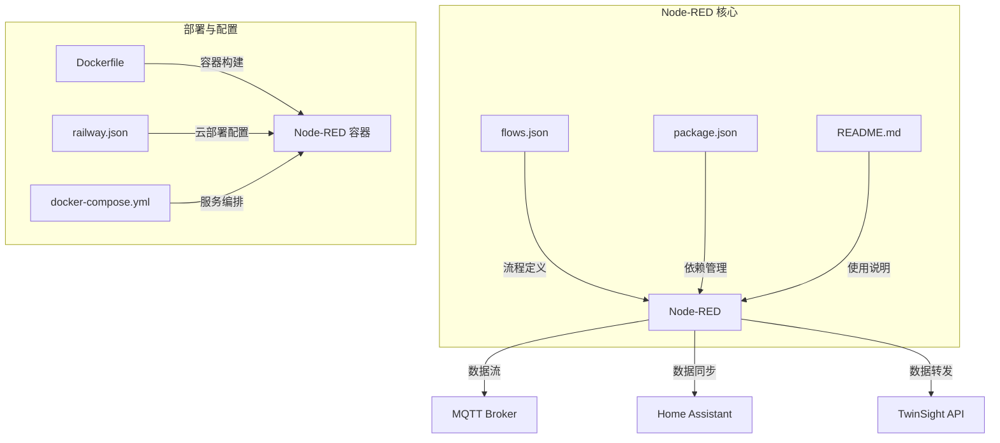
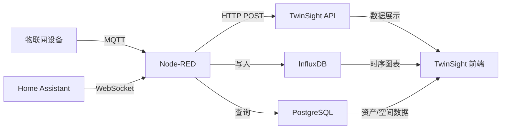
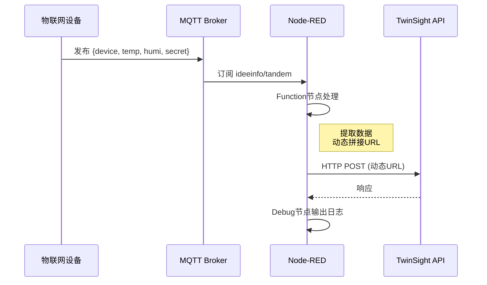
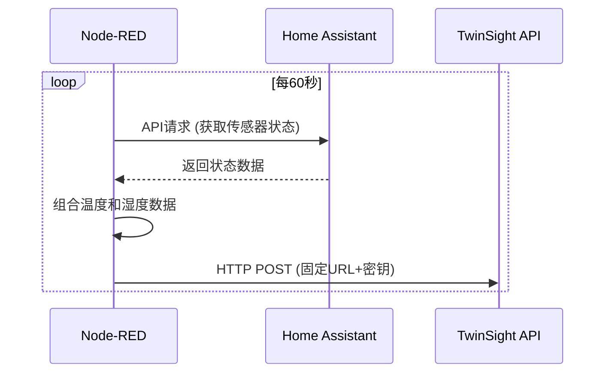
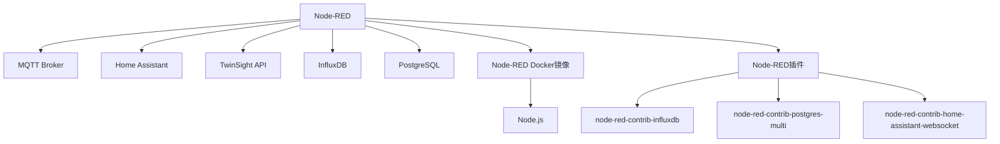

# Node-RED集成

<cite>
**本文档中引用的文件**   
- [flows.json](file://nodered/flows.json)
- [README.md](file://nodered/README.md)
- [package.json](file://nodered/package.json)
- [Dockerfile](file://services/node-red/Dockerfile)
- [railway.json](file://services/node-red/railway.json)
- [docker-compose.yml](file://docker-compose.yml)
- [CLOUD_DEPLOYMENT_GUIDE.md](file://CLOUD_DEPLOYMENT_GUIDE.md)
</cite>

## 目录
1. [简介](#简介)
2. [项目结构](#项目结构)
3. [核心组件](#核心组件)
4. [架构概述](#架构概述)
5. [详细组件分析](#详细组件分析)
6. [依赖分析](#依赖分析)
7. [性能考虑](#性能考虑)
8. [故障排除指南](#故障排除指南)
9. [结论](#结论)

## 简介
本文档详细记录了Node-RED在TwinSight系统中的集成与应用。Node-RED作为可视化流程编程工具，承担着物联网数据采集、处理和转发的核心职责。它通过MQTT协议接收来自设备的实时数据（如温度、湿度），利用Function节点进行数据处理和URL动态拼接，最终通过HTTP Request节点将时序数据安全地转发至TwinSight后端API。同时，Node-RED集成了Home Assistant API，用于获取本地智能家居传感器的状态，并将其同步到TwinSight平台，实现物理世界与数字孪生体的数据联动。本文档将深入分析其数据流、配置细节和部署方法。

## 项目结构
Node-RED相关的文件和配置主要位于`nodered/`和`services/node-red/`目录下，其结构清晰，职责分明。



**Diagram sources**
- [flows.json](file://nodered/flows.json)
- [Dockerfile](file://services/node-red/Dockerfile)
- [docker-compose.yml](file://docker-compose.yml)

**Section sources**
- [flows.json](file://nodered/flows.json)
- [README.md](file://nodered/README.md)
- [package.json](file://nodered/package.json)
- [Dockerfile](file://services/node-red/Dockerfile)
- [railway.json](file://services/node-red/railway.json)
- [docker-compose.yml](file://docker-compose.yml)

## 核心组件
Node-RED的核心功能由`flows.json`文件中的节点流程定义，主要包括MQTT输入、数据处理、HTTP请求和Home Assistant集成四大模块。`README.md`文件提供了详细的使用指南和最佳实践。

**Section sources**
- [flows.json](file://nodered/flows.json)
- [README.md](file://nodered/README.md)

## 架构概述
Node-RED在TwinSight系统中扮演着数据枢纽的角色，连接着物联网设备、智能家居平台和后端服务。



**Diagram sources**
- [flows.json](file://nodered/flows.json)
- [README.md](file://nodered/README.md)
- [docker-compose.yml](file://docker-compose.yml)

## 详细组件分析
本节将深入分析Node-RED流程中的关键组件，揭示其内部工作原理。

### 数据流分析
Node-RED实现了两条主要的数据流：一条是接收外部设备数据并转发至TwinSight，另一条是主动从Home Assistant获取数据并同步。

#### 设备数据接收与转发流程
该流程处理通过MQTT协议发送的设备数据。



**Diagram sources**
- [flows.json](file://nodered/flows.json#L87-L150)

#### Home Assistant数据同步流程
该流程定期轮询Home Assistant，获取传感器状态并同步到TwinSight。



**Diagram sources**
- [flows.json](file://nodered/flows.json#L201-L340)
- [flows.json](file://nodered/flows.json#L360-L498)

### 配置细节分析
#### MQTT Broker配置
Node-RED已配置连接到公共的EMQX MQTT Broker，用于接收设备数据。

**配置参数：**
- **Broker地址**: `broker.emqx.io`
- **端口**: `1883`
- **协议版本**: `MQTT 3.1.1`
- **消息主题**: `ideeinfo/tandem`
- **QoS**: `2` (确保消息至少被传递一次)

此配置允许任何在该主题下发布JSON格式数据的设备都能被系统接收。

**Section sources**
- [flows.json](file://nodered/flows.json#L26-L55)

#### 数据处理与URL拼接
Function节点是数据处理的核心，它执行以下关键操作：
1.  **安全检查**: 验证消息中是否包含`device`字段，若无则丢弃。
2.  **数据提取**: 从`msg.payload`中提取`device`、`temperature`、`humidity`和`secret`。
3.  **URL动态拼接**: 使用提取的`secret`和固定的`modelUrn`，拼接出完整的TwinSight API URL。
4.  **负载重构**: 将数据格式化为TwinSight API所需的`{temp, humi}`结构。

此设计确保了数据传输的安全性（通过Secret认证）和灵活性（支持多个设备）。

**Section sources**
- [flows.json](file://nodered/flows.json#L133-L149)

#### Home Assistant API集成
Node-RED通过`node-red-contrib-home-assistant-websocket`插件与Home Assistant集成。流程中使用`api-current-state`节点来获取指定传感器的当前状态。

**集成特点：**
- **实体ID**: 流程中明确指定了要获取的传感器，如`sensor.rf01_temperature`和`sensor.10_temperature`。
- **定时触发**: 使用`inject`节点每60秒触发一次，实现周期性数据同步。
- **数据组合**: 两个独立的`api-current-state`节点分别获取温度和湿度，然后组合成一个完整的数据对象。

**Section sources**
- [flows.json](file://nodered/flows.json#L231-L317)
- [flows.json](file://nodered/flows.json#L389-L474)
- [package.json](file://nodered/package.json)

## 依赖分析
Node-RED的正常运行依赖于多个外部服务和内部配置。



**Diagram sources**
- [flows.json](file://nodered/flows.json)
- [package.json](file://nodered/package.json)
- [docker-compose.yml](file://docker-compose.yml)

**Section sources**
- [package.json](file://nodered/package.json)
- [docker-compose.yml](file://docker-compose.yml)

## 性能考虑
Node-RED作为一个轻量级的流程引擎，其性能主要受以下因素影响：
- **流程复杂度**: 复杂的Function节点逻辑会增加处理延迟。
- **外部服务响应**: HTTP请求和API调用的响应时间是主要瓶颈。
- **消息频率**: 高频的MQTT消息可能导致Node-RED处理不过来。

建议通过`debug`节点监控流程执行时间，并在生产环境中对关键流程进行压力测试。

## 故障排除指南
当Node-RED集成出现问题时，可按以下步骤排查：

1.  **检查Node-RED容器状态**:
    ```bash
    docker ps | grep nodered
    ```
    确保容器处于`Up`状态。

2.  **查看Node-RED日志**:
    ```bash
    docker logs mynodered
    ```
    检查是否有错误信息，特别是`node.error()`输出。

3.  **验证MQTT连接**:
    在Node-RED编辑器中，检查MQTT输入节点的连接状态（通常在节点右上角有连接指示灯）。

4.  **检查Function节点逻辑**:
    查看`debug`节点的输出，确认数据是否按预期被处理。特别注意`secret`字段是否缺失。

5.  **测试HTTP请求**:
    检查HTTP Request节点的返回状态码。`401`表示认证失败，`404`表示URL错误。

6.  **验证Home Assistant连接**:
    确保Home Assistant服务正常运行，并且Node-RED使用的API Token有效。

**Section sources**
- [flows.json](file://nodered/flows.json)
- [README.md](file://nodered/README.md)

## 结论
Node-RED成功地将TwinSight系统与外部物联网设备和智能家居平台集成在一起。通过其直观的可视化编程界面，实现了复杂的数据流处理逻辑，包括安全的数据接收、灵活的URL拼接和跨平台的数据同步。其基于Docker的部署方式保证了环境的一致性和可移植性。未来可以进一步优化，例如将定时轮询改为事件驱动，或增加更复杂的数据验证和告警机制。