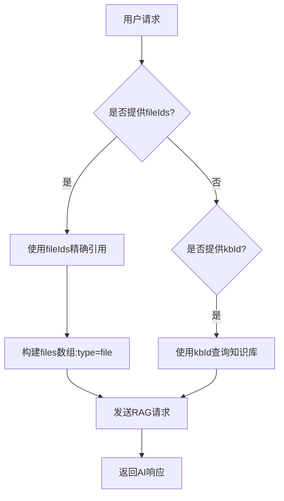
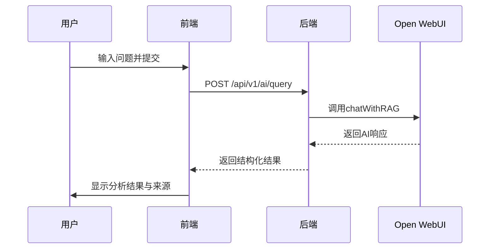
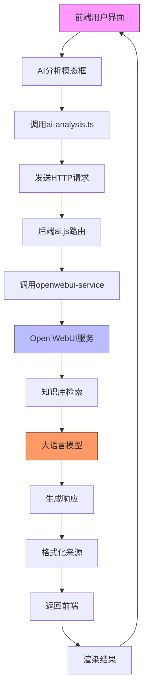

# AI问答与RAG查询

<cite>
**本文档引用文件**  
- [ai.js](file://server/routes/v1/ai.js)
- [openwebui-service.js](file://server/services/openwebui-service.js)
- [openwebui-config.js](file://server/config/openwebui-config.js)
- [ai-analysis.js](file://server/routes/ai-analysis.js)
- [AIAnalysisModal.vue](file://src/components/viewer/AIAnalysisModal.vue)
- [ai-analysis.ts](file://src/services/ai-analysis.ts)
</cite>

## 目录
1. [简介](#简介)
2. [核心功能解析](#核心功能解析)
3. [RAG查询实现机制](#rag查询实现机制)
4. [请求体构造方式](#请求体构造方式)
5. [模型选择机制](#模型选择机制)
6. [调用示例](#调用示例)
7. [应用场景](#应用场景)
8. [常见问题与调试建议](#常见问题与调试建议)
9. [系统集成与流程图](#系统集成与流程图)

## 简介
`chatWithRAG`函数是本系统中实现基于知识库的AI问答功能的核心组件。该功能通过集成Open WebUI服务，支持从特定文件或整个知识库集合中检索信息，并结合大语言模型生成智能回复。系统支持两种查询模式：通过`fileIds`精确引用特定文件内容，或通过`kbId`查询整个知识库。此文档将深入解析其工作原理、调用方式、配置机制及实际应用场景。

## 核心功能解析
`chatWithRAG`函数提供了基于检索增强生成（Retrieval-Augmented Generation, RAG）的智能问答能力，允许用户在提问时结合特定知识库或文件内容获取更准确的回答。该功能主要由后端服务`openwebui-service.js`中的`chatWithRAG`方法实现，并通过`ai.js`路由暴露为REST API接口。

该功能的关键特性包括：
- 支持多格式文档（PDF、DOCX、PPTX、XLSX、MD、TXT等）
- 可同时使用精确文件引用和知识库集合查询
- 自动处理文件上传、解析与向量化
- 支持来源追踪与文档链接跳转
- 与前端AI分析模态框无缝集成

**本节来源**  
- [openwebui-service.js](file://server/services/openwebui-service.js#L257-L310)
- [ai.js](file://server/routes/v1/ai.js#L199-L232)

## RAG查询实现机制
`chatWithRAG`函数支持两种查询模式，分别适用于不同精度需求的场景：

### 精确文件引用模式（fileIds）
当用户提供`fileIds`数组时，系统会优先使用这些具体文件ID进行精确内容检索。此模式适用于需要针对特定文档进行问答的场景，例如查阅某份设备手册的具体参数。



### 知识库集合查询模式（kbId）
当仅提供`kbId`时，系统将查询整个知识库集合中的相关内容。此模式适用于广义的知识检索，例如了解某一类设备的通用维护流程。

### 混合模式
系统支持同时提供`fileIds`和`kbId`，实现精确引用与广义检索的结合。在这种模式下，`fileIds`具有更高优先级，确保关键文档内容被优先考虑。

**本节来源**  
- [openwebui-service.js](file://server/services/openwebui-service.js#L278-L296)
- [ai.js](file://server/routes/v1/ai.js#L207-L225)

## 请求体构造方式
RAG查询的请求体采用标准JSON格式，包含以下关键字段：

### 消息历史（messages）
`messages`数组用于组织对话历史，当前仅支持单条用户消息。每条消息包含角色（role）和内容（content）两个属性。

```json
{
  "messages": [
    {
      "role": "user",
      "content": "请解释该设备的安装步骤"
    }
  ]
}
```

### 文件数组（files）
`files`数组用于指定检索范围，支持两种类型：

- **file类型**：通过`fileIds`精确引用特定文件
- **collection类型**：通过`kbId`查询整个知识库

```json
{
  "files": [
    {
      "type": "file",
      "id": "file-123"
    },
    {
      "type": "collection",
      "id": "kb-456"
    }
  ]
}
```

### 完整请求示例
```json
{
  "prompt": "如何维护该设备？",
  "kbId": "kb-789",
  "fileIds": ["file-123", "file-456"],
  "allowWebSearch": true
}
```

**本节来源**  
- [openwebui-service.js](file://server/services/openwebui-service.js#L268-L301)
- [ai-analysis.js](file://server/routes/ai-analysis.js#L454-L460)

## 模型选择机制
系统采用灵活的模型选择机制，默认使用配置文件中指定的`defaultModel`。该机制通过以下方式实现：

### 默认模型配置
在`openwebui-config.js`中定义了默认模型：
```javascript
defaultModel: 'gemini-2.0-flash'
```

### 运行时模型覆盖
调用者可以在请求中通过`model`参数覆盖默认模型，实现针对不同场景的优化：
```javascript
const result = await chatWithRAG({
    prompt,
    kbId,
    model: 'models/gemini-2.5-flash' // 覆盖默认模型
});
```

### 配置动态加载
系统采用getter方式动态读取环境变量，确保配置在运行时生效，避免了ES Modules静态导入时环境变量未加载的问题。

**本节来源**  
- [openwebui-config.js](file://server/config/openwebui-config.js#L47)
- [openwebui-service.js](file://server/services/openwebui-service.js#L262)

## 调用示例
以下为RAG查询的典型调用示例：

### 后端调用示例
```javascript
const result = await chatWithRAG({
    prompt: "请说明该设备的故障排除步骤",
    kbId: "kb-789",
    fileIds: ["file-123"],
    model: "gemini-2.0-flash"
});
```

### 前端调用流程
1. 用户在AI分析模态框中输入问题
2. 前端收集上下文信息（房间、设备、文档）
3. 调用`/api/v1/ai/query`接口
4. 处理响应并显示结果



### 响应处理
响应结果包含AI生成的文本和引用来源，前端通过`AIAnalysisModal.vue`组件进行渲染，支持点击来源链接跳转至文档预览。

**本节来源**  
- [ai-analysis.js](file://server/routes/ai-analysis.js#L454-L460)
- [AIAnalysisModal.vue](file://src/components/viewer/AIAnalysisModal.vue#L31)
- [ai-analysis.ts](file://src/services/ai-analysis.ts#L51-L63)

## 应用场景
该RAG查询功能在系统中有多种实际应用场景：

### 文档智能检索
用户可通过自然语言查询技术文档内容，例如：
- "查找空调机组的安装规范"
- "显示水泵的维护周期"

### 设备手册问答
针对特定设备进行问答，结合`fileIds`精确引用：
- "该型号变压器的额定电压是多少？"
- "如何更换此设备的过滤器？"

### 故障诊断辅助
结合实时数据与知识库进行智能分析：
- "温度报警时可能的原因有哪些？"
- "压力异常的处理步骤是什么？"

### 培训与知识传承
新员工可通过问答方式快速获取专业知识：
- "日常巡检需要检查哪些项目？"
- "安全操作规程有哪些要点？"

**本节来源**  
- [AIAnalysisModal.vue](file://src/components/viewer/AIAnalysisModal.vue)
- [ai-analysis.js](file://server/routes/ai-analysis.js#L69-L85)

## 常见问题与调试建议
在使用RAG查询功能时可能遇到以下问题：

### 知识库为空
**现象**：查询返回结果不包含预期内容  
**原因**：知识库未正确同步文档  
**解决方案**：
1. 检查知识库是否已创建
2. 手动触发同步操作
3. 验证文档格式是否支持

### 文件未完成处理
**现象**：新上传文件无法被检索到  
**原因**：Open WebUI需要时间处理文件内容  
**解决方案**：
1. 等待处理完成（系统会轮询检查状态）
2. 实现处理完成通知机制
3. 在前端显示处理进度

### 模型响应延迟
**现象**：查询响应时间过长  
**原因**：模型推理或网络延迟  
**解决方案**：
1. 优化模型选择（使用轻量级模型）
2. 实现超时重试机制
3. 添加加载状态提示

### 调试建议
1. 启用详细日志记录
2. 检查Open WebUI服务健康状态
3. 验证API密钥配置
4. 使用`/api/v1/ai/health`接口进行健康检查

**本节来源**  
- [openwebui-service.js](file://server/services/openwebui-service.js#L186-L214)
- [ai.js](file://server/routes/v1/ai.js#L19-L32)
- [openwebui-service.js](file://server/services/openwebui-service.js#L66-L74)

## 系统集成与流程图
以下流程图展示了RAG查询功能在整个系统中的集成方式：



该功能通过清晰的分层架构实现了前后端分离，确保了系统的可维护性和扩展性。

**图表来源**  
- [ai-analysis.ts](file://src/services/ai-analysis.ts)
- [ai.js](file://server/routes/v1/ai.js)
- [openwebui-service.js](file://server/services/openwebui-service.js)

**本节来源**  
- [ai-analysis.ts](file://src/services/ai-analysis.ts#L51-L63)
- [ai.js](file://server/routes/v1/ai.js#L199-L232)
- [openwebui-service.js](file://server/services/openwebui-service.js#L257-L310)