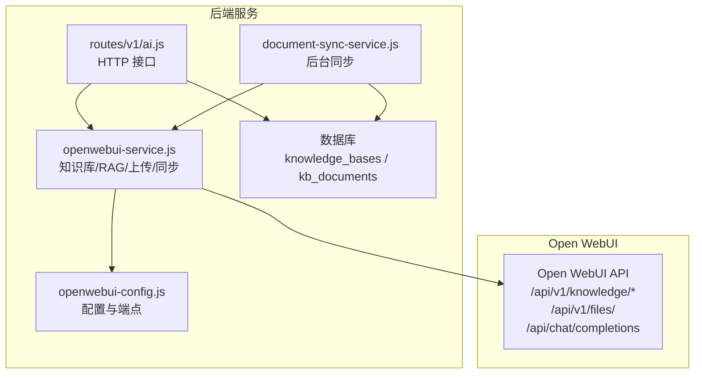
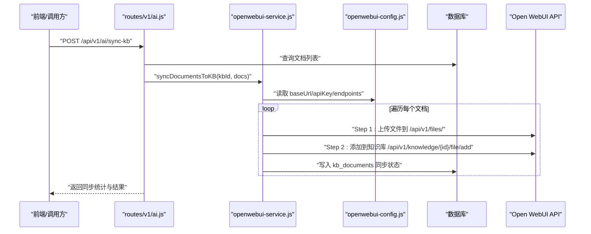
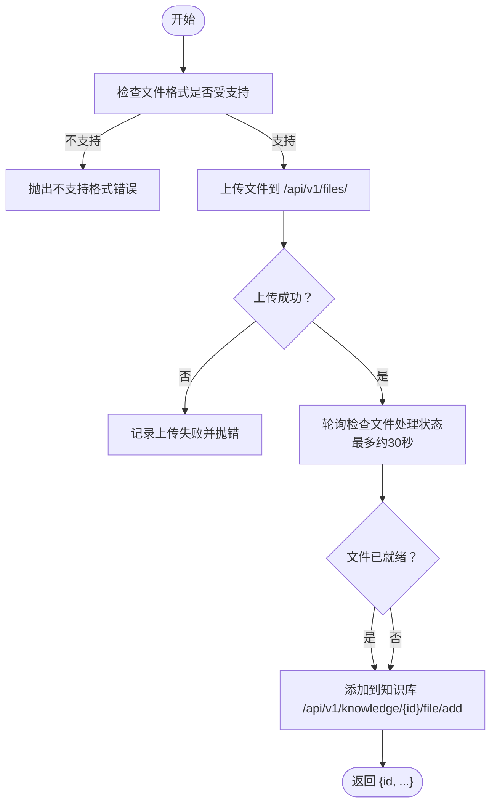
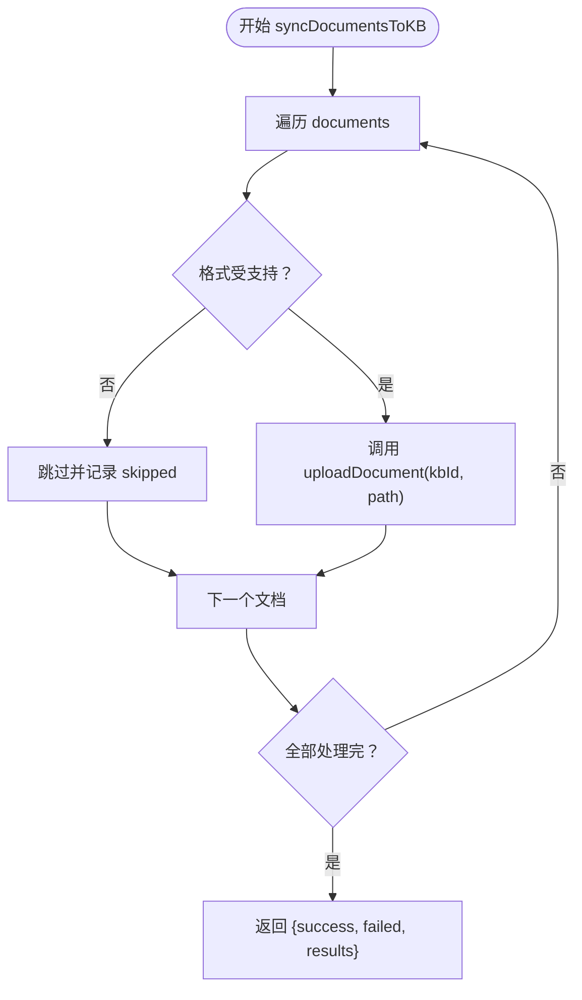
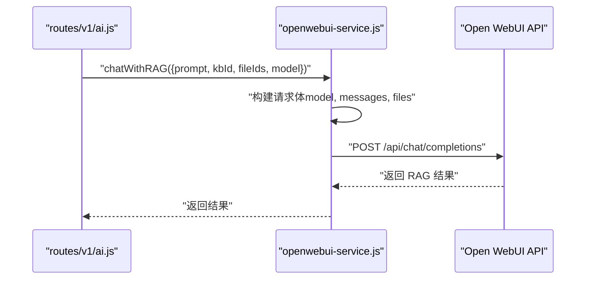
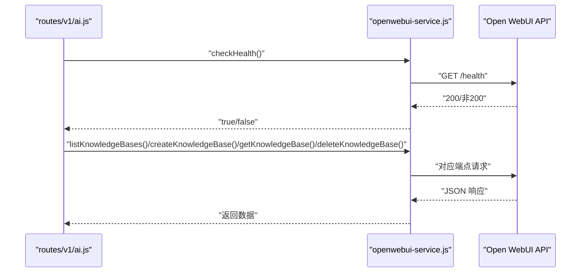
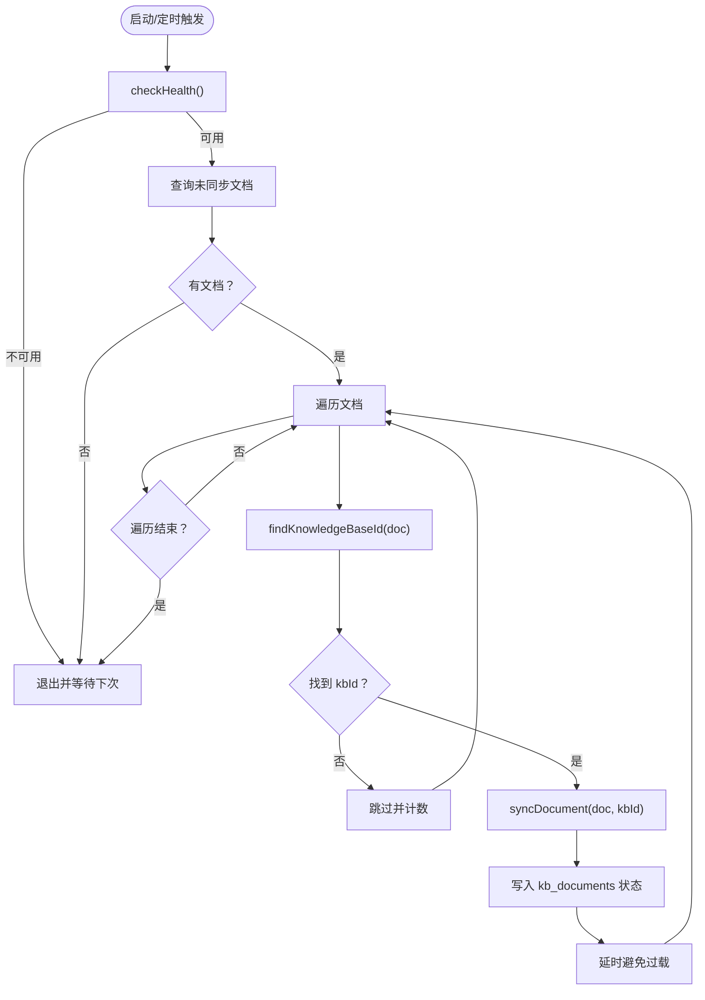
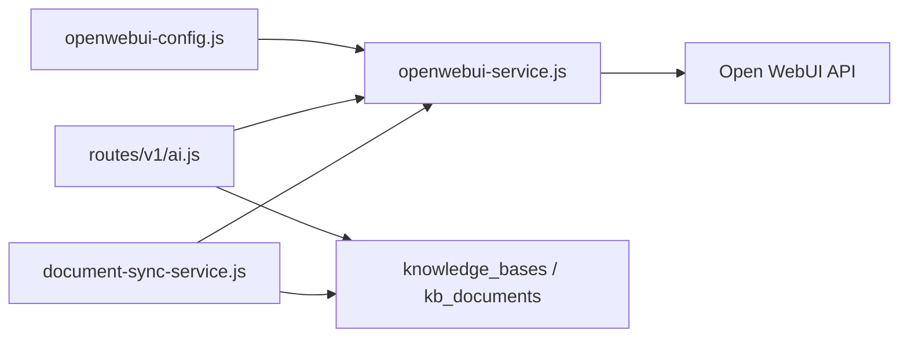

# Open WebUI知识库同步

<cite>
**本文引用的文件**
- [openwebui-service.js](file://server/services/openwebui-service.js)
- [openwebui-config.js](file://server/config/openwebui-config.js)
- [ai.js](file://server/routes/v1/ai.js)
- [document-sync-service.js](file://server/services/document-sync-service.js)
- [create-knowledge-base-tables.js](file://server/scripts/create-knowledge-base-tables.js)
- [init-all.sql](file://server/db/init-all.sql)
- [.env](file://.env)
- [server/.env](file://server/.env)
</cite>

## 目录
1. [简介](#简介)
2. [项目结构](#项目结构)
3. [核心组件](#核心组件)
4. [架构总览](#架构总览)
5. [详细组件分析](#详细组件分析)
6. [依赖分析](#依赖分析)
7. [性能考虑](#性能考虑)
8. [故障排查指南](#故障排查指南)
9. [结论](#结论)
10. [附录](#附录)

## 简介
本文件系统性记录 TwinSight 后端与 Open WebUI 的知识库集成与文档同步机制，重点覆盖以下方面：
- 上传文档到知识库的两步流程：先上传至 Open WebUI 文件系统，再添加到指定知识库
- 批量同步功能：文件格式校验、异步处理与错误恢复
- 基于知识库的 RAG 问答：支持精确文件引用与知识库集合查询
- 健康检查与知识库管理能力
- 配置 Open WebUI 基础 URL 与 API 密钥的方法

## 项目结构
围绕 Open WebUI 知识库与 RAG 的关键代码分布如下：
- 服务层：封装 Open WebUI API 调用、健康检查、知识库管理、文档上传与批量同步
- 配置层：集中管理 Open WebUI 基础 URL、API 密钥、端点、支持格式等
- 路由层：对外暴露知识库创建、文档同步、RAG 查询等 HTTP 接口
- 数据层：知识库映射与同步状态持久化，支持后台自动同步

图表来源
- [openwebui-service.js](file://server/services/openwebui-service.js#L1-L359)
- [openwebui-config.js](file://server/config/openwebui-config.js#L1-L56)
- [ai.js](file://server/routes/v1/ai.js#L1-L262)
- [document-sync-service.js](file://server/services/document-sync-service.js#L1-L250)

章节来源
- [openwebui-service.js](file://server/services/openwebui-service.js#L1-L359)
- [openwebui-config.js](file://server/config/openwebui-config.js#L1-L56)
- [ai.js](file://server/routes/v1/ai.js#L1-L262)
- [document-sync-service.js](file://server/services/document-sync-service.js#L1-L250)

## 核心组件
- Open WebUI 服务封装：统一请求、健康检查、知识库 CRUD、文件上传、RAG 查询、批量同步
- 配置中心：动态读取基础 URL 与 API 密钥，定义端点与支持格式
- 路由接口：对外提供知识库管理、手动同步、RAG 查询等 API
- 后台同步服务：按规则自动扫描未同步文档并写入知识库，记录同步状态

章节来源
- [openwebui-service.js](file://server/services/openwebui-service.js#L1-L359)
- [openwebui-config.js](file://server/config/openwebui-config.js#L1-L56)
- [ai.js](file://server/routes/v1/ai.js#L1-L262)
- [document-sync-service.js](file://server/services/document-sync-service.js#L1-L250)

## 架构总览
整体交互流程：
- 前端或业务逻辑调用后端路由
- 路由层协调数据库与服务层
- 服务层通过配置中心读取 Open WebUI 基础 URL 与 API 密钥
- 服务层调用 Open WebUI API 完成知识库管理、文件上传与 RAG 查询
- 同步状态写回数据库，便于追踪与恢复

图表来源
- [ai.js](file://server/routes/v1/ai.js#L84-L192)
- [openwebui-service.js](file://server/services/openwebui-service.js#L138-L237)
- [openwebui-config.js](file://server/config/openwebui-config.js#L1-L56)

## 详细组件分析

### 组件A：上传文档到知识库（两步操作）
- 第一步：将文件上传至 Open WebUI 文件系统
  - 使用 Node 原生 File 与 FormData，构造 multipart 请求
  - 通过 Authorization Bearer 传递 API 密钥
  - 成功后返回文件 ID
- 第二步：将文件添加到指定知识库
  - 调用知识库文件添加端点，传入 file_id
  - 返回添加结果，包含最终的文档标识
- 文件处理等待与容错
  - 上传后轮询检查文件状态，最多等待约 30 秒
  - 若超时仍继续添加到知识库，保证流程可推进

图表来源
- [openwebui-service.js](file://server/services/openwebui-service.js#L138-L237)

章节来源
- [openwebui-service.js](file://server/services/openwebui-service.js#L138-L237)

### 组件B：批量同步到知识库（格式校验、异步与错误恢复）
- 输入：目标知识库 ID 与文档数组（包含 id 与本地路径）
- 流程：
  - 遍历文档，先做格式校验
  - 对支持格式的文档，调用上传函数完成两步操作
  - 记录每条文档的同步结果（成功/失败/跳过）
  - 异常捕获并记录，避免中断后续文档处理
- 输出：统计总数、成功数、失败数与明细结果

图表来源
- [openwebui-service.js](file://server/services/openwebui-service.js#L312-L345)

章节来源
- [openwebui-service.js](file://server/services/openwebui-service.js#L312-L345)

### 组件C：基于知识库的 RAG 问答（精确文件引用与集合查询）
- 支持两种输入：
  - 精确文件引用：通过 fileIds 指定具体文件 ID
  - 知识库集合查询：通过 kbId 指定知识库（Collection Tag 或 UUID）
- 请求体构建：
  - 必填字段：model、messages（用户问题）
  - 可选字段：files（数组，包含 file 与 collection 两类）
- 返回：Open WebUI 的聊天补全响应

图表来源
- [ai.js](file://server/routes/v1/ai.js#L194-L232)
- [openwebui-service.js](file://server/services/openwebui-service.js#L248-L310)

章节来源
- [ai.js](file://server/routes/v1/ai.js#L194-L232)
- [openwebui-service.js](file://server/services/openwebui-service.js#L248-L310)

### 组件D：健康检查与知识库管理
- 健康检查：访问 /health，判断 Open WebUI 服务连通性
- 知识库管理：
  - 列出知识库：GET /api/v1/knowledge/
  - 创建知识库：POST /api/v1/knowledge/create
  - 获取知识库详情：GET /api/v1/knowledge/{id}
  - 删除知识库：DELETE /api/v1/knowledge/{id}/delete

图表来源
- [ai.js](file://server/routes/v1/ai.js#L1-L47)
- [openwebui-service.js](file://server/services/openwebui-service.js#L63-L125)

章节来源
- [ai.js](file://server/routes/v1/ai.js#L1-L47)
- [openwebui-service.js](file://server/services/openwebui-service.js#L63-L125)

### 组件E：后台自动同步服务
- 触发条件：定时任务或手动触发
- 流程：
  - 健康检查：确保 Open WebUI 可用
  - 查询未同步文档：按类型过滤并限制数量
  - 为每个文档查找对应知识库 ID（依据资产/空间/模型文件）
  - 调用同步函数，记录成功或失败状态
  - 控制请求频率，避免过载
- 数据持久化：kb_documents 记录同步状态、错误信息与时间戳

图表来源
- [document-sync-service.js](file://server/services/document-sync-service.js#L153-L217)
- [document-sync-service.js](file://server/services/document-sync-service.js#L93-L151)

章节来源
- [document-sync-service.js](file://server/services/document-sync-service.js#L1-L250)

## 依赖分析
- 服务层依赖配置中心，动态读取 Open WebUI 基础 URL 与 API 密钥
- 路由层依赖服务层与数据库，负责对外接口与状态落库
- 后台同步服务依赖服务层与数据库，负责自动维护知识库内容
- 数据库层面提供知识库映射与同步状态表，支撑查询与恢复

图表来源
- [openwebui-config.js](file://server/config/openwebui-config.js#L1-L56)
- [openwebui-service.js](file://server/services/openwebui-service.js#L1-L359)
- [ai.js](file://server/routes/v1/ai.js#L1-L262)
- [document-sync-service.js](file://server/services/document-sync-service.js#L1-L250)

章节来源
- [openwebui-config.js](file://server/config/openwebui-config.js#L1-L56)
- [openwebui-service.js](file://server/services/openwebui-service.js#L1-L359)
- [ai.js](file://server/routes/v1/ai.js#L1-L262)
- [document-sync-service.js](file://server/services/document-sync-service.js#L1-L250)

## 性能考虑
- 上传与添加知识库之间存在轮询等待，建议根据文件大小与处理负载调整等待策略
- 批量同步时对每个文档增加延迟，避免并发过高导致 Open WebUI 压力过大
- 健康检查前置，减少无效请求
- 数据库索引与唯一约束有助于快速定位知识库与文档映射，提升查询效率

## 故障排查指南
- API 密钥未配置
  - 现象：请求直接抛错或返回 401/403
  - 处理：设置 OPENWEBUI_API_KEY 环境变量
- 基础 URL 配置错误
  - 现象：健康检查失败或端点 404
  - 处理：设置 OPENWEBUI_URL 环境变量
- 文件格式不受支持
  - 现象：上传前即被拒绝
  - 处理：确认扩展名在支持列表中
- 文件处理超时
  - 现象：轮询多次后仍未就绪
  - 处理：检查 Open WebUI 内部处理队列与资源；可重试或人工介入
- 同步失败记录
  - 现象：kb_documents 中出现 failed 状态与错误信息
  - 处理：查看错误原因并修复后重新触发同步

章节来源
- [openwebui-service.js](file://server/services/openwebui-service.js#L20-L61)
- [openwebui-config.js](file://server/config/openwebui-config.js#L9-L14)
- [document-sync-service.js](file://server/services/document-sync-service.js#L133-L149)

## 结论
本方案通过服务层统一封装 Open WebUI API，结合路由层与数据库，实现了从文档上传、批量同步到 RAG 查询的完整闭环。两步上传流程与格式校验保障了可靠性；后台同步服务降低了人工运维成本；精确文件引用与集合查询兼顾了灵活性与准确性。

## 附录

### 配置 Open WebUI 基础 URL 与 API 密钥
- 设置基础 URL
  - 在环境变量中设置 OPENWEBUI_URL，若未设置则默认 http://localhost:3080
- 设置 API 密钥
  - 在环境变量中设置 OPENWEBUI_API_KEY
- 示例位置
  - 项目根目录与 server 目录均包含示例 .env 文件，可参考其中 OPENWEBUI_API_KEY 的设置方式

章节来源
- [openwebui-config.js](file://server/config/openwebui-config.js#L9-L14)
- [.env](file://.env#L1-L6)
- [server/.env](file://server/.env#L1-L24)

### 数据库表结构（知识库与同步状态）
- knowledge_bases：存储模型文件与 Open WebUI 知识库的映射关系
- kb_documents：存储文档与知识库的同步状态、错误信息与时间戳
- 初始化脚本与 SQL 文件中包含表结构、索引与约束定义

章节来源
- [create-knowledge-base-tables.js](file://server/scripts/create-knowledge-base-tables.js#L1-L84)
- [init-all.sql](file://server/db/init-all.sql#L252-L285)