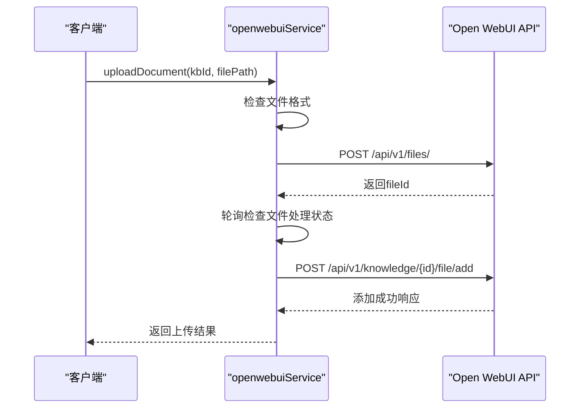
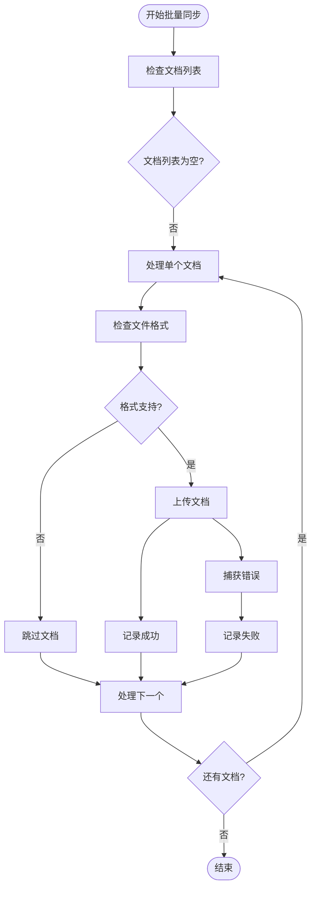
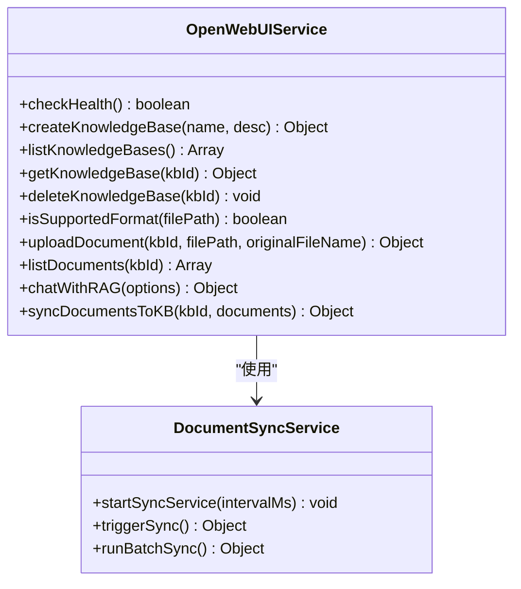
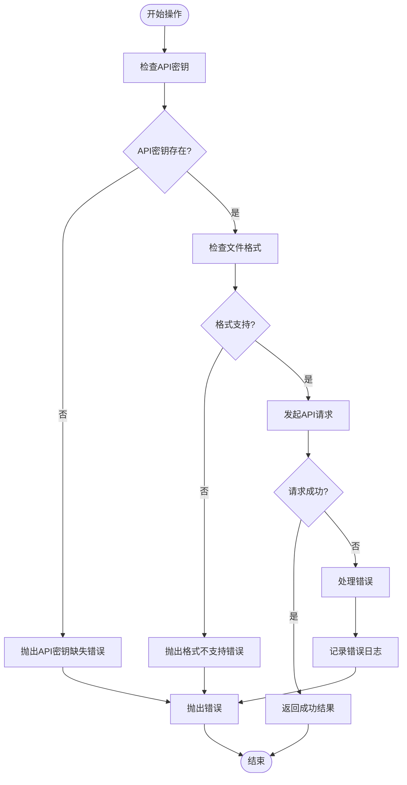

# 文档同步机制

<cite>
**本文档引用的文件**
- [openwebui-service.js](file://server/services/openwebui-service.js)
- [openwebui-config.js](file://server/config/openwebui-config.js)
- [document-sync-service.js](file://server/services/document-sync-service.js)
- [init-all.sql](file://server/db/init-all.sql)
- [create_documents_table.sql](file://server/db/create_documents_table.sql)
</cite>

## 目录
1. [文档上传两步操作](#文档上传两步操作)
2. [批量同步功能实现](#批量同步功能实现)
3. [文件处理状态轮询机制](#文件处理状态轮询机制)
4. [实际调用示例](#实际调用示例)
5. [常见问题处理策略](#常见问题处理策略)

## 文档上传两步操作

`openwebui-service.js`中的`uploadDocument`函数实现了文档上传的两步操作流程。第一步是通过POST请求将文件上传至Open WebUI的`/api/v1/files/`接口，获取返回的fileId；第二步是调用`/api/v1/knowledge/{id}/file/add`接口将文件添加到指定知识库。

在第一步中，函数首先检查文件格式是否支持，然后使用Node.js原生File API创建文件对象，并通过FormData构造上传请求。上传成功后，从响应中提取fileId。第二步中，使用获取到的fileId，向知识库添加文件的API端点发送POST请求，完成文件与知识库的关联。



**图表来源**
- [openwebui-service.js](file://server/services/openwebui-service.js#L146-L237)

**本节来源**
- [openwebui-service.js](file://server/services/openwebui-service.js#L146-L237)

## 批量同步功能实现

`syncDocumentsToKB`函数实现了批量同步文档到知识库的功能。该功能的实现逻辑包括遍历文档列表、格式校验、异步上传与错误捕获机制。

函数首先遍历传入的文档列表，对每个文档进行格式校验，只处理支持的文件格式。然后调用`uploadDocument`函数进行上传，成功则记录成功计数，失败则捕获错误并记录失败计数。整个过程采用顺序处理方式，确保每个文档的上传状态都能被准确跟踪。



**图表来源**
- [openwebui-service.js](file://server/services/openwebui-service.js#L318-L345)

**本节来源**
- [openwebui-service.js](file://server/services/openwebui-service.js#L318-L345)

## 文件处理状态轮询机制

文件上传后，系统会轮询检查处理状态，确保内容被成功解析和嵌入。该机制最多进行10次轮询，每次间隔3秒。

在`uploadDocument`函数中，上传文件后会立即开始轮询检查。通过调用`/api/v1/files/{fileId}`接口获取文件状态，检查响应中的`data.content`字段是否存在。如果在10次尝试内文件内容被成功处理，则停止轮询；否则继续执行后续步骤，即使处理可能仍在进行中。

```mermaid
stateDiagram-v2
[*] --> StartPolling
StartPolling --> WaitFor3s : 等待3秒
WaitFor3s --> CheckStatus : 检查文件状态
CheckStatus --> ContentExists{内容已处理?}
ContentExists --> |是| ProcessingComplete
ContentExists --> |否| IncrementCounter
IncrementCounter --> ReachLimit{达到10次?}
ReachLimit --> |否| WaitFor3s
ReachLimit --> |是| Timeout
ProcessingComplete --> [*]
Timeout --> [*]
```

**图表来源**
- [openwebui-service.js](file://server/services/openwebui-service.js#L185-L215)

**本节来源**
- [openwebui-service.js](file://server/services/openwebui-service.js#L185-L215)

## 实际调用示例

以下是调用这些方法进行单个和批量文档同步的实际代码示例：



**图表来源**
- [openwebui-service.js](file://server/services/openwebui-service.js#L66-L358)
- [document-sync-service.js](file://server/services/document-sync-service.js#L223-L248)

**本节来源**
- [openwebui-service.js](file://server/services/openwebui-service.js#L66-L358)
- [document-sync-service.js](file://server/services/document-sync-service.js#L223-L248)

## 常见问题处理策略

系统针对常见问题如文件格式不支持、API密钥缺失、网络超时等有相应的处理策略。

对于文件格式不支持的情况，`isSupportedFormat`函数会检查文件扩展名是否在支持列表中，如果不支持则直接抛出错误。API密钥缺失的情况在通用请求方法中处理，如果没有配置API密钥会抛出相应错误。网络超时和其他请求错误通过try-catch机制捕获，并在日志中记录详细的错误信息。



**图表来源**
- [openwebui-service.js](file://server/services/openwebui-service.js#L27-L60)
- [openwebui-service.js](file://server/services/openwebui-service.js#L147-L149)

**本节来源**
- [openwebui-service.js](file://server/services/openwebui-service.js#L27-L60)
- [openwebui-service.js](file://server/services/openwebui-service.js#L147-L149)