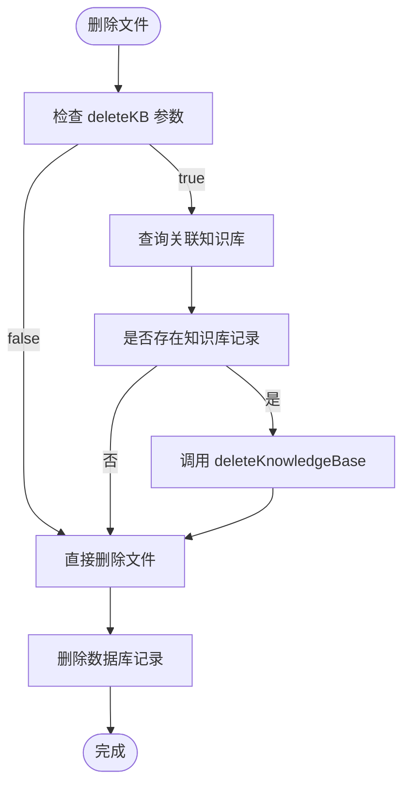

# 知识库管理

<cite>
**本文档引用的文件**  
- [openwebui-config.js](file://server/config/openwebui-config.js)
- [openwebui-service.js](file://server/services/openwebui-service.js)
- [ai.js](file://server/routes/v1/ai.js)
- [files.js](file://server/routes/files.js)
- [create-knowledge-base-tables.js](file://server/scripts/create-knowledge-base-tables.js)
</cite>

## 目录
1. [简介](#简介)
2. [知识库管理功能](#知识库管理功能)
3. [健康检查机制](#健康检查机制)
4. [文件格式支持判断](#文件格式支持判断)
5. [配置管理与最佳实践](#配置管理与最佳实践)
6. [系统集成与自动化流程](#系统集成与自动化流程)
7. [数据库结构](#数据库结构)
8. [错误处理与日志记录](#错误处理与日志记录)

## 简介
本文档全面记录Open WebUI知识库的管理功能，涵盖知识库的创建、查询、获取详情、删除等核心操作。详细说明各函数的参数要求、调用方式及返回结构。同时描述健康检查功能如何验证服务可用性，并解释文件格式支持判断逻辑。提供配置管理的最佳实践，确保系统安全性和可维护性。

## 知识库管理功能

Open WebUI知识库管理功能通过`openwebui-service.js`中的服务函数实现，主要包括创建、列出、获取详情和删除知识库等操作。

### 创建知识库 (`createKnowledgeBase`)

该函数用于在Open WebUI中创建新的知识库。

- **参数要求**：
  - `name` (字符串): 知识库名称（必填）
  - `description` (字符串): 知识库描述（可选，默认为空字符串）

- **调用方式**：
```javascript
const kb = await createKnowledgeBase("项目文档库", "存储所有项目相关文档");
```

- **返回结构**：
  返回包含知识库ID和其他元信息的JSON对象。

**Section sources**
- [openwebui-service.js](file://server/services/openwebui-service.js#L82-L96)

### 获取知识库列表 (`listKnowledgeBases`)

该函数用于获取所有已创建的知识库列表。

- **参数要求**：无
- **调用方式**：
```javascript
const kbs = await listKnowledgeBases();
```
- **返回结构**：返回知识库对象数组，每个对象包含ID、名称、描述等信息。

**Section sources**
- [openwebui-service.js](file://server/services/openwebui-service.js#L101-L105)

### 获取特定知识库详情 (`getKnowledgeBase`)

该函数用于获取指定ID的知识库详细信息。

- **参数要求**：
  - `kbId` (字符串): 知识库唯一标识符（必填）

- **调用方式**：
```javascript
const kb = await getKnowledgeBase("kb-12345");
```
- **返回结构**：返回单个知识库的完整信息对象。

**Section sources**
- [openwebui-service.js](file://server/services/openwebui-service.js#L111-L114)

### 删除知识库 (`deleteKnowledgeBase`)

该函数用于删除指定ID的知识库。

- **参数要求**：
  - `kbId` (字符串): 知识库唯一标识符（必填）

- **调用方式**：
```javascript
await deleteKnowledgeBase("kb-12345");
```
- **返回结构**：无返回值，成功则删除知识库，失败抛出异常。

**Section sources**
- [openwebui-service.js](file://server/services/openwebui-service.js#L119-L125)

## 健康检查机制

### 健康检查功能实现

`checkHealth`函数用于验证Open WebUI服务的可用性。


**Diagram sources**
- [openwebui-service.js](file://server/services/openwebui-service.js#L66-L74)

### 系统启动时的应用

在系统启动过程中，健康检查用于确认Open WebUI服务是否就绪：

1. 应用启动时立即执行健康检查
2. 如果检查失败，记录错误日志并继续启动流程
3. 提供降级机制，允许系统在AI功能不可用的情况下运行

### 定时任务中的应用

健康检查也用于定时监控任务中：

- 定期轮询Open WebUI服务状态
- 当检测到服务中断时触发告警
- 在自动同步文档前先验证服务可用性

**Section sources**
- [openwebui-service.js](file://server/services/openwebui-service.js#L66-L74)
- [ai.js](file://server/routes/v1/ai.js#L19-L32)

## 文件格式支持判断

### 格式判断逻辑 (`isSupportedFormat`)

`isSupportedFormat`函数根据文件扩展名判断是否支持RAG处理。


**Diagram sources**
- [openwebui-service.js](file://server/services/openwebui-service.js#L132-L134)

### 支持的格式定义

支持的格式由`openwebui-config.js`中`supportedFormats`数组定义：

- `.docx`, `.doc` - Word文档
- `.xlsx`, `.xls` - Excel表格
- `.pptx`, `.ppt` - PowerPoint演示文稿
- `.pdf` - PDF文件
- `.md` - Markdown文件
- `.txt` - 纯文本文件
- `.csv` - CSV文件
- `.json` - JSON文件

**Section sources**
- [openwebui-config.js](file://server/config/openwebui-config.js#L35-L44)

## 配置管理与最佳实践

### 配置项说明


**Diagram sources**
- [openwebui-config.js](file://server/config/openwebui-config.js#L6-L55)

### 最佳实践

#### 安全性最佳实践

1. **API密钥管理**：
   - 通过环境变量`OPENWEBUI_API_KEY`配置
   - 不在代码中硬编码密钥
   - 定期轮换API密钥

2. **基础URL配置**：
   - 使用环境变量`OPENWEBUI_URL`设置
   - 提供默认值`http://localhost:3080`用于开发

3. **运行时动态读取**：
   - 使用getter方法确保运行时读取最新环境变量
   - 避免模块加载时静态导入导致的配置问题

#### 可维护性最佳实践

1. **集中式配置**：所有Open WebUI相关配置集中在`openwebui-config.js`文件中
2. **清晰的端点定义**：通过`endpoints`对象统一管理API端点
3. **默认值设置**：为关键配置提供合理的默认值
4. **类型安全**：明确配置项的数据类型和结构

**Section sources**
- [openwebui-config.js](file://server/config/openwebui-config.js#L6-L55)

## 系统集成与自动化流程

### 模型文件上传时的自动创建

当上传新的模型文件时，系统会自动创建对应的知识库：


**Diagram sources**
- [files.js](file://server/routes/files.js#L38-L101)

### 文件删除时的级联删除

删除文件时可选择同时删除关联的知识库：



**Diagram sources**
- [files.js](file://server/routes/files.js#L406-L486)

## 数据库结构

### 知识库相关表

系统通过以下表存储知识库相关信息：


**Diagram sources**
- [create-knowledge-base-tables.js](file://server/scripts/create-knowledge-base-tables.js#L17-L70)

### 表结构说明

- `knowledge_bases`: 存储模型文件与Open WebUI知识库的映射关系
- `kb_documents`: 存储文档与知识库的同步状态
- 使用外键约束确保数据完整性
- 添加索引优化查询性能

**Section sources**
- [create-knowledge-base-tables.js](file://server/scripts/create-knowledge-base-tables.js#L12-L82)

## 错误处理与日志记录

### 统一错误处理

系统采用统一的错误处理机制：

- 所有API调用都包含try-catch块
- 详细的错误日志记录，包括状态码和错误信息
- 向客户端返回结构化的错误响应

### 日志级别与内容

- **调试日志**：记录配置状态、请求详情
- **错误日志**：记录失败的操作和异常信息
- **操作日志**：记录关键操作如创建、删除知识库

### 异常恢复策略

- 网络请求失败时提供重试机制
- 关键操作异步执行，不阻塞主流程
- 数据库操作失败时进行适当降级

**Section sources**
- [openwebui-service.js](file://server/services/openwebui-service.js#L44-L60)
- [files.js](file://server/routes/files.js#L429-L466)