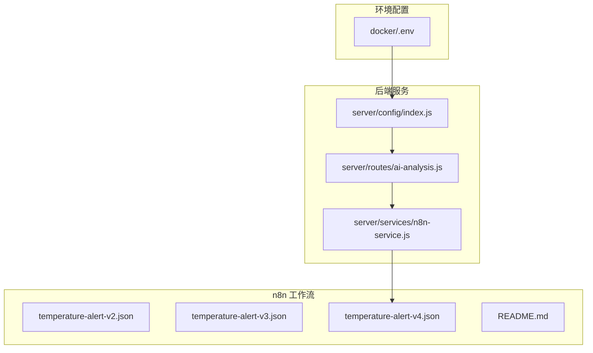
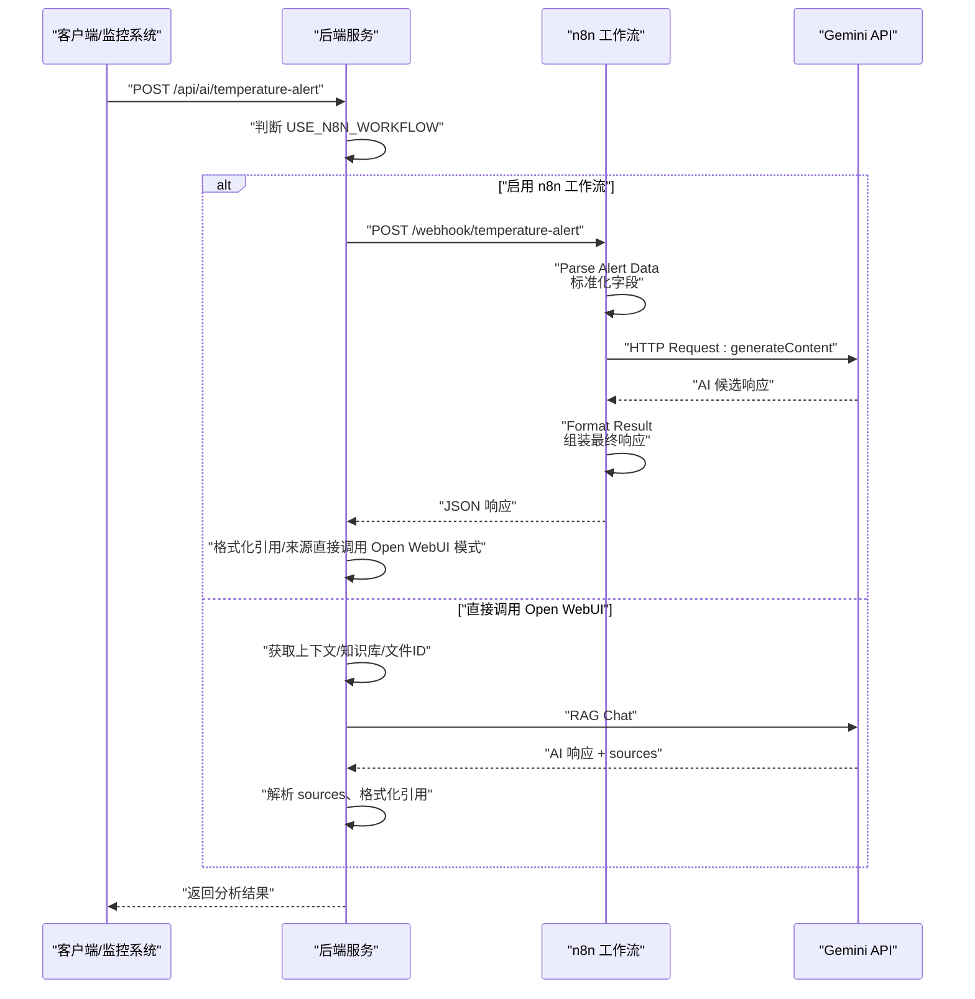
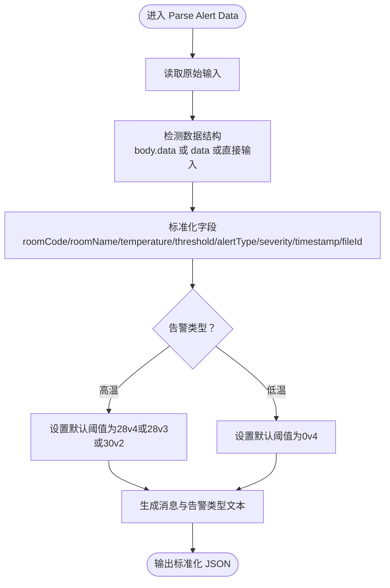
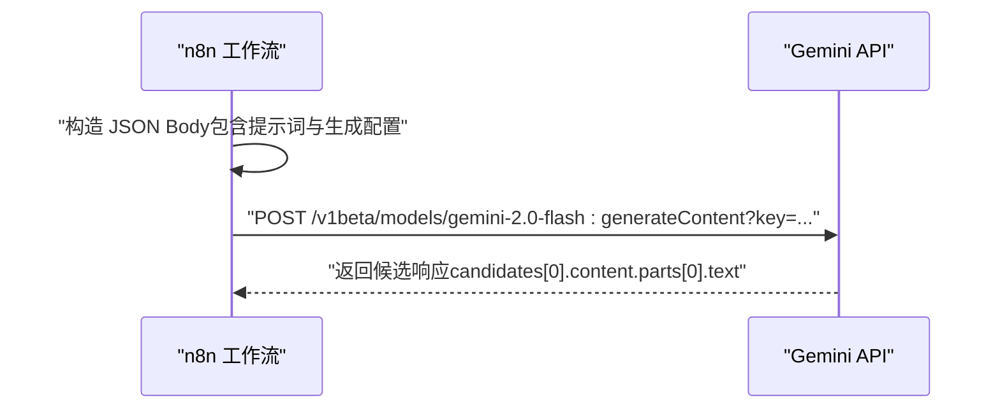
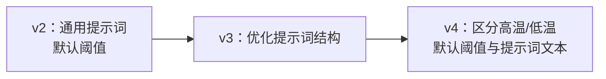
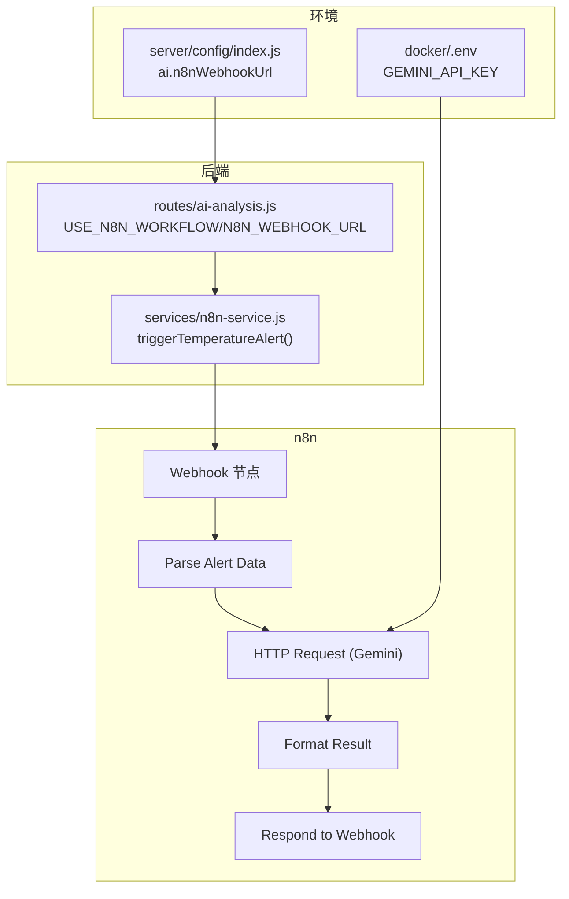

# n8n工作流定义

<cite>
**本文引用的文件**
- [n8n-workflows/temperature-alert-v2.json](file://n8n-workflows/temperature-alert-v2.json)
- [n8n-workflows/temperature-alert-v3.json](file://n8n-workflows/temperature-alert-v3.json)
- [n8n-workflows/temperature-alert-v4.json](file://n8n-workflows/temperature-alert-v4.json)
- [n8n-workflows/README.md](file://n8n-workflows/README.md)
- [server/services/n8n-service.js](file://server/services/n8n-service.js)
- [server/routes/ai-analysis.js](file://server/routes/ai-analysis.js)
- [server/config/index.js](file://server/config/index.js)
- [docker/.env](file://docker/.env)
</cite>

## 目录
1. [简介](#简介)
2. [项目结构](#项目结构)
3. [核心组件](#核心组件)
4. [架构总览](#架构总览)
5. [详细组件分析](#详细组件分析)
6. [依赖关系分析](#依赖关系分析)
7. [性能考量](#性能考量)
8. [故障排查指南](#故障排查指南)
9. [结论](#结论)
10. [附录](#附录)

## 简介
本文件面向开发者，深入解析 n8n 工作流仓库中温度告警分析工作流的定义，重点聚焦于 temperature-alert-v4.json 的完整执行流程。我们将逐节点拆解 Webhook、Function、HTTP Request、Gemini AI 等节点的职责与连接关系，说明从 Webhook 触发到数据解析、转换、调用 Gemini API 进行智能分析，再到最终响应的全过程。同时对比 v2 到 v4 版本的演进，解释为何引入更复杂的条件分支与错误处理机制，并提供在 n8n UI 中导入、修改与调试工作流的方法，以及如何配置 Gemini API 密钥等依赖服务，说明环境变量（如 N8N_WEBHOOK_URL）在工作流中的使用方式。

## 项目结构
n8n 工作流位于 n8n-workflows 目录，包含多个版本的工作流定义文件，以及一份说明文档。温度告警工作流的核心文件为 temperature-alert-v4.json，同时存在 v2、v3 的对照版本，便于理解演进过程。

**图表来源**
- [n8n-workflows/temperature-alert-v4.json](file://n8n-workflows/temperature-alert-v4.json#L1-L147)
- [server/routes/ai-analysis.js](file://server/routes/ai-analysis.js#L1-L120)
- [server/services/n8n-service.js](file://server/services/n8n-service.js#L1-L80)
- [server/config/index.js](file://server/config/index.js#L70-L93)
- [docker/.env](file://docker/.env#L1-L48)

**章节来源**
- [n8n-workflows/README.md](file://n8n-workflows/README.md#L1-L155)
- [n8n-workflows/temperature-alert-v4.json](file://n8n-workflows/temperature-alert-v4.json#L1-L147)

## 核心组件
- Webhook 节点：接收来自后端的温度告警触发请求，路径为 temperature-alert。
- Function 节点（Parse Alert Data）：解析输入数据，标准化字段（房间编码、房间名称、温度、阈值、告警类型、严重程度、时间戳、文件ID等），并区分高温/低温场景。
- HTTP Request 节点：向 Gemini API 发送生成内容请求，携带 Content-Type 与 JSON Body，Body 中包含结构化的提示词（Prompt）与生成配置。
- Function 节点（Format Result）：解析 Gemini 响应，提取候选文本，组装最终响应体（success、alert、analysis、processedAt）。
- Respond to Webhook 节点：将最终结果作为 JSON 响应返回给上游调用方。

上述组件在 v2、v3、v4 中保持一致的节点类型与连接关系，差异主要体现在数据解析逻辑与 Prompt 内容的细化。

**章节来源**
- [n8n-workflows/temperature-alert-v2.json](file://n8n-workflows/temperature-alert-v2.json#L1-L146)
- [n8n-workflows/temperature-alert-v3.json](file://n8n-workflows/temperature-alert-v3.json#L1-L147)
- [n8n-workflows/temperature-alert-v4.json](file://n8n-workflows/temperature-alert-v4.json#L1-L147)

## 架构总览
温度告警分析工作流的端到端流程如下：
- 后端服务在发生温度告警时，根据配置决定走 n8n 工作流模式或直接调用 Open WebUI。
- 若启用 n8n 工作流模式，后端通过 HTTP POST 调用 n8n 的 Webhook 路径，携带标准化的告警数据。
- n8n Webhook 接收请求后，依次经过数据解析、调用 Gemini API、格式化结果、返回响应。
- 最终，后端对 n8n 返回的结果进行来源解析与引用格式化（在直接调用 Open WebUI 模式下由后端完成）。

**图表来源**
- [server/routes/ai-analysis.js](file://server/routes/ai-analysis.js#L1-L120)
- [server/services/n8n-service.js](file://server/services/n8n-service.js#L1-L80)
- [n8n-workflows/temperature-alert-v4.json](file://n8n-workflows/temperature-alert-v4.json#L1-L147)

## 详细组件分析

### Webhook 节点
- 触发方式：HTTP POST
- 路径：temperature-alert
- 响应模式：responseNode（将后续节点的输出作为响应）
- 作用：接收来自后端的温度告警数据，作为工作流入口。

**章节来源**
- [n8n-workflows/temperature-alert-v2.json](file://n8n-workflows/temperature-alert-v2.json#L1-L40)
- [n8n-workflows/temperature-alert-v3.json](file://n8n-workflows/temperature-alert-v3.json#L1-L40)
- [n8n-workflows/temperature-alert-v4.json](file://n8n-workflows/temperature-alert-v4.json#L1-L40)

### Function 节点（Parse Alert Data）
- 功能：解析原始输入，兼容多种数据结构；区分告警类型（高温/低温）；计算严重程度；标准化输出字段（房间编码、房间名称、温度、阈值、告警类型、严重程度、时间戳、文件ID、消息等）。
- v4 新增：明确区分 alertType（high/low），并据此设置默认阈值与提示词中的告警类型文本，使提示词更具针对性。

**图表来源**
- [n8n-workflows/temperature-alert-v2.json](file://n8n-workflows/temperature-alert-v2.json#L20-L40)
- [n8n-workflows/temperature-alert-v3.json](file://n8n-workflows/temperature-alert-v3.json#L20-L40)
- [n8n-workflows/temperature-alert-v4.json](file://n8n-workflows/temperature-alert-v4.json#L20-L40)

**章节来源**
- [n8n-workflows/temperature-alert-v2.json](file://n8n-workflows/temperature-alert-v2.json#L20-L40)
- [n8n-workflows/temperature-alert-v3.json](file://n8n-workflows/temperature-alert-v3.json#L20-L40)
- [n8n-workflows/temperature-alert-v4.json](file://n8n-workflows/temperature-alert-v4.json#L20-L40)

### HTTP Request 节点（调用 Gemini API）
- 方法：POST
- URL：指向 Gemini 的 generateContent 接口，并通过环境变量注入 API Key。
- 请求头：Content-Type: application/json
- 请求体：包含 contents.parts.text（提示词）与 generationConfig（温度、最大输出令牌数）。
- v4 Prompt：根据告警类型（高温/低温）定制提示词，强调不同场景的原因分析与处置方案。

**图表来源**
- [n8n-workflows/temperature-alert-v4.json](file://n8n-workflows/temperature-alert-v4.json#L35-L60)

**章节来源**
- [n8n-workflows/temperature-alert-v2.json](file://n8n-workflows/temperature-alert-v2.json#L35-L60)
- [n8n-workflows/temperature-alert-v3.json](file://n8n-workflows/temperature-alert-v3.json#L35-L60)
- [n8n-workflows/temperature-alert-v4.json](file://n8n-workflows/temperature-alert-v4.json#L35-L60)

### Function 节点（Format Result）
- 功能：从上游节点读取标准化告警数据与 Gemini 响应，提取文本内容，组装最终响应体（success、alert、analysis、processedAt）。
- v2/v3/v4 逻辑一致，均包含对 candidates/content/parts 的健壮性处理与异常兜底。

**章节来源**
- [n8n-workflows/temperature-alert-v2.json](file://n8n-workflows/temperature-alert-v2.json#L60-L80)
- [n8n-workflows/temperature-alert-v3.json](file://n8n-workflows/temperature-alert-v3.json#L60-L80)
- [n8n-workflows/temperature-alert-v4.json](file://n8n-workflows/temperature-alert-v4.json#L60-L80)

### Respond to Webhook 节点
- 功能：将最终 JSON 响应返回给上游调用方（后端服务）。

**章节来源**
- [n8n-workflows/temperature-alert-v2.json](file://n8n-workflows/temperature-alert-v2.json#L75-L88)
- [n8n-workflows/temperature-alert-v3.json](file://n8n-workflows/temperature-alert-v3.json#L75-L88)
- [n8n-workflows/temperature-alert-v4.json](file://n8n-workflows/temperature-alert-v4.json#L75-L88)

### 版本演进对比（v2 → v3 → v4）
- v2：基础流程，提示词相对通用，阈值默认为 30（高温）或 28（低温）。
- v3：优化提示词结构，明确要求输出格式，增强可读性与一致性。
- v4：引入告警类型区分（高温/低温），分别设置默认阈值与提示词文本，使分析更具针对性；同时在数据解析阶段明确区分 alertType，确保后续流程按类型正确处理。

**图表来源**
- [n8n-workflows/temperature-alert-v2.json](file://n8n-workflows/temperature-alert-v2.json#L1-L146)
- [n8n-workflows/temperature-alert-v3.json](file://n8n-workflows/temperature-alert-v3.json#L1-L147)
- [n8n-workflows/temperature-alert-v4.json](file://n8n-workflows/temperature-alert-v4.json#L1-L147)

**章节来源**
- [n8n-workflows/temperature-alert-v2.json](file://n8n-workflows/temperature-alert-v2.json#L1-L146)
- [n8n-workflows/temperature-alert-v3.json](file://n8n-workflows/temperature-alert-v3.json#L1-L147)
- [n8n-workflows/temperature-alert-v4.json](file://n8n-workflows/temperature-alert-v4.json#L1-L147)

## 依赖关系分析
- 后端路由与服务：
  - 后端路由根据 USE_N8N_WORKFLOW 决定是否调用 n8n 工作流。
  - n8n-service 提供触发温度告警工作流的能力，构造负载并调用 n8n Webhook。
  - 后端在启用 n8n 模式时，仍负责对 n8n 返回结果进行来源解析与引用格式化（与直接调用 Open WebUI 模式的处理一致）。
- 环境变量：
  - N8N_WEBHOOK_URL：n8n 实例的基础 URL。
  - GEMINI_API_KEY：通过环境变量注入到 HTTP Request 节点的 URL 中。
  - USE_N8N_WORKFLOW：控制是否启用 n8n 工作流模式。
- n8n 工作流：
  - 依赖 HTTP Request 节点访问 Gemini API。
  - 依赖 Function 节点进行数据解析与结果组装。
  - 依赖 Respond to Webhook 节点返回响应。

**图表来源**
- [server/routes/ai-analysis.js](file://server/routes/ai-analysis.js#L1-L120)
- [server/services/n8n-service.js](file://server/services/n8n-service.js#L1-L80)
- [n8n-workflows/temperature-alert-v4.json](file://n8n-workflows/temperature-alert-v4.json#L1-L147)
- [docker/.env](file://docker/.env#L1-L48)
- [server/config/index.js](file://server/config/index.js#L70-L93)

**章节来源**
- [server/routes/ai-analysis.js](file://server/routes/ai-analysis.js#L1-L120)
- [server/services/n8n-service.js](file://server/services/n8n-service.js#L1-L80)
- [server/config/index.js](file://server/config/index.js#L70-L93)
- [docker/.env](file://docker/.env#L1-L48)

## 性能考量
- 网络延迟：HTTP Request 节点调用 Gemini API 的往返时间直接影响整体响应时延。
- 提示词大小：v3/v4 的提示词相较 v2 更长，可能增加生成耗时，但提升输出质量与一致性。
- 数据解析复杂度：v4 在解析阶段增加了告警类型判断与默认阈值设置，逻辑简单但能减少后续错误分支。
- 并发与重试：后端服务在调用 n8n 时未显式重试策略，建议在生产环境中增加幂等与重试机制。

[本节为通用建议，无需特定文件来源]

## 故障排查指南
- Webhook 无法触发：
  - 检查后端是否启用 n8n 工作流模式（USE_N8N_WORKFLOW）。
  - 确认 N8N_WEBHOOK_URL 是否正确配置。
  - 使用 curl 测试 Webhook 路径是否可达。
- Gemini API 调用失败：
  - 确认 GEMINI_API_KEY 是否正确注入到 HTTP Request 节点 URL 中。
  - 检查网络连通性与 API 限额。
- 响应格式异常：
  - 检查 Format Result 节点对 candidates/content/parts 的解析逻辑是否健壮。
  - 如遇异常，确保兜底文本已返回，避免空响应。
- 后端引用格式化问题：
  - 若启用 n8n 工作流模式，后端不会进行引用格式化；请确认是否期望由后端完成格式化，或在 n8n 工作流中增加相应节点。

**章节来源**
- [n8n-workflows/README.md](file://n8n-workflows/README.md#L1-L155)
- [n8n-workflows/temperature-alert-v4.json](file://n8n-workflows/temperature-alert-v4.json#L60-L80)
- [server/routes/ai-analysis.js](file://server/routes/ai-analysis.js#L1-L120)

## 结论
temperature-alert-v4.json 在 v2/v3 的基础上，通过区分高温/低温告警类型与默认阈值，增强了提示词的针对性与输出的一致性。工作流整体采用“Webhook → 解析 → 调用 Gemini → 格式化 → 响应”的线性流程，具备良好的可维护性与扩展性。结合后端的服务与配置，开发者可在 n8n UI 中导入、修改与调试工作流，并通过环境变量灵活配置依赖服务。

[本节为总结性内容，无需特定文件来源]

## 附录

### 在 n8n UI 中导入、修改与调试工作流
- 导入工作流：
  - 打开 n8n 控制台，点击左侧菜单的 Workflows，点击右上角 Import from File，选择对应的工作流 JSON 文件。
- 修改与调试：
  - 在 Function 节点中逐步验证数据解析逻辑，确保字段齐全。
  - 在 HTTP Request 节点中检查 URL 与请求体，确认 API Key 注入正确。
  - 使用 Respond to Webhook 节点快速查看最终响应。
- 测试：
  - 使用 curl 或 Postman 向 n8n Webhook 路径发送 POST 请求，模拟温度告警数据。

**章节来源**
- [n8n-workflows/README.md](file://n8n-workflows/README.md#L30-L120)

### 配置 Gemini API 密钥与依赖服务
- 环境变量：
  - GEMINI_API_KEY：在 docker/.env 中配置，HTTP Request 节点通过 {{ $env.GEMINI_API_KEY }} 注入。
  - N8N_WEBHOOK_URL：在 server/config/index.js 中读取，后端路由使用该地址调用 n8n Webhook。
  - USE_N8N_WORKFLOW：在后端 .env 中设置为 true，启用 n8n 工作流模式。
- 配置步骤：
  - 在 n8n 中导入工作流后，确保 HTTP Request 节点的 URL 中包含 API Key。
  - 在后端 .env 中设置 USE_N8N_WORKFLOW 与 N8N_WEBHOOK_URL，重启后端服务生效。

**章节来源**
- [docker/.env](file://docker/.env#L1-L48)
- [server/config/index.js](file://server/config/index.js#L70-L93)
- [server/routes/ai-analysis.js](file://server/routes/ai-analysis.js#L1-L120)