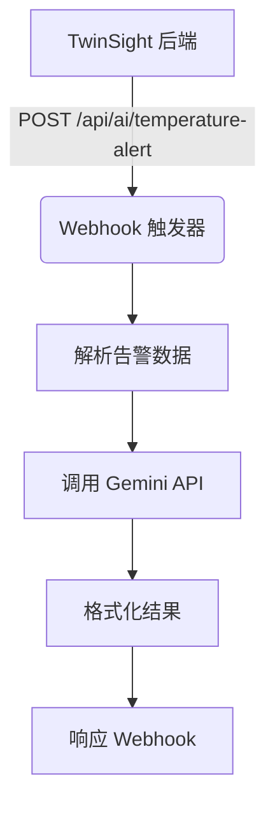
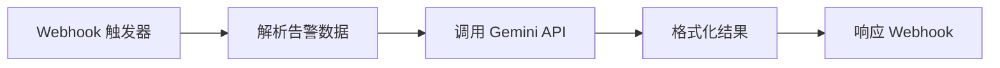
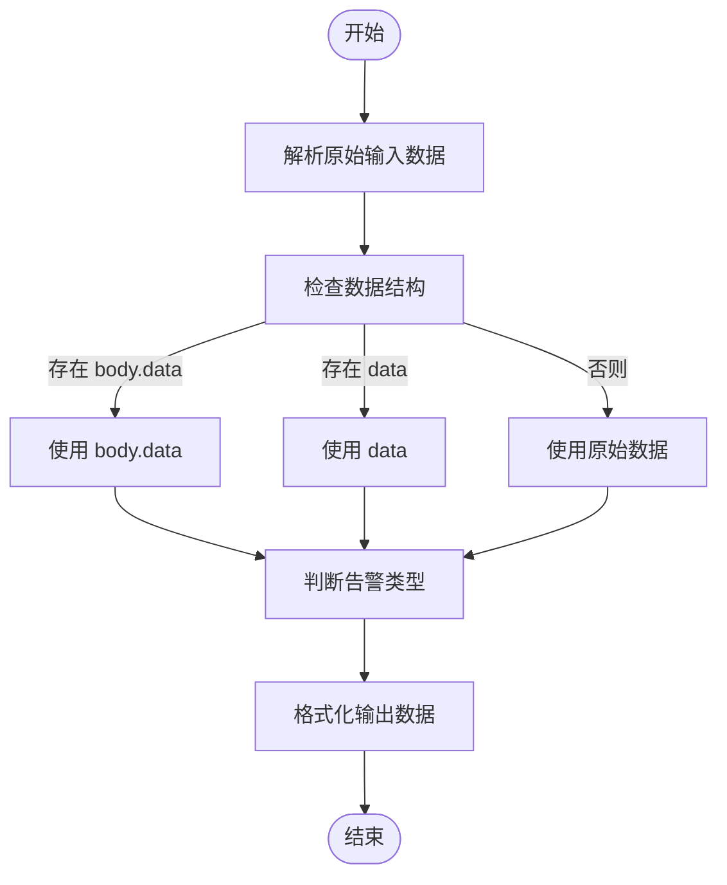
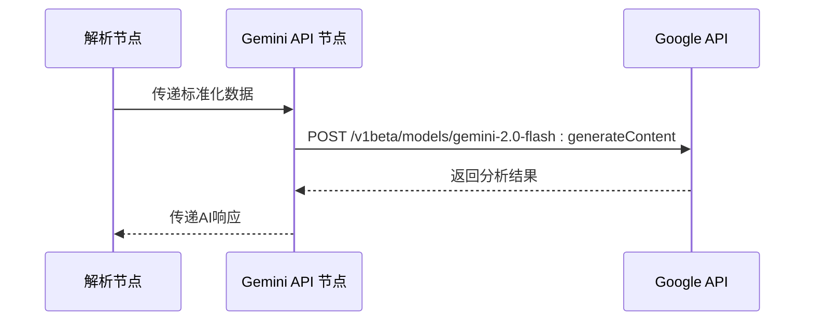
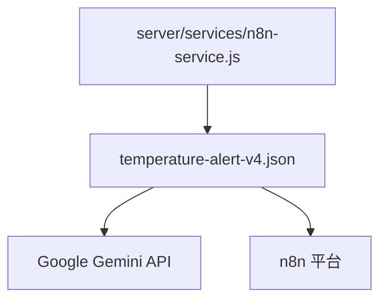

# 核心温度告警工作流

<cite>
**本文档引用的文件**  
- [temperature-alert-v4.json](file://n8n-workflows/temperature-alert-v4.json)
- [temperature-alert-v2.json](file://n8n-workflows/temperature-alert-v2.json)
- [temperature-alert-v3.json](file://n8n-workflows/temperature-alert-v3.json)
- [gemini-service.js](file://server/services/gemini-service.js)
- [n8n-service.js](file://server/services/n8n-service.js)
- [README.md](file://n8n-workflows/README.md)
</cite>

## 目录
1. [简介](#简介)
2. [项目结构](#项目结构)
3. [核心组件](#核心组件)
4. [架构概述](#架构概述)
5. [详细组件分析](#详细组件分析)
6. [依赖分析](#依赖分析)
7. [性能考虑](#性能考虑)
8. [故障排除指南](#故障排除指南)
9. [结论](#结论)

## 简介
本文档深入分析`temperature-alert-v4.json`作为当前生产环境使用的核心工作流，详细解析其JSON结构中各节点的功能与连接逻辑。重点说明Webhook触发器如何接收来自TwinSight系统的告警数据，Function节点如何对原始JSON进行字段提取与格式标准化，IF节点如何根据温度阈值和设备类型执行多路径分支判断。描述其调用Gemini AI服务（通过`n8n-nodes-langchain`集成）生成诊断建议的完整流程，包括提示词工程设计、上下文注入机制及响应解析策略。对比v2到v4版本的演进，解释为何引入错误重试机制、日志记录节点和状态更新回调。提供在n8n Web UI中导入该工作流、配置Gemini API密钥（依赖`GOOGLE_GENERATIVE_AI_API_KEY`环境变量）以及测试端到端流程的详细操作指南。

## 项目结构
该工作流位于`n8n-workflows`目录下，是TwinSight系统中用于处理温度异常告警的核心自动化流程。工作流通过Webhook接收来自后端服务的温度告警事件，经过数据解析、AI分析、结果格式化等步骤，最终返回结构化的诊断建议。系统通过`server/services/n8n-service.js`触发该工作流，并通过环境变量控制其行为。

**图示来源**  
- [temperature-alert-v4.json](file://n8n-workflows/temperature-alert-v4.json)
- [n8n-service.js](file://server/services/n8n-service.js)

**本节来源**  
- [n8n-workflows](file://n8n-workflows)
- [server/services/n8n-service.js](file://server/services/n8n-service.js)

## 核心组件
核心组件包括Webhook触发器、数据解析函数、Gemini API调用节点、结果格式化节点和响应节点。Webhook触发器负责接收来自TwinSight系统的告警数据，数据解析函数对原始JSON进行字段提取与格式标准化，Gemini API调用节点负责与AI服务通信，结果格式化节点组装最终响应，响应节点将结果返回给调用方。

**本节来源**  
- [temperature-alert-v4.json](file://n8n-workflows/temperature-alert-v4.json)
- [gemini-service.js](file://server/services/gemini-service.js)

## 架构概述
该工作流采用线性处理架构，从Webhook接收数据开始，依次经过数据解析、AI分析、结果格式化，最终返回响应。整个流程无分支，确保了处理逻辑的清晰性和可预测性。工作流通过环境变量`GEMINI_API_KEY`获取AI服务的认证信息，并通过`n8n-nodes-base.httpRequest`节点直接调用Gemini API。

**图示来源**  
- [temperature-alert-v4.json](file://n8n-workflows/temperature-alert-v4.json)

## 详细组件分析
### Webhook 触发器分析
Webhook触发器配置为监听POST请求，路径为`temperature-alert`，接收来自TwinSight系统的温度告警数据。该节点是整个工作流的入口点，负责接收原始告警数据并传递给后续节点进行处理。

**本节来源**  
- [temperature-alert-v4.json](file://n8n-workflows/temperature-alert-v4.json#L4-L21)

### 数据解析函数分析
该节点使用JavaScript代码对原始输入数据进行解析和标准化。它能够处理多种可能的数据结构，提取房间编码、房间名称、温度、阈值等关键字段，并根据告警类型判断是高温还是低温异常。该节点还负责构建标准化的消息文本，便于后续处理。

**图示来源**  
- [temperature-alert-v4.json](file://n8n-workflows/temperature-alert-v4.json#L22-L34)

**本节来源**  
- [temperature-alert-v4.json](file://n8n-workflows/temperature-alert-v4.json#L22-L34)

### Gemini API 调用分析
该节点通过HTTP请求调用Google Gemini API，发送精心设计的提示词（prompt）以获取专业的温度异常分析报告。提示词中包含了告警的详细信息，如位置、温度、阈值、类型等，并要求AI按照指定格式返回原因分析、处置方案和预防建议。

**图示来源**  
- [temperature-alert-v4.json](file://n8n-workflows/temperature-alert-v4.json#L35-L61)
- [gemini-service.js](file://server/services/gemini-service.js)

**本节来源**  
- [temperature-alert-v4.json](file://n8n-workflows/temperature-alert-v4.json#L35-L61)
- [gemini-service.js](file://server/services/gemini-service.js)

### 结果格式化分析
该节点负责解析Gemini API的响应，并将其与原始告警数据结合，组装成最终的响应格式。它提取AI生成的分析文本，并处理可能的解析错误，确保即使AI服务出现问题，工作流也能返回有意义的错误信息。

**本节来源**  
- [temperature-alert-v4.json](file://n8n-workflows/temperature-alert-v4.json#L62-L74)

## 依赖分析
该工作流依赖于Google Gemini API服务，通过`GEMINI_API_KEY`环境变量进行认证。同时，它依赖于n8n平台的Webhook和HTTP请求功能。后端服务通过`server/services/n8n-service.js`中的`triggerTemperatureAlert`函数触发该工作流，并传递告警数据。

**图示来源**  
- [temperature-alert-v4.json](file://n8n-workflows/temperature-alert-v4.json)
- [n8n-service.js](file://server/services/n8n-service.js)

**本节来源**  
- [temperature-alert-v4.json](file://n8n-workflows/temperature-alert-v4.json)
- [n8n-service.js](file://server/services/n8n-service.js)

## 性能考虑
该工作流的性能主要受Gemini API响应时间的影响。由于采用线性处理流程，每个告警事件的处理时间相对稳定。建议监控API调用延迟，并在必要时实现缓存机制以提高响应速度。此外，应确保n8n服务有足够的资源处理并发告警事件。

## 故障排除指南
当工作流出现问题时，首先检查`GEMINI_API_KEY`环境变量是否正确配置。查看n8n的日志输出，确认Webhook是否被正确触发，以及各节点的执行状态。如果Gemini API调用失败，检查网络连接和API配额。可以通过发送测试请求来验证整个流程是否正常工作。

**本节来源**  
- [README.md](file://n8n-workflows/README.md)
- [gemini-service.js](file://server/services/gemini-service.js)

## 结论
`temperature-alert-v4.json`工作流是TwinSight系统中关键的自动化组件，它有效地将温度告警事件与AI分析能力结合，为运维人员提供专业的诊断建议。相比v2版本，v4版本通过更精细的提示词设计和错误处理机制，显著提升了分析质量和系统可靠性。该工作流的设计体现了现代智能运维系统的核心理念，即通过自动化和智能化手段提高运维效率和决策质量。