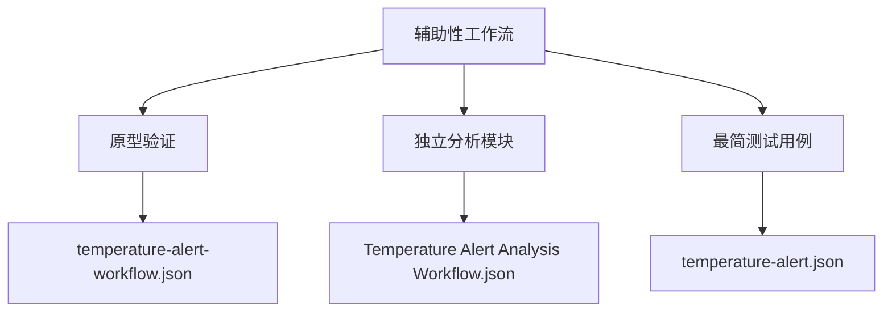
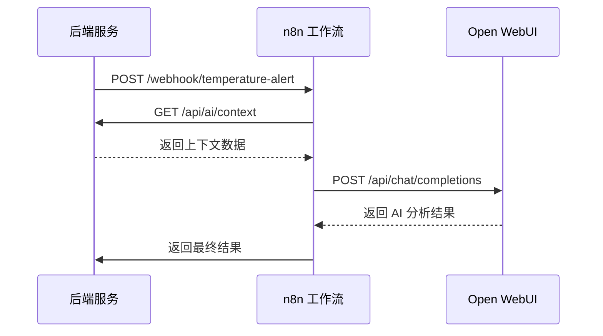

# 辅助性工作流

<cite>
**本文档引用的文件**  
- [Temperature Alert Analysis Workflow.json](file://n8n-workflows/Temperature Alert Analysis Workflow.json)
- [temperature-alert-workflow.json](file://n8n-workflows/temperature-alert-workflow.json)
- [temperature-alert-workflow_v1.json](file://n8n-workflows/temperature-alert-workflow_v1.json)
- [temperature-alert.json](file://n8n-workflows/temperature-alert.json)
- [temperature-alert-v2.json](file://n8n-workflows/temperature-alert-v2.json)
- [temperature-alert-v3.json](file://n8n-workflows/temperature-alert-v3.json)
- [temperature-alert-v4.json](file://n8n-workflows/temperature-alert-v4.json)
- [README.md](file://n8n-workflows/README.md)
- [ai-analysis.js](file://server/routes/ai-analysis.js)
- [n8n-service.js](file://server/services/n8n-service.js)
</cite>

## 目录
1. [引言](#引言)
2. [工作流分类与状态](#工作流分类与状态)
3. [原型验证工作流：temperature-alert-workflow.json](#原型验证工作流temperature-alert-workflowjson)
4. [独立分析模块：Temperature Alert Analysis Workflow.json](#独立分析模块temperature-alert-analysis-workflowjson)
5. [最简测试用例：temperature-alert.json](#最简测试用例temperature-alertjson)
6. [版本迁移与兼容性：_v1 版本](#版本迁移与兼容性_v1-版本)
7. [功能边界与集成方式](#功能边界与集成方式)
8. [结论](#结论)

## 引言

本项目中的 n8n 工作流主要用于实现建筑设施运维中的智能告警分析功能。系统支持两种 AI 分析模式：直接调用 Open WebUI 和通过 n8n 工作流进行编排。`n8n-workflows` 目录下的多个 JSON 文件代表了不同阶段、不同用途的辅助性工作流，它们在系统开发、测试和功能演进过程中扮演了重要角色。这些工作流目前主要用于实验、归档或特定测试场景，不建议在生产环境中直接使用。

**Section sources**
- [README.md](file://n8n-workflows/README.md)

## 工作流分类与状态

项目中的温度告警相关工作流可分为三类：早期原型、独立分析模块和最简测试用例。所有工作流均处于归档或实验状态，其主要目的是支持核心功能的开发与验证，而非作为生产级工作流直接部署。

**Diagram sources**
- [temperature-alert-workflow.json](file://n8n-workflows/temperature-alert-workflow.json)
- [Temperature Alert Analysis Workflow.json](file://n8n-workflows/Temperature Alert Analysis Workflow.json)
- [temperature-alert.json](file://n8n-workflows/temperature-alert.json)

## 原型验证工作流：temperature-alert-workflow.json

`temperature-alert-workflow.json` 是一个早期的原型版本工作流，设计目的是快速验证告警通道的连通性。该工作流实现了简化版的逻辑，仅包含基础的通知功能，不涉及复杂的上下文查询或 RAG（检索增强生成）分析。

其核心节点包括：
- **Webhook 接收温度报警**：作为入口，接收来自后端的 HTTP POST 请求。
- **查询上下文**：调用内部 API 获取房间相关的设备和文档信息。
- **构建 RAG Prompt**：使用 JavaScript 代码节点构建与 `ai-analysis.js` 一致的提示词。
- **调用 Open WebUI RAG**：向 Open WebUI 发送请求，执行 AI 分析。
- **返回结果**：将 AI 分析结果通过 Webhook 响应返回给调用方。

该工作流的简化逻辑使其成为快速测试告警触发、数据传递和响应处理的理想选择，常用于开发初期的功能验证。

**Section sources**
- [temperature-alert-workflow.json](file://n8n-workflows/temperature-alert-workflow.json)
- [README.md](file://n8n-workflows/README.md)

## 独立分析模块：Temperature Alert Analysis Workflow.json

`Temperature Alert Analysis Workflow.json` 是一个功能完整的独立分析模块，它被设计为可被主工作流调用的子模块，用于执行深度根因分析。与原型版本相比，此工作流包含了更复杂的逻辑和数据处理流程。

其工作流结构如下：
1. **Webhook 接收温度报警**：接收告警事件。
2. **查询上下文**：获取房间的设备、文档和知识库信息。
3. **构建 RAG Prompt**：根据上下文信息动态生成详细的 AI 提示词。
4. **调用 Open WebUI RAG**：执行 AI 分析，利用知识库和相关文档进行增强推理。
5. **解析 AI 回复**：提取 AI 生成的分析文本和引用的来源。
6. **返回结果**：将结构化的分析结果返回。

此工作流的关键特点是其“独立分析”能力，它不负责告警的触发或通知，而是专注于接收告警数据后，进行深度的上下文分析和根因推断。主工作流可以在需要时调用此模块，以获取专业的运维建议。

**Section sources**
- [Temperature Alert Analysis Workflow.json](file://n8n-workflows/Temperature Alert Analysis Workflow.json)
- [ai-analysis.js](file://server/routes/ai-analysis.js)

## 最简测试用例：temperature-alert.json

`temperature-alert.json` 作为最简测试用例，其设计目的是提供一个轻量级、易于理解的工作流模板，用于快速测试和演示基本功能。该工作流省略了复杂的上下文查询和 RAG 集成，直接使用 n8n 内置的 Gemini 节点进行分析。

其核心流程包括：
- **Webhook 接收温度报警**：接收原始告警数据。
- **Parse Alert Data**：使用代码节点解析和格式化告警信息。
- **Gemini Analysis**：直接调用 Google Gemini API 进行分析。
- **Format Result**：组装最终的响应结果。
- **Respond to Webhook**：返回 JSON 响应。

此工作流的优势在于其简单性和低依赖性，非常适合在没有配置 Open WebUI 或复杂知识库的环境中进行快速测试和概念验证。

**Section sources**
- [temperature-alert.json](file://n8n-workflows/temperature-alert.json)

## 版本迁移与兼容性：_v1 版本

`temperature-alert-workflow_v1.json` 代表了工作流在迁移过程中的一个兼容性版本。当系统从旧版工作流迁移到新版时，`_v1` 后缀的版本用于确保现有集成和调用逻辑的平稳过渡。

该版本通常包含以下特点：
- 保持与旧版相同的 Webhook 路径和请求/响应格式。
- 在内部实现上可能已更新为使用新的 API 或服务。
- 作为临时的兼容层，允许新旧系统并行运行，直至所有客户端完成升级。

这种版本命名策略有助于管理 API 的演进，避免因接口变更导致的系统中断。

**Section sources**
- [temperature-alert-workflow_v1.json](file://n8n-workflows/temperature-alert-workflow_v1.json)

## 功能边界与集成方式

这些辅助性工作流与核心工作流的功能边界清晰。核心工作流负责业务逻辑的执行和系统集成，而这些辅助工作流则专注于特定的分析任务或测试场景。

集成方式主要通过以下两种模式：
1. **Webhook 触发**：核心系统通过 HTTP POST 请求触发 n8n 工作流，如 `ai-analysis.js` 中通过 `fetch` 调用 n8n 的 Webhook URL。
2. **模块化调用**：将独立分析模块（如 `Temperature Alert Analysis Workflow.json`）作为子流程嵌入到更复杂的工作流中。

环境变量 `USE_N8N_WORKFLOW` 控制着系统是使用 n8n 工作流模式还是直接调用 Open WebUI 模式，这为系统提供了灵活的配置选项。

**Diagram sources**
- [ai-analysis.js](file://server/routes/ai-analysis.js)
- [n8n-service.js](file://server/services/n8n-service.js)
- [Temperature Alert Analysis Workflow.json](file://n8n-workflows/Temperature Alert Analysis Workflow.json)

## 结论

`n8n-workflows` 目录下的辅助性工作流是系统开发过程中的重要资产。`temperature-alert-workflow.json` 作为早期原型，用于快速验证告警通道；`Temperature Alert Analysis Workflow.json` 作为独立分析模块，提供了深度根因分析能力；`temperature-alert.json` 作为最简测试用例，便于快速部署和测试；`_v1` 版本则确保了在迁移过程中的兼容性。这些工作流目前处于归档或实验状态，其主要价值在于支持核心功能的开发和验证，而非直接用于生产环境。开发者应理解其设计目的和使用场景，以充分利用这些辅助工具。