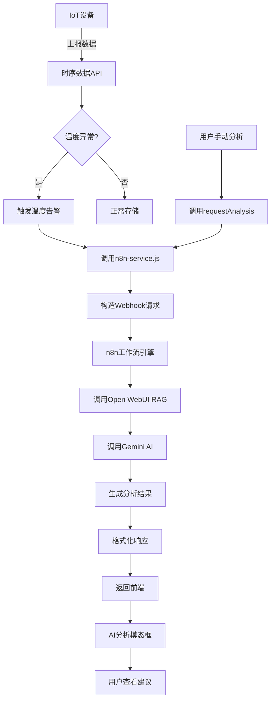

# n8n服务集成

<cite>
**本文档引用的文件**  
- [n8n-service.js](file://server/services/n8n-service.js)
- [temperature-alert-workflow.json](file://n8n-workflows/temperature-alert-workflow.json)
- [ai-analysis.js](file://server/routes/ai-analysis.js)
- [timeseries.js](file://server/routes/timeseries.js)
- [ai-analysis.ts](file://src/services/ai-analysis.ts)
- [AIAnalysisModal.vue](file://src/components/viewer/AIAnalysisModal.vue)
</cite>

## 目录
1. [集成概述](#集成概述)
2. [核心函数实现机制](#核心函数实现机制)
   - [triggerTemperatureAlert 实现](#triggertemperaturealert-实现)
   - [triggerManualAnalysis 实现](#triggermanualanalysis-实现)
   - [calculateSeverity 实现](#calculateseverity-实现)
3. [健康检查机制](#健康检查机制)
4. [业务逻辑调用链](#业务逻辑调用链)
5. [异常处理与重试策略](#异常处理与重试策略)
6. [前端交互数据格式](#前端交互数据格式)
7. [集成架构图](#集成架构图)

## 集成概述

TwinSight后端通过`n8n-service.js`文件与n8n工作流引擎进行集成，实现了智能化的告警分析和手动分析功能。该集成机制基于Webhook通信模式，当系统检测到温度异常或用户发起分析请求时，后端服务会触发相应的n8n工作流，利用AI模型进行深度分析并返回结构化建议。

集成架构采用分层设计，前端通过API路由触发分析请求，后端服务负责参数校验、数据转换和HTTP请求构造，最终通过Webhook与n8n工作流进行通信。n8n工作流则负责协调多个服务（如Open WebUI、Gemini等）完成复杂的分析任务。

**Section sources**
- [n8n-service.js](file://server/services/n8n-service.js#L1-L150)
- [ai-analysis.js](file://server/routes/ai-analysis.js#L1-L800)

## 核心函数实现机制

### triggerTemperatureAlert 实现

`triggerTemperatureAlert`函数负责触发温度报警工作流，其核心实现机制包括：

1. **参数校验**：验证输入参数的完整性和有效性，确保包含必要的房间编码、温度值等关键信息
2. **数据结构转换**：将原始报警数据转换为符合n8n工作流要求的标准化payload格式
3. **严重程度计算**：调用`calculateSeverity`函数动态计算告警的严重程度
4. **HTTP请求构造**：构建POST请求，设置正确的Content-Type头部，并序列化JSON payload
5. **错误处理**：捕获网络异常和HTTP错误，提供详细的错误信息

该函数通过环境变量`N8N_TEMPERATURE_ALERT_WEBHOOK`确定Webhook路径，确保配置的灵活性。

**Section sources**
- [n8n-service.js](file://server/services/n8n-service.js#L36-L77)

### triggerManualAnalysis 实现

`triggerManualAnalysis`函数用于触发手动分析请求工作流，其实现机制与温度报警类似但针对不同的分析场景：

1. **请求类型区分**：支持'asset'（资产）和'room'（房间）两种分析类型
2. **目标对象处理**：接收并传递目标分析对象的完整信息
3. **用户问题集成**：可选地包含用户提出的具体问题，用于指导AI分析
4. **时间戳生成**：自动添加请求时间戳，便于后续追踪和审计

该函数通过`N8N_MANUAL_ANALYSIS_WEBHOOK`环境变量配置专用的Webhook路径，实现与温度报警工作流的隔离。

**Section sources**
- [n8n-service.js](file://server/services/n8n-service.js#L91-L124)

### calculateSeverity 实现

`calculateSeverity`函数根据温度偏差动态计算告警严重程度，其算法逻辑如下：

- **高温告警**：当温度超过阈值5度时，严重程度为'critical'（严重），否则为'warning'（警告）
- **低温告警**：当温度低于阈值5度时，严重程度为'critical'（严重），否则为'warning'（警告）

该函数通过`alertType`参数区分高温和低温两种告警模式，提供了灵活的告警分级机制。计算结果作为重要元数据包含在Webhook payload中，用于后续的分析和处理。

**Section sources**
- [n8n-service.js](file://server/services/n8n-service.js#L12-L23)

## 健康检查机制

`checkN8nHealth`函数实现了对n8n服务的健康检查，其主要特点包括：

1. **轻量级检测**：通过向`/healthz`端点发送GET请求进行服务状态检测
2. **超时控制**：设置5秒的请求超时，避免长时间阻塞
3. **布尔返回**：返回简单的true/false值，便于上层逻辑判断
4. **异常捕获**：捕获所有网络和请求异常，确保健康检查不会导致系统崩溃

该健康检查机制可用于系统启动时的依赖验证、定时巡检以及故障恢复时的状态确认。

**Section sources**
- [n8n-service.js](file://server/services/n8n-service.js#L133-L142)

## 业务逻辑调用链

从时序数据监控模块触发温度告警的完整调用链如下：

1. **数据采集**：IoT设备通过`/api/v1/timeseries/streams/:spaceCode`接口上报温度数据
2. **阈值检测**：系统在接收数据时进行实时阈值比较，发现异常
3. **告警生成**：创建包含房间编码、温度值、阈值等信息的告警数据对象
4. **服务调用**：调用`triggerTemperatureAlert`函数，传入告警数据
5. **Webhook触发**：构造并发送HTTP POST请求到n8n Webhook端点
6. **工作流执行**：n8n执行"Temperature Alert Analysis Workflow"，调用AI模型进行分析
7. **结果返回**：分析结果通过API返回前端，显示在AI分析模态框中

此调用链体现了从数据采集到智能分析的完整闭环，展示了系统各组件的协同工作。

**Section sources**
- [timeseries.js](file://server/routes/timeseries.js#L267-L335)
- [ai-analysis.js](file://server/routes/ai-analysis.js#L69-L265)
- [ai-analysis.ts](file://src/services/ai-analysis.ts#L28-L98)

## 异常处理与重试策略

系统实现了多层次的异常处理和重试机制：

1. **前端重试**：在`ai-analysis.ts`中实现请求重试逻辑，对HTTP错误进行自动重试
2. **后端容错**：`n8n-service.js`中的try-catch块捕获所有异常，确保服务不中断
3. **降级处理**：当n8n服务不可用时，系统可切换到直接调用Open WebUI的备用路径
4. **日志记录**：详细的错误日志记录，包括HTTP状态码和响应文本，便于故障排查

建议的重试策略包括：
- 初始延迟1秒，指数退避
- 最多重试3次
- 对5xx错误进行重试，对4xx错误直接失败
- 记录重试次数和最终结果

**Section sources**
- [n8n-service.js](file://server/services/n8n-service.js#L77-L80)
- [ai-analysis.ts](file://src/services/ai-analysis.ts#L92-L98)

## 前端交互数据格式

前后端交互遵循统一的数据格式约定：

**请求格式**：
```json
{
  "roomCode": "string",
  "roomName": "string",
  "temperature": "number",
  "threshold": "number",
  "alertType": "high|low",
  "fileId": "number"
}
```

**响应格式**：
```json
{
  "success": "boolean",
  "analysis": "string",
  "sources": [
    {
      "name": "string",
      "fileName": "string",
      "url": "string",
      "downloadUrl": "string",
      "docId": "number"
    }
  ],
  "error": "string"
}
```

前端通过`AIAnalysisModal.vue`组件展示分析结果，支持点击文档引用跳转预览，提供了良好的用户体验。

**Section sources**
- [ai-analysis.ts](file://src/services/ai-analysis.ts#L35-L49)
- [AIAnalysisModal.vue](file://src/components/viewer/AIAnalysisModal.vue#L48-L77)

## 集成架构图



**Diagram sources**
- [n8n-service.js](file://server/services/n8n-service.js#L1-L150)
- [ai-analysis.js](file://server/routes/ai-analysis.js#L1-L800)
- [ai-analysis.ts](file://src/services/ai-analysis.ts#L1-L179)

**Section sources**
- [n8n-service.js](file://server/services/n8n-service.js#L1-L150)
- [ai-analysis.js](file://server/routes/ai-analysis.js#L1-L800)
- [ai-analysis.ts](file://src/services/ai-analysis.ts#L1-L179)