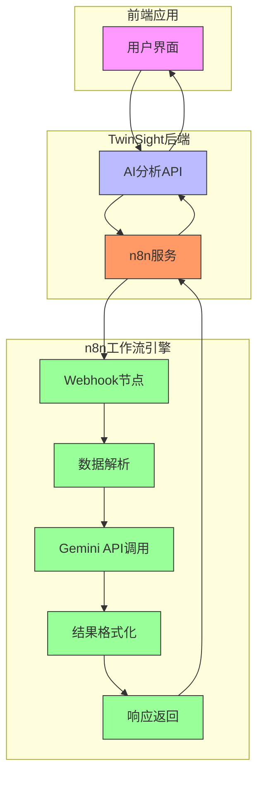
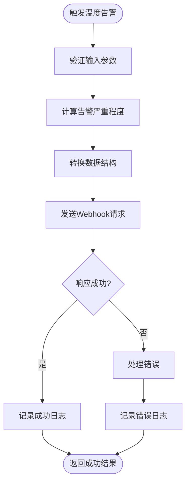
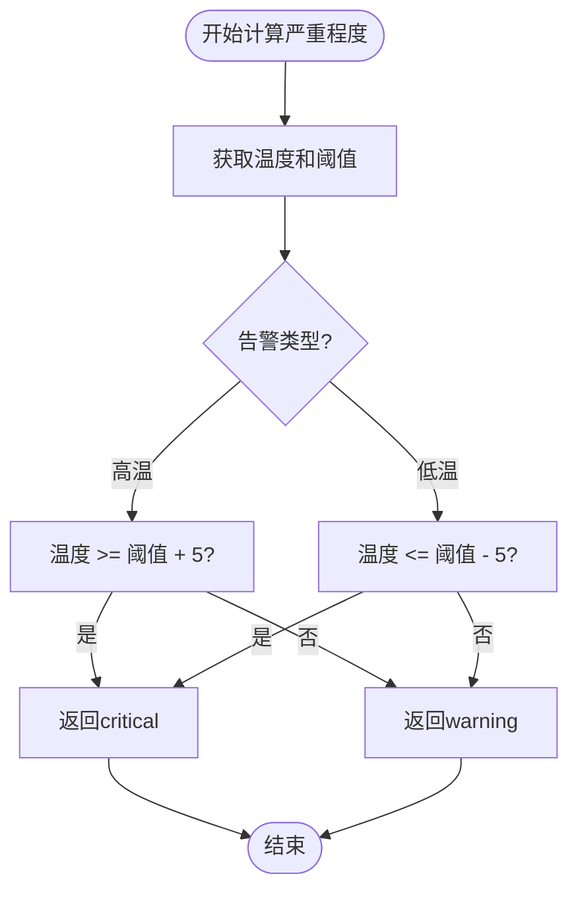
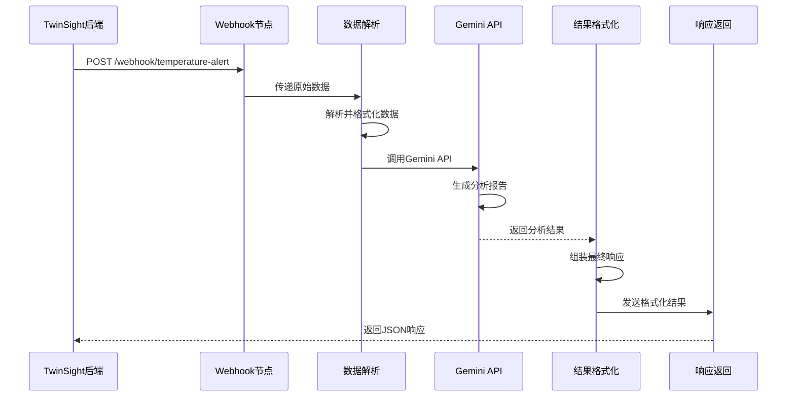
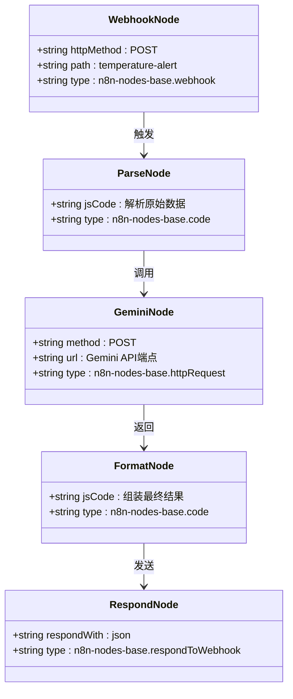
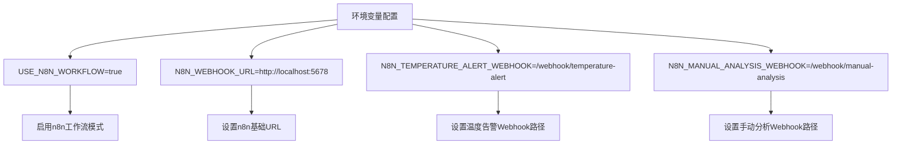
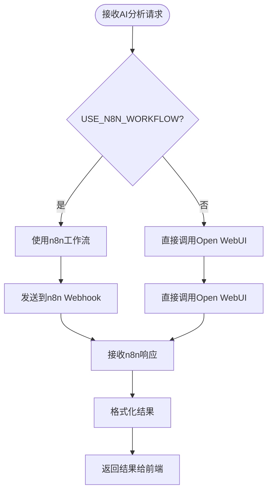
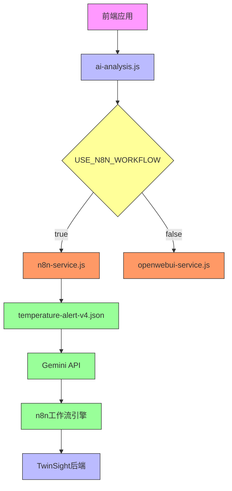

# n8n自动化工作流

<cite>
**本文档引用的文件**  
- [n8n-service.js](file://server/services/n8n-service.js)
- [temperature-alert-v4.json](file://n8n-workflows/temperature-alert-v4.json)
- [.env](file://server/.env)
- [ai-analysis.js](file://server/routes/ai-analysis.js)
- [gemini-service.js](file://server/services/gemini-service.js)
</cite>

## 目录
1. [简介](#简介)
2. [核心组件](#核心组件)
3. [架构概述](#架构概述)
4. [详细组件分析](#详细组件分析)
5. [依赖分析](#依赖分析)
6. [性能考虑](#性能考虑)
7. [故障排除指南](#故障排除指南)
8. [结论](#结论)

## 简介
本文档详细记录了TwinSight系统中n8n自动化工作流的集成与使用。重点说明了`n8n-service.js`中的`triggerTemperatureAlert`函数如何通过Webhook触发n8n工作流，包括数据结构转换、严重程度计算和错误处理机制。同时分析了`n8n-workflows/temperature-alert-v4.json`中的工作流定义，解释其由Webhook触发、数据解析、调用Gemini API进行智能分析到最终响应的完整执行链路。文档还描述了如何配置n8n Webhook URL和API密钥等环境变量，并提供了在TwinSight中触发温度告警和手动分析请求的代码示例，以及如何通过`checkN8nHealth`进行服务健康检查。

## 核心组件
本系统的核心组件包括n8n服务模块、温度告警工作流定义、环境变量配置以及AI分析路由。`n8n-service.js`提供了触发温度告警和手动分析请求的接口，同时包含服务健康检查功能。`temperature-alert-v4.json`定义了完整的温度告警分析工作流，从Webhook接收数据到调用Gemini API进行智能分析。环境变量通过`.env`文件进行配置，控制是否启用n8n工作流模式以及相关URL设置。`ai-analysis.js`路由则作为前端与n8n服务之间的桥梁，根据配置决定是直接调用Open WebUI还是通过n8n工作流进行处理。

**文档引用的文件**
- [n8n-service.js](file://server/services/n8n-service.js)
- [temperature-alert-v4.json](file://n8n-workflows/temperature-alert-v4.json)
- [.env](file://server/.env)
- [ai-analysis.js](file://server/routes/ai-analysis.js)

## 架构概述
TwinSight系统的n8n自动化工作流采用前后端分离的架构设计，通过Webhook实现事件驱动的自动化处理。系统支持两种AI分析模式：直接调用Open WebUI和通过n8n工作流编排。当启用n8n工作流模式时，前端或系统事件会通过`ai-analysis.js`路由将请求转发到n8n服务，由n8n工作流完成后续的数据处理、AI调用和结果返回。

**图表来源**
- [n8n-service.js](file://server/services/n8n-service.js)
- [ai-analysis.js](file://server/routes/ai-analysis.js)
- [temperature-alert-v4.json](file://n8n-workflows/temperature-alert-v4.json)

## 详细组件分析

### n8n服务模块分析
`n8n-service.js`是TwinSight系统与n8n工作流引擎之间的核心服务模块，提供了触发温度告警、手动分析请求和健康检查等功能。

#### 服务功能与数据流

**图表来源**
- [n8n-service.js](file://server/services/n8n-service.js#L36-L81)

#### 温度告警触发函数
`triggerTemperatureAlert`函数负责将温度告警事件转换为标准格式并发送到n8n工作流。该函数首先验证输入数据，然后计算告警严重程度，最后将数据转换为n8n工作流所需的格式并通过Webhook发送。

**代码路径**
- [n8n-service.js](file://server/services/n8n-service.js#L36-L81)

#### 严重程度计算逻辑

**图表来源**
- [n8n-service.js](file://server/services/n8n-service.js#L12-L23)

### 温度告警工作流分析
`temperature-alert-v4.json`定义了完整的温度告警分析工作流，从Webhook接收数据到最终返回分析结果。

#### 工作流执行链路

**图表来源**
- [temperature-alert-v4.json](file://n8n-workflows/temperature-alert-v4.json)

#### 工作流节点关系

**图表来源**
- [temperature-alert-v4.json](file://n8n-workflows/temperature-alert-v4.json)

### 环境配置与集成
系统通过环境变量和配置文件实现n8n服务的灵活配置和集成。

#### 环境变量配置

**图表来源**
- [.env](file://server/.env#L19-L22)

#### AI分析路由集成
`ai-analysis.js`路由作为前端与n8n服务之间的桥梁，根据配置决定使用哪种分析模式。

**图表来源**
- [ai-analysis.js](file://server/routes/ai-analysis.js#L89-L265)

## 依赖分析
系统各组件之间存在明确的依赖关系，确保了自动化工作流的可靠执行。

**图表来源**
- [ai-analysis.js](file://server/routes/ai-analysis.js)
- [n8n-service.js](file://server/services/n8n-service.js)
- [temperature-alert-v4.json](file://n8n-workflows/temperature-alert-v4.json)

## 性能考虑
在设计和使用n8n自动化工作流时，需要考虑以下性能因素：

1. **网络延迟**：由于工作流涉及多个服务间的HTTP通信，网络延迟可能影响整体响应时间。
2. **错误处理**：完善的错误处理机制确保在n8n服务不可用时能够优雅降级。
3. **并发处理**：n8n工作流引擎能够处理并发请求，但需要监控系统资源使用情况。
4. **数据转换开销**：在`triggerTemperatureAlert`函数中进行的数据结构转换会增加少量处理时间。
5. **API调用频率**：Gemini API调用可能受到速率限制，需要合理设计调用频率。

## 故障排除指南
当n8n自动化工作流出现问题时，可以按照以下步骤进行排查：

1. **检查服务健康状态**：使用`checkN8nHealth`函数检查n8n服务是否可用。
2. **验证环境变量**：确认`.env`文件中的`USE_N8N_WORKFLOW`、`N8N_WEBHOOK_URL`等变量配置正确。
3. **检查Webhook配置**：在n8n控制台中确认Webhook节点已正确配置并处于激活状态。
4. **查看日志信息**：检查`n8n-service.js`中的console.log输出，了解请求处理过程。
5. **测试直接调用**：使用curl命令直接测试n8n Webhook端点，排除前端问题。
6. **验证API密钥**：确保Gemini API密钥已正确配置在n8n环境中。

**代码路径**
- [n8n-service.js](file://server/services/n8n-service.js#L133-L143)
- [.env](file://server/.env)

## 结论
TwinSight系统的n8n自动化工作流提供了一种灵活、可扩展的事件处理机制。通过`n8n-service.js`中的`triggerTemperatureAlert`函数，系统能够将温度告警事件转换为标准格式并通过Webhook触发n8n工作流。`temperature-alert-v4.json`工作流定义了从数据解析、调用Gemini API进行智能分析到最终响应的完整执行链路。系统通过环境变量实现了n8n工作流模式的灵活配置，同时提供了完善的错误处理和健康检查机制。这种架构设计不仅提高了系统的可维护性，还为未来扩展更多自动化工作流奠定了基础。