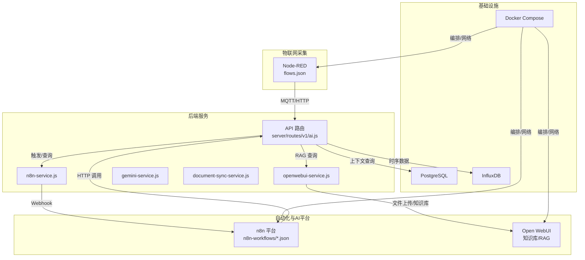
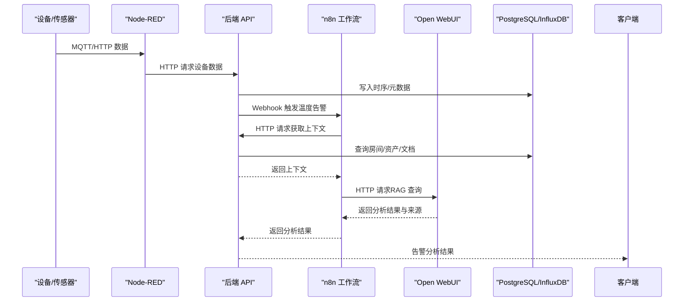
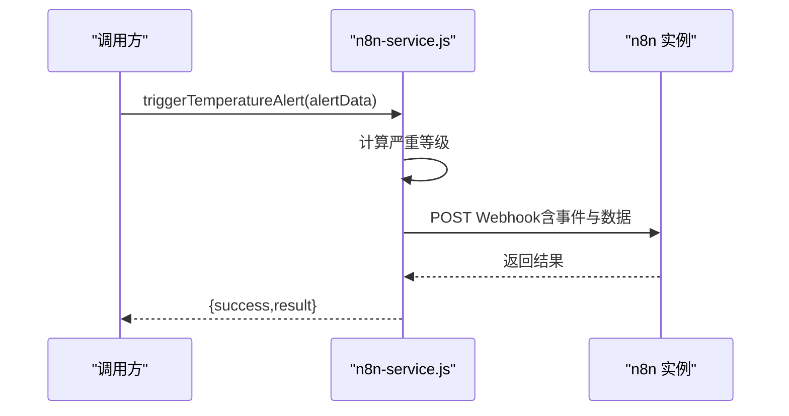
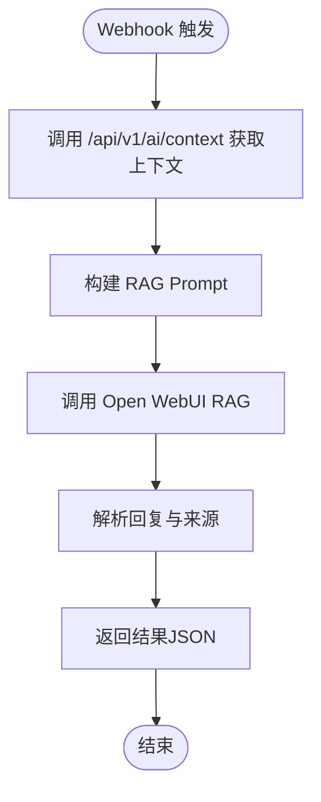
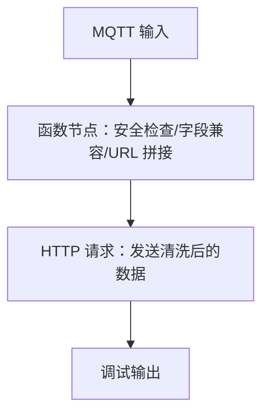
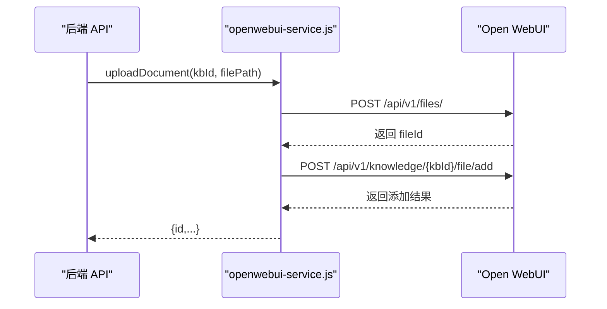
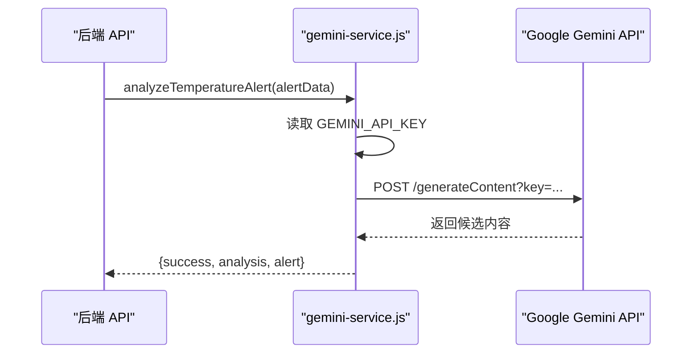
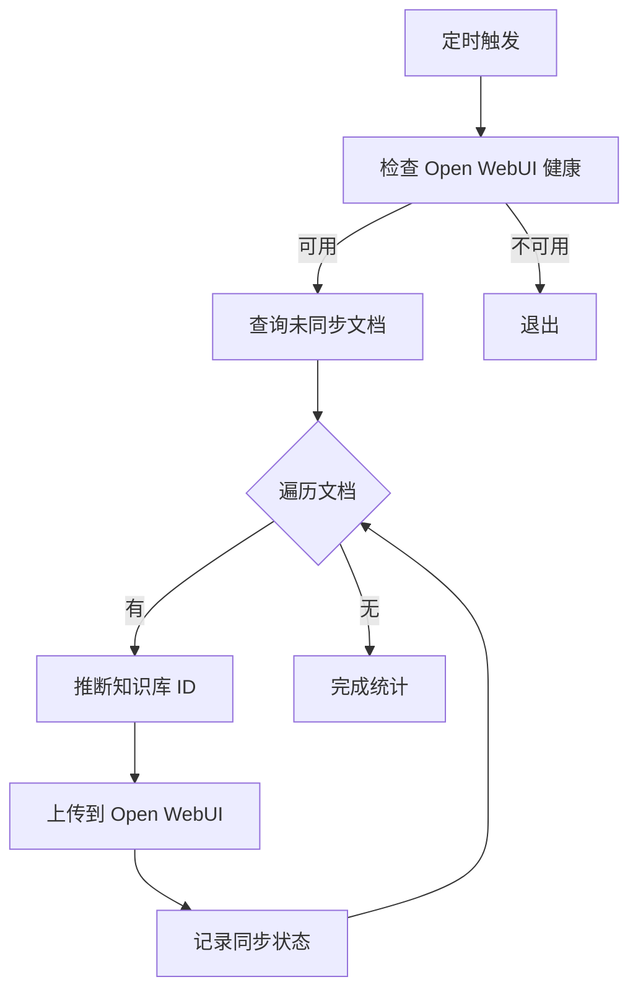
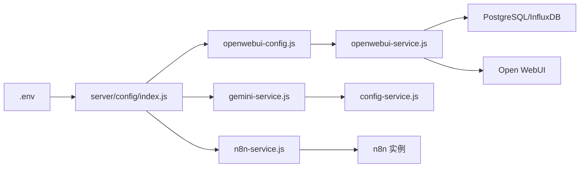

# 集成与自动化

<cite>
**本文引用的文件**
- [n8n-service.js](file://server/services/n8n-service.js)
- [openwebui-service.js](file://server/services/openwebui-service.js)
- [gemini-service.js](file://server/services/gemini-service.js)
- [openwebui-config.js](file://server/config/openwebui-config.js)
- [ai.js](file://server/routes/v1/ai.js)
- [document-sync-service.js](file://server/services/document-sync-service.js)
- [Temperature Alert Analysis Workflow.json](file://n8n-workflows/Temperature Alert Analysis Workflow.json)
- [temperature-alert-workflow.json](file://n8n-workflows/temperature-alert-workflow.json)
- [flows.json](file://nodered/flows.json)
- [docker-compose.yml](file://docker-compose.yml)
- [index.js](file://server/config/index.js)
- [config-service.js](file://server/services/config-service.js)
</cite>

## 目录
1. [简介](#简介)
2. [项目结构](#项目结构)
3. [核心组件](#核心组件)
4. [架构总览](#架构总览)
5. [详细组件分析](#详细组件分析)
6. [依赖关系分析](#依赖关系分析)
7. [性能考量](#性能考量)
8. [故障排查指南](#故障排查指南)
9. [结论](#结论)
10. [附录：外部服务配置步骤](#附录外部服务配置步骤)

## 简介
本文件面向系统集成与自动化场景，聚焦以下目标：
- 通过 n8n-service.js 与 n8n 实例交互，触发温度告警分析等自动化流程；
- 解析 n8n-workflows/ 下的 JSON 工作流定义，说明触发条件、处理逻辑与通知机制；
- 描述 Node-RED 流程在设备数据采集与转发中的作用；
- 阐述 openwebui-service.js 如何将文档内容同步至 Open WebUI 知识库并支持 RAG 问答；
- 说明 gemini-service.js 如何调用 Gemini 模型进行内容分析；
- 提供集成架构图与配置外部服务连接的步骤。

## 项目结构
系统采用“后端服务 + AI/自动化平台 + 物联网采集”的分层架构：
- 后端服务（server/）：提供 API、数据库访问、AI 服务封装、文档同步服务；
- n8n 工作流平台：承接温度告警等自动化流程；
- Open WebUI：提供知识库与 RAG 能力；
- Node-RED：负责设备数据采集与转发；
- Docker Compose：统一编排各服务网络与端口。

图表来源
- [docker-compose.yml](file://docker-compose.yml#L1-L220)
- [ai.js](file://server/routes/v1/ai.js#L1-L416)
- [n8n-service.js](file://server/services/n8n-service.js#L1-L150)
- [openwebui-service.js](file://server/services/openwebui-service.js#L1-L359)
- [gemini-service.js](file://server/services/gemini-service.js#L1-L111)
- [document-sync-service.js](file://server/services/document-sync-service.js#L1-L250)
- [flows.json](file://nodered/flows.json#L1-L508)

章节来源
- [docker-compose.yml](file://docker-compose.yml#L1-L220)

## 核心组件
- n8n-service.js：封装 n8n Webhook 调用，支持温度告警与手动分析两类触发；提供健康检查。
- openwebui-service.js：封装 Open WebUI API，包括知识库管理、文件上传、RAG 查询、批量同步等。
- gemini-service.js：直接调用 Gemini API，用于温度异常分析。
- openwebui-config.js：集中管理 Open WebUI 的基础地址、端点、支持格式、默认模型等配置。
- server/routes/v1/ai.js：对外暴露 AI 相关 API，包括知识库管理、文档同步、RAG 查询、上下文查询、来源格式化等。
- document-sync-service.js：后台服务，按需将文档同步到 Open WebUI 知识库，并维护同步状态。
- n8n-workflows/*.json：温度告警分析工作流的 JSON 定义，包含 Webhook 接收、上下文查询、Prompt 构建、RAG 调用、回复解析与结果返回。
- nodered/flows.json：设备数据采集与转发流程，包含 MQTT 输入、函数节点处理、HTTP 请求节点等。

章节来源
- [n8n-service.js](file://server/services/n8n-service.js#L1-L150)
- [openwebui-service.js](file://server/services/openwebui-service.js#L1-L359)
- [gemini-service.js](file://server/services/gemini-service.js#L1-L111)
- [openwebui-config.js](file://server/config/openwebui-config.js#L1-L56)
- [ai.js](file://server/routes/v1/ai.js#L1-L416)
- [document-sync-service.js](file://server/services/document-sync-service.js#L1-L250)
- [Temperature Alert Analysis Workflow.json](file://n8n-workflows/Temperature Alert Analysis Workflow.json#L1-L201)
- [temperature-alert-workflow.json](file://n8n-workflows/temperature-alert-workflow.json#L1-L197)
- [flows.json](file://nodered/flows.json#L1-L508)

## 架构总览
系统通过后端 API 作为中枢，串联 n8n 工作流与 Open WebUI，形成“告警触发—上下文检索—RAG 分析—结果返回”的闭环。Node-RED 负责设备数据采集与转发，为温度告警提供数据输入。

图表来源
- [flows.json](file://nodered/flows.json#L1-L508)
- [ai.js](file://server/routes/v1/ai.js#L234-L355)
- [Temperature Alert Analysis Workflow.json](file://n8n-workflows/Temperature Alert Analysis Workflow.json#L1-L201)
- [openwebui-service.js](file://server/services/openwebui-service.js#L248-L310)

## 详细组件分析

### n8n-service.js：与 n8n 实例交互
- 角色与职责
  - 提供温度告警触发函数，构造事件负载并调用 n8n Webhook；
  - 提供手动分析触发函数，支持资产/房间维度的分析请求；
  - 提供 n8n 健康检查函数。
- 关键行为
  - 计算告警严重等级（基于阈值差）；
  - 通过 fetch 发送 JSON 负载到 n8n Webhook；
  - 对响应进行日志记录与错误处理。
- 适用场景
  - 温度告警联动分析；
  - 手动触发 AI 分析请求。

图表来源
- [n8n-service.js](file://server/services/n8n-service.js#L1-L150)

章节来源
- [n8n-service.js](file://server/services/n8n-service.js#L1-L150)

### n8n 工作流：温度告警分析
- 触发条件
  - n8n Webhook 节点接收来自后端的温度告警事件；
  - 事件包含房间编码/名称、温度、阈值、告警类型、时间戳、文件ID等。
- 处理逻辑
  - 调用后端 /api/v1/ai/context 获取上下文（房间、设备、文档、知识库 ID）；
  - 构建 RAG Prompt（中文输出、严格格式）；
  - 调用 Open WebUI /api/chat/completions 执行 RAG；
  - 解析回复，提取分析文本与来源索引映射；
  - 通过 Webhook 节点返回结果。
- 通知机制
  - 工作流结束时以 JSON 形式返回分析结果与来源信息，便于前端展示。

图表来源
- [Temperature Alert Analysis Workflow.json](file://n8n-workflows/Temperature Alert Analysis Workflow.json#L1-L201)
- [temperature-alert-workflow.json](file://n8n-workflows/temperature-alert-workflow.json#L1-L197)
- [ai.js](file://server/routes/v1/ai.js#L234-L355)
- [openwebui-service.js](file://server/services/openwebui-service.js#L248-L310)

章节来源
- [Temperature Alert Analysis Workflow.json](file://n8n-workflows/Temperature Alert Analysis Workflow.json#L1-L201)
- [temperature-alert-workflow.json](file://n8n-workflows/temperature-alert-workflow.json#L1-L197)
- [ai.js](file://server/routes/v1/ai.js#L234-L355)

### Node-RED：设备数据处理
- 角色
  - 通过 MQTT 接收设备数据；
  - 在函数节点中进行安全校验、字段兼容处理、动态 URL 拼接；
  - 将清洗后的温湿度数据通过 HTTP 请求节点发送至后端 API。
- 关键点
  - 从 MQTT 消息中提取设备ID与密钥字段；
  - 动态拼接目标 API URL；
  - 将 payload 重构为仅包含温度/湿度的结构。

图表来源
- [flows.json](file://nodered/flows.json#L1-L508)

章节来源
- [flows.json](file://nodered/flows.json#L1-L508)

### openwebui-service.js：知识库与 RAG
- 角色
  - 封装 Open WebUI API，提供健康检查、知识库 CRUD、文件上传、RAG 查询、批量同步等能力；
  - 支持动态配置（基于 openwebui-config.js）。
- 关键流程
  - 文件上传：先上传到 /api/v1/files/，再添加到知识库 /api/v1/knowledge/{id}/file/add；
  - RAG 查询：向 /api/chat/completions 发送消息与文件引用；
  - 批量同步：遍历未同步文档，按模型文件定位知识库，逐个上传并记录状态。
- 错误处理
  - 对 HTTP 错误进行文本化日志与抛错；
  - 对文件处理超时进行降级处理（仍尝试加入知识库）。

图表来源
- [openwebui-service.js](file://server/services/openwebui-service.js#L146-L237)
- [openwebui-config.js](file://server/config/openwebui-config.js#L1-L56)

章节来源
- [openwebui-service.js](file://server/services/openwebui-service.js#L1-L359)
- [openwebui-config.js](file://server/config/openwebui-config.js#L1-L56)

### gemini-service.js：Gemini 模型调用
- 角色
  - 直接调用 Google Gemini API，不依赖 n8n；
  - 用于温度异常分析，构建 Prompt 并解析候选内容。
- 关键点
  - 从配置服务读取 API Key；
  - 构造 generationConfig（温度、最大输出长度）；
  - 解析响应中的分析文本并返回结构化结果。

图表来源
- [gemini-service.js](file://server/services/gemini-service.js#L1-L111)
- [config-service.js](file://server/services/config-service.js#L71-L76)

章节来源
- [gemini-service.js](file://server/services/gemini-service.js#L1-L111)
- [config-service.js](file://server/services/config-service.js#L1-L111)

### document-sync-service.js：文档自动同步
- 角色
  - 后台定时任务，扫描未同步文档，按文档关联的模型文件定位知识库，批量上传并记录状态；
  - 避免重复同步与无限重试。
- 关键流程
  - 查询未同步文档；
  - 通过资产/空间/活动模型文件推断知识库 ID；
  - 调用 openwebui-service.js 上传并写入 kb_documents 状态表；
  - 控制并发与节流。

图表来源
- [document-sync-service.js](file://server/services/document-sync-service.js#L1-L250)
- [openwebui-service.js](file://server/services/openwebui-service.js#L146-L237)

章节来源
- [document-sync-service.js](file://server/services/document-sync-service.js#L1-L250)

## 依赖关系分析
- 配置依赖
  - server/config/index.js：统一读取 .env，提供数据库、InfluxDB、JWT、上传路径、API 前缀、AI 配置等；
  - server/services/config-service.js：从数据库读取敏感配置（如 GEMINI_API_KEY），带缓存与 TTL；
  - server/config/openwebui-config.js：集中管理 Open WebUI 的基础地址、端点、支持格式、默认模型等。
- 服务依赖
  - n8n-service.js 依赖环境变量（N8N_WEBHOOK_URL、N8N_TEMPERATURE_ALERT_WEBHOOK 等）；
  - openwebui-service.js 依赖 openwebui-config.js 与环境变量（OPENWEBUI_URL、OPENWEBUI_API_KEY）；
  - gemini-service.js 依赖 config-service.js 获取 API Key；
  - document-sync-service.js 依赖 openwebui-service.js 与数据库 schema。
- 外部服务
  - n8n：工作流引擎，提供 Webhook 与 HTTP 节点；
  - Open WebUI：知识库与 RAG；
  - Node-RED：MQTT/HTTP 数据采集与转发；
  - PostgreSQL/InfluxDB：数据存储与时序数据。

图表来源
- [index.js](file://server/config/index.js#L1-L93)
- [config-service.js](file://server/services/config-service.js#L1-L111)
- [openwebui-config.js](file://server/config/openwebui-config.js#L1-L56)
- [n8n-service.js](file://server/services/n8n-service.js#L1-L150)
- [openwebui-service.js](file://server/services/openwebui-service.js#L1-L359)
- [gemini-service.js](file://server/services/gemini-service.js#L1-L111)

章节来源
- [index.js](file://server/config/index.js#L1-L93)
- [config-service.js](file://server/services/config-service.js#L1-L111)
- [openwebui-config.js](file://server/config/openwebui-config.js#L1-L56)

## 性能考量
- 网络与超时
  - n8n 工作流中的 HTTP 节点设置了较长超时（RAG 调用可达 120 秒），确保复杂查询完成；
  - openwebui-service.js 对文件上传后处理设置了轮询与等待，最长约 30 秒。
- 并发与节流
  - document-sync-service.js 对同步任务加锁（避免并发）、对每批同步间隔进行 500ms 节流，降低请求压力。
- 缓存与重试
  - config-service.js 对敏感配置使用 5 分钟缓存，减少数据库查询；
  - 同步失败记录错误信息，避免无限重试。
- 资源占用
  - Open WebUI 的 RAG 嵌入与检索依赖本地模型与向量库，建议合理规划内存与磁盘。

[本节为通用指导，无需特定文件来源]

## 故障排查指南
- n8n 无法访问
  - 使用 n8n-service.js 的健康检查函数确认实例状态；
  - 检查 N8N_WEBHOOK_URL、N8N_TEMPERATURE_ALERT_WEBHOOK 等环境变量；
  - 确认 n8n 容器网络与 host.docker.internal 映射。
- Open WebUI 无法访问
  - 使用 openwebui-service.js 的健康检查函数；
  - 检查 OPENWEBUI_URL、OPENWEBUI_API_KEY；
  - 确认容器端口映射与网络连通。
- RAG 查询失败
  - 检查知识库是否存在且包含相关文档；
  - 确认文件格式受支持（.pdf、.docx、.md、.txt、.csv、.json 等）；
  - 查看 openwebui-service.js 的错误日志与 HTTP 状态码。
- 文档同步失败
  - 检查 document-sync-service.js 的错误记录（kb_documents 表）；
  - 确认文档路径与上传目录配置（DATA_PATH、upload.dataPath）；
  - 确认知识库与模型文件的映射关系。
- Node-RED 数据缺失
  - 检查 MQTT Broker 配置与订阅主题；
  - 确认函数节点中对 secret/StreamSecret 字段的兼容处理；
  - 查看 HTTP 请求节点的 URL 与 payload 结构。

章节来源
- [n8n-service.js](file://server/services/n8n-service.js#L130-L150)
- [openwebui-service.js](file://server/services/openwebui-service.js#L63-L75)
- [document-sync-service.js](file://server/services/document-sync-service.js#L133-L149)
- [flows.json](file://nodered/flows.json#L1-L508)

## 结论
本系统通过后端 API 作为中枢，结合 n8n 工作流与 Open WebUI 的 RAG 能力，实现了从设备数据采集到温度告警分析与知识库驱动的智能问答闭环。Node-RED 负责边缘数据接入，openwebui-service.js 保障文档入库与检索，gemini-service.js 提供直接的模型分析能力。通过合理的配置与后台同步策略，系统具备良好的扩展性与稳定性。

[本节为总结，无需特定文件来源]

## 附录：外部服务配置步骤
- 配置 n8n
  - 在 docker-compose 中设置 N8N 基础参数（主机、端口、协议、Webhook URL、时区、基本认证、环境变量访问等）；
  - 在 n8n 中创建 Webhook 节点，记录 webhookId 并在后端使用对应路径；
  - 确保 n8n 可访问 host.docker.internal:3001（后端 API）与 3080（Open WebUI）。
- 配置 Open WebUI
  - 设置 OPENWEBUI_URL、OPENWEBUI_API_KEY；
  - 在 Open WebUI 中启用 API Keys、允许注册、开启 RAG Web 搜索；
  - 配置 RAG 嵌入模型（如 sentence-transformers/paraphrase-multilingual-MiniLM-L12-v2）。
- 配置后端
  - 在 .env 中设置 DATABASE_URL、INFLUX_URL/ORG/BUCKET/TOKEN、JWT_SECRET、DATA_PATH、MAX_FILE_SIZE 等；
  - 在系统配置表中设置 GEMINI_API_KEY（通过 config-service 读取）；
  - 启动 document-sync-service 定时任务，或手动触发同步。
- 验证连通性
  - 使用健康检查接口验证 n8n 与 Open WebUI；
  - 在 Node-RED 中验证 MQTT/HTTP 数据链路；
  - 通过 /api/v1/ai/context 与 /api/v1/ai/query 验证上下文与 RAG 查询。

章节来源
- [docker-compose.yml](file://docker-compose.yml#L92-L164)
- [index.js](file://server/config/index.js#L1-L93)
- [config-service.js](file://server/services/config-service.js#L71-L76)
- [openwebui-config.js](file://server/config/openwebui-config.js#L1-L56)
- [document-sync-service.js](file://server/services/document-sync-service.js#L223-L244)