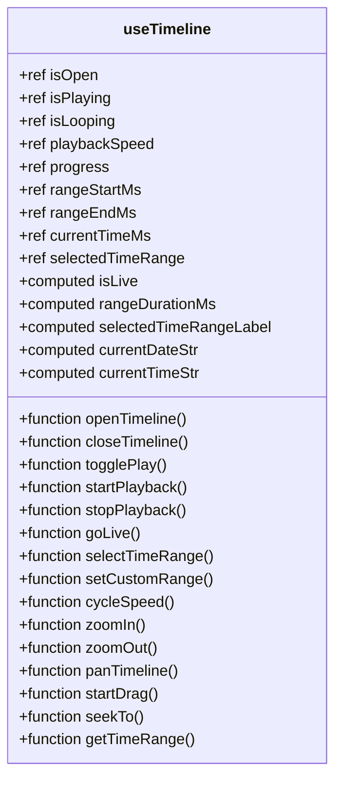
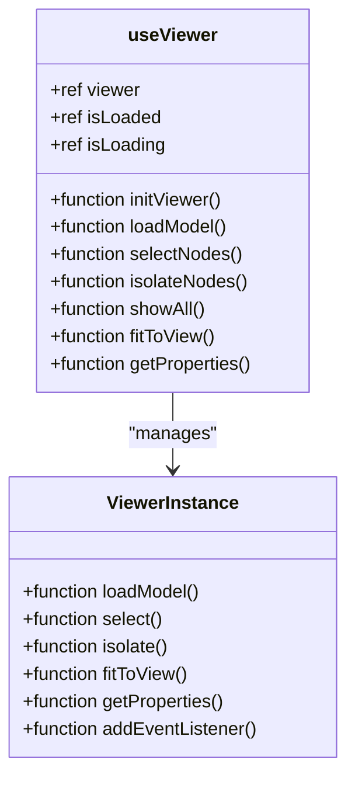
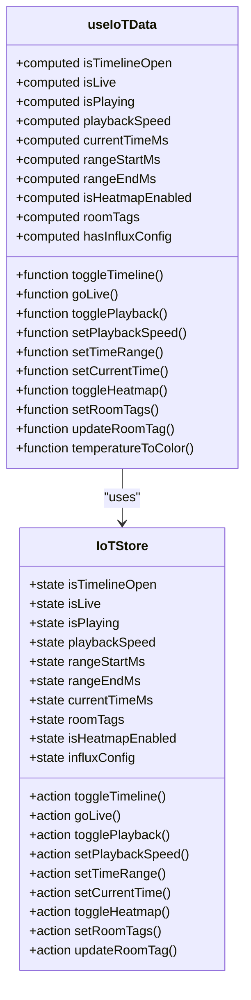
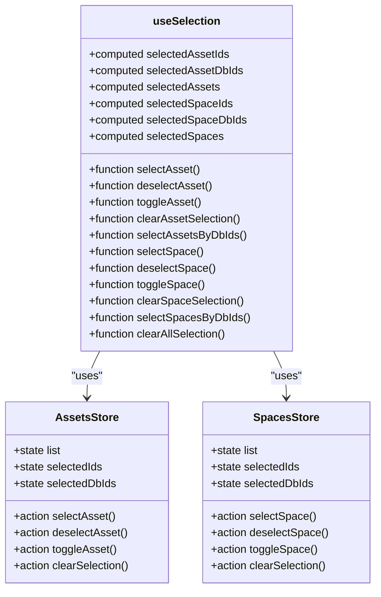
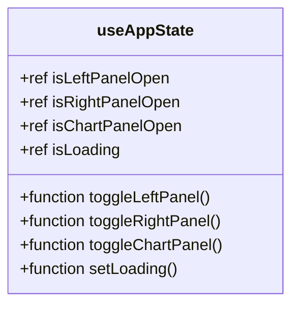
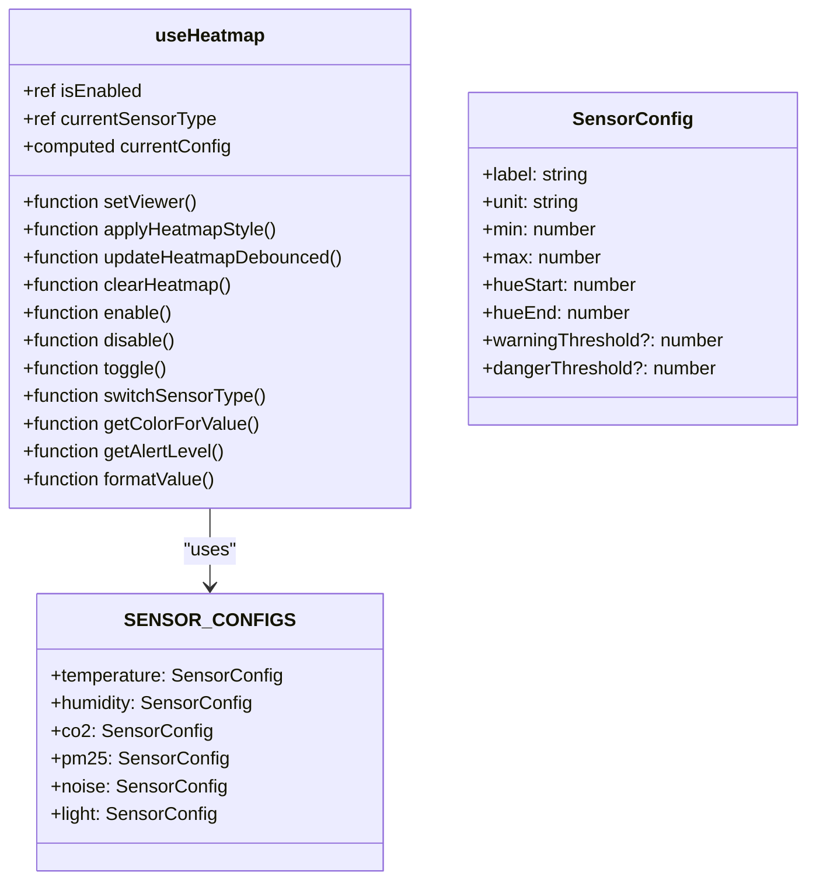
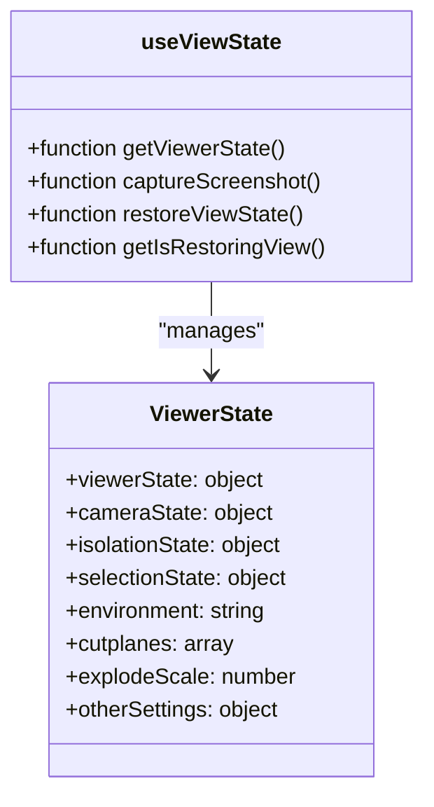
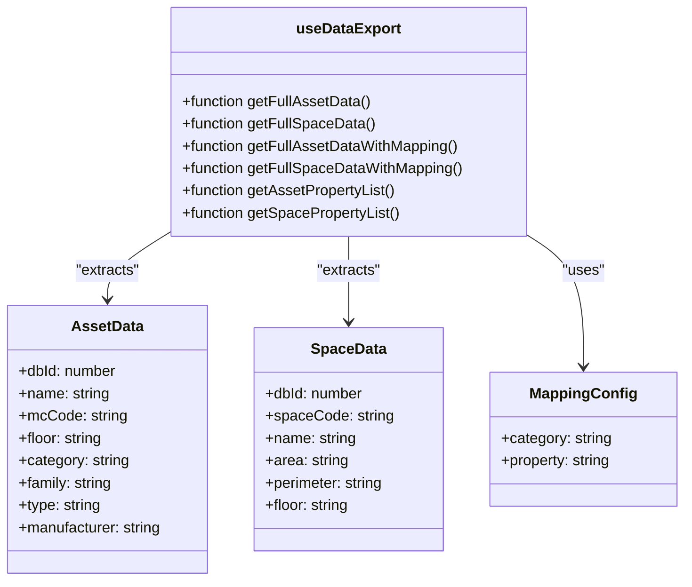
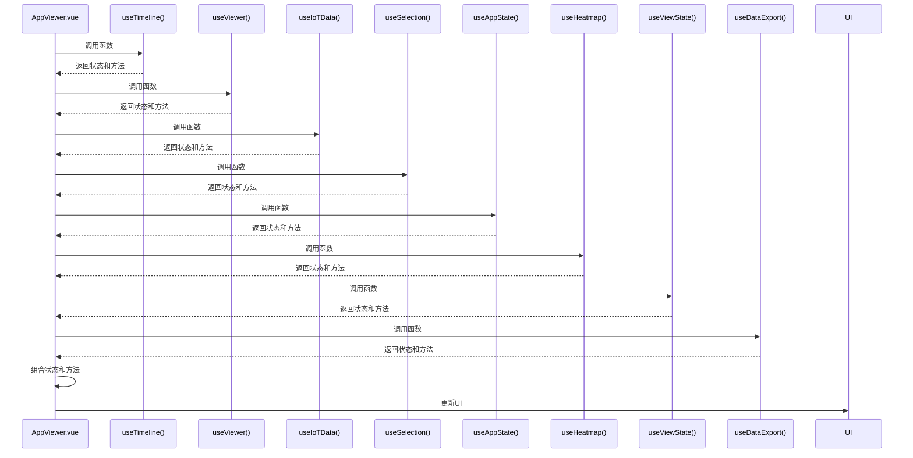

# 组合式函数

<cite>
**本文档引用的文件**
- [useTimeline.ts](file://src/composables/useTimeline.ts)
- [useViewer.ts](file://src/composables/useViewer.ts)
- [useIoTData.ts](file://src/composables/useIoTData.ts)
- [useSelection.ts](file://src/composables/useSelection.ts)
- [useAppState.ts](file://src/composables/useAppState.ts)
- [useHeatmap.ts](file://src/composables/useHeatmap.ts)
- [useViewState.ts](file://src/composables/useViewState.ts)
- [useDataExport.ts](file://src/composables/useDataExport.ts)
- [index.ts](file://src/composables/index.ts)
- [iot.ts](file://src/stores/iot.ts)
- [assets.ts](file://src/stores/assets.ts)
- [spaces.ts](file://src/stores/spaces.ts)
- [AppViewer.vue](file://src/AppViewer.vue)
</cite>

## 目录
1. [引言](#引言)
2. [核心组合式函数设计原理](#核心组合式函数设计原理)
3. [useTimeline：时间轴控制逻辑](#usetimeline时间轴控制逻辑)
4. [useViewer：三维查看器管理](#useviewer三维查看器管理)
5. [useIoTData：物联网数据处理](#useiotdata物联网数据处理)
6. [useSelection：资产与空间选择逻辑](#useselection资产与空间选择逻辑)
7. [useAppState：全局应用状态](#useappstate全局应用状态)
8. [useHeatmap：多传感器热力图](#useheatmap多传感器热力图)
9. [useViewState：视图状态管理](#useviewstate视图状态管理)
10. [useDataExport：数据导出](#usedataexport数据导出)
11. [高级话题：类型推导与性能监控](#高级话题类型推导与性能监控)
12. [组合式函数调用示例](#组合式函数调用示例)
13. [结论](#结论)

## 引言
组合式函数（Composables）是Vue 3中用于逻辑复用的核心模式，它通过`ref`、`reactive`、`watch`等响应式API将可复用的业务逻辑封装成独立的函数。在本项目中，组合式函数被广泛应用于三维查看器的状态管理、时间轴控制、物联网数据处理等复杂场景，有效简化了组件的逻辑复杂度，提升了代码的可维护性和可测试性。本文将深入分析`composables/`目录下的核心函数，探讨其设计原理与内部实现。

## 核心组合式函数设计原理
组合式函数的设计遵循单一职责原则，每个函数专注于解决特定的业务问题。通过将状态和逻辑封装在函数内部，组合式函数实现了逻辑的高内聚和低耦合。在本项目中，组合式函数通过`ref`和`computed`创建响应式状态，通过`watch`监听状态变化并执行副作用，通过返回对象暴露状态和方法供组件使用。这种设计模式使得组件可以专注于UI渲染，而将复杂的业务逻辑委托给组合式函数处理。

**Section sources**
- [useTimeline.ts](file://src/composables/useTimeline.ts#L20-L359)
- [useViewer.ts](file://src/composables/useViewer.ts)
- [useIoTData.ts](file://src/composables/useIoTData.ts#L20-L172)
- [useSelection.ts](file://src/composables/useSelection.ts#L9-L141)
- [useAppState.ts](file://src/composables/useAppState.ts)

## useTimeline：时间轴控制逻辑
`useTimeline`函数封装了时间轴的控制逻辑，包括播放、暂停、快进、倒退、循环播放等功能。它通过`ref`创建了`isPlaying`、`playbackSpeed`、`progress`等响应式状态，并通过`computed`计算了`isLive`、`rangeDurationMs`等派生状态。函数内部通过`setInterval`实现播放逻辑，根据播放速度更新当前时间，并同步到`iotStore`中。`useTimeline`还提供了`startDrag`方法，支持用户通过鼠标拖拽调整时间轴位置。

**Diagram sources **
- [useTimeline.ts](file://src/composables/useTimeline.ts#L20-L359)

**Section sources**
- [useTimeline.ts](file://src/composables/useTimeline.ts#L20-L359)

## useViewer：三维查看器管理
`useViewer`函数负责管理 Forge Viewer 的核心功能，包括初始化、模型加载、选择事件处理、隔离节点等。它通过封装 Viewer 实例的生命周期管理，提供了统一的 API 供组件使用。函数内部处理了 Viewer 的初始化配置、模型加载进度、选择状态同步等复杂逻辑，确保 3D 查看器的稳定运行。

**Diagram sources**
- [useViewer.ts](file://src/composables/useViewer.ts)

**Section sources**
- [useViewer.ts](file://src/composables/useViewer.ts)

## useIoTData：物联网数据处理
`useIoTData`函数封装了物联网数据的获取和处理逻辑，包括温度数据的获取、热力图颜色计算、时间轴控制等。它通过`useIoTStore`获取全局状态，并通过`computed`创建了`isTimelineOpen`、`isLive`、`isPlaying`等派生状态。函数内部通过`temperatureToColor`方法将温度值转换为热力图颜色，支持自定义温度范围和颜色映射。`useIoTData`还提供了`toggleTimeline`、`goLive`、`togglePlayback`等方法，用于控制时间轴的显示和播放状态。

**Diagram sources **
- [useIoTData.ts](file://src/composables/useIoTData.ts#L20-L172)
- [iot.ts](file://src/stores/iot.ts#L53-L205)

**Section sources**
- [useIoTData.ts](file://src/composables/useIoTData.ts#L20-L172)
- [iot.ts](file://src/stores/iot.ts#L53-L205)

## useSelection：资产与空间选择逻辑
`useSelection`函数封装了资产和空间的选择逻辑，包括选择、取消选择、切换选择、清除选择等操作。它通过`useAssetsStore`和`useSpacesStore`获取资产和空间的状态，并通过`computed`创建了`selectedAssetIds`、`selectedAssetDbIds`、`selectedAssets`等派生状态。函数内部通过`selectAsset`、`deselectAsset`、`toggleAsset`等方法实现选择逻辑，并通过`clearAllSelection`方法清除所有选择。`useSelection`还支持根据`dbId`批量选择资产或空间，提高了选择操作的效率。

**Diagram sources **
- [useSelection.ts](file://src/composables/useSelection.ts#L9-L141)
- [assets.ts](file://src/stores/assets.ts#L39-L173)
- [spaces.ts](file://src/stores/spaces.ts#L29-L166)

**Section sources**
- [useSelection.ts](file://src/composables/useSelection.ts#L9-L141)
- [assets.ts](file://src/stores/assets.ts#L39-L173)
- [spaces.ts](file://src/stores/spaces.ts#L29-L166)

## useAppState：全局应用状态
`useAppState`函数封装了全局应用状态的管理，包括面板可见性、加载状态、模态框状态等。它提供了一个统一的状态管理入口，简化了组件间状态共享的复杂度。

**Section sources**
- [useAppState.ts](file://src/composables/useAppState.ts)

## useHeatmap：多传感器热力图
`useHeatmap`函数提供可扩展的热力图可视化功能，支持多种传感器数据类型的实时渲染。

- **支持的传感器类型**：温度(temperature)、湿度(humidity)、二氧化碳(co2)、PM2.5(pm25)、噪音(noise)、光照(light)
- **颜色映射**：基于 HSL 色谱的动态颜色计算，可自定义色相范围
- **性能优化**：支持防抖更新(debounce)和变化阈值检测，避免频繁重绘
- **阈值警告**：可配置警告和危险阈值，自动判断数值级别

**Section sources**
- [useHeatmap.ts](file://src/composables/useHeatmap.ts)

## useViewState：视图状态管理
`useViewState`函数管理 3D Viewer 的视图状态，支持视图的保存、恢复和屏幕快照功能。

- **获取视图状态**：使用 Forge Viewer 官方 API 获取完整状态（相机位置、孤立状态、裁剪面等）
- **屏幕快照**：支持截取 3D 视图快照，自动处理 blob URL 到 base64 的转换
- **恢复视图**：支持恢复保存的视图状态，包含 WorldUpVector 修复逻辑确保 Z 轴向上
- **状态同步**：支持热力图和标签可见性状态的保存和恢复

**Section sources**
- [useViewState.ts](file://src/composables/useViewState.ts)

## useDataExport：数据导出
`useDataExport`函数封装从 3D 模型提取资产和空间数据的逻辑，支持灵活的数据字段映射。

- **资产数据提取**：从模型中提取资产属性（名称、MC编码、分类、制造商等）
- **空间数据提取**：提取空间属性（编号、面积、周长、楼层等）
- **映射配置**：支持灵活的数据字段映射，可将任意模型属性映射到系统字段
- **属性列表**：获取资产和空间的所有可用属性结构，用于映射配置界面

**Section sources**
- [useDataExport.ts](file://src/composables/useDataExport.ts)

## 高级话题：类型推导与性能监控
在组合式函数的设计中，类型推导和性能监控是两个重要的高级话题。通过TypeScript的泛型和接口，组合式函数可以实现精确的类型推导，提高代码的可读性和可维护性。例如，`useTimeline`函数通过`TimeRange`和`TimeOption`接口定义了时间范围和时间选项的类型，确保了参数和返回值的类型安全。在性能监控方面，组合式函数通过`watch`的`flush`选项控制副作用的执行时机，避免不必要的计算和渲染。此外，通过`shallowRef`和`markRaw`等API，可以优化响应式系统的性能，减少不必要的依赖追踪。

**Section sources**
- [useTimeline.ts](file://src/composables/useTimeline.ts#L8-L18)
- [useViewer.ts](file://src/composables/useViewer.ts)
- [useIoTData.ts](file://src/composables/useIoTData.ts#L8-L17)

## 组合式函数调用示例
在`AppViewer.vue`组件中，多个组合式函数被同时使用，展示了组合式函数的强大复用能力。组件通过`useTimeline`、`useViewer`、`useIoTData`、`useSelection`、`useAppState`、`useHeatmap`、`useViewState`、`useDataExport`等函数获取了时间轴、3D查看器、物联网数据、选择状态、全局状态、热力图、视图状态、数据导出等逻辑，并通过`v-model`和事件绑定将这些状态和方法应用到UI组件中。这种组合式函数的调用方式使得组件的逻辑清晰、代码简洁，易于维护和扩展。

**Diagram sources**
- [AppViewer.vue](file://src/AppViewer.vue)

**Section sources**
- [AppViewer.vue](file://src/AppViewer.vue)

## 结论
组合式函数是Vue 3中实现逻辑复用的强大工具，通过将可复用的业务逻辑封装成独立的函数，可以有效简化组件的复杂度，提升代码的可维护性和可测试性。在本项目中，`useTimeline`、`useViewer`、`useIoTData`、`useSelection`、`useAppState`、`useHeatmap`、`useViewState`、`useDataExport`等组合式函数被广泛应用于三维查看器的状态管理、时间轴控制、物联网数据处理、热力图渲染、视图状态管理和数据导出等复杂场景，展示了组合式函数在实际项目中的强大应用价值。通过深入理解组合式函数的设计原理和内部实现，开发者可以更好地利用这一模式，构建高效、可维护的前端应用。