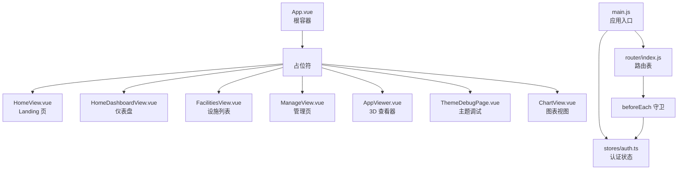
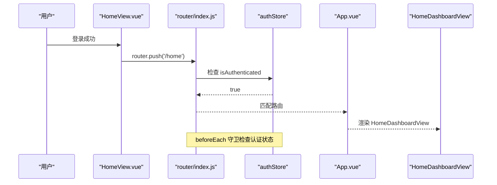
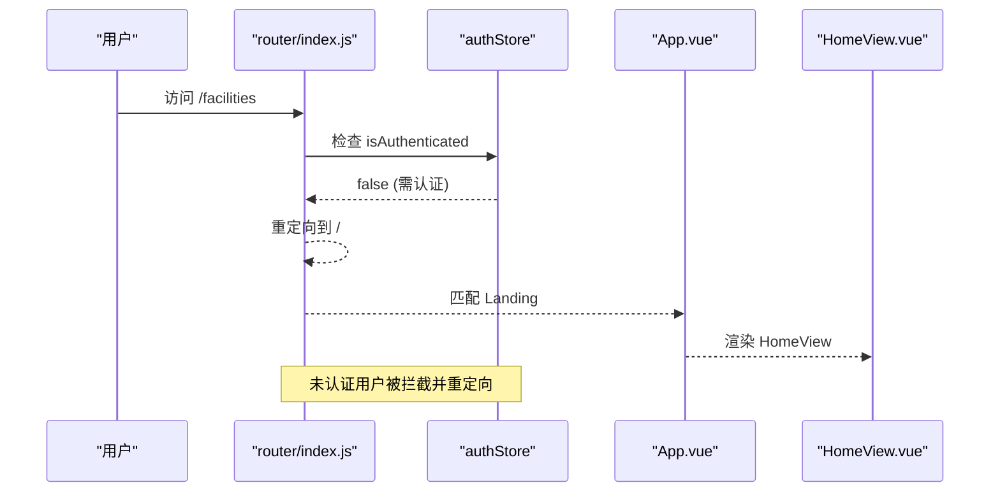
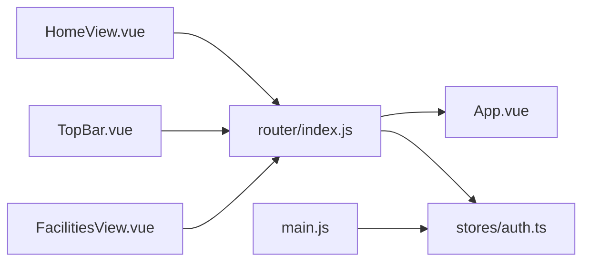

# 路由与导航

<cite>
**本文引用的文件**
- [src/router/index.js](file://src/router/index.js)
- [src/App.vue](file://src/App.vue)
- [src/AppViewer.vue](file://src/AppViewer.vue)
- [src/views/HomeView.vue](file://src/views/HomeView.vue)
- [src/views/HomeDashboardView.vue](file://src/views/HomeDashboardView.vue)
- [src/views/FacilitiesView.vue](file://src/views/FacilitiesView.vue)
- [src/views/ManageView.vue](file://src/views/ManageView.vue)
- [src/main.js](file://src/main.js)
- [src/stores/auth.ts](file://src/stores/auth.ts)
- [src/services/auth.ts](file://src/services/auth.ts)
- [src/components/TopBar.vue](file://src/components/TopBar.vue)
</cite>

## 目录
1. [引言](#引言)
2. [项目结构](#项目结构)
3. [核心组件](#核心组件)
4. [架构总览](#架构总览)
5. [详细组件分析](#详细组件分析)
6. [依赖分析](#依赖分析)
7. [性能考虑](#性能考虑)
8. [故障排查指南](#故障排查指南)
9. [结论](#结论)

## 引言
本章节系统性描述前端路由配置与页面导航机制，围绕 `src/router/index.js` 的路由表定义，解析 Vue Router 的懒加载策略（`import()` 语法）、路由与视图组件的映射关系、全局前置守卫的权限控制实现，以及 `<router-view>` 在 `App.vue` 中的渲染机制。文档涵盖编程式导航（`router.push`）的使用方法、认证守卫的实现逻辑，并提供性能优化和故障排查建议。

## 项目结构
- 路由定义集中于 `src/router/index.js`，采用 `createRouter` + `createWebHistory` 的 History 模式。
- 路由表共定义 8 条路由，分为公开路由和需要认证的受保护路由。
- `App.vue` 作为应用根容器，内部仅包含 `<router-view />`，负责承载当前路由匹配到的视图组件。
- 全局前置守卫 `router.beforeEach` 实现认证拦截，未认证用户访问受保护路由时重定向至首页。



**图表来源**
- [src/App.vue](file://src/App.vue#L1-L12)
- [src/router/index.js](file://src/router/index.js#L1-L81)
- [src/views/HomeView.vue](file://src/views/HomeView.vue)
- [src/main.js](file://src/main.js#L1-L40)

**Section sources**
- [src/router/index.js](file://src/router/index.js#L1-L81)
- [src/App.vue](file://src/App.vue#L1-L12)
- [src/main.js](file://src/main.js#L1-L40)

## 核心组件
- **路由表**（`src/router/index.js`）：定义了 8 条路由，全部采用懒加载组件（`import()` 形式），使用 `createWebHistory()` 构建 History 模式路由器。
- **根容器**（`src/App.vue`）：仅包含 `<router-view />`，用于渲染当前匹配到的视图组件。
- **全局前置守卫**：`router.beforeEach` 实现认证逻辑，已认证用户访问 `/` 自动重定向到 `/home`，未认证用户访问受保护路由时重定向到 `/`。
- **视图组件**：
  - `HomeView.vue`：Landing 页面（公开路由 `/`），包含登录对话框和编程式导航。
  - `HomeDashboardView.vue`：用户仪表盘（`/home`，需认证）。
  - `FacilitiesView.vue`：设施列表页（`/facilities`，需认证）。
  - `ManageView.vue`：管理页面（`/manage`，需认证）。
  - `AppViewer.vue`：3D 查看器主界面（`/viewer` 和 `/assets`，需认证）。

**Section sources**
- [src/router/index.js](file://src/router/index.js#L1-L81)
- [src/App.vue](file://src/App.vue#L1-L12)
- [src/views/HomeView.vue](file://src/views/HomeView.vue)
- [src/views/HomeDashboardView.vue](file://src/views/HomeDashboardView.vue)
- [src/views/FacilitiesView.vue](file://src/views/FacilitiesView.vue)
- [src/views/ManageView.vue](file://src/views/ManageView.vue)
- [src/AppViewer.vue](file://src/AppViewer.vue#L1-L120)
- [src/stores/auth.ts](file://src/stores/auth.ts#L1-L115)

## 架构总览
下图展示从用户交互到视图渲染的端到端流程，包括认证守卫拦截和编程式导航的关键节点。





**图表来源**
- [src/router/index.js](file://src/router/index.js#L67-L79)
- [src/stores/auth.ts](file://src/stores/auth.ts#L1-L115)
- [src/views/HomeView.vue](file://src/views/HomeView.vue)

## 详细组件分析

### 路由表与路由配置

当前路由表共定义 8 条路由：

| 路径 | 组件 | 需认证 | 说明 |
|------|------|--------|------|
| `/` | `HomeView.vue` | 否 | Landing 页（公开），已认证用户自动重定向到 `/home` |
| `/home` | `HomeDashboardView.vue` | 是 | 用户仪表盘 |
| `/facilities` | `FacilitiesView.vue` | 是 | 设施列表页 |
| `/manage` | `ManageView.vue` | 是 | 管理页面 |
| `/viewer` | `AppViewer.vue` | 是 | 3D 查看器主界面 |
| `/assets` | `AppViewer.vue` | 是 | 资产视图（复用 AppViewer） |
| `/theme-debug` | `ThemeDebugPage.vue` | 否 | 主题调试页面 |
| `/chart-view` | `ChartView.vue` | 否 | 图表独立视图 |

所有路由均采用 `import()` 语法进行懒加载，实现代码分割。

**Section sources**
- [src/router/index.js](file://src/router/index.js#L1-L60)

### 全局前置守卫（beforeEach）

路由实例上注册了全局前置守卫，实现认证拦截逻辑：

```js
router.beforeEach((to) => {
  const authStore = useAuthStore()

  // 已认证用户访问 Landing 页时，重定向到仪表盘
  if (to.path === '/' && authStore.isAuthenticated) {
    return '/home'
  }

  // 未认证用户访问需认证路由时，重定向到 Landing 页
  if (to.meta.requiresAuth && !authStore.isAuthenticated) {
    return '/'
  }

  return true
})
```

守卫逻辑：
1. 已认证用户访问 `/`（Landing）时，自动重定向到 `/home`（仪表盘）。
2. 未认证用户访问 `meta.requiresAuth` 为 `true` 的路由时，重定向到 `/`（Landing）。
3. 其他情况放行。

受保护的路由通过 `meta: { requiresAuth: true }` 标记，包括：`/home`、`/facilities`、`/manage`、`/viewer`、`/assets`。

**Section sources**
- [src/router/index.js](file://src/router/index.js#L67-L79)
- [src/stores/auth.ts](file://src/stores/auth.ts#L1-L115)

### 编程式导航

各组件中广泛使用 `useRouter().push()` 进行编程式导航：

- **HomeView.vue**：登录成功后调用 `router.push('/home')` 跳转到仪表盘。
- **TopBar.vue**：提供导航按钮，使用 `router.push()` 在不同视图间切换。
- **FacilitiesView.vue**：用户点击设施卡片时导航到 `/viewer` 查看3D模型。

**Section sources**
- [src/views/HomeView.vue](file://src/views/HomeView.vue)
- [src/components/TopBar.vue](file://src/components/TopBar.vue)

### `<router-view>` 渲染机制
- `App.vue` 仅包含 `<router-view />`，作为全局路由容器，所有路由切换都会在此处渲染对应组件。
- `AppViewer.vue` 作为 `/viewer` 和 `/assets` 的承载组件，切换这两个路由时复用同一组件实例，通过查询参数或路由元信息区分不同视图状态。

**Section sources**
- [src/App.vue](file://src/App.vue#L1-L12)
- [src/AppViewer.vue](file://src/AppViewer.vue#L1-L120)

## 依赖分析
- 路由与视图：`src/router/index.js` 定义路由表，`App.vue` 通过 `<router-view>` 渲染视图。
- 认证守卫：守卫依赖 `stores/auth.ts` 的 `isAuthenticated` 状态进行权限判断。
- 编程式导航：`HomeView.vue`、`TopBar.vue` 等组件通过 `useRouter()` 获取路由实例。



**图表来源**
- [src/router/index.js](file://src/router/index.js#L1-L81)
- [src/App.vue](file://src/App.vue#L1-L12)
- [src/main.js](file://src/main.js#L1-L40)
- [src/stores/auth.ts](file://src/stores/auth.ts#L1-L115)

**Section sources**
- [src/router/index.js](file://src/router/index.js#L1-L81)
- [src/App.vue](file://src/App.vue#L1-L12)
- [src/main.js](file://src/main.js#L1-L40)
- [src/stores/auth.ts](file://src/stores/auth.ts#L1-L115)

## 性能考虑
- **懒加载与代码分割**：路由组件采用 `import()` 懒加载，减少首屏加载体积，提升初始渲染性能。
- **路由切换开销**：`AppViewer.vue` 作为 `/viewer` 和 `/assets` 的承载组件，切换时复用同一组件实例，避免重复初始化。
- **守卫性能**：`beforeEach` 守卫仅读取 Pinia store 状态，无异步操作，性能开销极低。
- **建议**：对频繁切换的视图可考虑 `keep-alive` 缓存以进一步降低切换成本。

**Section sources**
- [src/router/index.js](file://src/router/index.js#L1-L81)
- [src/AppViewer.vue](file://src/AppViewer.vue#L1-L120)

## 故障排查指南
- **路由无法匹配或空白页**：检查路由路径是否与组件懒加载路径一致，确认 `import()` 路径正确，确认 `App.vue` 中存在 `<router-view />`。
- **编程式导航无效**：确认组件内已通过 `useRouter()` 获取路由实例，并在正确的生命周期或事件中调用 `router.push`。
- **认证守卫未生效**：确认受保护路由已设置 `meta: { requiresAuth: true }`，检查 `authStore.checkAuth()` 是否在应用挂载前执行。
- **认证状态异常**：检查 `localStorage` 中是否存在 `accessToken`，必要时清理后重新登录。
- **已认证用户停留在 Landing 页**：检查 `beforeEach` 守卫中 `/` 到 `/home` 的重定向逻辑是否正常工作。

**Section sources**
- [src/router/index.js](file://src/router/index.js#L67-L79)
- [src/stores/auth.ts](file://src/stores/auth.ts#L1-L115)
- [src/main.js](file://src/main.js#L20-L40)

## 结论
本项目采用 History 模式的 Vue Router，通过懒加载与 `<router-view>` 实现清晰的路由与视图映射。全局前置守卫实现了认证拦截，已认证用户自动重定向到仪表盘，未认证用户被限制访问受保护路由。整体架构简洁、职责清晰，支持 8 条路由的灵活配置和扩展。
