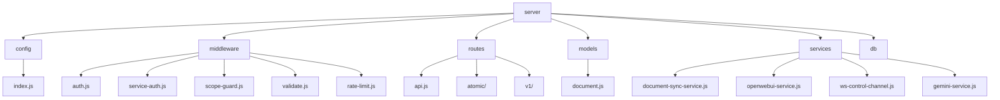
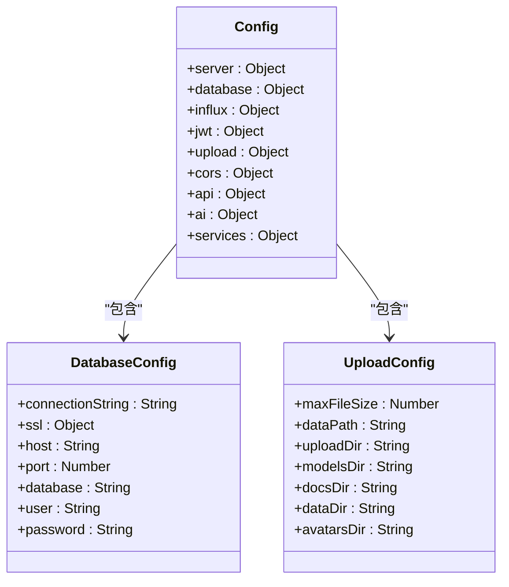
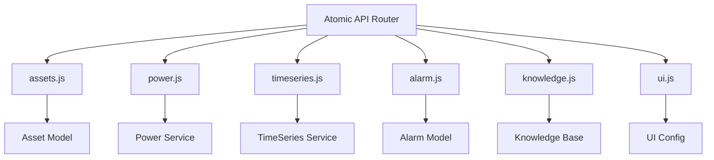
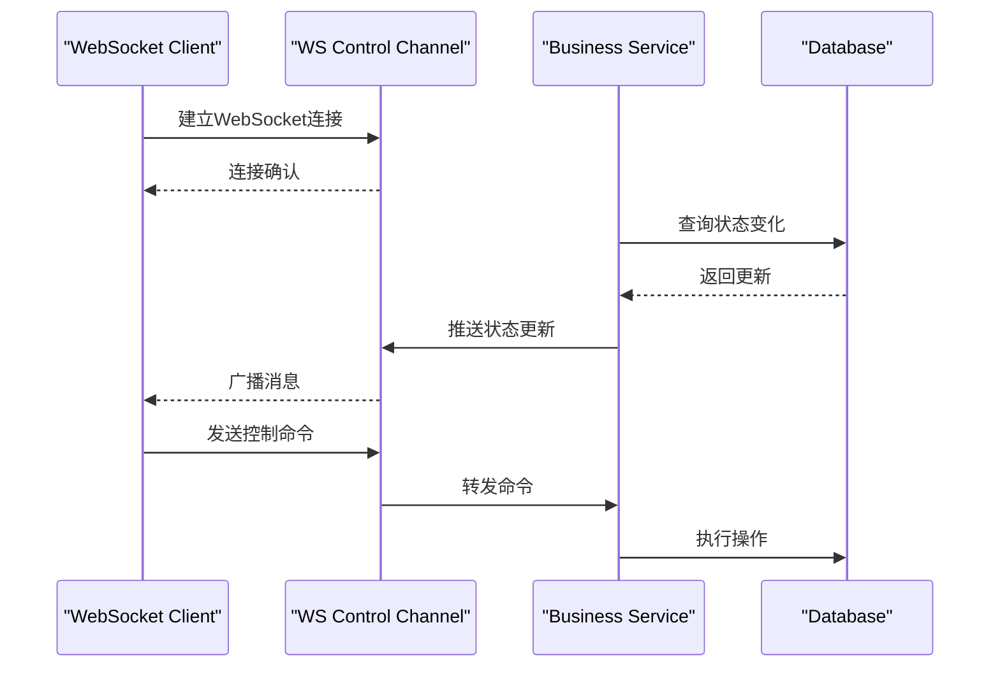
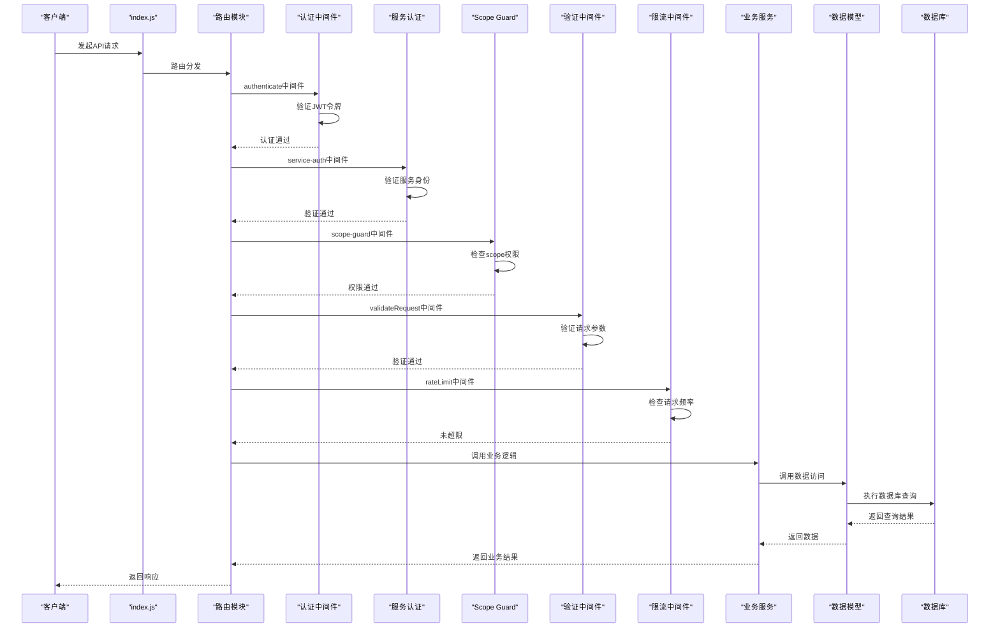
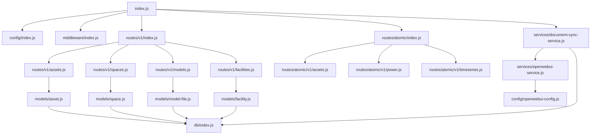

# 后端架构

<cite>
**本文档引用的文件**
- [index.js](file://server/index.js)
- [config/index.js](file://server/config/index.js)
- [middleware/index.js](file://server/middleware/index.js)
- [middleware/auth.js](file://server/middleware/auth.js)
- [middleware/service-auth.js](file://server/middleware/service-auth.js)
- [middleware/scope-guard.js](file://server/middleware/scope-guard.js)
- [middleware/validate.js](file://server/middleware/validate.js)
- [middleware/rate-limit.js](file://server/middleware/rate-limit.js)
- [routes/api.js](file://server/routes/api.js)
- [routes/atomic/index.js](file://server/routes/atomic/index.js)
- [routes/v1/index.js](file://server/routes/v1/index.js)
- [routes/v1/facilities.js](file://server/routes/v1/facilities.js)
- [services/document-sync-service.js](file://server/services/document-sync-service.js)
- [services/openwebui-service.js](file://server/services/openwebui-service.js)
- [services/ws-control-channel.js](file://server/services/ws-control-channel.js)
- [services/gemini-service.js](file://server/services/gemini-service.js)
- [models/document.js](file://server/models/document.js)
- [models/facility.js](file://server/models/facility.js)
- [config/auth.js](file://server/config/auth.js)
- [db/index.js](file://server/db/index.js)
</cite>

## 目录
1. [项目结构](#项目结构)
2. [核心架构](#核心架构)
3. [新增组件 (2025-03)](#新增组件-2025-03)
4. [请求处理流程](#请求处理流程)
5. [配置中心化](#配置中心化)
6. [服务层设计](#服务层设计)
7. [中间件机制](#中间件机制)
8. [Atomic API 架构](#atomic-api-架构)
9. [WebSocket 控制通道](#websocket-控制通道)
10. [API请求处理序列图](#api请求处理序列图)
11. [可扩展性设计](#可扩展性设计)
12. [安全性实践](#安全性实践)
13. [依赖分析](#依赖分析)

## 项目结构



**图表来源**  
- [server](file://server)

**章节来源**  
- [server](file://server)

## 核心架构

本系统采用基于Express.js的MVC模式实现，构建了一个模块化、可扩展的后端服务架构。系统通过清晰的分层设计实现了关注点分离，包括路由分发、中间件链、业务逻辑服务层和数据访问模型层。整个架构以`server/index.js`为入口，通过模块化的方式组织代码，确保了系统的可维护性和可测试性。

**章节来源**  
- [index.js](file://server/index.js)

## 新增组件 (2025-03)

最新代码更新引入了以下重要组件：

### Atomic API v1
全新的原子化API设计，位于 `server/routes/atomic/v1/`，包含：
- **assets.js** - 资产管理接口
- **power.js** - 功率数据接口
- **timeseries.js** - 时序数据接口
- **alarm.js** - 告警管理接口
- **knowledge.js** - 知识库接口
- **ui.js** - UI配置接口

### 服务认证中间件 (service-auth.js)
新增服务间认证机制，位于 `server/middleware/service-auth.js`，实现了微服务架构中的服务身份验证。

### Scope Guard (scope-guard.js)
新增细粒度权限控制中间件，位于 `server/middleware/scope-guard.js`，支持基于scope的访问控制。

### WebSocket 控制通道 (ws-control-channel.js)
新增实时双向通信服务，位于 `server/services/ws-control-channel.js`，支持实时控制和状态推送。

## 请求处理流程

系统遵循标准的MVC请求处理流程：入口（index.js）→ 路由分发（routes）→ 中间件链（auth, service-auth, scope-guard, validate, rate-limit）→ 业务逻辑（services）→ 数据访问（models）。当客户端发起API请求时，首先由`index.js`中的Express应用实例接收，然后根据请求路径分发到相应的路由模块。

**章节来源**  
- [index.js](file://server/index.js)
- [routes/api.js](file://server/routes/api.js)

## 配置中心化



**图表来源**  
- [config/index.js](file://server/config/index.js)

**章节来源**  
- [config/index.js](file://server/config/index.js)

## 服务层设计

```mermaid
classDiagram
class DocumentSyncService {
+isSyncing : boolean
+getUnsyncedDocuments() : Promise~Array~
+findKnowledgeBaseId(doc) : Promise~String~
+syncDocument(doc, kbId) : Promise~boolean~
+runBatchSync() : Promise~Object~
+startSyncService(intervalMs) : void
+triggerSync() : Promise~Object~
}
class OpenWebUIService {
+checkHealth() : Promise~boolean~
+createKnowledgeBase(name, desc) : Promise~Object~
+listKnowledgeBases() : Promise~Array~
+getKnowledgeBase(kbId) : Promise~Object~
+deleteKnowledgeBase(kbId) : void
+isSupportedFormat(filePath) : boolean
+uploadDocument(kbId, filePath, fileName) : Promise~Object~
+listDocuments(kbId) : Promise~Array~
+chatWithRAG(options) : Promise~Object~
+syncDocumentsToKB(kbId, docs) : Promise~Object~
}
class WSControlChannel {
+initialize(server) : void
+broadcast(message) : void
+sendToClient(clientId, message) : void
}
class GeminiService {
+analyzeTemperatureAlert(alertData) : Promise~Object~
}
DocumentSyncService --> OpenWebUIService : "依赖"
DocumentSyncService --> "db/index.js" : "依赖"
GeminiService --> "config-service.js" : "依赖"
```

**图表来源**  
- [services/document-sync-service.js](file://server/services/document-sync-service.js)
- [services/openwebui-service.js](file://server/services/openwebui-service.js)
- [services/ws-control-channel.js](file://server/services/ws-control-channel.js)
- [services/gemini-service.js](file://server/services/gemini-service.js)

**章节来源**  
- [services/document-sync-service.js](file://server/services/document-sync-service.js)
- [services/openwebui-service.js](file://server/services/openwebui-service.js)
- [services/ws-control-channel.js](file://server/services/ws-control-channel.js)
- [services/gemini-service.js](file://server/services/gemini-service.js)

## 中间件机制

```mermaid
classDiagram
class AuthMiddleware {
+authenticate(req, res, next) : void
+authorize(permission) : Middleware
+optionalAuth(req, res, next) : void
}
class ServiceAuthMiddleware {
+authenticateService(req, res, next) : void
+verifyServiceToken(token) : boolean
}
class ScopeGuardMiddleware {
+guard(scope) : Middleware
+checkPermission(req, scope) : boolean
}
class ValidateMiddleware {
+validateRequest(req, res, next) : void
+commonValidators : Object
}
class RateLimitMiddleware {
+rateLimit(options) : Middleware
+strictRateLimit : Middleware
+loginRateLimit : Middleware
}
class ErrorHandler {
+ApiError
+notFoundHandler
+errorHandler
}
AuthMiddleware --> "config/index.js" : "依赖"
AuthMiddleware --> "config/auth.js" : "依赖"
ServiceAuthMiddleware --> "config/index.js" : "依赖"
ScopeGuardMiddleware --> "config/auth.js" : "依赖"
ValidateMiddleware --> "express-validator" : "依赖"
RateLimitMiddleware --> "requestCounts" : "依赖"
```

**图表来源**  
- [middleware/auth.js](file://server/middleware/auth.js)
- [middleware/service-auth.js](file://server/middleware/service-auth.js)
- [middleware/scope-guard.js](file://server/middleware/scope-guard.js)
- [middleware/validate.js](file://server/middleware/validate.js)
- [middleware/rate-limit.js](file://server/middleware/rate-limit.js)

**章节来源**  
- [middleware/auth.js](file://server/middleware/auth.js)
- [middleware/service-auth.js](file://server/middleware/service-auth.js)
- [middleware/scope-guard.js](file://server/middleware/scope-guard.js)
- [middleware/validate.js](file://server/middleware/validate.js)
- [middleware/rate-limit.js](file://server/middleware/rate-limit.js)

## Atomic API 架构

Atomic API 是系统新引入的原子化API设计，采用RESTful风格，专注于单一资源的高效操作。



**图表来源**  
- [routes/atomic/index.js](file://server/routes/atomic/index.js)
- [routes/atomic/v1/](file://server/routes/atomic/v1/)

## WebSocket 控制通道

WebSocket 控制通道提供了实时双向通信能力，支持：
- 实时状态推送
- 远程控制命令
- 多客户端广播
- 连接管理和心跳检测



**图表来源**  
- [services/ws-control-channel.js](file://server/services/ws-control-channel.js)

## API请求处理序列图



**图表来源**  
- [index.js](file://server/index.js)
- [middleware/auth.js](file://server/middleware/auth.js)
- [middleware/service-auth.js](file://server/middleware/service-auth.js)
- [middleware/scope-guard.js](file://server/middleware/scope-guard.js)
- [middleware/validate.js](file://server/middleware/validate.js)
- [middleware/rate-limit.js](file://server/middleware/rate-limit.js)
- [services/document-sync-service.js](file://server/services/document-sync-service.js)
- [models/document.js](file://server/models/document.js)

## 可扩展性设计

系统通过模块化路由设计实现了良好的可扩展性。`routes/v1/index.js` 和 `routes/atomic/index.js` 作为不同版本API的路由聚合点，通过导入和挂载不同的路由模块实现了功能模块的解耦。

**章节来源**  
- [routes/v1/index.js](file://server/routes/v1/index.js)
- [routes/atomic/index.js](file://server/routes/atomic/index.js)

## 安全性实践

系统实施了多层次的安全性实践：

1. **JWT认证** - 通过`config/auth.js`和`middleware/auth.js`实现用户身份验证
2. **服务间认证** - 新增`middleware/service-auth.js`实现微服务间的安全通信
3. **Scope权限控制** - 新增`middleware/scope-guard.js`实现细粒度权限控制
4. **输入验证** - 通过`middleware/validate.js`防止注入攻击
5. **限流保护** - 通过`middleware/rate-limit.js`防止API滥用
6. **CORS控制** - 配置跨域请求策略
7. **环境变量管理** - 敏感信息通过`.env`文件管理，避免硬编码

**章节来源**  
- [config/auth.js](file://server/config/auth.js)
- [middleware/auth.js](file://server/middleware/auth.js)
- [middleware/service-auth.js](file://server/middleware/service-auth.js)
- [middleware/scope-guard.js](file://server/middleware/scope-guard.js)
- [config/index.js](file://server/config/index.js)

## 依赖分析



**图表来源**
- [index.js](file://server/index.js)
- [config/index.js](file://server/config/index.js)
- [middleware/index.js](file://server/middleware/index.js)
- [routes/v1/index.js](file://server/routes/v1/index.js)
- [routes/v1/facilities.js](file://server/routes/v1/facilities.js)
- [routes/atomic/index.js](file://server/routes/atomic/index.js)
- [services/document-sync-service.js](file://server/services/document-sync-service.js)
- [services/openwebui-service.js](file://server/services/openwebui-service.js)
- [models/facility.js](file://server/models/facility.js)
- [db/index.js](file://server/db/index.js)

---

**最后更新**: 2026-03-19
**更新说明**: 新增设施管理路由模块（facilities.js）与数据模型（facility.js）文档引用
