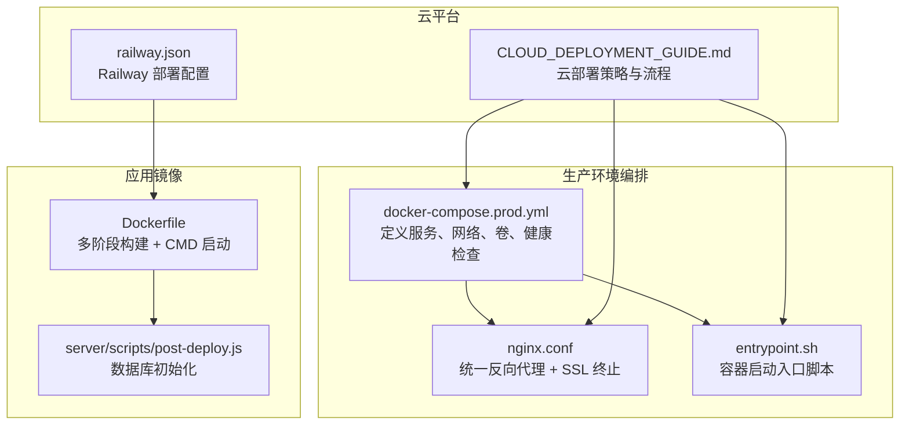
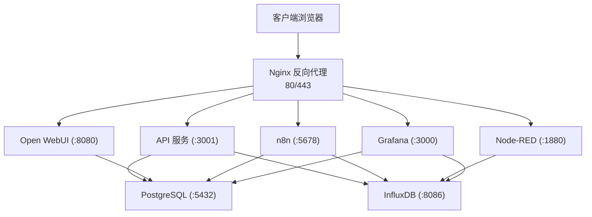
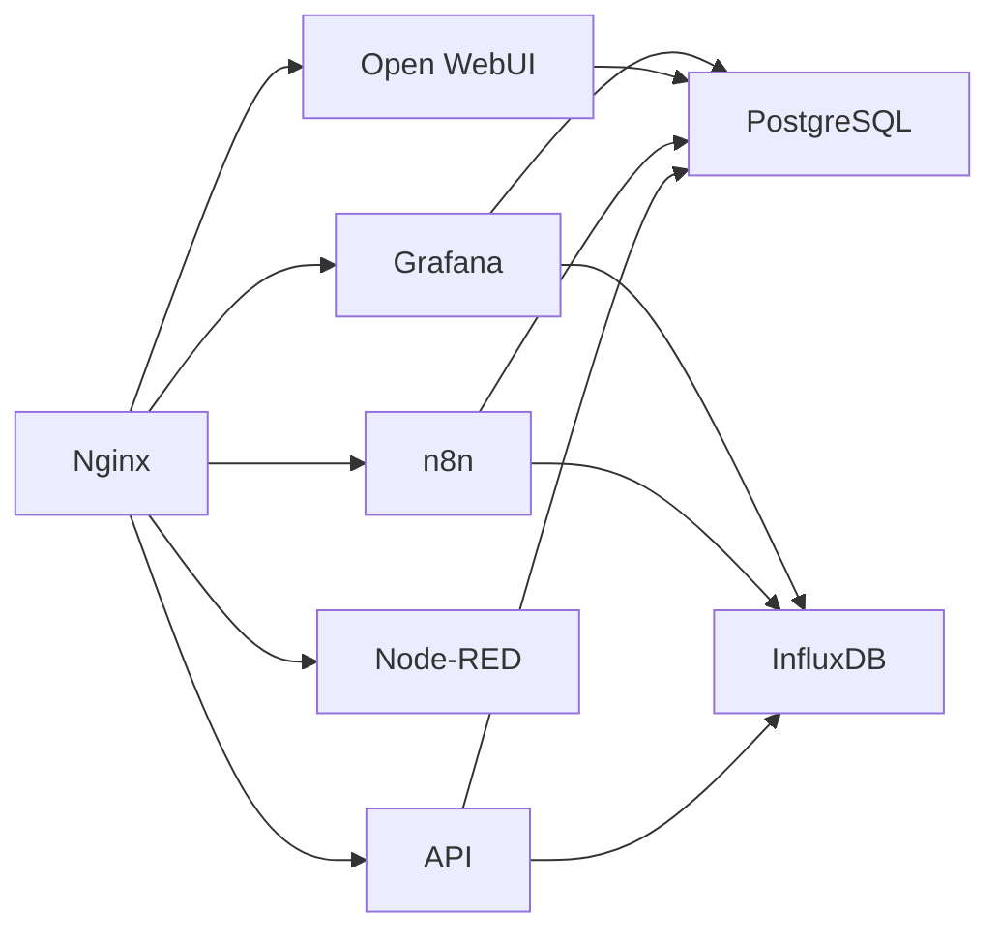

# 部署与运维

<cite>
**本文引用的文件**
- [docker/docker-compose.prod.yml](file://docker/docker-compose.prod.yml)
- [docker/nginx.conf](file://docker/nginx.conf)
- [docker/entrypoint.sh](file://docker/entrypoint.sh)
- [.env.production](file://.env.production)
- [docker/.env.production.example](file://docker/.env.production.example)
- [CLOUD_DEPLOYMENT_GUIDE.md](file://CLOUD_DEPLOYMENT_GUIDE.md)
- [Dockerfile](file://Dockerfile)
- [server/scripts/post-deploy.js](file://server/scripts/post-deploy.js)
- [docker/README.md](file://docker/README.md)
- [railway.json](file://railway.json)
</cite>

## 目录
1. [简介](#简介)
2. [项目结构](#项目结构)
3. [核心组件](#核心组件)
4. [架构总览](#架构总览)
5. [详细组件分析](#详细组件分析)
6. [依赖关系分析](#依赖关系分析)
7. [性能与容量规划](#性能与容量规划)
8. [故障排查指南](#故障排查指南)
9. [结论](#结论)
10. [附录](#附录)

## 简介
本手册面向生产环境部署与运维，围绕基于 Docker 的多环境部署（开发、测试、生产）进行系统性说明。重点覆盖：
- docker/ 目录下的 docker-compose.prod.yml、nginx.conf、entrypoint.sh 在生产环境的作用与配置要点
- 环境变量（.env.production 与 docker/.env.production.example）的配置方法
- 反向代理与 SSL 证书的设置
- 容器监控、日志查看与常用运维命令
- 系统升级与回滚策略
- 云平台（Railway 等）部署要点与一键部署实践

## 项目结构
本项目采用“多阶段构建 + Docker Compose 生产编排”的方式，将前端构建产物与后端服务打包进同一镜像，并通过 Nginx 统一反向代理对外提供服务。生产环境编排文件定义了核心应用、数据库、AI/IoT/监控等服务，以及网络与卷的组织方式。

图表来源
- [docker/docker-compose.prod.yml](file://docker/docker-compose.prod.yml#L1-L262)
- [docker/nginx.conf](file://docker/nginx.conf#L1-L240)
- [docker/entrypoint.sh](file://docker/entrypoint.sh#L1-L36)
- [Dockerfile](file://Dockerfile#L1-L75)
- [server/scripts/post-deploy.js](file://server/scripts/post-deploy.js#L1-L182)
- [railway.json](file://railway.json#L1-L12)
- [CLOUD_DEPLOYMENT_GUIDE.md](file://CLOUD_DEPLOYMENT_GUIDE.md#L1-L740)

章节来源
- [docker/docker-compose.prod.yml](file://docker/docker-compose.prod.yml#L1-L262)
- [docker/nginx.conf](file://docker/nginx.conf#L1-L240)
- [docker/entrypoint.sh](file://docker/entrypoint.sh#L1-L36)
- [Dockerfile](file://Dockerfile#L1-L75)
- [server/scripts/post-deploy.js](file://server/scripts/post-deploy.js#L1-L182)
- [CLOUD_DEPLOYMENT_GUIDE.md](file://CLOUD_DEPLOYMENT_GUIDE.md#L1-L740)
- [.env.production](file://.env.production#L1-L4)
- [docker/.env.production.example](file://docker/.env.production.example#L1-L104)
- [railway.json](file://railway.json#L1-L12)

## 核心组件
- 生产编排（docker-compose.prod.yml）
  - 定义核心服务：PostgreSQL（含 PGVector 扩展）、API、Nginx、InfluxDB、n8n、Open WebUI、Node-RED、Grafana
  - 健康检查与重启策略
  - 网络与卷的声明
- 反向代理（nginx.conf）
  - 统一 80/443 端口，HTTPS 证书加载，路径到上游服务的映射
  - WebSocket/SSE 支持、长连接超时、安全头
- 容器入口脚本（entrypoint.sh）
  - 等待数据库就绪、执行数据库初始化脚本、启动应用
- 环境变量
  - .env.production（前端 API 基础路径）
  - docker/.env.production.example（生产环境变量模板）
- 镜像与启动
  - Dockerfile 多阶段构建，CMD 启动应用；Railway 通过 railway.json 覆盖启动命令
- 数据库初始化
  - server/scripts/post-deploy.js 自动检测并创建表结构、扩展与基础数据

章节来源
- [docker/docker-compose.prod.yml](file://docker/docker-compose.prod.yml#L1-L262)
- [docker/nginx.conf](file://docker/nginx.conf#L1-L240)
- [docker/entrypoint.sh](file://docker/entrypoint.sh#L1-L36)
- [.env.production](file://.env.production#L1-L4)
- [docker/.env.production.example](file://docker/.env.production.example#L1-L104)
- [Dockerfile](file://Dockerfile#L1-L75)
- [server/scripts/post-deploy.js](file://server/scripts/post-deploy.js#L1-L182)
- [railway.json](file://railway.json#L1-L12)

## 架构总览
生产环境采用“统一反向代理 + 多服务编排”的架构，Nginx 作为唯一入口，负责 SSL 终止、路径转发与长连接支持；各后端服务通过内网网络互通，数据库与时序数据库分别承载结构化与时序数据。

图表来源
- [docker/docker-compose.prod.yml](file://docker/docker-compose.prod.yml#L1-L262)
- [docker/nginx.conf](file://docker/nginx.conf#L1-L240)

## 详细组件分析

### 生产编排（docker-compose.prod.yml）
- 服务角色与端口
  - API：Node.js 后端，监听 3001，依赖数据库健康
  - PostgreSQL：带 PGVector 扩展，持久化数据卷
  - InfluxDB：时序数据库，初始化参数与持久化
  - n8n：工作流自动化，支持 Webhook 与基本认证
  - Open WebUI：AI 对话界面，兼容 Gemini API
  - Node-RED：IoT 数据流处理
  - Grafana：可视化仪表盘
- 网络与卷
  - 自定义桥接网络 tandem-network
  - 多个命名卷用于持久化
- 健康检查
  - API、n8n、Node-RED 均配置健康检查
- 使用说明
  - 启动核心服务与包含管理工具的 profile
  - 日志查看与停止服务

章节来源
- [docker/docker-compose.prod.yml](file://docker/docker-compose.prod.yml#L1-L262)

### 反向代理（nginx.conf）
- 统一入口与路径映射
  - /api/* → API
  - /ai/* → Open WebUI
  - /n8n/* → n8n
  - /nodered/* → Node-RED
  - /grafana/* → Grafana
  - /docs/ → 文档静态资源
  - /webhook/ → n8n Webhook
  - /health → API 健康检查
- SSL 与安全
  - 443 端口监听，证书链与私钥路径
  - TLS 版本、加密套件、安全头
  - Let’s Encrypt ACME 验证路径
- 性能与长连接
  - keepalive、gzip、超时配置
  - WebSocket/SSE 支持

章节来源
- [docker/nginx.conf](file://docker/nginx.conf#L1-L240)

### 容器入口脚本（entrypoint.sh）
- 启动流程
  - 检测 DATABASE_URL 或 DB_HOST 是否配置
  - 执行数据库初始化脚本（post-deploy.js）
  - 启动 Node.js 应用
- 错误处理
  - 初始化失败时退出，避免启动异常应用

章节来源
- [docker/entrypoint.sh](file://docker/entrypoint.sh#L1-L36)
- [server/scripts/post-deploy.js](file://server/scripts/post-deploy.js#L1-L182)

### 环境变量配置
- .env.production（前端）
  - VITE_API_URL 为空字符串表示同源请求
- docker/.env.production.example（生产环境模板）
  - 时区、域名、数据库、InfluxDB、AI 服务、监控、通知等配置项
  - 必填项标注与获取方式说明
  - SSL 证书放置位置说明
- Railway 集成
  - railway.json 中 startCommand 可覆盖容器启动行为
  - CLOUD_DEPLOYMENT_GUIDE.md 提供变量配置与部署流程

章节来源
- [.env.production](file://.env.production#L1-L4)
- [docker/.env.production.example](file://docker/.env.production.example#L1-L104)
- [railway.json](file://railway.json#L1-L12)
- [CLOUD_DEPLOYMENT_GUIDE.md](file://CLOUD_DEPLOYMENT_GUIDE.md#L1-L740)

### 镜像与启动流程
- Dockerfile
  - 多阶段构建：前端构建产物与后端依赖合并
  - 生产镜像安装 wget 用于健康检查
  - CMD 指向 node index.js
- 启动顺序
  - Nginx 依赖 API、n8n、Open WebUI
  - API 依赖数据库健康
  - entrypoint.sh 在 API 中执行初始化逻辑

章节来源
- [Dockerfile](file://Dockerfile#L1-L75)
- [docker/docker-compose.prod.yml](file://docker/docker-compose.prod.yml#L1-L262)
- [docker/entrypoint.sh](file://docker/entrypoint.sh#L1-L36)

### 数据库初始化机制（post-deploy.js）
- 初始化流程
  - 优先使用 DATABASE_URL（云服务注入）
  - 等待数据库就绪（最多重试若干次）
  - 检查核心表是否存在，不存在则创建并执行完整 schema
  - 创建必要扩展（如 uuid-ossp）
  - 创建系统基础数据（幂等）
- 生产环境 SSL
  - 在生产或使用 DATABASE_URL 时启用 SSL（允许自签名）

章节来源
- [server/scripts/post-deploy.js](file://server/scripts/post-deploy.js#L1-L182)

### 云平台部署要点（Railway）
- 部署配置
  - railway.json 指定 Dockerfile 构建与重启策略
  - CLOUD_DEPLOYMENT_GUIDE.md 提供变量配置、自定义域名、端口暴露与服务关系
- 一键部署
  - Railway 模板可生成一键部署链接
- 前后端分离部署
  - Vercel 前端 + Railway 后端的组合方案

章节来源
- [railway.json](file://railway.json#L1-L12)
- [CLOUD_DEPLOYMENT_GUIDE.md](file://CLOUD_DEPLOYMENT_GUIDE.md#L1-L740)

## 依赖关系分析
- 组件耦合
  - API 依赖数据库健康
  - Nginx 依赖 API、n8n、Open WebUI、Node-RED、Grafana
  - entrypoint.sh 依赖数据库初始化脚本
- 外部依赖
  - SSL 证书（Let’s Encrypt 或自签名）
  - InfluxDB（时序数据）
  - Gemini API（AI 能力）
- 循环依赖
  - 无显式循环依赖，服务间通过内网网络通信

图表来源
- [docker/docker-compose.prod.yml](file://docker/docker-compose.prod.yml#L1-L262)
- [docker/nginx.conf](file://docker/nginx.conf#L1-L240)

## 性能与容量规划
- Nginx 性能
  - keepalive、gzip、超时参数已配置，适合高并发静态与长连接场景
- 数据库与时序数据库
  - PostgreSQL 使用 PGVector 扩展，适合向量检索
  - InfluxDB 用于时序数据，建议结合云服务或独立实例
- 容器资源
  - 建议为各服务设置合理的内存与 CPU 限额，结合监控指标动态调整
- 镜像与构建
  - 多阶段构建减少镜像体积，提升拉取与启动速度

[本节为通用指导，无需列出具体文件来源]

## 故障排查指南
- 健康检查与日志
  - 使用 docker-compose logs -f 查看实时日志
  - API 健康检查端点：/api/health
- 常见问题定位
  - 数据库连接失败：检查 DATABASE_URL 或独立配置，确认网络连通与凭据
  - Nginx 404/502：检查上游服务是否就绪，路径映射是否正确
  - SSL 证书错误：确认证书链与私钥路径，权限与格式
  - n8n/Node-RED/Grafana 无法访问：检查端口暴露与网络连通
- AI/IoT 服务
  - 参考 docker/README.md 中的快速排查步骤

章节来源
- [docker/docker-compose.prod.yml](file://docker/docker-compose.prod.yml#L1-L262)
- [docker/nginx.conf](file://docker/nginx.conf#L1-L240)
- [docker/README.md](file://docker/README.md#L1-L105)

## 结论
本手册提供了从零到上线的完整生产部署与运维路径：明确 docker-compose.prod.yml、nginx.conf、entrypoint.sh 的职责与配置要点，规范环境变量与 SSL 证书管理，给出容器监控与日志查看的实用命令，并总结升级与回滚策略。结合 CLOUD_DEPLOYMENT_GUIDE.md 的云平台部署实践，可快速实现稳定、可观测、可扩展的生产环境。

[本节为总结性内容，无需列出具体文件来源]

## 附录

### 多环境部署流程（开发/测试/生产）
- 开发环境
  - 使用 docker-compose.yml 或 docker-compose.dev.yml（如存在）
  - 本地数据库与静态资源挂载，便于调试
- 测试环境
  - 使用 docker-compose.prod.yml，但使用较小资源规格与独立域名
  - 配置测试专用 InfluxDB 与数据库快照
- 生产环境
  - 使用 docker/docker-compose.prod.yml，配合 Nginx 与 SSL
  - 通过 CLOUD_DEPLOYMENT_GUIDE.md 的云平台方案部署

章节来源
- [docker/docker-compose.prod.yml](file://docker/docker-compose.prod.yml#L1-L262)
- [CLOUD_DEPLOYMENT_GUIDE.md](file://CLOUD_DEPLOYMENT_GUIDE.md#L1-L740)

### 环境变量清单与配置要点
- 关键变量
  - 数据库：DB_HOST、DB_PORT、DB_NAME、DB_USER、DB_PASSWORD、DATABASE_URL
  - InfluxDB：INFLUX_ORG、INFLUX_BUCKET、INFLUX_USER、INFLUX_PASSWORD、INFLUX_TOKEN
  - AI 服务：GEMINI_API_KEY、N8N_AUTH_USER、N8N_AUTH_PASSWORD、N8N_WEBHOOK_URL
  - 监控：GRAFANA_USER、GRAFANA_PASSWORD、GRAFANA_ROOT_URL
  - 通知：SMTP_*、阿里云短信与企业微信配置
- 配置来源
  - .env.production（前端）
  - docker/.env.production.example（生产模板）
  - Railway 变量注入（DATABASE_URL 等）

章节来源
- [.env.production](file://.env.production#L1-L4)
- [docker/.env.production.example](file://docker/.env.production.example#L1-L104)
- [CLOUD_DEPLOYMENT_GUIDE.md](file://CLOUD_DEPLOYMENT_GUIDE.md#L1-L740)

### 反向代理与 SSL 证书配置
- Nginx 配置要点
  - 443 端口监听，证书链与私钥路径
  - 路径映射与 WebSocket/SSE 支持
  - 安全头与超时设置
- 证书获取
  - Let’s Encrypt（推荐）
  - 自签名证书（开发/测试）
- 证书放置
  - 将 fullchain.pem 与 privkey.pem 放置于 docker/ssl 目录

章节来源
- [docker/nginx.conf](file://docker/nginx.conf#L1-L240)
- [docker/.env.production.example](file://docker/.env.production.example#L1-L104)

### 容器监控、日志与常用命令
- 启停与查看
  - docker-compose -f docker-compose.prod.yml up -d
  - docker-compose -f docker-compose.prod.yml logs -f
  - docker-compose -f docker-compose.prod.yml down
- 健康检查
  - /api/health
- AI/IoT 服务排查
  - 参考 docker/README.md 的 n8n 与 Qdrant 排查步骤

章节来源
- [docker/docker-compose.prod.yml](file://docker/docker-compose.prod.yml#L1-L262)
- [docker/README.md](file://docker/README.md#L1-L105)

### 系统升级与回滚策略
- 升级策略
  - 多阶段滚动升级：先更新镜像，再逐个容器重启，观察健康检查
  - 数据库变更采用迁移脚本，确保幂等与备份
- 回滚策略
  - 保留旧镜像标签，回退时切换镜像版本
  - 数据库回滚：使用备份快照恢复至变更前状态
- 变更管理
  - 使用 Git 标签与发布分支，配合 CI/CD 自动化部署

[本节为通用指导，无需列出具体文件来源]

### 云平台部署要点（Railway）
- 部署流程
  - 新建项目 → 选择仓库 → 添加 PostgreSQL → 配置环境变量 → 部署
- 变量配置
  - DATABASE_URL（云服务自动注入）
  - GEMINI_API_KEY、InfluxDB 相关变量
- 自定义域名
  - 在 Railway 项目设置中添加域名
- 一键模板
  - 生成 Railway 模板链接，客户一键部署

章节来源
- [CLOUD_DEPLOYMENT_GUIDE.md](file://CLOUD_DEPLOYMENT_GUIDE.md#L1-L740)
- [railway.json](file://railway.json#L1-L12)