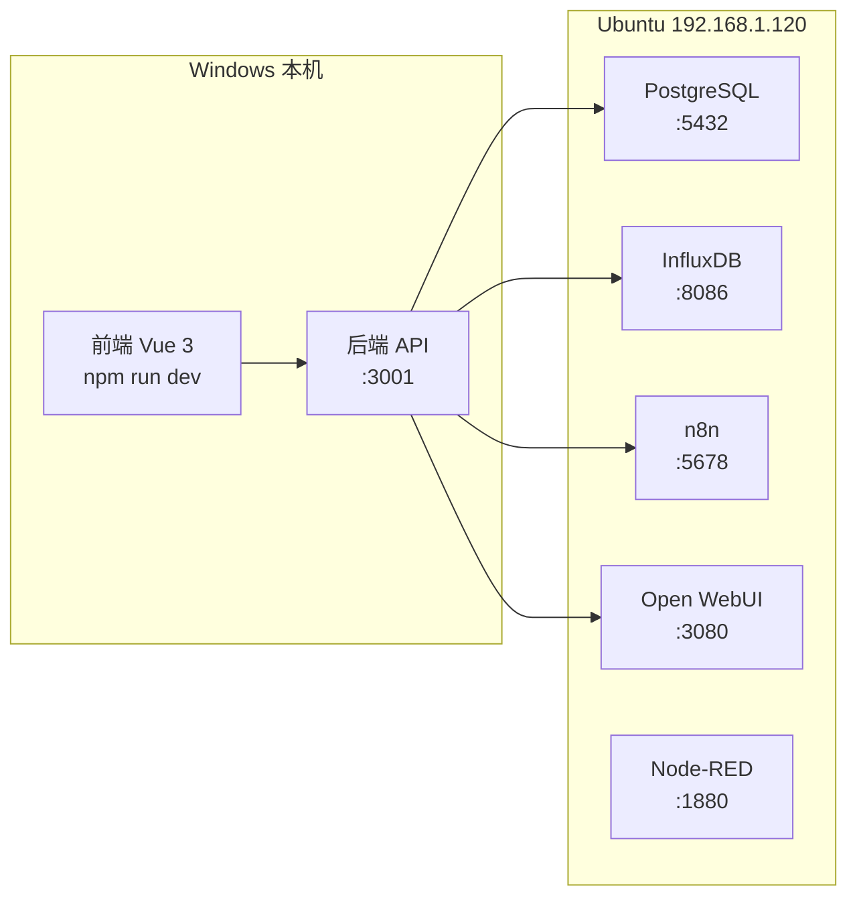

# Docker 服务迁移至局域网 Ubuntu 服务器实施计划

> **服务器 IP**: 192.168.1.120  
> **创建日期**: 2026-01-19

## 概述

将本地 Windows Docker 环境中的服务（PostgreSQL、InfluxDB、Node-RED、n8n、Open WebUI）迁移至局域网 Ubuntu 24.04 服务器。迁移后，本地开发只需运行前端和后端 API，通过网络连接到 Ubuntu 服务器上的数据库和 AI 服务，从而节省本机资源。



---

## 已创建的配置文件

| 文件 | 用途 |
|------|------|
| [docker-compose.lan.yml](file:///d:/TwinSIght/antigravity/twinsight/docker/docker-compose.lan.yml) | 局域网 Docker Compose 配置 |
| [.env.lan.example](file:///d:/TwinSIght/antigravity/twinsight/docker/.env.lan.example) | 局域网环境变量模板 |
| [.env.production.example](file:///d:/TwinSIght/antigravity/twinsight/docker/.env.production.example) | 生产环境变量模板 |
| [PASSWORD_MANAGEMENT.md](file:///d:/TwinSIght/antigravity/twinsight/docs/PASSWORD_MANAGEMENT.md) | 密码管理规范 |
| [.env.lan](file:///d:/TwinSIght/antigravity/twinsight/.env.lan) | 本地开发连接 Ubuntu 的环境变量 |

## 已创建的脚本

| 脚本 | 用途 | 运行环境 |
|------|------|----------|
| [export-data.ps1](file:///d:/TwinSIght/antigravity/twinsight/scripts/export-data.ps1) | 导出本地 Docker 数据 | Windows PowerShell |
| [deploy-lan.sh](file:///d:/TwinSIght/antigravity/twinsight/scripts/deploy-lan.sh) | Ubuntu 服务器部署 | Ubuntu Bash |
| [import-data.sh](file:///d:/TwinSIght/antigravity/twinsight/scripts/import-data.sh) | 导入数据到 Ubuntu | Ubuntu Bash |

---

## 第一步：上传配置文件到 Ubuntu 服务器

在 Windows PowerShell 中执行：

```powershell
# 上传 Docker Compose 配置
scp d:\TwinSIght\antigravity\twinsight\docker\docker-compose.lan.yml user@192.168.1.120:/opt/twinsight/docker-compose.yml

# 上传环境变量文件
scp d:\TwinSIght\antigravity\twinsight\docker\.env.lan.example user@192.168.1.120:/opt/twinsight/.env

# 上传部署脚本
scp d:\TwinSIght\antigravity\twinsight\scripts\deploy-lan.sh user@192.168.1.120:/opt/twinsight/
scp d:\TwinSIght\antigravity\twinsight\scripts\import-data.sh user@192.168.1.120:/opt/twinsight/
```

> [!TIP]
> 如果使用 SSH 密钥登录，请确保已配置好 `~/.ssh/config`。如果使用密码登录，会提示输入密码。

---

## 第二步：在 Ubuntu 服务器上准备环境

SSH 登录到 Ubuntu 服务器后执行：

```bash
# 创建项目目录（如果不存在）
sudo mkdir -p /opt/twinsight
sudo chown $USER:$USER /opt/twinsight
cd /opt/twinsight

# 编辑环境变量文件，填写实际值
nano .env

# 赋予脚本执行权限
chmod +x deploy-lan.sh import-data.sh
```

**需要编辑的 `.env` 配置项：**

```ini
# 确认服务器 IP
LAN_SERVER_IP=192.168.1.120

# 填写 Gemini API Key
GEMINI_API_KEY=your-actual-gemini-api-key
```

---

## 第三步：启动 Docker 服务

在 Ubuntu 服务器上执行：

```bash
cd /opt/twinsight

# 方式一：使用部署脚本（推荐）
./deploy-lan.sh

# 方式二：手动启动
docker compose pull
docker compose up -d
docker compose ps
```

验证服务状态：

```bash
# 查看所有服务状态
docker compose ps

# 查看日志
docker compose logs -f

# 测试 PostgreSQL 连接
docker exec twinsight-postgres pg_isready -U postgres

# 测试 InfluxDB
curl http://localhost:8086/health
```

---

## 第四步：导出本地数据 (Windows)

在 Windows PowerShell 中执行：

```powershell
cd d:\TwinSIght\antigravity\twinsight

# 运行数据导出脚本
.\scripts\export-data.ps1

# 或者手动导出 PostgreSQL
docker exec twinsight-postgres pg_dump -U postgres twinsight > D:\TwinSIght\backup\postgres_backup.sql
```

脚本会导出：
- PostgreSQL 完整数据库
- PostgreSQL 仅结构（用于生产环境初始化）
- InfluxDB 数据备份

---

## 第五步：上传并导入数据 (Ubuntu)

```powershell
# Windows: 上传备份文件
scp -r D:\TwinSIght\backup\migration_* user@192.168.1.120:/opt/twinsight/backup/
```

```bash
# Ubuntu: 导入数据
cd /opt/twinsight
./import-data.sh /opt/twinsight/backup/migration_*

# 或手动导入 PostgreSQL
docker exec -i twinsight-postgres psql -U postgres twinsight < /opt/twinsight/backup/postgres_twinsight.sql
```

### 手动导入 Node-RED 和 n8n

| 服务 | 访问地址 | 导入步骤 |
|------|----------|----------|
| Node-RED | http://192.168.1.120:1880 | 右上角菜单 → Import → 选择 flows.json |
| n8n | http://192.168.1.120:5678 | 右上角 → Import from File → 选择工作流 JSON |

---

## 第六步：配置本地开发环境

### 方式一：使用预配置的 .env.lan 文件

```powershell
# 备份当前配置
Copy-Item .env.local .env.local.backup

# 使用局域网配置
Copy-Item .env.lan .env.local
```

### 方式二：手动修改 .env.local

编辑 `d:\TwinSIght\antigravity\twinsight\.env.local`：

```ini
# API 服务器配置
VITE_API_URL=http://localhost:3001

# PostgreSQL - 连接到 Ubuntu 服务器
DB_HOST=192.168.1.120
DB_PORT=5432
DB_NAME=twinsight
DB_USER=postgres
DB_PASSWORD=password

# InfluxDB - 连接到 Ubuntu 服务器
INFLUX_URL=http://192.168.1.120:8086
INFLUX_ORG=demo
INFLUX_BUCKET=twinsight
INFLUX_TOKEN=SsFt9slg5E2jS6HmvxuaePjebpkNVRi-S0wrDexjQWOFXDeARRY8NeJ-_Dqe6eAzsyuWtIVHFmSs3XMuv0x1ww==

# AI 服务 - 连接到 Ubuntu 服务器
OPENWEBUI_URL=http://192.168.1.120:3080
OPENWEBUI_API_KEY=sk-d88ba6f39e21479491e9ab3f7d5e11d7
N8N_WEBHOOK_URL=http://192.168.1.120:5678
```

### 测试连接

```powershell
# 启动后端 API
cd server
npm run dev

# 在另一个终端启动前端
npm run dev
```

---

## 服务访问地址汇总

| 服务 | 本地开发 (之前) | 局域网 Ubuntu (迁移后) |
|------|-----------------|------------------------|
| PostgreSQL | localhost:5432 | 192.168.1.120:5432 |
| InfluxDB | http://localhost:8086 | http://192.168.1.120:8086 |
| Node-RED | http://localhost:1880 | http://192.168.1.120:1880 |
| n8n | http://localhost:5678 | http://192.168.1.120:5678 |
| Open WebUI | http://localhost:3080 | http://192.168.1.120:3080 |

---

## 生产环境部署一致性

### 配置对比

| 方面 | 局域网 (192.168.1.120) | 阿里云 ECS |
|------|------------------------|------------|
| Docker Compose | docker-compose.lan.yml | docker-compose.prod.yml |
| 网络模式 | 直接端口暴露 | Nginx 反向代理 |
| SSL | 无 | Let's Encrypt |
| 域名 | IP 访问 | 自定义域名 |
| 密码 | 开发/测试密码 | 强密码 (见密码规范) |

### 迁移到阿里云 ECS

1. 使用 `docker/docker-compose.prod.yml`
2. 配置 `.env.production.example` → `.env`
3. 申请 SSL 证书
4. 配置 Nginx 反向代理
5. 更新密码为生产级别

详细步骤参考：[ALIBABA_ECS_DEPLOYMENT.md](file:///d:/TwinSIght/antigravity/twinsight/ALIBABA_ECS_DEPLOYMENT.md)

---

## 密码管理

请参考 [PASSWORD_MANAGEMENT.md](file:///d:/TwinSIght/antigravity/twinsight/docs/PASSWORD_MANAGEMENT.md) 了解：

- 各环境密码强度要求
- 密码轮换策略
- 密钥管理工具推荐
- 紧急响应流程

---

## 故障排除

### 无法连接到 Ubuntu 服务器

```bash
# 检查 Ubuntu 防火墙
sudo ufw status
sudo ufw allow 5432/tcp  # PostgreSQL
sudo ufw allow 8086/tcp  # InfluxDB
sudo ufw allow 1880/tcp  # Node-RED
sudo ufw allow 5678/tcp  # n8n
sudo ufw allow 3080/tcp  # Open WebUI
```

### Docker 服务无法启动

```bash
# 查看详细日志
docker compose logs [service-name]

# 检查磁盘空间
df -h

# 检查内存
free -m
```

### 本地开发无法连接数据库

```powershell
# 测试网络连接
Test-NetConnection -ComputerName 192.168.1.120 -Port 5432

# 检查 .env.local 配置是否正确
Get-Content .env.local
```
