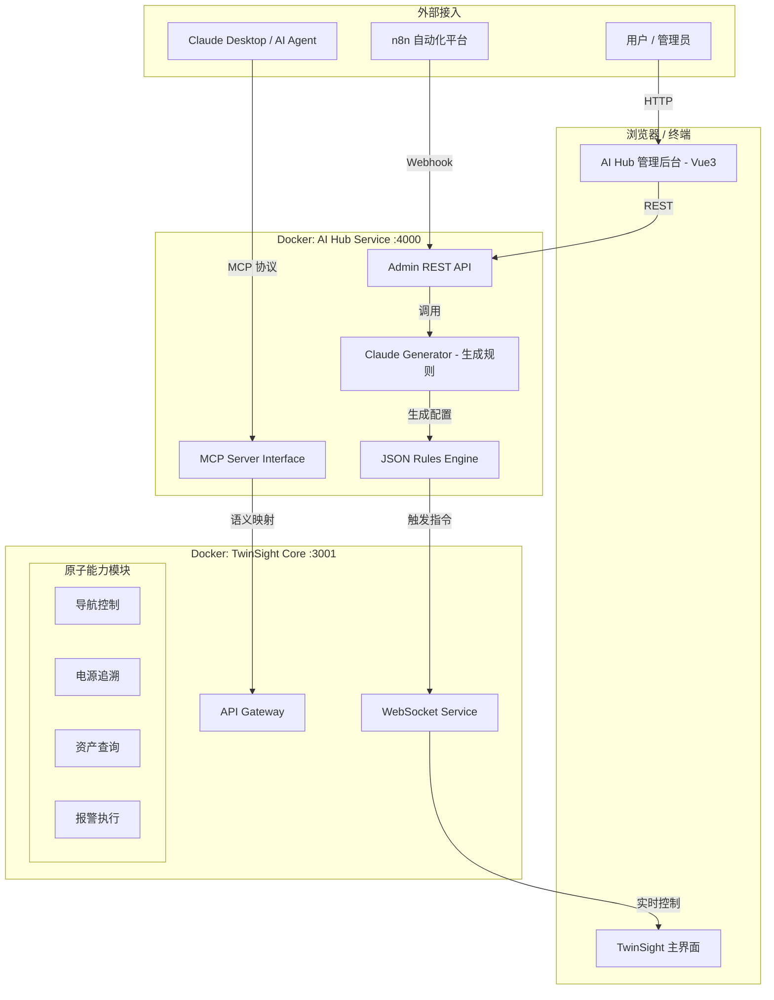
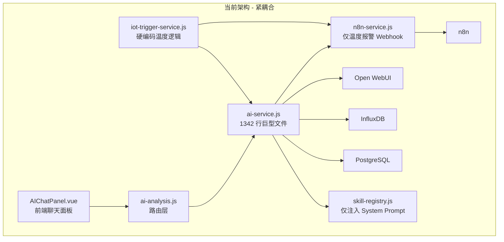

# AI 能力中心重构规划 (v3.0)

> **核心目标**：解耦业务代码与 AI 逻辑，实现用户"零代码"配置规则，并通过 MCP 协议将 TwinSight 能力标准化暴露给外部世界。

---

## 1. 系统架构概览

### 1.1 核心设计理念

* **TwinSight (现有)** → 退化为**"手脚"**。只提供原子 API（查数据、查资产）和执行指令（页面跳转、高亮构件）。
* **AI Hub (新建)** → 升级为**"大脑"**。负责语义理解（MCP）、逻辑判断（规则引擎）和任务分发。

### 1.2 架构拓扑



### 1.3 通信协议定位

| 通道 | 协议 | 方向 | 用途 |
|------|------|------|------|
| **对外（AI 客户端）** | MCP (Streamable HTTP) | Claude Desktop ↔ AI Hub | 标准化 AI 接口，工具/资源发现与调用 |
| **对内（前端控制）** | WebSocket (Socket.io) | AI Hub → TwinSight 前端 | 实时页面跳转、构件高亮等 UI 指令 |
| **管理界面** | REST API | Admin UI ↔ AI Hub | 规则/工具 CRUD，AI 生成，日志查询 |
| **原子调用** | HTTP REST | AI Hub → TwinSight API | 数据查询、电源追溯等原子操作 |
| **N8N 集成** | Webhook | n8n → AI Hub | 自动化流程触发规则评估 |

### 1.4 现有架构（待重构）



### 1.5 核心问题

| # | 问题 | 具体表现 | 影响 |
|---|------|----------|------|
| 1 | **巨型服务** | `ai-service.js` 包含聊天、报警、分析、数据预取、引用格式化 | 无法独立维护 |
| 2 | **硬编码业务** | 温度报警直接写死在 `processTemperatureAlert`，n8n path 硬编码 | 新增传感器需改代码 |
| 3 | **技能无执行层** | 3 个 `.skill.json` 仅注入 Prompt，前端正则解析 action 块 | 不可靠，外部不可调用 |
| 4 | **触发器僵化** | `iot-trigger-service.js` 仅数值比较，动作仅 n8n/builtin | 无法扩展 |
| 5 | **能力封闭** | 电源追溯、温度查询等能力无标准化接口 | 外部 AI 无法使用 |

---

## 2. 技术选型与栈

| 模块 | 选型 | 理由 |
| --- | --- | --- |
| **规则引擎** | **json-rules-engine** | Node.js 原生，JSON 格式对 LLM 极其友好，支持事实 (Fact) 动态加载 |
| **对外协议** | **Model Context Protocol (MCP)** | 标准化 AI 接口，支持 Claude Desktop 直接连接，未来扩展性强 |
| **管理前端** | **Vue 3 + Element Plus** | 快速开发，与 TwinSight 技术栈统一，易于集成可视化组件 |
| **AI 生成** | **Claude 3.5 Sonnet API** (通过 Open WebUI) | 用于将用户的自然语言需求转换为 json-rules-engine 的配置 |
| **通信管道** | **WebSocket (Socket.io)** | 实现 AI Hub 对 TwinSight 前端界面的实时控制（如导航跳转） |

---

## 3. 新增服务规格

### 3.1 AI Hub (MCP Server + 规则引擎 + Admin API)

| 属性 | 值 |
|------|-----|
| **容器名** | `twinsight-ai-hub` |
| **端口** | `4000` (MCP Streamable HTTP + REST API) |
| **运行时** | Node.js 20 |
| **协议** | MCP 2025-11-25 (Streamable HTTP Transport) |
| **依赖** | `@modelcontextprotocol/sdk`, `express`, `json-rules-engine`, `socket.io-client` |
| **数据存储** | PostgreSQL (复用现有实例，新增 `ai_hub` schema) |
| **配置** | 通过环境变量注入 TwinSight API 地址 |

#### 目录结构

```
ai-hub/
├── Dockerfile
├── package.json
├── src/
│   ├── index.js                    # 入口：启动 MCP Server + REST API
│   ├── mcp/
│   │   ├── server.js               # MCP Server 初始化 & Streamable HTTP 传输
│   │   ├── tool-adapter.js         # 将 Tool 适配为 MCP Tool
│   │   └── resource-adapter.js     # 将数据源适配为 MCP Resource
│   ├── chat/
│   │   ├── orchestrator.js         # 聊天编排器（意图识别 → 工具调用 → 结果组合）
│   │   ├── intent-detector.js      # 意图检测（query / create-rule / create-tool / navigate）
│   │   ├── response-builder.js     # 响应构建（合并多 Tool 结果 + LLM 总结）
│   │   └── nl-generator.js         # NL2Rule / NL2Tool：自然语言 → 结构化 JSON
│   ├── tools/
│   │   ├── base-tool.js            # Tool 基类（统一通过 HTTP 调用 TwinSight API）
│   │   ├── tool-registry.js        # 工具注册表（内存 + DB 持久化）
│   │   ├── builtin/                # 内置工具（均通过 TwinSight API Gateway）
│   │   │   ├── query-timeseries.js  # → POST /api/v1/tools/query-timeseries
│   │   │   ├── knowledge-search.js  # → POST /api/v1/tools/knowledge-search
│   │   │   ├── power-trace.js       # → POST /api/v1/tools/power-trace
│   │   │   ├── navigate-module.js   # → POST /api/v1/tools/navigate
│   │   │   └── query-assets.js      # → POST /api/v1/tools/query-assets
│   │   └── custom/                 # 用户自定义工具 (运行时加载)
│   ├── rules/
│   │   ├── engine.js               # json-rules-engine 封装
│   │   ├── almanac-adapter.js      # 事实适配器：自动从 TwinSight API 获取实时数据
│   │   └── event-handler.js        # 事件处理器：规则触发后的动作分发（Webhook/WebSocket/通知）
│   ├── api/
│   │   ├── chat.js                 # POST /api/chat (聊天入口)
│   │   ├── tools.js                # GET/POST/PUT/DELETE /api/tools
│   │   ├── rules.js                # GET/POST/PUT/DELETE /api/rules
│   │   ├── executions.js           # GET /api/executions (执行日志)
│   │   ├── webhook.js              # POST /webhook/n8n/trigger (N8N 适配)
│   │   └── health.js               # GET /api/health
│   └── db/
│       ├── schema.sql              # AI Hub 专用表
│       └── index.js                # 数据库连接
```

#### 核心数据表 (`ai_hub` schema)

##### 规则存储结构 (`ai_rules`)

> [!IMPORTANT]
> 规则使用 `json-rules-engine` 原生 JSON 格式存储，LLM 可直接生成此格式。

```json
{
  "rule_id": "rule_001",
  "name": "齿轮箱高温报警",
  "description": "自然语言描述：当齿轮箱温度>75且风机运行中...",
  "enabled": true,
  "priority": 10,
  "engine_config": {
    "conditions": {
      "all": [
        {
          "fact": "sensor_reading",
          "path": "$.value",
          "operator": "greaterThan",
          "value": 75,
          "params": { "sensor_code": "=A1.GR1.Temp" }
        }
      ]
    },
    "event": {
      "type": "dispatch_alert",
      "params": { "level": "critical", "msg": "过热风险" }
    }
  }
}
```

##### 完整 Schema (SQL)

```sql
-- 工具定义表
CREATE TABLE ai_hub.tools (
    id          UUID PRIMARY KEY DEFAULT gen_random_uuid(),
    tool_id     VARCHAR(100) UNIQUE NOT NULL,  -- 如 'query-timeseries'
    name        VARCHAR(200) NOT NULL,
    description TEXT,
    category    VARCHAR(50),                   -- 'iot' | 'bim' | 'nav' | 'data'
    parameters  JSONB NOT NULL,                -- JSON Schema 格式参数定义
    endpoint    JSONB NOT NULL,                -- { "method":"POST", "url":"http://api:3001/api/v1/..." }
    is_builtin  BOOLEAN DEFAULT false,
    enabled     BOOLEAN DEFAULT true,
    created_at  TIMESTAMPTZ DEFAULT NOW(),
    updated_at  TIMESTAMPTZ DEFAULT NOW()
);

-- 规则定义表 (json-rules-engine 格式)
CREATE TABLE ai_hub.rules (
    id            UUID PRIMARY KEY DEFAULT gen_random_uuid(),
    rule_id       VARCHAR(100) UNIQUE NOT NULL,
    name          VARCHAR(200) NOT NULL,
    description   TEXT,                         -- 自然语言描述
    enabled       BOOLEAN DEFAULT true,
    priority      INT DEFAULT 1,
    engine_config JSONB NOT NULL,               -- json-rules-engine 原生配置 (conditions + event)
    cooldown_sec  INT DEFAULT 300,              -- 冷却时间
    last_fired    TIMESTAMPTZ,
    created_at    TIMESTAMPTZ DEFAULT NOW(),
    updated_at    TIMESTAMPTZ DEFAULT NOW()
);

-- 执行日志
CREATE TABLE ai_hub.execution_log (
    id          UUID PRIMARY KEY DEFAULT gen_random_uuid(),
    source      VARCHAR(50) NOT NULL,          -- 'mcp' | 'rule' | 'api' | 'chat' | 'webhook'
    tool_id     VARCHAR(100),
    rule_id     VARCHAR(100) REFERENCES ai_hub.rules(rule_id),
    input       JSONB,
    output      JSONB,
    status      VARCHAR(20),                   -- 'success' | 'error' | 'timeout'
    duration_ms INT,
    created_at  TIMESTAMPTZ DEFAULT NOW()
);
```

#### json-rules-engine 集成

##### 事实适配器 (Almanac)

> 当规则需要 `sensor_reading` 等事实时，Almanac 自动调用 TwinSight API 获取实时数据。

```javascript
// ai-hub/src/rules/almanac-adapter.js
import { Engine } from 'json-rules-engine';

export function createRuleEngine(twinsightApiUrl) {
    const engine = new Engine();

    // 注册动态事实：传感器读数
    engine.addFact('sensor_reading', async (params, almanac) => {
        const { sensor_code } = params;
        const response = await fetch(
            `${twinsightApiUrl}/api/influx/query`,
            {
                method: 'POST',
                headers: { 'Content-Type': 'application/json' },
                body: JSON.stringify({
                    measurement: 'sensor_data',
                    tags: { code: sensor_code },
                    duration: '5m',
                    aggregation: 'last'
                })
            }
        );
        const data = await response.json();
        return data?.results?.[0] ?? null;
    });

    return engine;
}
```

##### 事件处理器

```javascript
// ai-hub/src/rules/event-handler.js
export function registerEventHandlers(engine, { wsClient, webhookUrl }) {
    // 报警分发
    engine.on('dispatch_alert', async (event) => {
        const { level, msg } = event.params;
        // 1. 通过 WebSocket 推送到 TwinSight 前端
        wsClient.emit('alert', { level, message: msg });
        // 2. 触发 n8n Webhook
        await fetch(`${webhookUrl}/webhook/alert-notification`, {
            method: 'POST',
            headers: { 'Content-Type': 'application/json' },
            body: JSON.stringify({ level, message: msg })
        });
    });

    // 导航指令
    engine.on('navigate', async (event) => {
        wsClient.emit('navigate', event.params);
    });
}
```

#### Tool 基类定义

```javascript
// ai-hub/src/tools/base-tool.js
export class BaseTool {
    constructor({ id, name, description, category, parameters, endpoint }) {
        this.id = id;
        this.name = name;
        this.description = description;
        this.category = category;       // 'iot' | 'bim' | 'nav' | 'data'
        this.parameters = parameters;   // JSON Schema
        this.endpoint = endpoint;       // { method, url, headers? }
    }

    /** 执行工具 - 通过 HTTP 调用 TwinSight API */
    async execute(params, context = {}) {
        const { method, url, headers = {} } = this.endpoint;
        const response = await fetch(url, {
            method,
            headers: { 'Content-Type': 'application/json', ...headers },
            body: method !== 'GET' ? JSON.stringify(params) : undefined,
        });
        if (!response.ok) {
            throw new Error(`Tool ${this.id} failed: HTTP ${response.status}`);
        }
        return response.json();
    }

    /** 导出为 MCP Tool 格式 */
    toMCPSchema() {
        return {
            name: this.id,
            description: this.description,
            inputSchema: this.parameters,
        };
    }
}
```

#### MCP Server 启动

```javascript
// ai-hub/src/mcp/server.js
import { McpServer } from "@modelcontextprotocol/sdk/server/mcp.js";
import { StreamableHTTPServerTransport } from "@modelcontextprotocol/sdk/server/streamableHttp.js";
import express from "express";

export function createMCPServer(toolRegistry) {
    const mcpServer = new McpServer({
        name: "twinsight-ai-hub",
        version: "1.0.0",
    });

    // 从 Registry 动态注册所有工具
    for (const tool of toolRegistry.listAll()) {
        mcpServer.tool(
            tool.id,
            tool.description,
            tool.parameters,
            async (params) => {
                const result = await tool.execute(params);
                return { content: [{ type: "text", text: JSON.stringify(result) }] };
            }
        );
    }

    // 暴露 MCP Resources
    mcpServer.resource("asset-list", "twinsight://assets", async () => ({
        contents: [{ uri: "twinsight://assets", text: "..." }]
    }));

    return mcpServer;
}

// 挂载到 Express
export function mountMCP(app, mcpServer) {
    app.post("/mcp", async (req, res) => {
        const transport = new StreamableHTTPServerTransport({ sessionIdGenerator: undefined });
        await mcpServer.connect(transport);
        await transport.handleRequest(req, res, req.body);
    });

    app.get("/mcp", async (req, res) => {
        const transport = new StreamableHTTPServerTransport({ sessionIdGenerator: undefined });
        await mcpServer.connect(transport);
        await transport.handleRequest(req, res);
    });
}
```

#### MCP Tool 定义示例

```typescript
{
  name: "navigate_system",
  description: "控制前端界面跳转到指定模块或设备",
  inputSchema: {
    type: "object",
    properties: {
      target: { type: "string", description: "模块名称或设备81346编码" },
      action: { type: "string", enum: ["view", "highlight", "isolate"] }
    }
  }
}
```

---

### 3.2 AI Hub Admin (独立管理界面)

| 属性 | 值 |
|------|-----|
| **容器名** | `twinsight-ai-admin` |
| **端口** | `4001` |
| **技术栈** | Vue 3 + Vite + Element Plus |
| **后端** | 无独立后端，直接调用 AI Hub REST API (`http://ai-hub:4000/api/`) |
| **构建** | 多阶段 Docker 构建，Nginx 托管静态文件 |
| **认证** | 共用 TwinSight 的 JWT Token (通过 `api:3001` 校验) |

#### 目录结构

```
ai-admin/
├── Dockerfile
├── nginx.conf
├── package.json
├── vite.config.js
├── index.html
├── src/
│   ├── main.js
│   ├── App.vue
│   ├── router/
│   │   └── index.js
│   ├── api/
│   │   ├── hub.js                  # AI Hub API 客户端
│   │   └── auth.js                 # 认证（复用 TwinSight Token）
│   ├── views/
│   │   ├── Dashboard.vue           # 仪表盘：连接状态、统计概览
│   │   ├── ToolManagement.vue      # 技能管理：列表 + CRUD
│   │   ├── ToolEditor.vue          # 技能编辑器：JSON Schema 表单
│   │   ├── RuleManagement.vue      # 规则管理：列表 + CRUD
│   │   ├── RuleEditor.vue          # 规则编辑器：条件 + 动作配置
│   │   ├── ExecutionLog.vue        # 执行日志查看
│   │   └── MCPStatus.vue           # MCP 连接状态与工具清单
│   └── components/
│       ├── JsonSchemaForm.vue      # 根据 JSON Schema 自动渲染表单
│       ├── ConditionBuilder.vue    # 规则条件可视化构建器
│       ├── ActionConfigurator.vue  # 动作配置器
│       ├── NLGeneratorInput.vue    # 自然语言生成输入框（规则/工具通用）
│       ├── RuleSandbox.vue         # 模拟测试沙箱
│       └── ToolTestPanel.vue       # 工具在线测试面板
```

#### 核心页面说明

| 页面 | 功能 | 核心组件 |
|------|------|----------|
| **Dashboard** | 总览：已注册工具数、活跃规则数、今日执行数、MCP 连接数 | 统计卡片 + 最近执行流 |
| **ToolManagement** | 查看/搜索/启用/禁用工具，支持创建自定义工具 | Element Plus Table + Dialog |
| **ToolEditor** | 编辑工具参数和端点；支持"AI 生成"模式（自然语言 → 自动填充） | JsonSchemaForm + NLGeneratorInput |
| **RuleManagement** | 查看/搜索规则，支持创建 IoT 规则和定时规则 | Element Plus Table + Tag |
| **RuleEditor** | 可视化配置或 AI 生成规则条件和动作；内嵌模拟测试沙箱 | ConditionBuilder + NLGeneratorInput + RuleSandbox |
| **ExecutionLog** | 按时间/来源/状态筛选执行日志 | Element Plus Table + 详情展开 |
| **MCPStatus** | 实时查看 MCP Server 状态、已暴露工具清单、活跃会话 | 状态卡片 + 工具列表 |

#### 模拟测试沙箱

> [!TIP]
> 提供"模拟运行"按钮，用户输入模拟数据（如 `temp=80`），后端跑一遍 json-rules-engine，返回结果（True/False + 触发事件），无需等待真实 IoT 数据。

```
操作流程：
1. 用户在 RuleEditor 页面编辑/生成好规则
2. 点击"模拟运行"
3. 弹出输入区域，填写模拟 Fact 数据，如：
   { "sensor_reading": { "value": 80, "unit": "°C" } }
4. 后端调用 engine.run(facts) 执行规则评估
5. 返回评估结果（哪些条件满足/不满足，是否触发事件）
```

---

### 3.3 Docker Compose 新增服务

```yaml
# docker/docker-compose.cloud.yml 新增内容

  # AI 能力中心 - MCP Server + 规则引擎
  ai-hub:
    build:
      context: ../ai-hub
      dockerfile: Dockerfile
    container_name: twinsight-ai-hub
    restart: unless-stopped
    environment:
      NODE_ENV: production
      PORT: 4000
      # TwinSight API 内部地址
      TWINSIGHT_API_URL: http://api:3001
      # 数据库（复用现有 PostgreSQL）
      DB_HOST: postgres
      DB_PORT: 5432
      DB_NAME: ${DB_NAME:-twinsight}
      DB_USER: ${DB_USER:-postgres}
      DB_PASSWORD: ${DB_PASSWORD}
      # n8n 内部地址
      N8N_WEBHOOK_URL: http://n8n:5678
      # Open WebUI 地址
      OPENWEBUI_URL: http://open-webui:8080
      OPENWEBUI_API_KEY: ${OPENWEBUI_API_KEY}
      # TwinSight WebSocket 地址
      TWINSIGHT_WS_URL: ws://api:3001
      TZ: Asia/Shanghai
    ports:
      - "127.0.0.1:4000:4000"
    depends_on:
      postgres:
        condition: service_healthy
    networks:
      - twinsight-network
    healthcheck:
      test: ["CMD", "wget", "--spider", "-q", "http://localhost:4000/api/health"]
      interval: 30s
      timeout: 10s
      retries: 3

  # AI 管理界面
  ai-admin:
    build:
      context: ../ai-admin
      dockerfile: Dockerfile
    container_name: twinsight-ai-admin
    restart: unless-stopped
    ports:
      - "127.0.0.1:4001:80"
    depends_on:
      - ai-hub
    networks:
      - twinsight-network
```

#### Nginx 反向代理新增

```nginx
# 宿主机 Nginx 配置新增
server {
    server_name hub.twinsight.cn;
    location / { proxy_pass http://127.0.0.1:4000; }
}

server {
    server_name ai-admin.twinsight.cn;
    location / { proxy_pass http://127.0.0.1:4001; }
}
```

---

### 3.4 自然语言生成能力 (NL2Rule / NL2Tool)

> [!TIP]
> 用户可以通过自然语言描述来创建规则和工具，无需手动填写 JSON 配置。

#### NL2Rule：自然语言 → json-rules-engine 规则

```
用户（聊天或 Admin UI）:
  "帮我创建一个监控，如果 1号风机齿轮箱温度超过 65°C 就通知我"
       ↓ Chat Orchestrator 识别意图为 create-rule
       ↓ nl-generator.js 调用 LLM 生成 json-rules-engine 格式 JSON
       ↓ 生成结果：
         {
           "name": "1号风机齿轮箱高温报警",
           "priority": 10,
           "engine_config": {
             "conditions": {
               "all": [{
                 "fact": "sensor_reading",
                 "path": "$.value",
                 "operator": "greaterThan",
                 "value": 65,
                 "params": { "sensor_code": "=A1.FAN01.GEARBOX.Temp" }
               }]
             },
             "event": {
               "type": "dispatch_alert",
               "params": { "level": "warning", "msg": "1号风机齿轮箱温度超限" }
             }
           }
         }
       ↓ 用户确认后存入 ai_hub.rules
       ↓ 返回："已创建规则，当齿轮箱温度 > 65°C 时将触发通知"
```

#### NL2Tool：自然语言 → 工具注册

```
用户（Admin UI "AI 生成"模式）:
  "创建一个新工具：查询指定船舱的湿度趋势，调用 /api/influx/query 接口"
       ↓ nl-generator.js 调用 LLM 生成 Tool 定义
       ↓ 生成结果：
         {
           "tool_id": "query-cabin-humidity",
           "name": "船舱湿度查询",
           "description": "查询指定船舱的湿度历史数据和趋势",
           "parameters": {
             "type": "object",
             "properties": {
               "cabinCode": { "type": "string", "description": "船舱编码" },
               "duration": { "type": "string", "default": "24h" }
             },
             "required": ["cabinCode"]
           },
           "endpoint": { "method": "POST", "url": "http://api:3001/api/influx/query" }
         }
       ↓ 用户在 UI 上预览/微调后确认保存
       ↓ 自动通过 MCP 暴露为新工具
```

#### 实现要点

| 项目 | 说明 |
|------|------|
| LLM 调用 | 通过 Open WebUI API 调用 LLM，复用现有基础设施 |
| Prompt 设计 | System Prompt 包含已注册工具列表、json-rules-engine Schema 定义、已有规则示例 |
| 确认机制 | 生成结果必须经用户确认才存入 DB，避免误操作 |
| 双入口 | 聊天窗口（Chat Orchestrator 意图识别）+ Admin UI（NLGeneratorInput 组件） |

---

## 4. TwinSight 侧改动

> TwinSight 保留现有 REST API 不变，新增原子 API 封装 + WebSocket 控制通道 + RAG 透传 + 聊天代理。

### 4.1 原子 API 封装

> [!IMPORTANT]
> 剥离复杂的判断逻辑，暴露纯粹的"原子"能力供 AI Hub 调用。

| 原子 API | 说明 | 状态 |
|-----------|------|------|
| `GET /api/atomic/assets` | 基于 81346 编码的精准查询 | 新增封装 |
| `GET /api/atomic/power-trace` | 纯粹的电源路径计算，不带业务描述 | 新增封装 |
| `POST /api/atomic/alarm` | 纯粹的报警写入接口 | 新增封装 |

### 4.2 WebSocket 控制通道建设

```javascript
// 在 TwinSight 后端建立专用 WebSocket 频道
// server/services/ws-control-channel.js [NEW]

import { Server } from 'socket.io';

export function initControlChannel(httpServer) {
    const io = new Server(httpServer, {
        path: '/ws/control',
        cors: { origin: '*' }
    });

    io.on('connection', (socket) => {
        console.log('控制通道已连接:', socket.id);

        // AI Hub 推送导航指令 → 前端响应
        socket.on('navigate', (data) => {
            io.emit('NAVIGATE_TO', data);  // 广播到所有前端客户端
        });

        socket.on('highlight', (data) => {
            io.emit('HIGHLIGHT_DEVICE', data);
        });
    });

    return io;
}
```

```javascript
// 前端监听器 - App.vue 或全局 Store 中挂载
// src/composables/useControlChannel.js [NEW]

import { io } from 'socket.io-client';

export function useControlChannel(router) {
    const socket = io('/ws/control');

    socket.on('NAVIGATE_TO', ({ target, action }) => {
        // 页面跳转
        router.push({ name: target });
    });

    socket.on('HIGHLIGHT_DEVICE', ({ deviceCode, color }) => {
        // 构件高亮
        store.dispatch('viewer/highlightByCode', { deviceCode, color });
    });

    return socket;
}
```

### 4.3 AI Hub 工具与 TwinSight 现有 API 的映射

| AI Hub 内置工具 | 调用的 TwinSight API | 状态 |
|-----------------|----------------------|------|
| `query-timeseries` | `POST /api/influx/query` | 已有 |
| `power-trace` | `POST /api/topology/trace` | 已有 |
| `query-assets` | `GET /api/rds/objects` | 已有 |
| `navigate` | WebSocket `/ws/control` 指令 | **新增** |
| `knowledge-search` | `POST /api/ai/rag-search` | **新增** |

### 4.4 新增端点：RAG 透传

```javascript
// [NEW] server/routes/ai-analysis.js 新增
router.post('/rag-search', async (req, res) => {
    const { query, fileId, knowledgeBaseId } = req.body;
    const owResponse = await openWebUIService.ragSearch(query, { fileId, knowledgeBaseId });
    res.json({ success: true, data: owResponse });
});
```

### 4.5 聊天入口改为代理转发

```javascript
// server/routes/ai-analysis.js (重构后)
router.post('/chat', async (req, res) => {
    const hubResponse = await fetch(`${process.env.AI_HUB_URL}/api/chat`, {
        method: 'POST',
        headers: { 'Content-Type': 'application/json' },
        body: JSON.stringify(req.body)
    });
    const result = await hubResponse.json();
    res.json(result);
});
```

### 4.6 废弃 `ai-service.js` 大部分逻辑

| 原有逻辑 | 迁移目标 | 说明 |
|----------|----------|------|
| `processChat()` | **AI Hub** `chat/orchestrator.js` | 聊天编排：意图识别 → 工具调用 → 结果组合 |
| `processTemperatureAlert()` | **AI Hub** `rules/event-handler.js` | 由 json-rules-engine 统一触发 |
| `processManualAnalysis()` | **AI Hub** `chat/orchestrator.js` | 合并到聊天编排流程 |
| `getContextData()` | 不需迁移 | AI Hub 直接调用 `/api/rds/objects` 等现有 API |
| `chatWithRAG()` | 不需迁移 | AI Hub 直接调用 `/api/ai/rag-search` |
| `formatAnalysisResult()` | **AI Hub** `chat/response-builder.js` | 引用格式化随聊天编排迁移 |
| `executeN8nWorkflow()` | **AI Hub** `rules/event-handler.js` | n8n 调用由规则引擎管理 |

### 4.7 清理旧代码

- [ ] 逐步废弃庞大的 `ai-service.js`
- [ ] 移除硬编码的温度报警逻辑 (`if temp > 30...`)
- [ ] 废弃 `iot-trigger-service.js` 或保留为 fallback

### 4.8 IoT 数据入口调整

现有 IoT 数据流入路径：
```
传感器 → Node-RED → InfluxDB + TwinSight API → iot-trigger-service.js
```

重构后路径：
```
传感器 → Node-RED → InfluxDB + TwinSight API → AI Hub Rule Engine (json-rules-engine)
```

TwinSight 在收到 IoT 数据时，将事件转发至 AI Hub 的规则引擎：

```javascript
// server/services/iot-data-service.js (修改后)
async function onIoTDataReceived(data, context) {
    // 1. 存储到 InfluxDB（保持不变）
    await influxService.write(data);

    // 2. 将事件转发到 AI Hub 规则引擎
    try {
        await fetch(`${process.env.AI_HUB_URL}/api/rules/evaluate`, {
            method: 'POST',
            headers: { 'Content-Type': 'application/json' },
            body: JSON.stringify({ data, context })
        });
    } catch (e) {
        console.warn('AI Hub rule evaluation failed:', e.message);
    }
}
```

---

## 5. N8N 集成适配

### 5.1 N8N Webhook 适配器

> AI Hub 暴露专用 Webhook 端点，将 N8N 请求标准化为规则引擎的 Fact，纳入统一评估。

```javascript
// ai-hub/src/api/webhook.js [NEW]
router.post('/webhook/n8n/trigger', async (req, res) => {
    const n8nPayload = req.body;

    // 将 N8N 请求标准化为规则引擎 Fact
    const facts = {
        source: 'n8n',
        workflow_id: n8nPayload.workflowId,
        data: n8nPayload.data,
        timestamp: new Date().toISOString()
    };

    // 提交给规则引擎评估
    const result = await ruleEngine.evaluate(facts);

    res.json({ success: true, evaluated: result.events.length, events: result.events });
});
```

### 5.2 端到端场景测试

```
测试场景：在 Claude Desktop 输入"带我去故障点"
验证链路：
  Claude → MCP → AI Hub (语义映射)
       → query-assets (查找故障设备)
       → WebSocket → TwinSight 前端跳转到故障页面
```

---

## 6. 分阶段实施计划

### 阶段一：TwinSight 原子化改造（Week 1）

> [!IMPORTANT]
> 此阶段是后续所有阶段的基础，必须优先完成。

**目标**：剥离复杂的判断逻辑，暴露纯粹的"原子"能力，建立 WebSocket 控制通道。

| 步骤 | 工作内容 | 涉及文件 |
|------|----------|----------|
| 1.1 | 封装原子 API (`/api/atomic/assets`, `/api/atomic/power-trace`, `/api/atomic/alarm`) | [NEW] `server/routes/atomic.js` |
| 1.2 | 建立 WebSocket 控制通道（导航/高亮指令） | [NEW] `server/services/ws-control-channel.js` |
| 1.3 | 前端监听器挂载（响应 `NAVIGATE_TO`, `HIGHLIGHT_DEVICE`） | [NEW] `src/composables/useControlChannel.js` |
| 1.4 | 新增 RAG 透传端点 `/api/ai/rag-search` | [MODIFY] `server/routes/ai-analysis.js` |
| 1.5 | 确认现有 API 可被 AI Hub 调用（influx/topology/rds） | 测试验证 |

**验证**：现有 API 端点正常工作；WebSocket 控制通道可收发指令；`rag-search` 端点可透传

---

### 阶段二：AI Hub 核心构建（Week 2）

**目标**：搭建独立 Docker 服务，跑通 MCP Server 和 json-rules-engine。

| 步骤 | 工作内容 | 涉及文件 |
|------|----------|----------|
| 2.1 | 初始化 `ai-hub/` 项目 (Node.js + Express + TypeScript) | [NEW] `ai-hub/package.json` 等 |
| 2.2 | 配置 `docker-compose.yml`，映射端口 4000 | [MODIFY] `docker/docker-compose.cloud.yml` |
| 2.3 | 实现 MCP Server (Streamable HTTP) | [NEW] `ai-hub/src/mcp/` |
| 2.4 | 注册 MCP Tools: `search_asset`, `trace_power`, `control_navigation` | [NEW] `ai-hub/src/tools/builtin/` |
| 2.5 | 实现 Tool Handler：收到指令后通过 HTTP 调用 TwinSight 原子 API | [NEW] `ai-hub/src/tools/base-tool.js` |
| 2.6 | 集成 json-rules-engine | [NEW] `ai-hub/src/rules/engine.js` |
| 2.7 | 实现事实适配器 (Almanac)：自动从 TwinSight API 获取实时数据 | [NEW] `ai-hub/src/rules/almanac-adapter.js` |
| 2.8 | 实现事件处理器：规则触发后 Webhook/WebSocket 推送 | [NEW] `ai-hub/src/rules/event-handler.js` |
| 2.9 | 实现 REST API (聊天 + 工具 + 规则管理) | [NEW] `ai-hub/src/api/` |
| 2.10 | 创建 Dockerfile + 数据库迁移 | [NEW] `ai-hub/Dockerfile`, `schema.sql` |

**验证**：
- Claude Desktop 通过 MCP 连接成功（可被发现并列出 Tools）
- 通过 MCP 执行时序数据查询和电源追溯
- json-rules-engine 可加载规则并正确触发事件

---

### 阶段三：可视化配置中心 + AI 生成（Week 3）

**目标**：实现"自然语言 → 规则上线"的闭环，开发 Admin UI。

| 步骤 | 工作内容 |
|------|----------|
| 3.1 | 初始化 `ai-admin/` 项目 (Vue 3 + Vite + Element Plus) |
| 3.2 | Dashboard 页面（统计概览） |
| 3.3 | **技能注册页**：查看当前暴露了哪些 MCP 工具 |
| 3.4 | **规则配置页**：输入自然语言 → "AI 生成" → 展示 JSON → 确认保存 |
| 3.5 | NLGeneratorInput 组件（自然语言输入 → 调用 AI Hub → 预览/确认） |
| 3.6 | **模拟测试沙箱**：输入模拟 Fact 数据 → 引擎运行 → 返回结果 |
| 3.7 | AI 生成后端服务：System Prompt 注入数据字典 + 调用 Claude API 输出 json-rules-engine JSON |
| 3.8 | 执行日志页面 |
| 3.9 | MCP 状态页面 |
| 3.10 | 创建 Dockerfile (多阶段构建 + Nginx) |

**验证**：
- 在管理界面中用自然语言创建报警规则
- 规则生成的 JSON 符合 json-rules-engine Schema
- 模拟测试沙箱正确返回评估结果
- 在管理界面中创建自定义工具

---

### 阶段四：集成、N8N 适配与迁移清理（Week 4）

**目标**：对接 N8N、迁移现有硬编码逻辑、全面上线。

| 步骤 | 工作内容 |
|------|----------|
| 4.1 | N8N Webhook 适配器：暴露 `/webhook/n8n/trigger`，标准化为 Fact |
| 4.2 | 聊天入口改为代理转发到 AI Hub |
| 4.3 | 修改 TwinSight IoT 数据入口，转发事件到 AI Hub |
| 4.4 | 迁移现有硬编码逻辑（温度报警、电源追踪描述）至 json-rules-engine 规则 |
| 4.5 | 废弃 `iot-trigger-service.js`（或保留为 fallback） |
| 4.6 | 从 `ai-service.js` 移除已迁移的代码 |
| 4.7 | **端到端联调**：Claude Desktop → MCP → AI Hub → WebSocket → TwinSight 前端跳转 |
| 4.8 | 回归测试 |

**验证**：
- 端到端场景测试通过（如"带我去故障点"）
- N8N Webhook 适配器正常接收并评估
- 现有报警逻辑在新架构下正常工作

---

## 7. 互联交互示例

### 7.1 Claude Desktop 通过 MCP 执行电源追溯

```
用户 (在 Claude Desktop 中)：帮我追溯一下 CP0101 的上游供电路径

Claude → MCP Server (Streamable HTTP POST http://hub.twinsight.cn/mcp)
  → Tool: power-trace
  → Params: { "mcCode": "CP0101", "direction": "upstream" }

MCP Server → AI Hub Tool Executor
  → HTTP POST http://api:3001/api/atomic/power-trace
  → Body: { "mcCode": "CP0101", "direction": "upstream" }

TwinSight API → PostgreSQL (查询电源拓扑)
  → 返回 { nodes: [...], edges: [...] }

Claude ← 格式化结果：
"CP0101 的上游供电路径：
 主配电盘 MDB-1 → 分配电盘 SDB-B1 → CP0101
 共经过 2 级配电设备。"
```

### 7.2 自然语言创建报警规则 (Admin UI)

```
1. 用户在 Admin UI 规则配置页输入：
   "当 1 号风机温度超过 75 度时报警"

2. 点击 "AI 生成"

3. 后端调用 Claude API，注入 json-rules-engine Schema + 传感器数据字典

4. 返回生成的 JSON，展示在 vue-json-pretty 组件中

5. 用户确认 → 存入 ai_hub.rules

6. 点击 "模拟运行" → 输入 temp=80 → 引擎返回 "触发: dispatch_alert"
```

### 7.3 Claude Desktop 导航控制

```
用户 (在 Claude Desktop 中)：带我去故障点

Claude → MCP → AI Hub:
  1. 调用 query-assets 查找故障设备
  2. 调用 navigate_system: { target: "=A1.FAN01", action: "highlight" }

AI Hub → WebSocket → TwinSight 前端:
  socket.emit('NAVIGATE_TO', { target: "=A1.FAN01", action: "highlight" })

TwinSight 前端 ← 响应:
  - 页面跳转到风机模块
  - 3D 模型高亮 1 号风机
```

---

## 8. 实施优先级总览

| 阶段 | 优先级 | 预估工时 | 依赖 | 里程碑 |
|------|--------|----------|------|--------|
| **阶段一：TwinSight 原子化改造** | 🔴 最高 | Week 1 | 无 | 原子 API + WebSocket 控制通道打通 |
| **阶段二：AI Hub 核心构建** | 🔴 最高 | Week 2 | 阶段一 | MCP Server 可被 Claude Desktop 连接 |
| **阶段三：Admin UI + AI 生成** | 🟡 高 | Week 3 | 阶段二 | 自然语言 → 规则上线闭环 |
| **阶段四：集成 + N8N + 清理** | 🟢 中 | Week 4 | 阶段二 | 全面上线，旧代码清理 |

总计预估：**4 周**

---

## 9. Claude Code 集成说明

Claude Code 作为**开发态工具**（而非运行态服务），通过 MCP 连接 AI Hub：

```json
// Claude Desktop / Claude Code 的 MCP 配置
{
  "mcpServers": {
    "twinsight": {
      "url": "http://hub.twinsight.cn/mcp",
      "transport": "streamable-http"
    }
  }
}
```

**开发者工作流**：
1. 在 Claude Code 中连接 TwinSight MCP Server
2. 用自然语言指令："查询泵房的温度数据" → Claude 调用 `query-timeseries` 工具
3. 用自然语言指令："查看机房的湿度趋势" → Claude 调用 `query-timeseries` 工具
4. 生产环境推理仍由 Open WebUI + 大模型完成
