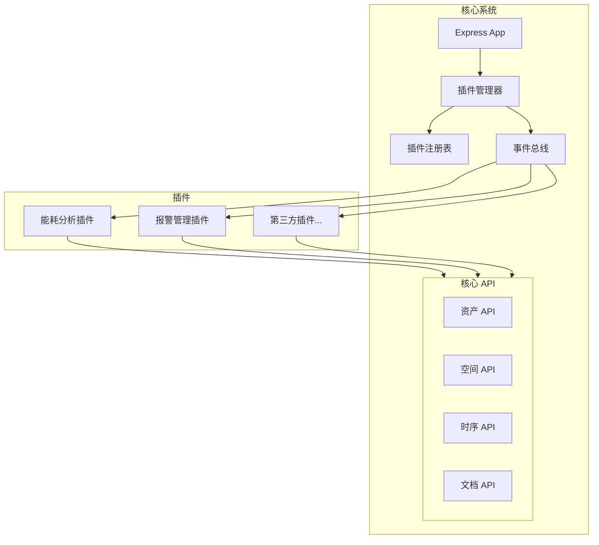

# 插件系统架构设计方案

## 概述

设计一个可扩展的插件机制，让新功能模块可以插件化，同时提供开放 API 给第三方开发插件。

## 核心目标

1. **模块化扩展** - 新功能以插件形式开发，独立于核心系统
2. **热插拔** - 插件可以在运行时启用/禁用，无需重启服务
3. **第三方开发** - 提供 SDK 和文档，让外部开发者可以创建插件
4. **安全隔离** - 插件之间相互隔离，不影响核心系统稳定性

---

## 架构设计

### 系统架构图



---

## 核心组件

### 1. 插件管理器 (`PluginManager`)

负责插件的加载、初始化、启用/禁用和卸载。

**位置**: `server/core/plugin-manager.js`

```javascript
class PluginManager {
    // 已注册的插件
    private plugins: Map<string, Plugin>;
    
    // 加载插件
    async loadPlugin(pluginPath: string): Promise<void>;
    
    // 启用插件
    async enablePlugin(pluginId: string): Promise<void>;
    
    // 禁用插件
    async disablePlugin(pluginId: string): Promise<void>;
    
    // 获取插件列表
    getPlugins(): PluginInfo[];
    
    // 获取插件 API
    getPluginAPI(pluginId: string): PluginAPI;
}
```

### 2. 插件接口规范 (`PluginInterface`)

定义插件必须实现的接口。

**位置**: `server/core/plugin-interface.js`

```javascript
interface Plugin {
    // 插件元数据
    id: string;           // 唯一标识符
    name: string;         // 显示名称
    version: string;      // 版本号
    description: string;  // 描述
    author: string;       // 作者
    
    // 生命周期钩子
    onLoad(context: PluginContext): Promise<void>;
    onEnable(): Promise<void>;
    onDisable(): Promise<void>;
    onUnload(): Promise<void>;
    
    // 可选：注册路由
    registerRoutes?(router: Router): void;
    
    // 可选：注册前端组件
    registerUI?(): UIComponent[];
    
    // 可选：注册事件监听
    registerEventHandlers?(): EventHandler[];
}
```

### 3. 插件上下文 (`PluginContext`)

提供给插件的核心 API 访问接口。

```javascript
interface PluginContext {
    // 核心服务访问
    services: {
        asset: AssetService;
        space: SpaceService;
        timeseries: TimeseriesService;
        document: DocumentService;
        ai: AIService;
    };
    
    // 数据库访问（受限）
    db: {
        query(sql: string, params?: any[]): Promise<QueryResult>;
        // 插件专用表操作
        createTable(def: TableDefinition): Promise<void>;
    };
    
    // 事件系统
    events: {
        emit(event: string, data: any): void;
        on(event: string, handler: Function): void;
        off(event: string, handler: Function): void;
    };
    
    // 配置存储
    config: {
        get(key: string): any;
        set(key: string, value: any): Promise<void>;
    };
    
    // 日志
    logger: Logger;
}
```

### 4. 事件总线 (`EventBus`)

核心事件系统，用于插件间通信和核心系统通知。

**内置事件**:
- `asset:created` / `asset:updated` / `asset:deleted`
- `space:created` / `space:updated` / `space:deleted`
- `timeseries:data-received`
- `document:uploaded` / `document:deleted`
- `model:loaded` / `model:unloaded`
- `alert:triggered`

---

## 插件目录结构

```
server/plugins/
├── index.js                    # 插件加载入口
├── core/                       # 核心插件框架
│   ├── plugin-manager.js
│   ├── plugin-interface.js
│   ├── plugin-context.js
│   ├── event-bus.js
│   └── plugin-api.js
├── builtin/                    # 内置插件（官方）
│   ├── energy-analysis/        # 能耗分析插件
│   │   ├── manifest.json
│   │   ├── index.js
│   │   ├── routes/
│   │   ├── services/
│   │   └── ui/
│   ├── alert-management/       # 报警管理插件
│   └── maintenance-schedule/   # 维护计划插件
└── external/                   # 第三方插件目录
    └── .gitkeep
```

### 插件包结构示例

```
energy-analysis/
├── manifest.json              # 插件清单
├── index.js                   # 插件入口
├── package.json               # 依赖声明
├── routes/                    # API 路由
│   └── energy.js
├── services/                  # 业务逻辑
│   └── energy-calculator.js
├── migrations/                # 数据库迁移
│   └── 001-create-energy-table.sql
└── ui/                        # 前端组件（可选）
    ├── EnergyDashboard.vue
    └── manifest.json
```

### manifest.json 示例

```json
{
    "id": "energy-analysis",
    "name": "能耗分析",
    "version": "1.0.0",
    "description": "基于时序数据的能耗分析和报表功能",
    "author": "Tandem Team",
    "main": "index.js",
    "apiVersion": "1.0",
    "permissions": [
        "timeseries:read",
        "assets:read",
        "spaces:read",
        "db:plugin-tables"
    ],
    "dependencies": {
        "lodash": "^4.17.21"
    },
    "routes": {
        "prefix": "/energy",
        "file": "routes/energy.js"
    },
    "ui": {
        "components": ["ui/EnergyDashboard.vue"],
        "menuItem": {
            "title": "能耗分析",
            "icon": "lightning",
            "path": "/energy"
        }
    }
}
```

---

## API 扩展机制

### 插件 API 路由注册

插件可以注册自己的 API 路由，统一挂载在 `/api/v1/plugins/{pluginId}/` 下。

```javascript
// 插件 routes/energy.js
export default function(router, context) {
    // GET /api/v1/plugins/energy-analysis/summary
    router.get('/summary', async (req, res) => {
        const assets = await context.services.asset.getAll();
        const data = await context.services.timeseries.query({...});
        // 计算逻辑...
        res.json({ success: true, data: result });
    });
    
    // POST /api/v1/plugins/energy-analysis/report
    router.post('/report', async (req, res) => {
        // 生成报告...
    });
}
```

### 第三方开发 SDK

提供 npm 包 `@tandem/plugin-sdk`：

```javascript
import { definePlugin, useContext } from '@tandem/plugin-sdk';

export default definePlugin({
    id: 'my-custom-plugin',
    name: '自定义插件',
    version: '1.0.0',
    
    async onLoad(ctx) {
        const { services, events, logger } = ctx;
        
        // 监听资产变化
        events.on('asset:updated', async (asset) => {
            logger.info(`资产 ${asset.name} 已更新`);
            // 自定义逻辑...
        });
    },
    
    registerRoutes(router) {
        router.get('/hello', (req, res) => {
            res.json({ message: 'Hello from my plugin!' });
        });
    }
});
```

---

## 前端集成

### 插件 UI 注册

插件可以注册 Vue 组件，通过动态加载机制集成到前端。

```javascript
// 前端插件加载器
// src/plugins/plugin-loader.js

class FrontendPluginManager {
    async loadPluginUI(pluginId) {
        const manifest = await fetch(`/api/v1/plugins/${pluginId}/ui-manifest`);
        const components = await this.loadComponents(manifest.components);
        this.registerComponents(components);
        this.addMenuItem(manifest.menuItem);
    }
}
```

### 插件菜单项

插件可以在侧边栏添加自己的菜单入口。

---

## 数据库设计

### 插件管理表

```sql
-- 插件注册表
CREATE TABLE plugins (
    id VARCHAR(64) PRIMARY KEY,
    name VARCHAR(128) NOT NULL,
    version VARCHAR(32) NOT NULL,
    description TEXT,
    author VARCHAR(128),
    status VARCHAR(20) DEFAULT 'disabled', -- enabled, disabled, error
    config JSONB DEFAULT '{}',
    installed_at TIMESTAMP DEFAULT CURRENT_TIMESTAMP,
    updated_at TIMESTAMP DEFAULT CURRENT_TIMESTAMP
);

-- 插件配置存储
CREATE TABLE plugin_configs (
    plugin_id VARCHAR(64) REFERENCES plugins(id) ON DELETE CASCADE,
    key VARCHAR(128) NOT NULL,
    value JSONB,
    PRIMARY KEY (plugin_id, key)
);
```

---

## Proposed Changes

### Phase 1: 核心插件框架

#### [NEW] [plugin-manager.js](file:///d:/Tandem/antigravity/tandem-demo/server/core/plugin-manager.js)
插件管理器核心类，负责插件生命周期管理。

#### [NEW] [plugin-interface.js](file:///d:/Tandem/antigravity/tandem-demo/server/core/plugin-interface.js)
插件接口定义和类型声明。

#### [NEW] [plugin-context.js](file:///d:/Tandem/antigravity/tandem-demo/server/core/plugin-context.js)
插件上下文工厂，提供服务访问封装。

#### [NEW] [event-bus.js](file:///d:/Tandem/antigravity/tandem-demo/server/core/event-bus.js)
事件总线实现。

#### [NEW] [plugin-api.js](file:///d:/Tandem/antigravity/tandem-demo/server/routes/v1/plugins.js)
插件管理 REST API。

#### [MODIFY] [index.js](file:///d:/Tandem/antigravity/tandem-demo/server/index.js)
集成插件管理器到应用启动流程。

---

### Phase 2: 数据库支持

#### [NEW] [create-plugin-tables.sql](file:///d:/Tandem/antigravity/tandem-demo/server/db/migrations/create-plugin-tables.sql)
创建插件相关数据库表。

---

### Phase 3: 示例插件

#### [NEW] energy-analysis 插件
`server/plugins/builtin/energy-analysis/`

完整的示例插件，展示插件开发规范。

---

### Phase 4: 前端插件加载

#### [NEW] [plugin-loader.js](file:///d:/Tandem/antigravity/tandem-demo/src/plugins/plugin-loader.js)
前端插件动态加载器。

#### [MODIFY] [App.vue](file:///d:/Tandem/antigravity/tandem-demo/src/App.vue)
集成插件菜单和组件。

---

## User Review Required

> [!IMPORTANT]
> **请确认以下设计决策**:

1. **插件路由前缀**: 建议使用 `/api/v1/plugins/{pluginId}/` 统一管理，是否可接受？

2. **权限模型**: 目前设计为基于 manifest 声明权限（如 `timeseries:read`），是否需要更细粒度的权限控制？

3. **插件存储位置**: 
   - **内置插件**: `server/plugins/builtin/`
   - **第三方插件**: `server/plugins/external/`
   
   或者您希望第三方插件通过 npm 包方式安装？

4. **前端插件支持**: 是否需要支持插件注册自定义 UI 组件？这会增加复杂度。

5. **优先实现的插件模块**:
   - [ ] 能耗分析
   - [ ] 报警管理
   - [ ] 维护计划
   - [ ] 数据导出增强
   - [ ] 其他: ______

---

## Verification Plan

### 自动化测试

1. **插件管理器单元测试**
   ```bash
   cd server && npm test -- --grep "PluginManager"
   ```
   - 测试插件加载/卸载
   - 测试事件系统
   - 测试权限检查

2. **插件 API 集成测试**
   ```bash
   cd server && npm test -- --grep "Plugin API"
   ```
   - 测试 GET /api/v1/plugins 列表
   - 测试 POST /api/v1/plugins/:id/enable
   - 测试插件路由代理

### 手动验证

1. **创建示例插件并加载**
   - 将示例插件复制到 `server/plugins/builtin/`
   - 重启服务器
   - 检查日志确认插件加载成功

2. **通过 API 管理插件**
   - 调用 `GET /api/v1/plugins` 查看插件列表
   - 调用 `POST /api/v1/plugins/energy-analysis/enable` 启用插件
   - 访问插件路由 `GET /api/v1/plugins/energy-analysis/summary`

3. **事件系统验证**
   - 更新一个资产
   - 检查日志确认事件被触发
   - 验证插件收到事件通知
