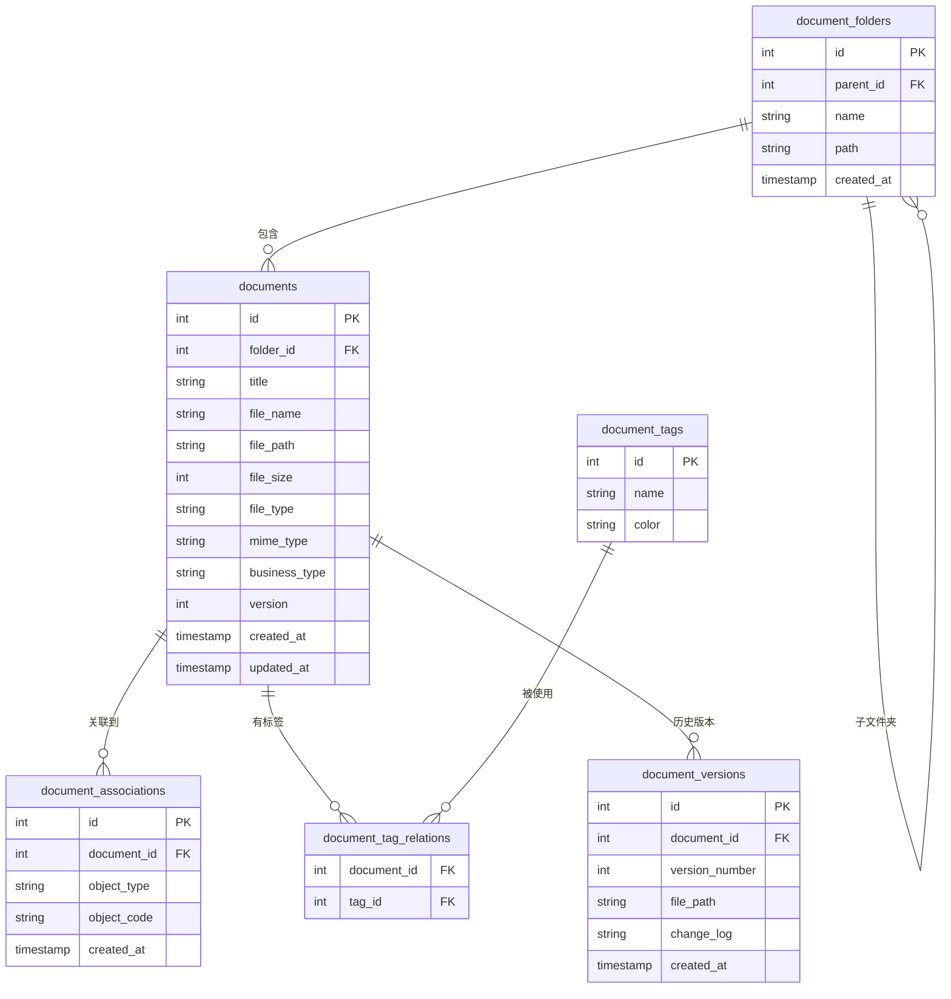
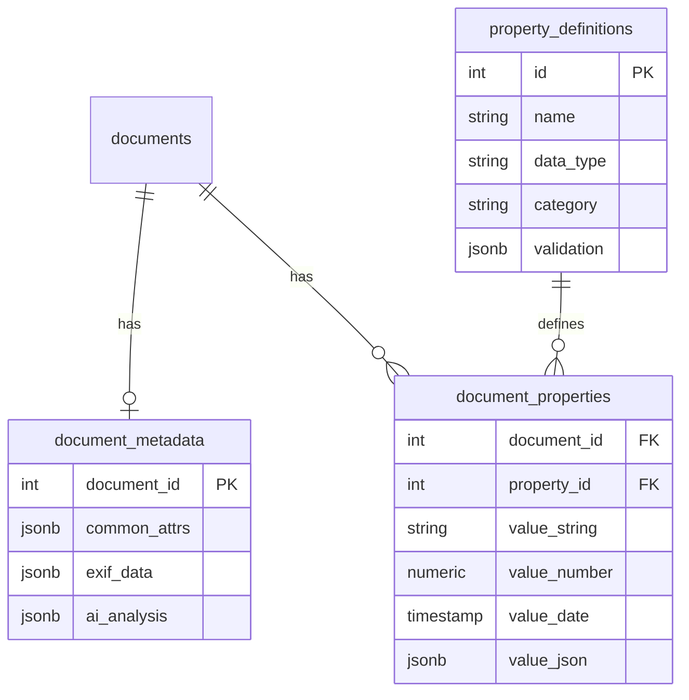
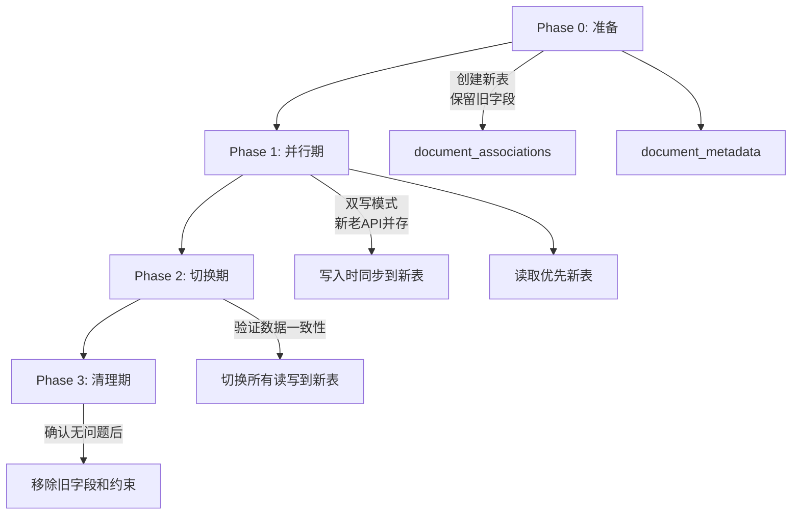
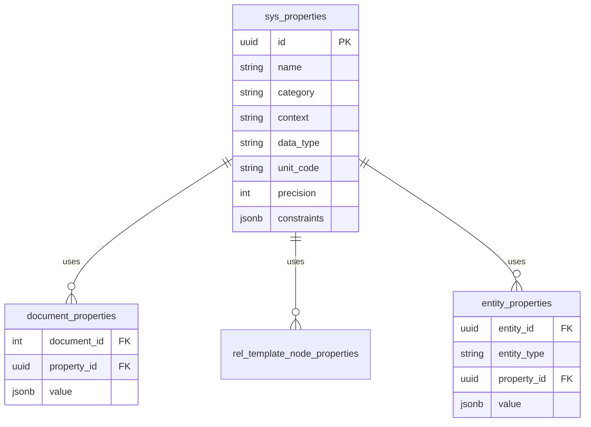

# 文档管理模块 - 实施计划

## 1. 需求分析

### 1.1 现状分析
| 能力 | 现状 | 问题 |
|------|------|------|
| 关联方式 | 单一关联(asset/space/spec三选一) | 无法多对象关联 |
| 管理入口 | 各模块分散上传 | 无独立管理模块 |
| 文档类型 | 按扩展名分类 | 无业务类型识别 |
| 版本控制 | 无 | 不支持历史版本 |
| 权限控制 | 无 | 所有用户可见 |
| AI能力 | RAG知识库(与模型文件绑定) | 设施级知识库待实现 |

### 1.2 需求优先级矩阵

| 需求点 | 优先级 | 复杂度 | 阶段 |
|--------|--------|--------|------|
| 独立文档管理模块(CRUD) | 🔴 高 | 中 | P1 |
| 多对象关联(多对多) | 🔴 高 | 中 | P1 |
| 文件夹管理 | 🔴 高 | 中 | P1 |
| 批量上传 | 🔴 高 | 低 | P1 |
| 缩略图生成 | 🟡 中 | 中 | P2 |
| 智能类型识别(全景图等) | 🟡 中 | 高 | P2 |
| 标签系统 | 🟡 中 | 中 | P2 |
| 文档版本控制 | 🟡 中 | 高 | P3 |
| 权限控制 | 🟡 中 | 高 | P3 |
| BIM/CAD/Office预览 | 🟢 低 | 高 | P3 |
| AI智能分析(LLM) | 🟢 低 | 高 | P4 |
| 设施级知识库 | 🟢 低 | 高 | P4 |

---

## 2. 技术设计

### 2.1 数据库设计



**核心变更**:
- 移除`chk_single_relation`约束
- 新增`document_associations`多对多关联表
- 新增`document_folders`文件夹表
- 新增`document_tags`标签表
- 新增`document_versions`版本表
- 新增`business_type`业务类型字段

### 2.2 API设计

#### P1阶段API
| 方法 | 路由 | 说明 |
|------|------|------|
| GET | `/api/v2/documents` | 文档列表(分页、筛选) |
| GET | `/api/v2/documents/:id` | 文档详情 |
| POST | `/api/v2/documents` | 创建文档 |
| POST | `/api/v2/documents/batch` | 批量上传 |
| PATCH | `/api/v2/documents/:id` | 更新文档属性 |
| DELETE | `/api/v2/documents/:id` | 删除文档 |
| POST | `/api/v2/documents/:id/associations` | 添加关联 |
| DELETE | `/api/v2/documents/:id/associations/:type/:code` | 移除关联 |
| GET | `/api/v2/folders` | 文件夹列表 |
| POST | `/api/v2/folders` | 创建文件夹 |
| PATCH | `/api/v2/folders/:id` | 重命名/移动文件夹 |
| DELETE | `/api/v2/folders/:id` | 删除文件夹 |

### 2.3 前端组件设计

```
src/components/documents/
├── DocumentManager.vue      # 主管理视图
├── DocumentList.vue         # 列表视图(可复用现有)
├── DocumentGrid.vue         # 缩略图网格视图
├── DocumentUploader.vue     # 上传组件(支持批量+文件夹)
├── DocumentDetail.vue       # 详情/编辑面板
├── FolderTree.vue           # 文件夹树
├── TagFilter.vue            # 标签筛选器
└── AssociationPicker.vue    # 关联对象选择器
```

---

## 3. 分阶段开发计划

### Phase 1: 基础文档管理 (2周)
- [x] 数据库迁移脚本(移除单一关联约束)
- [ ] 新增document_associations表
- [ ] 新增document_folders表
- [ ] 后端API开发(CRUD + 文件夹)
- [ ] 前端DocumentManager主视图
- [ ] 批量上传功能
- [ ] 多对象关联功能

### Phase 2: 智能增强 (2周)
- [ ] 缩略图生成服务
- [ ] 业务类型自动识别(全景图检测等)
- [ ] 标签系统
- [ ] 自动关联识别(基于文件名规则)

### Phase 3: 高级功能 (2周)
- [ ] 版本控制
- [ ] 权限管理
- [ ] BIM/CAD预览(开源方案评估)
- [ ] Office文档预览

### Phase 4: AI能力 (2周+)
- [ ] 设施层级设计
- [ ] 设施级知识库
- [ ] LLM智能分析集成
- [ ] AI工作流插件机制

---

## 4. 文档属性设计 (深化)

### 4.1 现有document_exif表分析
```sql
-- 现有结构: 固定字段,仅支持图像EXIF
document_exif (
  document_id FK → documents(id) ON DELETE CASCADE,
  date_time, image_width, image_height,  -- 文件组
  equip_model, f_number, exposure_time, iso_speed, focal_length,  -- 相机组
  gps_longitude, gps_latitude, gps_altitude  -- GPS组
)
```

**问题**: 固定Schema无法适应不同文档类型(PDF/CAD/BIM/Office等)

### 4.2 可扩展属性方案: EAV + JSONB 混合模式



**表说明**:
- `document_metadata`: 1:1通用元数据(JSONB存储EXIF/AI分析结果)
- `property_definitions`: 属性定义(名称、类型、分类、验证规则)
- `document_properties`: 1:N自定义属性值(EAV模式)

### 4.3 迁移策略: document_exif → document_metadata

```sql
-- Step 1: 创建新表
CREATE TABLE document_metadata (
    document_id INTEGER PRIMARY KEY REFERENCES documents(id) ON DELETE CASCADE,
    common_attrs JSONB DEFAULT '{}',  -- 通用属性
    exif_data JSONB DEFAULT '{}',     -- 兼容现有EXIF
    ai_analysis JSONB DEFAULT '{}',   -- AI分析结果
    created_at TIMESTAMP DEFAULT CURRENT_TIMESTAMP,
    updated_at TIMESTAMP DEFAULT CURRENT_TIMESTAMP
);

-- Step 2: 数据迁移(将固定字段转为JSONB)
INSERT INTO document_metadata (document_id, exif_data)
SELECT document_id, jsonb_build_object(
    'dateTime', date_time,
    'imageWidth', image_width,
    'imageHeight', image_height,
    'equipModel', equip_model,
    'fNumber', f_number,
    'exposureTime', exposure_time,
    'isoSpeed', iso_speed,
    'focalLength', focal_length,
    'gpsLongitude', gps_longitude,
    'gpsLatitude', gps_latitude,
    'gpsAltitude', gps_altitude
) FROM document_exif;

-- Step 3: 更新代码调用后,删除旧表
DROP TABLE document_exif;
```

---

## 5. 数据迁移方案

### 5.1 迁移目标
| 现有结构 | 目标结构 | 迁移方式 |
|----------|----------|----------|
| documents.asset_code/space_code/spec_code | document_associations表 | 数据拆分 |
| chk_single_relation约束 | 移除 | DDL变更 |
| document_exif固定字段 | document_metadata JSONB | 数据转换 |

### 5.2 平滑迁移步骤



### 5.3 迁移SQL脚本

```sql
-- ============ Phase 0: 创建新表(不影响现有功能) ============
-- 关联表
CREATE TABLE document_associations (
    id SERIAL PRIMARY KEY,
    document_id INTEGER NOT NULL REFERENCES documents(id) ON DELETE CASCADE,
    object_type VARCHAR(20) NOT NULL CHECK (object_type IN ('asset', 'space', 'spec', 'view')),
    object_code VARCHAR(100) NOT NULL,
    created_at TIMESTAMP DEFAULT CURRENT_TIMESTAMP,
    UNIQUE(document_id, object_type, object_code)
);

-- 索引
CREATE INDEX idx_doc_assoc_document ON document_associations(document_id);
CREATE INDEX idx_doc_assoc_object ON document_associations(object_type, object_code);

-- ============ Phase 1: 数据迁移(旧数据同步到新表) ============
INSERT INTO document_associations (document_id, object_type, object_code)
SELECT id, 'asset', asset_code FROM documents WHERE asset_code IS NOT NULL
UNION ALL
SELECT id, 'space', space_code FROM documents WHERE space_code IS NOT NULL
UNION ALL
SELECT id, 'spec', spec_code FROM documents WHERE spec_code IS NOT NULL
UNION ALL
SELECT id, 'view', view_id::text FROM documents WHERE view_id IS NOT NULL;

-- ============ Phase 2: 验证数据一致性 ============
-- 检查脚本(应返回0行)
SELECT d.id FROM documents d
LEFT JOIN document_associations da ON d.id = da.document_id
WHERE (d.asset_code IS NOT NULL OR d.space_code IS NOT NULL OR d.spec_code IS NOT NULL)
  AND da.id IS NULL;

-- ============ Phase 3: 移除旧约束和字段 ============
ALTER TABLE documents DROP CONSTRAINT IF EXISTS chk_single_relation;
-- 可选: 延迟移除旧字段,先标记为deprecated
-- ALTER TABLE documents DROP COLUMN asset_code, DROP COLUMN space_code, DROP COLUMN spec_code;
```

### 5.4 代码迁移检查清单
- [ ] `server/models/document.js` - 修改查询使用JOIN
- [ ] `server/models/document-exif.js` - 迁移到metadata模式
- [ ] `server/routes/documents.js` - 更新API逻辑
- [ ] `server/routes/v1/documents.js` - 更新API逻辑
- [ ] `server/routes/ai-analysis.js` - 更新关联查询
- [ ] `server/routes/v1/ai.js` - 更新关联查询
- [ ] `src/components/DocumentList.vue` - 适配新API

### 5.5 AI分析工作流迁移方案

#### 现有API调用分析
| 文件 | 功能 | 现有查询方式 |
|------|------|--------------|
| `ai-analysis.js` | 温度报警分析 | `WHERE asset_code = $1 OR space_code = $2` |
| `v1/ai.js` | 手动分析/RAG查询 | `WHERE asset_code = $1` / `WHERE space_code = $1` |
| n8n工作流 | 温度报警Webhook | 调用API获取文档 |

#### 新API设计 (兼容现有+支持新模式)

```javascript
// GET /api/v2/documents?objectType=asset&objectCode=XXX
// 或多对象查询
// GET /api/v2/documents?associations=asset:XXX,space:YYY

router.get('/api/v2/documents', async (req, res) => {
  const { objectType, objectCode, associations } = req.query;
  
  let query = `
    SELECT DISTINCT d.* FROM documents d
    JOIN document_associations da ON d.id = da.document_id
    WHERE 1=1
  `;
  
  if (objectType && objectCode) {
    query += ` AND da.object_type = $1 AND da.object_code = $2`;
  } else if (associations) {
    // 解析 associations=asset:XXX,space:YYY
    const pairs = associations.split(',').map(p => p.split(':'));
    // 构建 OR 条件
  }
  
  // ... 执行查询
});
```

#### 迁移步骤


**Step 1**: 新增 `/api/v2/documents` 端点(支持多关联查询)
**Step 2**: `ai-analysis.js` 改用新API
```javascript
// 旧: WHERE asset_code = $1 OR space_code = $2
// 新: JOIN document_associations ...
const docsResult = await pool.query(`
    SELECT d.*, da.object_type, da.object_code
    FROM documents d
    JOIN document_associations da ON d.id = da.document_id
    WHERE (da.object_type = 'asset' AND da.object_code = $1)
       OR (da.object_type = 'space' AND da.object_code = $2)
`, [assetCode, spaceCode]);
```
**Step 3**: 更新n8n工作流中的HTTP Request节点URL
**Step 4**: 验证温度报警和手动分析功能正常

---

## 6. 技术选型建议

| 功能 | 推荐方案 | 备选方案 |
|------|----------|----------|
| 缩略图生成 | Sharp | ImageMagick |
| PDF预览 | PDF.js | react-pdf |
| Office预览 | OnlyOffice(开源) | LibreOffice Online |
| CAD预览 | Three.js + DXF解析 | AutoCAD Web |
| BIM预览 | 复用现有Forge Viewer | 无 |

## 7. 风险评估

| 风险 | 影响 | 缓解措施 |
|------|------|----------|
| 多对多关联迁移影响现有数据 | 高 | 编写数据迁移脚本,保持向后兼容 |
| Office预览开源方案部署复杂 | 中 | 先实现下载,预览作为增强功能 |
| LLM成本和响应时间 | 中 | 异步处理,结果缓存 |

---

## 8. 属性系统统一设计分析

### 8.1 两套属性系统对比

| 维度 | 文档属性系统 (本计划) | 设施模板属性系统 (FACILITY_TEMPLATE_PLAN) |
|------|----------------------|------------------------------------------|
| **目标对象** | 文档(documents) | 资产/空间/规格(通过分类节点) |
| **属性定义表** | `property_definitions` | `sys_properties` |
| **属性值存储** | `document_properties` (EAV) + `document_metadata` (JSONB) | `rel_template_node_properties` (关联表) |
| **数据类型** | string/number/date/geo/jsonb | Text/Integer/Number/Boolean/DateTime/Link/Tag |
| **继承机制** | 无 | 父节点→子节点自动继承 |
| **约束规则** | JSONB存储 | `constraints` JSON字段 |
| **单位支持** | 无 | 国标单位编码(unit_code) |
| **精度控制** | 无 | precision字段 |

### 8.2 EAV + JSONB 是否适合设施模板系统?

**结论**: ✅ 适合,但需要扩展

| 方面 | 分析 |
|------|------|
| **属性定义** | `sys_properties`已有完善设计,可作为统一属性定义表 |
| **属性值存储** | 设施模板的属性是**模板级**(定义分配规则),不是实例级(存储具体值),EAV更适合存储**实例属性值** |
| **继承逻辑** | EAV模式可通过查询时JOIN实现继承,但需额外逻辑 |
| **JSONB** | 适合存储动态约束、预设值列表等元数据 |

### 8.3 统一方案建议



**统一策略**:
1. **共享属性定义表**: 将`property_definitions`与`sys_properties`合并为统一的`sys_properties`
2. **分离属性值存储**: 不同对象类型使用不同的值存储表
   - 文档: `document_properties` / `document_metadata`
   - 资产/空间: `entity_properties` (新表)
   - 模板分配: `rel_template_node_properties` (保持现有设计)
3. **JSONB存储属性值**: 所有属性值使用JSONB存储,支持复杂类型

### 8.4 合并时机建议

| 阶段 | 建议 |
|------|------|
| **P1 (文档模块)** | 使用`property_definitions`作为临时方案,结构对齐`sys_properties` |
| **设施模板开发时** | 创建统一的`sys_properties`,迁移`property_definitions`数据 |
| **后续** | 资产/空间实例属性也使用统一属性库 |

### 8.5 设计决策

> [!IMPORTANT]
> **推荐**: 现阶段文档模块的`property_definitions`表设计应**对齐`sys_properties`结构**,包括:
> - 添加`unit_code`字段
> - 添加`precision`字段  
> - 添加`context`字段(Element/Type)
> - 使用UUID作为主键
> 
> 这样在设施模板模块开发时可平滑合并。
