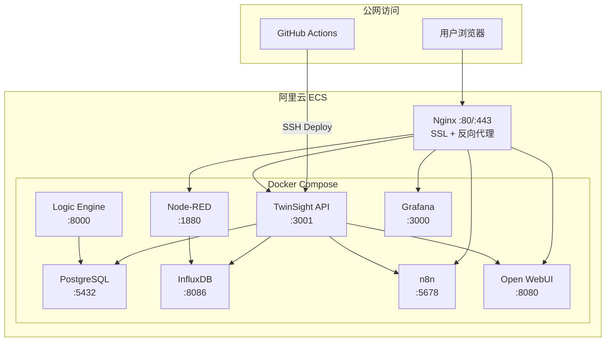

# TwinSight 阿里云公网部署实施计划

> **目标域名**: demo.twinsight.cn  
> **用途**: 公网开发服务器 + 对外展示 Demo  
> **数据源**: 192.168.2.183 局域网服务器（PostgreSQL、InfluxDB、Node-RED、Open WebUI、n8n）  
> **更新日期**: 2026-02-10

---

## 一、Ubuntu 版本与服务器配置建议

### 1.1 操作系统

| 选项 | 推荐 |
|------|------|
| **Ubuntu 版本** | **Ubuntu 24.04 LTS (Noble Numbat)** |
| 理由 | LTS 长期支持至 2029 年；内核 6.8 原生支持更好的容器性能；阿里云镜像直接提供 |

### 1.2 服务器配置

> [!IMPORTANT]
> 以下为**最低推荐配置**，Open WebUI 的 Embedding 模型（paraphrase-multilingual-MiniLM-L12-v2）会占用约 1-2GB 内存。

| 配置项 | 推荐值 | 说明 |
|--------|--------|------|
| **CPU** | 4 核 | n8n + Node-RED + Open WebUI 并发需求 |
| **内存** | 8 GB（推荐 16 GB） | PostgreSQL + InfluxDB + Open WebUI Embedding 模型 |
| **系统盘** | 60 GB SSD | 操作系统 + Docker 镜像 |
| **数据盘** | 100 GB SSD（单独挂载） | Docker volumes（数据库、上传文件等），便于独立扩容和备份 |
| **带宽** | 5-10 Mbps（按固定带宽）或按流量计费 | Demo 展示根据访问量选择 |
| **安全组** | 开放 80/443（HTTP/HTTPS）、22（SSH） | 其他端口通过 Nginx 反向代理访问 |

> [!TIP]
> 阿里云 ECS **抢占式实例**可节省 50-80% 成本，适合 Demo 用途。但有被回收风险，正式环境建议按量或包年。

### 1.3 阿里云产品选择

| 方案 | 产品 | 优势 | 劣势 |
|------|------|------|------|
| **方案 A（推荐）** | **ECS 云服务器** | 完全控制、Docker 自由部署 | 需自行运维 |
| 方案 B | ACK（容器服务） | K8s 编排 | 过度复杂，成本高 |
| 方案 C | 轻量应用服务器 | 价格便宜 | 配置受限、不适合多容器 |

**推荐方案 A: ECS 云服务器 + 独立数据盘**

---

## 二、服务架构总览



### 域名访问方案

> [!IMPORTANT]
> **推荐采用子域名方案**（方案 A），避免子路径带来的各服务 base URL 兼容性问题（尤其是 Open WebUI 和 n8n）。

| 方案 | 域名 | 对应服务 |
|------|------|---------|
| **A: 子域名（推荐）** | `demo.twinsight.cn` | TwinSight 主应用（前端 + API） |
| | `n8n.twinsight.cn` | n8n 工作流 |
| | `ai.twinsight.cn` | Open WebUI |
| | `nodered.twinsight.cn` | Node-RED |
| | `grafana.twinsight.cn` | Grafana |
| | `influx.twinsight.cn` | InfluxDB（可选，内部访问） |
| B: 子路径 | `demo.twinsight.cn/n8n/` | 需要各服务配置 base path，兼容性差 |

---

## 三、详细执行步骤

### 阶段 1：阿里云 ECS 初始化（约 1 小时）

#### 1.1 购买 ECS 实例
- 地域选择华东（上海/杭州）
- 镜像选择 **Ubuntu 24.04 LTS 64位**
- 配置按上文推荐
- 数据盘 100GB 单独挂载

#### 1.2 SSH 连接与基础配置

```bash
# 1. 格式化并挂载数据盘
sudo mkfs.ext4 /dev/vdb
sudo mkdir -p /data
sudo mount /dev/vdb /data
echo '/dev/vdb /data ext4 defaults 0 0' | sudo tee -a /etc/fstab

# 2. 更换阿里云 apt 源
sudo cp /etc/apt/sources.list.d/ubuntu.sources /etc/apt/sources.list.d/ubuntu.sources.bak
sudo sed -i 's|http://archive.ubuntu.com|https://mirrors.aliyun.com|g' /etc/apt/sources.list.d/ubuntu.sources
sudo sed -i 's|http://security.ubuntu.com|https://mirrors.aliyun.com|g' /etc/apt/sources.list.d/ubuntu.sources
sudo apt update && sudo apt upgrade -y

# 3. 安装 Docker（使用阿里云镜像加速）
sudo apt install -y ca-certificates curl gnupg
sudo install -m 0755 -d /etc/apt/keyrings
curl -fsSL https://mirrors.aliyun.com/docker-ce/linux/ubuntu/gpg | sudo gpg --dearmor -o /etc/apt/keyrings/docker.gpg
echo "deb [arch=$(dpkg --print-architecture) signed-by=/etc/apt/keyrings/docker.gpg] https://mirrors.aliyun.com/docker-ce/linux/ubuntu $(. /etc/os-release && echo $VERSION_CODENAME) stable" | sudo tee /etc/apt/sources.list.d/docker.list
sudo apt update
sudo apt install -y docker-ce docker-ce-cli containerd.io docker-buildx-plugin docker-compose-plugin

# 4. 当前用户加入 docker 组
sudo usermod -aG docker $USER
newgrp docker

# 5. 配置 Docker 镜像加速（阿里云加速器）
sudo mkdir -p /etc/docker
sudo tee /etc/docker/daemon.json <<-'EOF'
{
  "data-root": "/data/docker",
  "registry-mirrors": [
    "https://mirror.ccs.tencentyun.com",
    "https://docker.m.daocloud.io"
  ],
  "log-driver": "json-file",
  "log-opts": {
    "max-size": "10m",
    "max-file": "3"
  }
}
EOF
sudo systemctl daemon-reload
sudo systemctl restart docker
sudo systemctl enable docker

# 6. 安装其他工具
sudo apt install -y git nginx certbot python3-certbot-nginx htop
```

> [!NOTE]
> `data-root` 设为 `/data/docker`，确保所有 Docker 数据存储在数据盘上，系统盘保持轻量。
> 阿里云个人镜像加速器地址可在 [阿里云控制台 → 容器镜像服务 → 镜像加速器](https://cr.console.aliyun.com/cn-shanghai/instances/mirrors) 获取。

---

### 阶段 2：域名与 SSL 配置（约 30 分钟）

#### 2.1 DNS 解析配置

在阿里云 DNS 控制台为 `twinsight.cn` 添加解析：

| 记录类型 | 主机记录 | 记录值 |
|---------|---------|--------|
| A | demo | `<ECS 公网 IP>` |
| A | n8n | `<ECS 公网 IP>` |
| A | ai | `<ECS 公网 IP>` |
| A | nodered | `<ECS 公网 IP>` |
| A | grafana | `<ECS 公网 IP>` |

#### 2.2 Nginx 配置（宿主机）

> [!IMPORTANT]
> Nginx 安装在**宿主机**而非 Docker 内，便于 Certbot 自动管理 SSL 证书。Docker 容器只映射端口到 127.0.0.1（localhost），安全性更高。

创建 `/etc/nginx/sites-available/twinsight.conf`：

```nginx
# ==================== TwinSight 主应用 ====================
server {
    listen 80;
    server_name demo.twinsight.cn;

    location /.well-known/acme-challenge/ { root /var/www/certbot; }
    location / { return 301 https://$host$request_uri; }
}
server {
    listen 443 ssl http2;
    server_name demo.twinsight.cn;

    ssl_certificate /etc/letsencrypt/live/demo.twinsight.cn/fullchain.pem;
    ssl_certificate_key /etc/letsencrypt/live/demo.twinsight.cn/privkey.pem;
    include /etc/letsencrypt/options-ssl-nginx.conf;
    ssl_dhparam /etc/letsencrypt/ssl-dhparams.pem;

    client_max_body_size 500M;

    # 安全头
    add_header X-Frame-Options "SAMEORIGIN" always;
    add_header X-Content-Type-Options "nosniff" always;

    # 前端 + API
    location / {
        proxy_pass http://127.0.0.1:3001;
        proxy_http_version 1.1;
        proxy_set_header Upgrade $http_upgrade;
        proxy_set_header Connection "upgrade";
        proxy_set_header Host $host;
        proxy_set_header X-Real-IP $remote_addr;
        proxy_set_header X-Forwarded-For $proxy_add_x_forwarded_for;
        proxy_set_header X-Forwarded-Proto $scheme;
        proxy_read_timeout 86400s;
        proxy_send_timeout 86400s;
    }
}

# ==================== n8n ====================
server {
    listen 80;
    server_name n8n.twinsight.cn;
    location / { return 301 https://$host$request_uri; }
}
server {
    listen 443 ssl http2;
    server_name n8n.twinsight.cn;

    ssl_certificate /etc/letsencrypt/live/demo.twinsight.cn/fullchain.pem;
    ssl_certificate_key /etc/letsencrypt/live/demo.twinsight.cn/privkey.pem;
    include /etc/letsencrypt/options-ssl-nginx.conf;

    location / {
        proxy_pass http://127.0.0.1:5678;
        proxy_http_version 1.1;
        proxy_set_header Upgrade $http_upgrade;
        proxy_set_header Connection "upgrade";
        proxy_set_header Host $host;
        proxy_set_header X-Real-IP $remote_addr;
        proxy_set_header X-Forwarded-For $proxy_add_x_forwarded_for;
        proxy_set_header X-Forwarded-Proto $scheme;
        proxy_read_timeout 86400s;
    }
}

# ==================== Open WebUI ====================
server {
    listen 80;
    server_name ai.twinsight.cn;
    location / { return 301 https://$host$request_uri; }
}
server {
    listen 443 ssl http2;
    server_name ai.twinsight.cn;

    ssl_certificate /etc/letsencrypt/live/demo.twinsight.cn/fullchain.pem;
    ssl_certificate_key /etc/letsencrypt/live/demo.twinsight.cn/privkey.pem;
    include /etc/letsencrypt/options-ssl-nginx.conf;

    client_max_body_size 500M;

    location / {
        proxy_pass http://127.0.0.1:3080;
        proxy_http_version 1.1;
        proxy_set_header Upgrade $http_upgrade;
        proxy_set_header Connection "upgrade";
        proxy_set_header Host $host;
        proxy_set_header X-Real-IP $remote_addr;
        proxy_set_header X-Forwarded-For $proxy_add_x_forwarded_for;
        proxy_set_header X-Forwarded-Proto $scheme;
        proxy_read_timeout 300s;
        proxy_buffering off;
    }
}

# ==================== Node-RED ====================
server {
    listen 80;
    server_name nodered.twinsight.cn;
    location / { return 301 https://$host$request_uri; }
}
server {
    listen 443 ssl http2;
    server_name nodered.twinsight.cn;

    ssl_certificate /etc/letsencrypt/live/demo.twinsight.cn/fullchain.pem;
    ssl_certificate_key /etc/letsencrypt/live/demo.twinsight.cn/privkey.pem;
    include /etc/letsencrypt/options-ssl-nginx.conf;

    location / {
        proxy_pass http://127.0.0.1:1880;
        proxy_http_version 1.1;
        proxy_set_header Upgrade $http_upgrade;
        proxy_set_header Connection "upgrade";
        proxy_set_header Host $host;
        proxy_set_header X-Real-IP $remote_addr;
        proxy_set_header X-Forwarded-For $proxy_add_x_forwarded_for;
        proxy_set_header X-Forwarded-Proto $scheme;
    }
}

# ==================== Grafana ====================
server {
    listen 80;
    server_name grafana.twinsight.cn;
    location / { return 301 https://$host$request_uri; }
}
server {
    listen 443 ssl http2;
    server_name grafana.twinsight.cn;

    ssl_certificate /etc/letsencrypt/live/demo.twinsight.cn/fullchain.pem;
    ssl_certificate_key /etc/letsencrypt/live/demo.twinsight.cn/privkey.pem;
    include /etc/letsencrypt/options-ssl-nginx.conf;

    location / {
        proxy_pass http://127.0.0.1:3000;
        proxy_http_version 1.1;
        proxy_set_header Upgrade $http_upgrade;
        proxy_set_header Connection "upgrade";
        proxy_set_header Host $host;
        proxy_set_header X-Real-IP $remote_addr;
        proxy_set_header X-Forwarded-For $proxy_add_x_forwarded_for;
        proxy_set_header X-Forwarded-Proto $scheme;
    }
}
```

#### 2.3 申请 SSL 证书

```bash
# 先启用 HTTP，用 certbot 自动获取证书
sudo ln -s /etc/nginx/sites-available/twinsight.conf /etc/nginx/sites-enabled/
sudo nginx -t && sudo systemctl reload nginx

注意，这里会报错，因为 Certbot 尚未运行，所以 /etc/letsencrypt 下的证书文件和 options-ssl-nginx.conf 配置文件都不存在。
我们需要分两步走：先用 纯 HTTP 模式启动 Nginx 以便 Certbot 能验证域名，证书申请下来后会自动修改配置启用 HTTPS。

解决方法
请按以下步骤操作（修改你刚上传的 /etc/nginx/sites-available/twinsight.conf）：
1. 临时注释掉 SSL 部分： 只保留 80 端口的配置，并且把重定向到 HTTPS 的代码也暂时注释掉。 修改后的 /etc/nginx/sites-available/twinsight.conf 应该像这样（只保留最简 HTTP 配置）：
、、、
server {
    listen 80;
    server_name demo.twinsight.cn n8n.twinsight.cn ai.twinsight.cn nodered.twinsight.cn grafana.twinsight.cn;

    location /.well-known/acme-challenge/ {
        root /var/www/certbot;
    }

    location / {
        return 200 'Waiting for SSL...';
        add_header Content-Type text/plain;
    }
}
、、、

2.创建验证目录并重载 Nginx：

sudo mkdir -p /var/www/certbot
sudo nginx -t
sudo systemctl reload nginx

3. 运行 Certbot 申请证书：

sudo mkdir -p /var/www/certbot
sudo nginx -t
sudo systemctl reload nginx

Certbot 会问你是否要自动配置 HTTPS重定向，选择 2: Redirect，它会自动帮你把配置文件改好，并填充 SSL 路径参数)。
接下来让agent整合conf文件，重新上传。


# 申请泛域名证书（一次性覆盖所有子域名）
sudo certbot --nginx -d demo.twinsight.cn -d n8n.twinsight.cn -d ai.twinsight.cn -d nodered.twinsight.cn -d grafana.twinsight.cn

# 设置自动续期
sudo systemctl enable certbot.timer
```

---

### 阶段 3：数据迁移（约 1-2 小时）

#### 3.1 从 192.168.2.183 导出数据

在 **192.168.2.183** 上执行：

```bash
# 创建备份目录
mkdir -p ~/twinsight-backup

# 1. PostgreSQL 完整备份
docker exec twinsight-postgres pg_dump -U postgres -F c twinsight > ~/twinsight-backup/postgres_twinsight.dump

# 2. InfluxDB 备份
docker exec twinsight-influxdb influx backup /tmp/influx-backup --token <YOUR_TOKEN>
docker cp twinsight-influxdb:/tmp/influx-backup ~/twinsight-backup/influx-backup

# 3. n8n 工作流导出
docker cp twinsight-n8n:/home/node/.n8n ~/twinsight-backup/n8n-data

# 4. Node-RED 流程导出
docker cp twinsight-nodered:/data ~/twinsight-backup/nodered-data

# 5. Open WebUI 数据（知识库、配置）
docker cp twinsight-open-webui:/app/backend/data ~/twinsight-backup/openwebui-data

# 6. 打包
cd ~
tar -czf twinsight-backup.tar.gz twinsight-backup/
```

#### 3.2 传输到阿里云

```bash
# 从本地或 192.168.2.183 上传到阿里云
scp ~/twinsight-backup.tar.gz user@<阿里云IP>:/data/

# 阿里云上解压
ssh user@<阿里云IP>
cd /data
tar -xzf twinsight-backup.tar.gz
```

#### 3.3 在阿里云上恢复数据

```bash
# 先启动基础服务（不含 API）
cd /data/twinsight
docker compose up -d postgres influxdb

# 等待 PostgreSQL 就绪
sleep 10

# 1. 恢复 PostgreSQL
docker exec -i twinsight-postgres pg_restore -U postgres -d twinsight --clean --if-exists < /data/twinsight-backup/postgres_twinsight.dump

# 2. 恢复 InfluxDB
docker cp /data/twinsight-backup/influx-backup twinsight-influxdb:/tmp/
docker exec twinsight-influxdb influx restore /tmp/influx-backup --token <TOKEN>

# 3. 恢复 n8n（停止容器后复制数据卷）
docker compose stop n8n
docker cp /data/twinsight-backup/n8n-data/. $(docker volume inspect twinsight_n8n_data -f '{{.Mountpoint}}')
docker compose up -d n8n

# 4. 恢复 Node-RED
docker compose stop nodered
docker cp /data/twinsight-backup/nodered-data/. $(docker volume inspect twinsight_nodered_data -f '{{.Mountpoint}}')
docker compose up -d nodered

# 5. 恢复 Open WebUI
docker compose stop open-webui
docker cp /data/twinsight-backup/openwebui-data/. $(docker volume inspect twinsight_open_webui_data -f '{{.Mountpoint}}')
docker compose up -d open-webui
```

---

### 阶段 4：Docker Compose 部署（约 1 小时）

#### 4.1 项目目录结构

```
/data/twinsight/
├── docker-compose.yml          # 生产配置（基于 docker-compose.prod.yml 改写）
├── .env                        # 环境变量
├── nginx/                      # （可选，如果用 Docker 内 Nginx）
└── uploads/                    # 持久化上传目录
```

#### 4.2 生产环境 docker-compose.yml

基于现有 `docker-compose.prod.yml`，主要调整：
- 移除 Docker 内的 Nginx（改用宿主机 Nginx）
- 所有服务端口映射到 `127.0.0.1`（仅本地可访问，由宿主机 Nginx 代理）
- 添加 logic-engine 服务
- n8n 的 `WEBHOOK_URL` 更新为 `https://n8n.twinsight.cn/`
- Open WebUI 的 Gemini API 通过 Admin Panel 配置
- 添加文件上传 volume 挂载

#### 4.3 环境变量 `.env`

```bash
# 数据库
DB_USER=postgres
DB_PASSWORD=<强密码>
DB_NAME=twinsight

# InfluxDB
INFLUX_USER=admin
INFLUX_PASSWORD=<强密码>
INFLUX_ORG=demo
INFLUX_BUCKET=twinsight
INFLUX_TOKEN=<从 192.168.2.183 迁移的 Token>

# n8n
N8N_AUTH_USER=admin@twinsight.cn
N8N_AUTH_PASSWORD=<强密码>
N8N_HOST=n8n.twinsight.cn
N8N_PROTOCOL=https
N8N_WEBHOOK_URL=https://n8n.twinsight.cn/

# 时区
TZ=Asia/Shanghai
```

---

### 阶段 5：CI/CD 持续集成（GitHub Actions）

#### 5.1 方案对比

| 方案 | 描述 | 优势 | 劣势 |
|------|------|------|------|
| **A: SSH Deploy（推荐）** | GitHub Action SSH 到服务器执行 `git pull` + `docker compose` | 简单可靠，适合小团队 | 需要配置 SSH Key |
| B: Docker Registry | 构建 Docker 镜像推送到 Registry | 标准化 | 构建慢，配置复杂 |
| C: Webhook | 服务器端监听 GitHub webhook | 实时触发 | 需要维护 webhook 服务 |

#### 5.2 推荐方案：SSH Deploy

**工作流程**：
```
git push → GitHub Actions → SSH 到阿里云 → git pull → docker compose build → docker compose up -d
```

**GitHub Actions 配置** `.github/workflows/deploy.yml`：

```yaml
name: Deploy to Aliyun

on:
  push:
    branches: [main]
  workflow_dispatch:  # 手动触发

jobs:
  deploy:
    runs-on: ubuntu-latest
    steps:
      - name: Deploy via SSH
        uses: appleboy/ssh-action@v1.2.0
        with:
          host: ${{ secrets.ALIYUN_HOST }}
          username: ${{ secrets.ALIYUN_USER }}
          key: ${{ secrets.ALIYUN_SSH_KEY }}
          script: |
            cd /data/twinsight
            git pull origin main
            docker compose build api logic-engine
            docker compose up -d
            docker compose ps
```

**GitHub Secrets 配置**：
- `ALIYUN_HOST`: 阿里云公网 IP
- `ALIYUN_USER`: SSH 登录用户名
- `ALIYUN_SSH_KEY`: SSH 私钥

#### 5.3 手动快速部署（开发期间）

```bash
# 从本地一键部署
ssh user@<阿里云IP> "cd /data/twinsight && git pull && docker compose build api && docker compose up -d api"
```

或在项目中添加脚本 `scripts/deploy-aliyun.sh`：

```bash
#!/bin/bash
REMOTE="user@<阿里云IP>"
echo "🚀 发布到阿里云..."
ssh $REMOTE "cd /data/twinsight && git pull origin main && docker compose build api logic-engine --no-cache && docker compose up -d api logic-engine && echo '✅ 部署完成'"
```

---

## 四、安全加固

| 措施 | 命令/配置 |
|------|----------|
| 关闭密码登录 | `/etc/ssh/sshd_config` → `PasswordAuthentication no` |
| 仅开放 22/80/443 端口 | 阿里云安全组 + `ufw` |
| 容器端口仅绑定 127.0.0.1 | `"127.0.0.1:5432:5432"` |
| 定期备份 | crontab 每日 `pg_dump` + `influx backup` |
| Fail2Ban | `sudo apt install fail2ban` |

---

## 五、执行检查清单

| # | 步骤 | 预计时间 |
|---|------|---------|
| 1 | 购买阿里云 ECS + 数据盘 | 10 min |
| 2 | 基础系统配置（源、Docker、工具） | 30 min |
| 3 | DNS 解析配置 | 10 min |
| 4 | Nginx + SSL 证书 | 30 min |
| 5 | 从 192.168.2.183 导出数据 | 20 min |
| 6 | 上传数据到阿里云 | 30 min（取决于网速） |
| 7 | Docker Compose 启动服务 | 20 min |
| 8 | 恢复数据 | 30 min |
| 9 | 验证所有服务 | 20 min |
| 10 | GitHub Actions CI/CD 配置 | 20 min |
| **合计** | | **约 3-4 小时** |

---

## 六、验证计划

### 自动验证
- `curl -s https://demo.twinsight.cn/api/health` 返回 200
- `curl -s https://n8n.twinsight.cn` 可访问 n8n
- `curl -s https://ai.twinsight.cn` 可访问 Open WebUI

### 手动验证
- 登录 `demo.twinsight.cn` 查看 3D 模型加载
- 触发 IoT 温度报警，验证 AI 分析流程
- 测试文档上传和知识库查询
- 从 GitHub 推送代码，验证自动部署

---

## User Review Required

> [!IMPORTANT]
> 以下问题需要确认：
> 1. **阿里云账号**：是否已有阿里云账号和域名 `twinsight.cn` 的管理权限？
> 2. **预算范围**：4核 8G 的 ECS 按月约 ¥200-400，是否可接受？16G 内存约 ¥400-600/月。
> 3. **域名方案**：子域名方案（`n8n.twinsight.cn`）还是子路径方案（`demo.twinsight.cn/n8n/`）？
> 4. **CI/CD 触发方式**：push 到 `main` 自动部署，还是手动触发？是否需要 staging 环境？
> 5. **192.168.2.183 保留**：迁移后局域网服务器是否继续保留运行？
